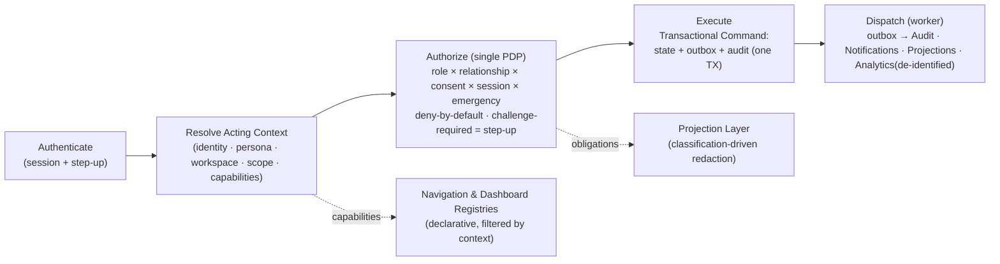

# NelyoHealth — Architecture Evolution & Canonicalization Report

## Document Control

| Field | Value |
|---|---|
| Document | `docs/architecture/architecture-evolution-report.md` |
| Kind | Canonical architecture decision record (pre–Design-Freeze) |
| Authority | Supersedes conflicting statements in the Platform Manifest, Kernel Blueprint, and Glossary **for the concepts it classifies**, once ratified |
| Owner role | Principal Architect + Technical Governance Lead |
| Review state | PROPOSED — becomes the reference architecture on ratification |
| Last updated | 2026-07-17 |
| Evidence base | Product vision; Platform Manifest; Kernel Blueprint; Glossary; ADRs 0001–0011, P02-001–006; `apps/api/src` (~100 modules); `packages/{domain,database,platform-adapters}`; `docs/STATUS.md`; `docs/architecture/*`; `docs/security/*`, `docs/data/*`, `docs/testing/*` |

> **Method.** Every source was treated as evidence, none as automatically authoritative. The only authority is NelyoHealth as a national-scale healthcare coordination platform that must remain coherent and maintainable for a decade. Where the recently authored Kernel Blueprint and Glossary (which I authored) conflict with a sound implementation, **the implementation generally wins and the documents are corrected** — because the code already realizes the intent with fewer abstractions.

---

# Executive Summary

## Current architectural maturity

NelyoHealth is **not** a greenfield awaiting a foundation. Per `docs/STATUS.md`, Phase 0 passed and essentially all of Phase 2 is **complete with evidence**: Postgres + migrations/seed/rollback, a NestJS API, OpenAPI + typed-client + drift gating, a worker queue (retry/DLQ/idempotency), a **transactional-outbox foundation with dispatch+rollback evidence**, object storage, observability, config/secret boundary, and dev→staging deploy workflows. `apps/api/src` contains ~100 tested modules: authentication, a multi-dimensional authorization policy, granular 11-domain consent, append-only audit, break-glass, tenancy with facility-scoped roles, a rich relationship model, appointments, prescriptions, diagnostics, referrals, payments, and provider-disclosure.

The genuine problem is **not missing capability — it is a coherence gap at the conceptual seam.** Three recently authored "source of truth" documents (Manifest, Kernel Blueprint, Glossary) introduced **Workspace, Persona, first-class Care Circle, Resource/Capability Registries, and a Projection layer** as if greenfield. The built system already realizes their *function* under different names (`tenant`, `actorRole`, `relationship`) and does not contain the registries or projection layer at all. Two architectures now describe one platform.

## Major strengths

- **A correct authorization core.** `authorization-policy.ts` decides `allowed | denied | challenge-required` from actor role × relationship × consent × session × emergency — a real RBAC∧ABAC∧consent∧session PDP with step-up semantics.
- **Mature, purpose-scoped consent** (11 `ConsentDomain`s incl. telemedicine, recording, cross-border, emergency-access) with versioned grant/revoke.
- **Append-only audit** with amendment support and break-glass workflows + policy.
- **A rich relationship model** (guardian/household/sponsor/caregiver-delegation/clinical-proxy/emergency-contact) with verification, lifecycle, `permittedActions`, and revocation — the exact substrate a Care Circle needs.
- **Solid platform services and testing**: transactional outbox, worker backplane, object storage, observability; a genuinely strong test posture (journey/privacy-boundary/provider-disclosure catalogues, contract/drift, a11y).
- **API-first discipline**: OpenAPI-first, typed client, drift specs, response envelope, idempotency middleware.

## Major weaknesses

- **Doc↔code divergence** (the dominant rework risk): the canonical docs describe abstractions the code doesn't have, and rename ones it does.
- **Over-abstraction in the new docs**: Resource Registry, Capability Registry, and a persisted Workspace/Persona/Care-Circle are architecture-for-its-own-sake given what already works.
- **A runtime/compute mismatch**: the recorded deployment posture (Supabase Edge Functions for a NestJS monolith + persistent worker) is unsound for long-lived processes.
- **Event discipline not yet enforced**: the outbox foundation exists but domain handlers don't route through it, and audit is written on a separate path.
- **Missing derived surfaces**: Projection/redaction layer, Timeline, Activity Stream, and Notification orchestration are unimplemented.
- **Unratified foundations**: ADRs 0005–0011 are all `DRAFT-PENDING-APPROVAL`; video transport (0009) is deferred.

## Overall readiness

**Fundamentally sound; not yet coherent.** The canonicalization required is mostly *correct-the-documents-to-a-derived model*, add three or four thin derived layers, retarget the runtime, and enforce two conventions with test gates — **not** a redesign. Design Freeze is achievable this sprint if the P0 conditions below are met.

---

# Concept Classification Matrix

Every concept appears exactly once.

| Concept | KEEP | ADAPT | REPLACE | REMOVE | NEW | Rationale |
|---|:--:|:--:|:--:|:--:|:--:|---|
| Identity | ✅ | | | | | `Person`/`UserAccount`/`ExternalIdentity` implemented and sound (ADR-0006, `identity-tenancy-model.ts`). |
| Authentication | ✅ | | | | | Implemented with sessions and step-up (`authentication.ts`). |
| Authorization | ✅ | | | | | Multi-dimensional PDP is architecturally correct; hardening is implementation, not redesign. |
| Context Resolution | | ✅ | | | | Exists as `request-context.middleware` + tenancy + policy inputs; must be unified into one canonical resolver. |
| Acting Context | | ✅ | | | | Correct concept; formalize as the **derived** resolution output (not a stored entity). |
| Persona | | ✅ | | | | Already implemented as `AuthorizationActorRole`. Keep **derived**; unify vocabulary; do **not** build a Persona table. |
| Workspace | | ✅ | | | | Realized today as tenancy (`activeTenantId: null → Personal`, tenant → Organization/Professional/Business). Keep **derived**; do **not** persist a Workspace entity. |
| Role | ✅ | | | | | `roleCode`/`RoleScope`/`roleScopes` with facility scoping, implemented. |
| Permission | | ✅ | | | | Exists as `permittedActions`; treat as the **authored** primitive; consolidate. |
| Capability | | ✅ | | | | Keep as the **derived effective** permitted-action set in an Acting Context; not a separate store. |
| Consent | ✅ | | | | | Granular, purpose-scoped, versioned; among the strongest areas. |
| Care Circle | | ✅ | | | | Correct concept; realize as a **derived read model / permission surface** over the relationship graph — not a new aggregate. |
| Guardian | ✅ | | | | | Implemented relationship type with legal-authority semantics. |
| Caregiver | ✅ | | | | | `caregiver-delegation` relationship with scoped `permittedActions`. |
| Dependent | | ✅ | | | | Not an entity; the cared-for side of a relationship. Clarify as a **derived role**, not a table. |
| Patient | ✅ | | | | | Continuity anchor; one canonical Patient (REQ-LOCK-001, ADR-0006). |
| Practitioner | ✅ | | | | | `PractitionerRole` in Credentialing; reconcile "Provider/Healthcare Professional" naming (Glossary already does). |
| Organization | ✅ | | | | | Organization/tenant modeled via tenancy; sound. |
| Organization Membership | ✅ | | | | | `TenantMembershipDraft`/`OrganizationMembership` with role scopes. |
| Facility | ✅ | | | | | Facility scoping in `RoleScope.facilityIds`; source-of-truth-owned. |
| Employer | ✅ | | | | | Actor role + payer/clinical separation (ADR-0007). |
| HMO | ✅ | | | | | Actor role + coverage (ADR-0007). |
| Hospital | ✅ | | | | | Provider Organization type. |
| Laboratory | ✅ | | | | | Provider Organization type (Lab Ops + Diagnostics split is correct). |
| Pharmacy | ✅ | | | | | Provider Organization type. |
| Healthcare Journey | ✅ | | | | | Organizing narrative; realized across domain modules. |
| Platform Kernel | | ✅ | | | | The *concept* is right; the Blueprint over-reached. Adapt to a **thin** cross-cutting substrate (resolve → authorize → transactional-command → dispatch → project) over existing modules. |
| Platform Services | ✅ | | | | | DB, queue/worker, storage, observability, config, flags, comms adapter — built and evidenced. |
| Platform Runtime | | | ✅ | | | Recorded posture (Edge Functions for a NestJS monolith + persistent worker) is unsound; replace with long-lived containers. |
| Transactional Outbox | ✅ | | | | | Foundation implemented (`packages/database`, worker) with dispatch+rollback evidence; enforce usage (see Event Architecture). |
| Event Architecture | | ✅ | | | | Make the outbox the **single mandatory path** for state+event+audit; freeze schemas; unify audit onto it. |
| Audit | ✅ | | | | | Append-only + amendments + break-glass; strong. |
| Timeline | | | | | ✅ | Not implemented; introduce as a **derived projection** over events (per subject). |
| Activity Stream | | | | | ✅ | Not implemented; introduce as a **derived, permission-scoped** feed per workspace. |
| Projection Layer | | | | | ✅ | Redaction is per-handler today; introduce a central, classification-driven projection/redaction layer. |
| Notification Architecture | | | | | ✅ | Only a fake comms adapter exists; introduce an event-driven orchestration module. |
| Messaging | | ✅ | | | | Async queue/worker backplane is sound (KEEP); extend with a **real-time/user-messaging port** decision. |
| Search | | | | | ✅ | Absent; introduce a decided-but-staged strategy (Postgres FTS for pilot, port for a future engine). |
| Navigation Registry | | | | | ✅ | Needed for context-assembled nav; introduce as a **declarative code registry** (content-registry pattern). |
| Dashboard Registry | | | | | ✅ | Same, for context-assembled dashboards. |
| Resource Registry | | | | ✅ | | Redundant with `data-classification.md` + `source-of-truth-matrix.md`; derive PDP resource metadata from those. |
| Capability Registry | | | | ✅ | | Capabilities derive from role→permission definitions; a separate persisted registry adds complexity for no gain. |
| API Architecture | ✅ | | | | | NestJS + OpenAPI-first + typed client + drift + envelope + idempotency; strong. |
| Storage | ✅ | | | | | Signed-URL object-storage adapter with expiry evidence; add malware-scan port (minor). |
| AI Integration | | | | | ✅ | Conceptual only; introduce as a **deferred** capability that must inherit Acting Context + PDP; do not build yet. |
| Deployment Architecture | | ✅ | | | | CI/CD/IaC/promotion pipeline + exit-gate rehearsal are sound; **retarget** to the container runtime. |
| Testing Strategy | ✅ | | | | | Strong catalogues + unit/integration/contract/a11y evidence. |
| Developer Experience | | ✅ | | | | Tooling is strong; the two-vocabulary divergence must be resolved so contributors have one model. |
| Observability | ✅ | | | | | API+worker logs/traces/metrics with redaction (ADR-P02-006); error-reporting vendor deferral is minor. |
| Security | ✅ | | | | | Requirements + access-intent + break-glass + threat model + no-PHI-analytics + MFA + append-only audit. |
| Privacy | ✅ | | | | | Data classification/handling + payer-visibility + disclosure + minimum-necessary spec; central Projection Layer (NEW) completes it. |

**Tally:** KEEP 24 · ADAPT 15 · REPLACE 1 · REMOVE 2 · NEW 9. The weight on KEEP/ADAPT confirms this is canonicalization, not reconstruction.

---

# Architectural Mismatches

For each: current implementation · current documentation · recommended canonical model · migration impact · risk · priority.

### AM-1 — Workspace
- **Implementation.** `TenancyAccessDraft { activeTenantId, requestedTenantId, allowTenantSwitch, memberships[roleScopes,facilityIds] }`. No Workspace entity; "Personal" is simply `activeTenantId = null`.
- **Documentation.** Manifest/Blueprint/Glossary describe Workspace as a first-class, four-kind concept.
- **Canonical.** **Workspace is a derived dimension of the Acting Context**: `Personal` (no active tenant) · `Organization` (tenant present) · `Professional`/`Business` (tenant sub-type). Nothing new is persisted.
- **Migration impact.** Document correction + a small resolver mapping tenant state → workspace kind. No schema change.
- **Risk.** High if built as an entity (needless tables, dual source of truth). **Priority: P0.**

### AM-2 — Persona
- **Implementation.** `AuthorizationActorRole` (patient/guardian/sponsor/caregiver/clinician/support/organization-admin/platform-admin/payer/employer/hmo).
- **Documentation.** Persona presented as a first-class switchable entity.
- **Canonical.** **Persona = the actor-role capacity, derived** from membership + relationship at resolution time. Keep the enum; establish "Persona" as its canonical concept name (Glossary), not a new store.
- **Migration impact.** Vocabulary alignment + include persona in the Acting Context resolver. Minimal code.
- **Risk.** Medium. **Priority: P0.**

### AM-3 — Care Circle
- **Implementation.** Relationship graph with `permittedActions`, verification, revocation; **no** Care Circle aggregate.
- **Documentation.** Manifest: "Care Circles are first-class platform entities."
- **Canonical.** **Care Circle = a derived, patient-centered read model** over relationships + active care contexts, exposed as a first-class **API/permission surface** (first-class in the model, derived in storage).
- **Migration impact.** Build a derived read model + endpoints; no new authority store. Medium.
- **Risk.** High — the Family Health product line depends on it. **Priority: P0.**

### AM-4 — Kernel over-abstraction (Registries / Projection / naming)
- **Implementation.** Cross-cutting concerns exist as middleware (`request-context`, `idempotency`), the authorization policy, and the outbox. No registries, no projection layer.
- **Documentation.** Kernel Blueprint introduces Resource Registry, Capability Registry, Navigation/Dashboard Registries, and a Projection layer, and renames the PDP dimensions to RBAC/ABAC.
- **Canonical.** Keep a **thin kernel** = the existing middleware + policy + outbox, formalized. **Remove** Resource/Capability registries (derive from classification + role defs). **Add** Navigation/Dashboard **declarative** registries and a **central Projection layer**. Align PDP naming to the implemented dimensions.
- **Migration impact.** Mixed: deletions (docs), additions (two registries + projection layer). Medium.
- **Risk.** Medium. **Priority: P0 (docs) / P1 (new layers).**

### AM-5 — Platform Runtime / compute
- **Implementation.** NestJS modular monolith + a persistent worker running the outbox dispatcher and queue consumer.
- **Documentation.** P02-ISS-016 records Supabase Edge Functions + scheduled jobs for API/worker.
- **Canonical.** **Long-lived containers** for API and worker (e.g. Cloud Run/Fly/Render/VM); Supabase retained for **managed Postgres + Storage**; managed Redis-compatible queue.
- **Migration impact.** Infrastructure/deploy config; no domain code. Medium; **breaking for deployment**.
- **Risk.** Very high (a serverless target cannot host a persistent dispatcher/monolith). **Priority: P0.**

### AM-6 — Event/audit discipline
- **Implementation.** Outbox foundation present but **not referenced by domain handlers**; audit written via a separate append-only path.
- **Documentation.** Blueprint: outbox is the single derived-event path; audit is a subscriber.
- **Canonical.** A mandatory **transactional-command** helper: every state change writes **state + outbox + audit intent in one transaction**; the dispatcher fans out to audit, notifications, projections, analytics.
- **Migration impact.** Shared helper + a test gate; retrofit convention for existing handlers. Medium.
- **Risk.** High (silent event/audit drift; non-derivable timelines). **Priority: P0.**

### AM-7 — Authorization universality + tenant scoping
- **Implementation.** Correct PDP, but enforcement is by handler convention; tenant scope is not provably applied at the persistence boundary.
- **Documentation.** Blueprint requires an unbypassable PEP + persistence-scoped tenancy.
- **Canonical.** A mandatory guard that calls the PDP for every protected route + a repository-level tenant-scope guard; complete ABAC legs (Care-Circle membership; time/location where applicable). Promote `authorization-policy-endpoint-coverage.test.ts` to a gate.
- **Migration impact.** Guard + repo wrapper + gate. Medium.
- **Risk.** High (latent authorization bypass). **Priority: P1.**

### AM-8 — Redaction / Projection
- **Implementation.** Redaction lives inside `provider-disclosure` and per-handler code.
- **Documentation.** Source-of-truth matrix specifies a redacted-projection register.
- **Canonical.** A **central projection/redaction layer** keyed by data classification; all cross-context reads pass through it, validated by the existing privacy-boundary tests.
- **Migration impact.** Extract + route reads through it. Medium.
- **Risk.** High (per-handler redaction leaks; the pre-payment-location rule is exactly this class). **Priority: P1.**

### AM-9 — Governance (unratified foundations)
- **Implementation / Documentation.** ADRs 0005–0011 are `DRAFT-PENDING-APPROVAL`; video (0009) deferred.
- **Canonical.** Ratify 0005–0011; decide 0009 (or scope pilot without video, behind a port).
- **Migration impact.** Governance effort; low technical cost.
- **Risk.** High (cannot freeze on unratified foundations). **Priority: P0 (ratification) / P1 (video).**

---

# Canonical Architecture

This is the reference architecture for NelyoHealth after this sprint.

## Persisted primitives (systems of record, per bounded context)

- **Identity & Access:** `Person`, `UserAccount`, `ExternalIdentity`, `Session`, `Device`.
- **Patients & Relationships:** `Patient`/`PatientProfile`; the **Relationship graph** (guardian, household, sponsor, caregiver-delegation, clinical-proxy, emergency-contact) with `permittedActions`, verification, lifecycle, revocation.
- **Organizations & Facilities:** `Organization`/`Tenant`, `Facility`, `OrganizationMembership`, `RoleAssignment` (facility-scoped).
- **Consent & Audit:** `ConsentGrant` (granular, purpose-scoped, versioned); **append-only** `AuditEvent` store.
- **Domain contexts:** Scheduling, Encounters, Clinical Records, Prescriptions, Diagnostics, Marketplace/Matching, Pharmacy Fulfilment, Lab Ops, Referrals, Payments & Ledger, Plans & Coverage (per `domain-boundaries.md`, `source-of-truth-matrix.md`).
- **Kernel-owned:** `TransactionalOutbox`.

## Derived at runtime — never persisted

- **Acting Context** = `resolve(Identity, activeTenant|null, persona/actor-role, session)`.
- **Persona** = the actor-role capacity (from membership + relationship).
- **Workspace** = `f(activeTenant, persona)` → Personal / Professional / Business / Organization.
- **Capability set** = the resolved effective `permittedActions` in the Acting Context.
- **Care Circle** = a patient-centered projection over the relationship graph + active care contexts.
- **Timeline / Activity Stream** = projections over the event stream (per subject / per workspace).

## The thin kernel — one request pipeline

- **Authorization:** the existing `allowed | denied | challenge-required` policy, made **mandatory** via a guard and completed with the remaining ABAC legs. No feature bypasses it (Architectural Rules 5, 7).
- **Events:** the outbox is the **only** way state changes leave a module; the dispatcher is the single fan-out.
- **Registries:** Navigation and Dashboard are **declarative code registries** (the proven `content-registry` pattern), filtered by capabilities. There are **no** Resource or Capability registries.
- **Projection Layer:** every cross-context read returns a **minimum-necessary, classification-checked** projection.

## Runtime & platform

- **Compute:** NestJS modular monolith (API) + worker (outbox dispatcher / queue consumer) as **long-lived containers**.
- **Managed services:** Supabase Postgres + Storage (signed URLs), managed Redis-compatible queue/cache, observability (logs/traces/metrics with redaction).
- **API-first:** OpenAPI + typed client + drift gate; idempotency middleware; response envelope; explicit Public vs Internal API boundary.
- **Security/Privacy:** MFA-capable auth, append-only audit, consent-gated access, minimum-necessary projections, no PHI in analytics (ADR-0010).

## National-scale posture

The modular monolith (ADR-0005) with clean bounded contexts, an outbox-driven event backbone, and derived read models is the correct **starting** topology: it scales vertically and read-side (projections/replicas) now, and any context with independent scale/regulatory pressure can be extracted later behind its already-defined ports — without re-modeling the domain.

---

# Migration Plan

## Quick Wins (days)
- Ratify ADRs 0005–0011; open the video-transport decision (AM-9).
- Correct the Manifest, Glossary, and Kernel Blueprint to the **derived** Workspace/Persona/Care-Circle model; **remove** Resource/Capability Registries (AM-1, AM-2, AM-3, AM-4).
- Publish the canonical **Acting Context** contract and the **request pipeline**.
- Add gates: authorization endpoint-coverage → CI gate; outbox-usage → CI gate (AM-6, AM-7).

## Medium Complexity (weeks)
- Formalize the **Acting Context resolver** (unify request-context + tenancy + policy inputs) (AM-1/2).
- Introduce the **transactional-command** helper and adopt it as the only mutation path (AM-6).
- Build the **central Projection/redaction layer**; route cross-context reads through it (AM-8).
- Build the **Care Circle derived read model** + endpoints (AM-3).
- Add **Navigation/Dashboard declarative registries** + resolver (AM-4).
- Add the **repository-level tenant-scope guard** and complete ABAC legs (AM-7).
- Stand up the **Notification orchestration** module on the outbox stream (NEW).
- Retarget deployment to the **container runtime** (AM-5).

## High Complexity (weeks–months)
- Decide and integrate **video/real-time transport** behind a port (AM-9).
- **Timeline / Activity Stream** projections at scale.
- **Search** strategy (Postgres FTS → engine port) as matching grows.
- **AI capability** strictly behind Acting Context + PDP.
- Production hardening of queue/cache/storage/observability vendors (P02 deferrals).

## Breaking Changes
- **Runtime/deploy target** (Edge Functions → containers).
- **Event schema freeze** (consumers pin to versioned schemas).
- Handlers not on the transactional-command path must be migrated before new domain work stacks on them.
- Vocabulary alignment in code is **non-breaking** if introduced as aliases; avoid gratuitous renames.

---

# Documentation Updates

- **Platform Manifest.** Reword Principle 2/3 and the domain objects so Workspace, Persona, and Care Circle are "first-class **concepts** realized as **derived** context/read-models." Principles otherwise stand.
- **Platform Glossary.** Mark Workspace, Persona, Capability, Care Circle, Timeline, Activity Stream as **derived**; delete Resource Registry and Capability Registry as persisted artifacts; confirm Persona = actor-role. (Provider/Practitioner and Marketplace conflicts already recorded.)
- **Kernel Blueprint.** Rewrite to the **thin kernel**: remove Resource/Capability registries; state derived Workspace/Persona/Care-Circle; align PDP naming to the implemented dimensions; make the outbox the mandatory single path; add the Projection layer; correct the runtime to containers.
- **ADRs.** Ratify 0005–0011. Add: **Runtime & compute (containers)**; **Mandatory outbox event/audit emission**; **Derived context model (Workspace/Persona/Care-Circle)**; **Central Projection layer**; **Video transport (decide 0009)**; **Notification orchestration**.
- **Architecture docs.** Update `source-of-truth-matrix.md` and `domain-boundaries.md` to name the derived read models (Care Circle, Timeline, Activity Stream) and the Projection layer; add a **runtime/deployment** architecture doc.
- **README / developer docs.** One canonical model: the request pipeline, the transactional-command convention, the registry pattern, and the "derive-don't-persist" rule.

---

# Code Changes (by module)

| Area / module | Change | Complexity | Backwards-compat |
|---|---|---|---|
| **Kernel (cross-cutting)** | Formalize Acting Context resolver; mandatory authorization guard; transactional-command helper; central Projection layer; CI gates (authz coverage, outbox usage). | Medium | Additive; retrofit handlers incrementally. |
| **authorization** | KEEP policy; add guard + repo tenant-scope; complete ABAC legs (care-circle/time/location). | Low–Med | Compatible; stricter enforcement may surface latent gaps (desired). |
| **consent** | KEEP; add minor-consent rules + revocation-driven cache invalidation. | Low | Compatible. |
| **relationships → care-circle** | Add derived Care Circle read model + endpoints. | Medium | Additive. |
| **events / worker** | Enforce outbox path; freeze/version event schemas; wire dispatcher subscribers (audit exists; add notifications + projections). | Medium | Schema freeze is a **breaking** contract point for consumers. |
| **notifications** | NEW event-driven orchestration module (adapter already present). | Medium | Additive. |
| **navigation / dashboard** | NEW declarative registries + context resolver. | Medium | Additive. |
| **runtime / deploy** | Retarget to containers; adjust IaC/config; keep Supabase for DB/Storage. | Medium | **Breaking** for deployment only. |
| **storage** | Add malware-scan port before clinical uploads. | Low | Additive. |
| **search / ai** | Define ports; defer engines. | Low (now) | Additive. |
| **Resource/Capability registries** | Do **not** build; delete from design. | — | N/A. |

---

# Design Freeze Checklist

| Area | Freeze-ready? | Condition (if not) |
|---|:--:|---|
| Identity / Auth / Sessions | ✅ | Ratify ADR-0006. |
| Authorization (PDP model) | ✅ | Concept frozen; enforcement gate is implementation. |
| Consent | ✅ | Add minor-consent grammar + revocation invalidation (non-structural). |
| Audit | ✅ | Ensure universal routing via transactional-command. |
| Persona (derived) | ⚠ | Ratify "Persona = derived actor-role"; update docs. |
| Workspace (derived) | ⚠ | Ratify "Workspace = derived over tenant+persona"; update docs. |
| Care Circle (derived read model) | ⚠ | Ratify derived model; build read model. |
| Acting Context / Context Resolution | ⚠ | Publish canonical resolver contract. |
| Event Architecture (mandatory outbox) | ⚠ | Adopt transactional-command + gate; freeze schemas. |
| Projection Layer | ❌ | Build central redaction layer. |
| Notification Architecture | ❌ | Build orchestration module. |
| Navigation / Dashboard Registries | ❌ | Introduce declarative registries. |
| Resource / Capability Registries | ✅ | Frozen by **removal**. |
| Platform Services (DB/queue/storage/observability) | ✅ | Production vendor hardening tracked separately. |
| Platform Runtime / Deployment | ❌ | Retarget to containers (AM-5). |
| API Architecture | ✅ | Formalize Public/Internal boundary. |
| Testing / Security / Privacy / Observability | ✅ | Strong; Projection layer completes privacy. |
| Video / Real-time transport | ❌ | Decide ADR-0009 behind a port. |
| Search / AI | ⚠ | Decide ports; safe to defer implementation. |
| Foundational ADRs (0005–0011) | ❌ | Ratify. |

**Freeze verdict:** the **domain and platform-service architecture** can be frozen now; the **kernel derivations, event discipline, projection/notification layers, and runtime** must be resolved to complete the freeze.

---

# Final Recommendation

## Can the remaining platform now be implemented with confidence?

# YES WITH CONDITIONS

**Justification.** The platform is architecturally sound and substantially built correctly; the required work is canonicalization, not reconstruction (KEEP/ADAPT dominate; a single REPLACE, two REMOVEs). The heaviest risks are cheap to retire on paper (correct the docs to a derived model; remove two registries; ratify ADRs) or are contained infrastructure/convention changes (container runtime; mandatory outbox + authorization gates; a projection layer; a Care Circle read model). None requires re-modeling the domain. It is not an unconditional **YES** because two conditions are genuinely breaking (runtime retarget; event-schema freeze) and two foundations (ADR ratification; video) are unresolved. It is emphatically not **NO** — halting a foundation this strong would destroy real, correct work.

**Implementation may proceed with confidence once these P0 conditions are met, in order:**

1. **Retarget the runtime to long-lived containers** (AM-5) and ratify it as an ADR.
2. **Ratify ADRs 0005–0011** (AM-9).
3. **Adopt the derived canonical model** — Workspace, Persona, Care Circle as derived — and correct the Manifest/Blueprint/Glossary; remove Resource/Capability registries (AM-1–4).
4. **Make the outbox the mandatory single event/audit path** with a CI gate, and freeze event schemas (AM-6).
5. **Make authorization enforcement universal** with a guard + repository-level tenant scoping + coverage gate (AM-7).
6. **Introduce the central Projection layer** and the **Care Circle derived read model** (AM-3, AM-8).

P1 (parallelizable, not freeze-blocking): Notification orchestration; Navigation/Dashboard registries; decide video transport behind a port. Deferrable with a recorded decision: Search, AI.

Meeting conditions 1–6 constitutes **Design Freeze**. Everything implemented afterward conforms to the Canonical Architecture above.
