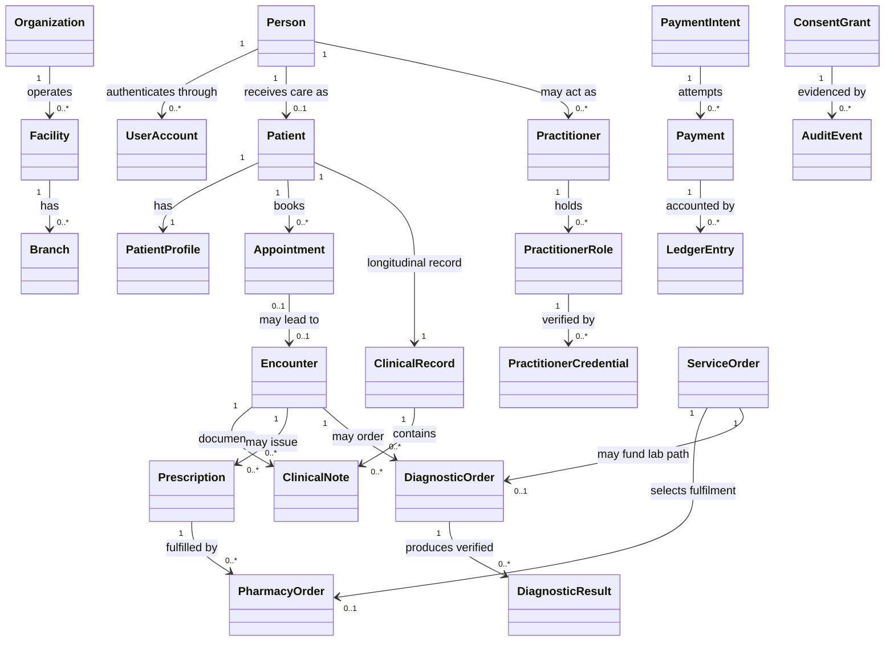
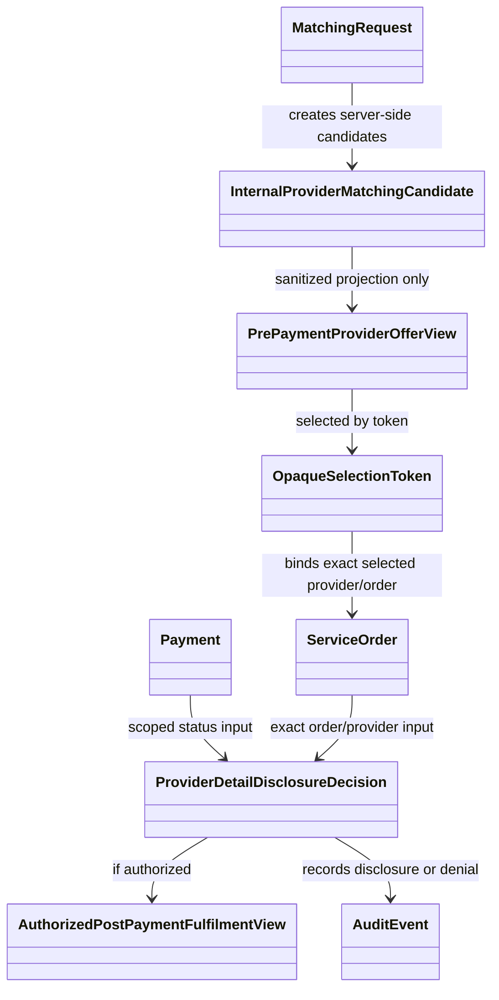

# NelyoHealth Conceptual Domain Model

## Document Control

| Field | Value |
|---|---|
| Prompt | P00-06 |
| Complete Breakdown work packages | P00-07; P00-08 |
| Issue IDs | P00-DOM-001; P00-ARC-001 |
| Owner role | Architecture lead + domain owners |
| Review state | PROPOSED |
| Last updated | 2026-06-24 |
| Related decisions | REQ-DOM-001 through REQ-DOM-012; REQ-ARC-001 through REQ-ARC-018 |

## Modeling Rules

- Entities are conceptual.
- Attributes are illustrative.
- Relationships do not imply foreign keys.
- Aggregates do not imply microservices.
- Vendor fields are excluded.
- Final implementation belongs to later phases.
- This document is not a database schema, ORM model, API contract, or queue design.

## Core Entity Groups

| Group | Conceptual entities | Ownership note |
|---|---|---|
| Identity | Person, UserAccount, ExternalIdentity, Session, Device | Identity owns Person/account access; Patients owns Patient. |
| Patient and relationships | Patient, PatientProfile, GuardianRelationship, ClinicalProxyRelationship, CaregiverDelegation, FamilyPlanMembership, SponsorRelationship, EmergencyContact | Relationships attach to existing Person/Patient and never create duplicate Patient. |
| Organizations and providers | Organization, Facility, Branch, OrganizationMembership, Practitioner, PractitionerRole, PractitionerCredential, FacilityCredential | Organization/facility master data is separate from credential status. |
| Coverage | Plan, BenefitPackage, Coverage, Eligibility, PriorAuthorization, Claim, Remittance | Coverage and claims do not own clinical records. |
| Clinical care | Appointment, Encounter, ClinicalNote, Observation, Condition, Allergy, MedicationStatement, FollowUpPlan, Referral, CarePlan, HomeCareVisit | Encounter lifecycle is separate from finalized Clinical Records. |
| Prescription and pharmacy | Prescription, PrescriptionItem, PharmacyQuote, StockReservation, PharmacyOrder, Fulfilment, Delivery | Prescription authority remains separate from pharmacy fulfilment. |
| Diagnostics | DiagnosticOrder, DiagnosticOrderItem, LaboratoryAppointment, Specimen, Accession, DiagnosticResult, ResultComponent, CriticalResultAcknowledgement | Lab operations produce specimen/process artifacts; Diagnostics owns verified result. |
| Marketplace | MatchingRequest, InternalProviderMatchingCandidate, PrePaymentProviderOfferView, OpaqueSelectionToken, ServiceOrder, AuthorizedPostPaymentFulfilmentView | Matching candidate is server-only; pre-payment view is sanitized. |
| Finance | Invoice, InvoiceLine, PaymentIntent, Payment, Refund, Payout, LedgerAccount, LedgerEntry, ReconciliationRecord | Ledger entries are accounting authority; payment does not own order or clinical content. |
| Governance | ConsentGrant, Delegation, Authorization, AuditEvent, Complaint, ClinicalIncident, PrivacyIncident, SecurityIncident, CredentialReview | Audit evidence is append-only and distinct from business source records. |

## Required Model Relationships

- Person may link to zero or more UserAccounts according to unresolved policy in OQ-00-90.
- Person may have one longitudinal Patient identity when receiving care.
- Patient may participate in multiple funding, sponsor, family, employer, HMO, caregiver, guardian, and clinical-proxy arrangements without creating another Patient.
- Patient may have many Encounters.
- Appointment may lead to Encounter.
- Encounter may produce Prescription, DiagnosticOrder, Referral, FollowUpPlan, EmergencyEscalationTriggered, or ClinicalNote.
- Prescription may lead to one or more controlled fulfilment attempts without changing the original Prescription record.
- DiagnosticOrder may lead to specimen and result workflows.
- DiagnosticResult may have corrected versions.
- Finalized ClinicalNote, Prescription, DiagnosticResult, ReferralPacket, and other finalized records retain version history and are amended, not silently overwritten.
- ServiceOrder selects exactly one provider for one fulfilment attempt.
- Payment may fund an exact order but does not own the order.
- LedgerEntry records financial movement but does not replace Payment.
- Organization may have multiple Facilities and Branches.
- Practitioner may work through multiple OrganizationMembership or FacilityMembership relationships.
- Coverage attaches to the existing Patient.
- ConsentGrant and Delegation are not interchangeable.
- Authorization is the runtime/policy access decision.
- AuditEvent records actions without becoming the business entity itself.

## Conceptual Mermaid Model

Text explanation: the model anchors one Person to one Patient identity where care exists, separates UserAccount authentication from clinical identity, separates Appointment from Encounter, separates Prescription from PharmacyOrder, separates DiagnosticOrder from DiagnosticResult, and keeps Payment and LedgerEntry distinct.

## Provider Disclosure Conceptual Model

Text explanation: `InternalProviderMatchingCandidate` may contain protected internal matching data and stays server-side. `PrePaymentProviderOfferView` contains only `providerDisplayName`, approved non-identifying commercial/workflow fields, and optionally a non-derivable token. `AuthorizedPostPaymentFulfilmentView` is generated only after server-side authorization for the selected order, provider, actor, patient, and tenant, using the P00-13-approved payment policy.

## Aggregate and Invariant Candidates

| Candidate | Conceptual invariant |
|---|---|
| PersonIdentity | One Person identity is linked during activation/recovery; duplicates require review. |
| PatientRelationshipSet | Relationships do not create another Patient and must be scoped. |
| Appointment | Booking/no-show/cancellation state belongs to Scheduling. |
| Encounter | Encounter lifecycle and disposition are coherent before downstream clinical outputs. |
| Prescription | Prescription issue includes items and signature metadata in one atomic local transaction. |
| DiagnosticOrder | Order items and patient/order context remain coherent. |
| DiagnosticResultVersionSet | Verified result versions and corrections preserve history. |
| MatchingRequest | Internal candidates do not cross pre-payment boundary. |
| ServiceOrder | Selected provider binding is exact and cannot unlock another provider/order. |
| StockReservation | Reservation reflects internally authoritative inventory where applicable. |
| PharmacyOrder | Acceptance, dispensing, handover, and fulfilment status are auditable. |
| PaymentIntent | Payment attempts remain scoped to order/actor/source. |
| LedgerTransaction | Balanced entries for one financial movement are atomic. |
| Coverage | Eligibility and authorization attach to existing Patient and do not grant clinical access. |
| ConsentGrant | Grant/withdrawal and audit/outbox intent are atomic. |
| CredentialReview | Credential status changes are auditable and effective for eligibility. |
| ComplaintCase | Case closure/reopening has an owner and audit trail. |

## Non-Schema Guardrails

- Attributes are intentionally not exhaustive.
- Relationship cardinalities are conceptual and may be refined later.
- This model does not define database tables, foreign keys, indexes, APIs, queues, or service classes.
- Vendor-specific payment, video, map, identity, delivery, lab, pharmacy, HMO, employer, or storage types are excluded.
