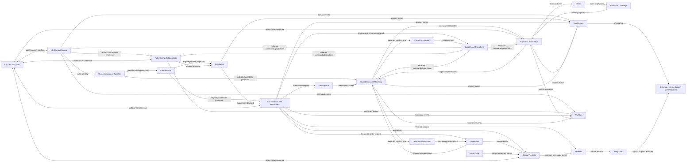
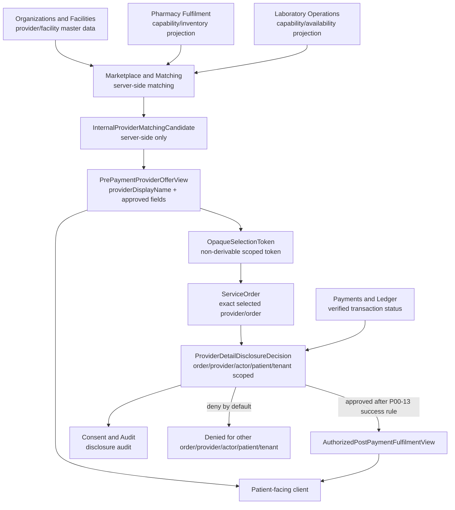
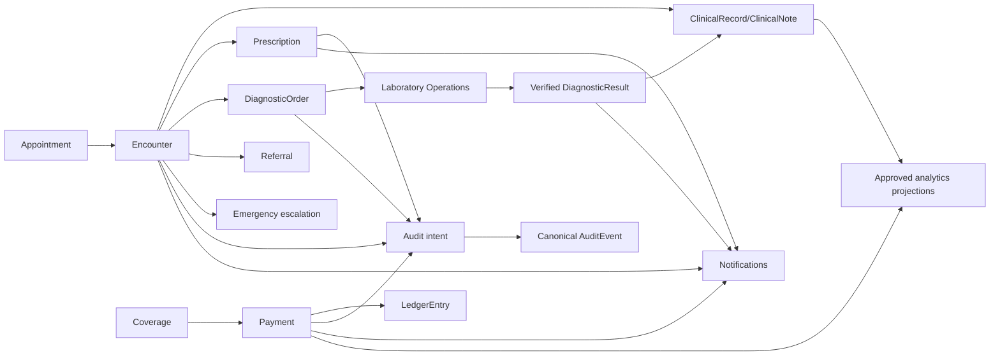
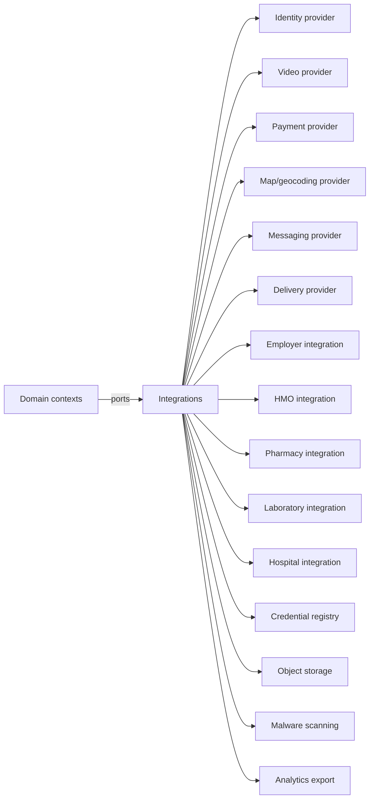

# NelyoHealth Context Map

## Document Control

| Field | Value |
|---|---|
| Prompt | P00-06 |
| Complete Breakdown work packages | P00-07; P00-08 |
| Issue IDs | P00-DOM-001; P00-ARC-001 |
| Owner role | Architecture lead |
| Review state | PROPOSED |
| Last updated | 2026-06-24 |
| Related decisions | REQ-ARC-001 through REQ-ARC-018 |

## Relationship Types

| Label | Meaning |
|---|---|
| UPSTREAM | Source authority or policy source. |
| DOWNSTREAM | Consumer of events, projections, or interfaces. |
| PUBLISHED-LANGUAGE | Explicit contract/interface language shared across contexts. |
| CONFORMIST | Consumer follows upstream model. |
| ANTI-CORRUPTION-LAYER | Adapter shields domain from external/vendor language. |
| OPEN-HOST-SERVICE | Explicit interface exposed by a context. |
| CUSTOMER-SUPPLIER | Upstream and downstream coordinate contract changes. |
| REDACTED-PROJECTION | Consumer sees minimized projection, not source record. |
| EVENT-CONSUMER | Consumer receives events asynchronously. |

## Context Map Diagram

This diagram shows a modular monolith, not microservices. Arrows describe conceptual dependencies, events, or projections. Analytics and Notifications are downstream. Support and Operations uses approved commands/projections rather than private storage bypass. Integrations protects domain contexts from vendor-specific types.

## Provider-Disclosure Projection Boundary

Flow description:

1. Organizations and Facilities owns provider and facility master data.
2. Pharmacy Fulfilment or Laboratory Operations supplies capability and availability data.
3. Marketplace and Matching performs server-side matching.
4. Marketplace creates `InternalProviderMatchingCandidate` for server use only.
5. Marketplace produces `PrePaymentProviderOfferView`.
6. The client receives `providerDisplayName` and approved fields only.
7. The user selects through an opaque scoped token.
8. Marketplace creates or associates the exact `ServiceOrder`.
9. Payments and Ledger supplies verified transaction status.
10. The disclosure policy evaluates selected order, selected provider, actor authorization, patient context, tenant context, and the later P00-13 approved successful-payment rule.
11. Only then is `AuthorizedPostPaymentFulfilmentView` produced.
12. Consent and Audit records the disclosure.
13. Another order, actor, patient, provider, or tenant remains denied.

The exact successful-payment event remains `REQUIRES_APPROVAL` for P00-13. `ProviderDetailDisclosureEligibilityEstablished` is not a generic payment-success event.

## Clinical Flow Map

Clinical flow description:

- Appointment may lead to Encounter.
- Encounter may produce ClinicalRecord entries, Prescription, DiagnosticOrder, Referral, FollowUpPlan, or EmergencyEscalationTriggered.
- Laboratory Operations owns specimen/process while Diagnostics owns clinical order and verified result.
- Emergency escalation is safety-first and not blocked by payment, coverage, registration, provider comparison, funding, sponsor approval, employer/HMO authorization, or pharmacy/lab provider-detail protection.
- Coverage informs payment; payment creates ledger entries but does not own care or disclosure authority.
- Domain actions produce audit intent and notification events with minimum necessary data.
- Analytics receives approved minimized projections only.

## External Adapter Map

External adapter description: domains define ports in domain-neutral terms. Integrations maps to vendor-specific contracts and delivery state. No vendor, SDK type, processor enum, map provider type, video provider type, or identity provider type becomes a canonical domain type.
