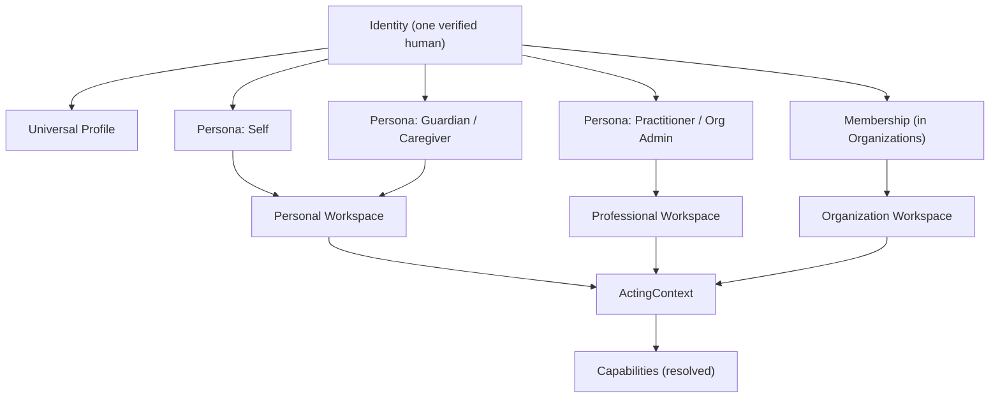
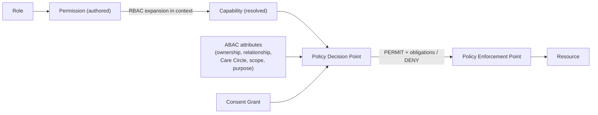
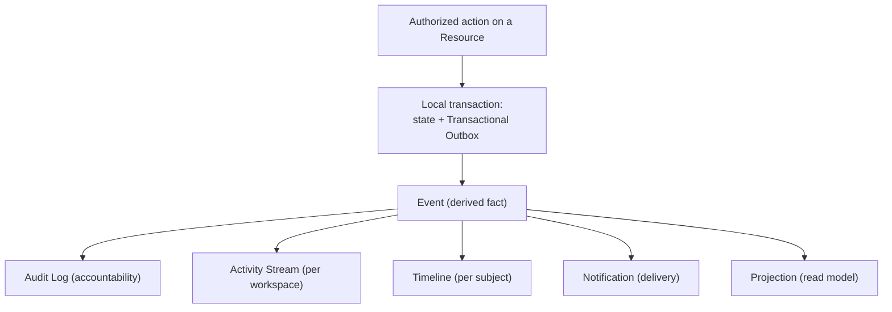
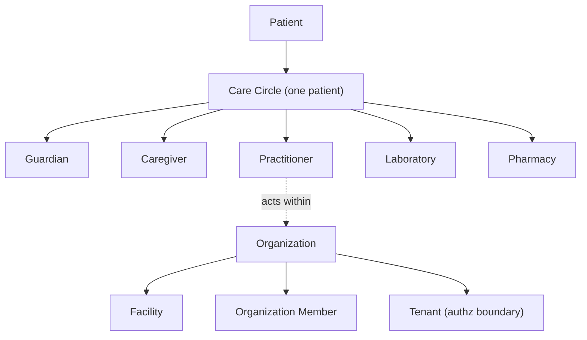
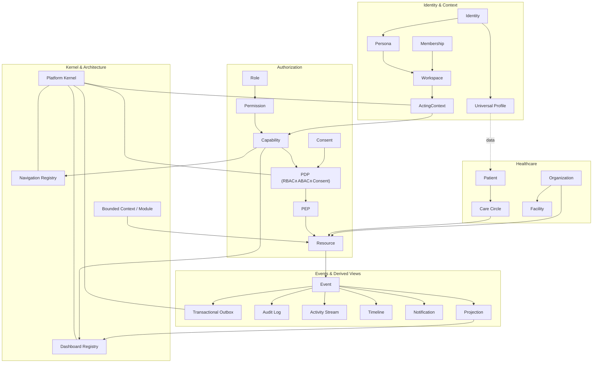

# NelyoHealth Platform Glossary — Canonical Language Specification

## Document Control

| Field | Value |
|---|---|
| Document | `docs/architecture/platform-glossary.md` |
| Kind | Canonical language specification (source of truth for terminology) |
| Governing sources | `docs/platform-manifest.md` (v1.0); `docs/architecture/platform-kernel-blueprint.md` |
| Aligned with | `docs/glossary.md` (domain + data-classification glossary), `domain-boundaries.md`, `source-of-truth-matrix.md`, `tenancy-concept.md`, `event-catalogue-draft.md`, `packages/domain/src/identity-tenancy-model.ts` |
| Owner role | Architecture lead |
| Review state | PROPOSED |
| Last updated | 2026-07-17 |

---

## Introduction

This document is the **Canonical Language Specification** for NelyoHealth. It is not a casual glossary; it is the authoritative vocabulary that Engineering, Product, UX/UI, Documentation, AI assistants, API design, database design, and architecture must all use consistently.

It exists because a large healthcare platform fails quietly when the same word means different things to different people. "User", "profile", "provider", "context", and "permission" each carry three or four meanings in an unmanaged codebase. This specification assigns **one canonical name to one concept**, and records the relationships and boundaries between concepts so the system remains legible for a decade.

## Purpose

- Eliminate terminological ambiguity across every discipline and document.
- Give every important concept exactly one canonical name, one definition, one intended usage.
- Make the relationships between concepts explicit.
- Record, and where necessary resolve, conflicts with existing repository terminology.

## How to Use This Document

- **Every other document references this one.** When a spec, ADR, API contract, or schema uses a platform term, it uses the term as defined here.
- **This is the tie-breaker for *platform language*.** If terminology elsewhere in the repository conflicts with this glossary, this glossary wins for platform/architectural vocabulary, and the conflict is recorded in the [Conflict Register](#appendix-a--terminology-conflict-register).
- **Relationship to the domain glossary.** `docs/glossary.md` (P00-06) is the authority for **domain-entity definitions, owning Bounded Context, and data classification** (Person, UserAccount, Patient, etc.). This document is the authority for **platform/kernel language, concept relationships, and naming rules** (Identity as an umbrella, Persona, Workspace, Context, Capability, PDP/PEP, registries). Where they overlap they **must agree**; for an entity's canonical definition/ownership/classification, defer to `docs/glossary.md`; for how concepts relate and how they are named across disciplines, defer here. They cross-link and neither silently overrides the other.
- **UI copy is exempt from wording but not from meaning.** A screen may say "Your family" where the architecture says *Care Circle*; the mapping is recorded, but the underlying concept is unchanged. See [Terminology Rules](#terminology-rules).
- **When a term is missing,** propose an addition here first, rather than coining a synonym in a feature branch.

## Guiding Principles

1. **Language is architecture.** The ubiquitous language (DDD) is a design artifact, not documentation garnish.
2. **Canonical over convenient.** Prefer the precise term even when a looser everyday word is available.
3. **Layer-aware naming.** A single real-world thing may legitimately have a *product term* and a *technical term*; both are recorded and mapped, never conflated.
4. **Traceability.** Every term is consistent with the Platform Manifest and the Platform Kernel Blueprint.
5. **Nothing implied.** Mirroring the platform's own security posture, meaning is explicit; a term never quietly acquires a second meaning.

## Terminology Rules

1. **One concept, one name.** A concept has exactly one canonical term.
2. **One name, one concept.** Two different concepts must never share a name.
3. **No synonyms in technical material.** Specs, code, schemas, and APIs use the canonical term only. Synonyms live only in UI copy and marketing, and only via a recorded mapping.
4. **UI labels may differ from architectural terms.** Product surfaces optimise for human warmth; the mapping to the canonical term is recorded and the concept is never changed.
5. **Business language maps cleanly to technical language.** Every product term resolves to exactly one canonical term.
6. **Domain type names are `PascalCase`** (`Person`, `CareCircle`, `ConsentGrant`).
7. **Event names are `PascalCase`, past tense** (`AppointmentBooked`, `ConsentWithdrawn`) — an event is a fact that already happened.
8. **Overloaded English words are not canonical terms.** `User`, `Record`, `Profile`, and `Provider` are avoided as bare terms; each resolves to a precise canonical term.
9. **"Context" is always qualified.** The runtime `ActingContext` and the DDD *Bounded Context* are different concepts and are never both called just "context".

> **Entry format.** Each term below provides: **Definition**, **Purpose** (why it exists), **Example**, **Related**, **Not to be confused with** (where useful), and **Implementation** (where useful).

---

## Core Concepts

### Identity
- **Definition.** The single, permanent, verified representation of one human being on the platform. One human = one Identity.
- **Purpose.** The immutable root to which every persona, role, membership, permission, and action ultimately attaches. Identity is permanent; everything else is situational (Manifest Principle 1).
- **Example.** Amina has one Identity whether she books a consult for herself, manages her son's vaccinations as a guardian, or works a clinic shift as a doctor.
- **Related.** Universal Profile, Person, UserAccount, Persona, Authentication.
- **Not to be confused with.** *User* (an avoided term); *Persona* (a capacity *of* an Identity); *UserAccount* (the authentication principal, one facet of an Identity).
- **Implementation.** Realized as a canonical `Person` (the human, owned by *Identity & Access*) plus one or more `UserAccount` / `ExternalIdentity` records. See `identity-tenancy-model.ts`, ADR-0006.

### Universal Profile
- **Definition.** The single, identity-level profile of a human — the real-world attributes that are true regardless of capacity: legal/preferred name, date of birth, and verified contact points.
- **Purpose.** Gives an Identity exactly one authoritative profile, shared across all personas and workspaces, so personal data is never fragmented or duplicated per role.
- **Example.** Amina's name and date of birth are the same whether she is acting as a patient or a doctor; they live in her Universal Profile, not in each persona.
- **Related.** Identity, Person, Persona, Patient (which references, but does not duplicate, the person).
- **Not to be confused with.** *Persona* (a capacity, not a data record); *PatientProfile* (a domain-specific profile owned by *Patients & Relationships*); any per-role "profile".
- **Implementation.** Backed by the `Person` record's attributes plus verified `ContactPoint`s in *Identity & Access*.

### Authentication
- **Definition.** The process of establishing *who is making a request* — verifying that a session belongs to a genuine `UserAccount` bound to a `Person`.
- **Purpose.** The first stage of the request lifecycle; produces the verified principal that context resolution builds on. Answers "who is acting?".
- **Example.** A phone-OTP login plus an MFA step establishes an authenticated session for Amina's account.
- **Related.** Session, Identity Verification, Device Trust, Authorization.
- **Not to be confused with.** *Authorization* (what an authenticated actor is *allowed* to do); *Identity Verification* (a one-time proofing of a real human, not a per-request check).

### Authorization
- **Definition.** The decision of *whether the current actor may perform a specific action on a specific resource*, computed server-side as RBAC ∧ ABAC ∧ Consent.
- **Purpose.** Enforces "permissions before access" (Manifest Principle 4) at a single, unbypassable decision path.
- **Example.** A caregiver is authorized to view a dependent's appointment but not to read the clinician's private notes.
- **Related.** Permission, Capability, Consent, RBAC, ABAC, Policy Decision Point, Policy Enforcement Point.
- **Not to be confused with.** *Authentication* (who you are, not what you may do).

### Context (ActingContext)
- **Definition.** The resolved, request-scoped answer to *who is acting, for whom, where, and with what effective abilities* — the object threaded through every request.
- **Purpose.** Makes "everything is context-aware" (Manifest Principle 2) structural: no domain action runs without a valid Context.
- **Example.** `{ identity: Amina, persona: Doctor, workspace: Enugu Clinic (Professional), capabilities: […], scope: tenant=EnuguClinic }`.
- **Related.** Context Resolution, Persona, Workspace, Role, Capability, Session.
- **Not to be confused with.** *Bounded Context* (a DDD ownership boundary — always spelled out in full). Per Terminology Rule 9, the runtime concept is *Context* / *ActingContext*, never bare "context" when a Bounded Context might be meant.
- **Implementation.** The `ActingContext` object defined in the Platform Kernel Blueprint §3.1.

### Context Resolution
- **Definition.** The kernel process that turns an authenticated principal plus a declared persona and workspace into a validated `ActingContext`.
- **Purpose.** The single place personas, workspaces, roles, and capabilities are assembled — with deterministic, audited transitions and no silent privilege carryover.
- **Example.** Switching from the Personal to the Professional workspace re-resolves the Context from zero rather than adding privileges to the existing one.
- **Related.** Context, Persona, Workspace, Role, Capability.
- **Not to be confused with.** *Authentication* (which precedes it).

### Persona
- **Definition.** The capacity in which one Identity is currently acting — Self, Parent, Guardian, Caregiver, Practitioner, Organization Administrator, Operations, etc.
- **Purpose.** Lets one permanent Identity act in many capacities without new accounts. Identity is permanent; personas are situational (Manifest Principle 1 / domain objects).
- **Example.** Amina's *Guardian* persona lets her manage her son's care; her *Doctor* persona lets her treat patients. Same Identity, different personas.
- **Related.** Identity, Workspace, Role, Membership, Care Circle.
- **Not to be confused with.** *Profile* (data, not capacity); *Role* (a bundle of permissions attached to a persona-in-workspace); *Identity* (the permanent root).

### Workspace
- **Definition.** The operational environment an Identity acts within — **Personal**, **Professional**, **Business**, or **Organization** — resolving to a tenant/facility scope.
- **Purpose.** Provides the visible, deterministic boundary for authorization and data. Users switch workspaces without switching accounts; leaving one drops its privileges.
- **Example.** Amina's *Personal Workspace* holds her and her son's care; her *Organization Workspace* for the Enugu Clinic holds her clinical work there.
- **Related.** Persona, Organization, Facility, Tenant, Membership.
- **Not to be confused with.** *Dashboard* (a rendered surface *inside* a workspace, not the environment itself); *Tenant* (the authorization/data boundary a workspace resolves to).

### Personal Workspace
- **Definition.** The Workspace in which an Identity manages their own health and the care of their dependents (their Care Circles).
- **Purpose.** The home of individual and family health, distinct from any professional or organizational capacity.
- **Related.** Workspace, Care Circle, Patient, Dependent.

### Professional Workspace
- **Definition.** The Workspace in which an Identity acts as an individual Practitioner (independent of, or across, organizations).
- **Purpose.** Separates a clinician's individual professional capacity from any single employing organization.
- **Related.** Workspace, Practitioner, PractitionerRole, Membership.

### Business Workspace
- **Definition.** The Workspace for an Identity operating a business relationship that is not a full care organization — e.g. an employer sponsor or a small partner account.
- **Purpose.** Houses commercial/sponsorship activity without granting clinical capability.
- **Related.** Workspace, Employer, Health Partner, Subscription.

### Organization Workspace
- **Definition.** The Workspace scoped to a specific Organization (and optionally a Facility) in which members act with organization-granted roles.
- **Purpose.** The operating environment for hospitals, laboratories, pharmacies, HMOs, and employers, bounded by tenant scope.
- **Related.** Organization, Facility, Organization Member, Tenant, Membership.

### Membership
- **Definition.** The relationship by which an Identity belongs to an Organization (optionally a Facility) and holds one or more roles there.
- **Purpose.** The link that lets an Identity enter an Organization Workspace and hold organization-granted roles; revoking it removes access without deleting Identity.
- **Example.** Amina's membership at the Enugu Clinic carries a *Doctor* role; ending the membership revokes that access, but her signed records remain attributable.
- **Related.** Organization, Organization Member, Role, Persona, Workspace.
- **Not to be confused with.** *Care Circle* participation (a patient-centered clinical/family relationship, not organizational employment).
- **Implementation.** `OrganizationMembership` + `RoleAssignment` in `identity-tenancy-model.ts` (owned by *Organizations & Facilities*).

### Ownership
- **Definition.** The attribute stating that a specific Resource belongs to a specific principal (Identity, Patient, or Organization), used as an ABAC input.
- **Purpose.** Lets authorization grant an actor rights over their own resources without a blanket role.
- **Example.** A patient owns their own appointment; that ownership is one reason they may cancel it.
- **Related.** Resource, Authorization, ABAC, Patient, Organization.
- **Not to be confused with.** *Membership* (belonging to an org) or *Custody of data* (the owning **Bounded Context** in the source-of-truth matrix, which is a storage-authority concept, not a person's ownership).

### Session
- **Definition.** An authenticated, time-bounded interaction between one device and one `UserAccount`, carrying the auth level (e.g. whether MFA was satisfied).
- **Purpose.** The unit that Authentication produces and that context resolution and revocation act upon.
- **Related.** Authentication, Device Trust, Context.
- **Not to be confused with.** *Context* (the resolved acting context *within* a session).
- **Implementation.** `Session` / `Device` in *Identity & Access*; revocation emits `SessionsRevoked` (EVT-005).

---

## Authorization Concepts

### Role
- **Definition.** A named bundle of permissions and responsibilities, attached to a persona within a workspace — e.g. Patient, Doctor, Family Manager, Hospital Admin, Pharmacist.
- **Purpose.** The unit organizations and the platform grant; the input RBAC expands into capabilities. Roles are attached to personas; **roles are not identities** (Manifest domain objects).
- **Example.** The *Doctor* role at a facility grants the permissions needed to run encounters and issue prescriptions there.
- **Related.** Permission, Capability, Persona, Membership, RBAC.
- **Not to be confused with.** *Persona* (the capacity a role attaches to); *Capability* (the resolved effect of roles in a context).
- **Implementation.** `RoleAssignment.roleCode` within an `OrganizationMembership`.

### Permission
- **Definition.** An atomic authorization primitive: the right to perform a specific action on a specific resource type (e.g. `appointment:cancel`). The *authored* unit.
- **Purpose.** The building block that roles are composed from and that the policy catalog enumerates.
- **Example.** `prescription:issue` is a permission carried by clinical roles.
- **Related.** Role, Capability, Policy Decision Point, Capability Registry.
- **Not to be confused with.** *Capability* — a **Permission is authored and attached to a Role; a Capability is the resolved, effective ability present in an `ActingContext`.** UI, navigation, and dashboards gate on **Capability**, never on raw Permission (see [Naming Rules](#naming-rules)).

### Capability
- **Definition.** An effective ability present in a resolved `ActingContext` — the RBAC expansion of the actor's roles for the active persona and workspace, before ABAC/consent narrowing.
- **Purpose.** The runtime currency the kernel gates on: navigation entries, dashboard widgets, and command availability are all filtered by capability.
- **Example.** In her Doctor persona at the Enugu Clinic, Amina's Context carries the `encounter:conduct` capability; in her Personal workspace it does not.
- **Related.** Permission, Role, Context, Navigation Registry, Dashboard Registry.
- **Not to be confused with.** *Permission* (the authored primitive). Capability = permissions **resolved into a context**.

### Resource
- **Definition.** Any addressable thing an action can target and that authorization protects — an appointment, a clinical note, a payment, an organization member.
- **Purpose.** The unit of protection; every authorization decision is about a `(actor, action, resource)` triple.
- **Example.** A specific `Consultation` is a resource; reading it is an action authorization must permit.
- **Related.** Ownership, Authorization, Resource Registry, Projection.
- **Not to be confused with.** *Record* (a concrete persisted artifact) or *Document* (a stored file). A Resource is the authorization abstraction; a Record/Document is one kind of resource. Per Terminology Rule 8, prefer **Resource** in authorization contexts.

### RBAC (Role-Based Access Control)
- **Definition.** The authorization leg that grants abilities based on the actor's roles.
- **Purpose.** Coarse, role-driven capability assignment — the first, cacheable leg of a decision.
- **Related.** Role, Capability, ABAC, Policy Decision Point.
- **Not to be confused with.** *ABAC* (the attribute/relationship leg that RBAC is combined with).

### ABAC (Attribute-Based Access Control)
- **Definition.** The authorization leg that evaluates attributes and relationships — resource ownership, patient relationship, Care Circle membership, tenant/facility scope match, purpose-of-use, time and location.
- **Purpose.** Adds the contextual precision RBAC alone cannot express; the second leg of every decision.
- **Related.** RBAC, Consent, Ownership, Care Circle, Policy Decision Point.

### Consent
- **Definition.** A patient's (or guardian's) explicit authorization for a specific actor to access specific information for a specific purpose — a required leg of authorization for protected data.
- **Purpose.** Makes access patient-controlled and revocable (Manifest Principle 4; Architectural Rule 7). No feature bypasses it.
- **Example.** A patient consents to share a lab result with a treating doctor; without that grant, access is denied.
- **Related.** Consent Policy, Consent Grant, Consent Revocation, Emergency Access, Break Glass Access, Authorization.
- **Not to be confused with.** *Permission* (a platform-authored primitive) — consent is a **patient-authored** authorization input.
- **Implementation.** Owned by *Consent & Audit*; consulted by the PDP via the `ConsentPort`.

### Consent Policy
- **Definition.** A reusable rule set defining what a category of consent covers, including minor-consent rules and default scopes.
- **Purpose.** Lets consent be evaluated consistently rather than case by case.
- **Related.** Consent, Consent Grant, Guardian, Dependent.

### Consent Grant
- **Definition.** A concrete, recorded instance of consent — actor, purpose, scope, and validity window — issued by the patient or their guardian.
- **Purpose.** The evidence the PDP checks; the thing that can be time-bounded and revoked.
- **Related.** Consent, Consent Revocation, Audit Log.
- **Implementation.** `ConsentGrant`; emits `ConsentGranted` (EVT-074).

### Consent Revocation
- **Definition.** The withdrawal of a previously issued Consent Grant, effective from a stated time.
- **Purpose.** Guarantees consent is revocable at any time and forces authorization caches to invalidate.
- **Related.** Consent Grant, Authorization, Audit Log.
- **Implementation.** `ConsentWithdrawal`; emits `ConsentWithdrawn` (EVT-075).

### Emergency Access
- **Definition.** A consent-and-authorization pathway that permits time-critical access to information when ordinary consent cannot be obtained, under policy.
- **Purpose.** Ensures emergencies are never blocked by ordinary gating — while remaining bounded and audited.
- **Related.** Break Glass Access, Consent, Healthcare Journey.
- **Not to be confused with.** *Break Glass Access* — Emergency Access is the *policy pathway*; Break Glass is the *specific override action* an actor takes within it.

### Break Glass Access
- **Definition.** A specific, deliberate override in which an authorized actor accesses protected data under an emergency policy, requiring justification and always producing an audit record.
- **Purpose.** Makes exceptional access possible, accountable, and reviewable rather than silent.
- **Example.** An emergency clinician invokes break glass to read a critical allergy, recording a justification.
- **Related.** Emergency Access, Audit Log, Policy Decision Point.
- **Implementation.** Carried as a PDP obligation; emits `BreakGlassAccessUsed` (EVT-076, owned by *Consent & Audit*).

### Policy Decision Point (PDP)
- **Definition.** The single kernel component that renders an authorization decision (PERMIT/DENY + obligations) from RBAC ∧ ABAC ∧ Consent.
- **Purpose.** Centralizes the decision so Architectural Rules 5 and 7 are unbypassable.
- **Related.** Policy Enforcement Point, RBAC, ABAC, Consent, Authorization.
- **Not to be confused with.** *Policy Enforcement Point* (which *asks* the PDP and *applies* the answer).

### Policy Enforcement Point (PEP)
- **Definition.** The location — the API edge and each domain command handler — that calls the PDP before acting and applies its decision and obligations (e.g. redaction, step-up MFA).
- **Purpose.** Ensures every protected action is actually gated; the PDP decides, the PEP enforces.
- **Related.** Policy Decision Point, Projection, Authorization.

---

## Healthcare Concepts

### Care Circle
- **Definition.** The patient-centered graph of people and organizations who collaborate on one patient's care — patient, family (parent, guardian, caregiver, adult child), and providers (doctor, hospital, laboratory, pharmacy, specialists) — each with permissions appropriate to their responsibility.
- **Purpose.** The platform's primary collaboration model; makes "care is collaborative" (Manifest Principle 3) a first-class entity rather than an afterthought. Centers on exactly one patient.
- **Example.** Grace's Care Circle includes Grace (patient), her daughter (caregiver, from abroad), her GP (doctor), a laboratory, and a pharmacy.
- **Related.** Patient, Guardian, Caregiver, Dependent, Practitioner, Consent, Membership.
- **Not to be confused with.** *Family Group* (avoided term); *Family Plan / Coverage* (a **funding** construct, not a collaboration graph); *Organization* (an institution). A Care Circle spans families **and** providers around one patient.
- **Implementation.** A Phase 1+ domain module in *Patients & Relationships*, built on the kernel. Not implemented in the kernel itself.

### Patient
- **Definition.** The longitudinal care identity of a person receiving care — the single continuity anchor for their clinical timeline.
- **Purpose.** Guarantees one continuous care history per human, never fragmented or duplicated by coverage, sponsor, or organization changes.
- **Example.** Grace is one Patient whether her care is self-funded, sponsored by her daughter, or covered by an HMO.
- **Related.** Person, Care Circle, Medical Record, Consultation, Healthcare Journey.
- **Not to be confused with.** *Person* (the identity-level human; a Patient *references* a Person and adds care continuity); *Universal Profile* (identity data, not care history).
- **Implementation.** `Patient` / `PatientProfile` owned by *Patients & Relationships*; **must not be duplicated per coverage/sponsor** (`source-of-truth-matrix.md`, REQ-LOCK-001). *Note:* the marketing/`ui-foundation` layer is forbidden from naming `Patient` as a domain identifier — product surfaces use everyday language instead.

### Dependent
- **Definition.** A person whose care is managed within another person's Care Circle — typically a minor child or an elderly relative — under a Guardian or Caregiver relationship.
- **Purpose.** Names the cared-for party in family health without implying they lack their own Identity.
- **Related.** Guardian, Caregiver, Care Circle, Patient, Consent Policy.
- **Not to be confused with.** *Caregiver* (the one providing support) or *Beneficiary* (a funding relationship).

### Guardian
- **Definition.** A person with **legal decision-making authority** over a Dependent (e.g. a parent of a minor), including consent authority for that Dependent's care.
- **Purpose.** Provides the lawful basis for managing a minor's or incapacitated adult's care and consent.
- **Example.** A parent as Guardian consents to and books their child's vaccination.
- **Related.** Caregiver, Dependent, Consent, Care Circle, Persona.
- **Not to be confused with.** *Caregiver* — a **Guardian has legal authority (including consent); a Caregiver has delegated, day-to-day, scoped access without legal authority.**

### Caregiver
- **Definition.** A person granted delegated, day-to-day, scoped access to support another person's care (e.g. medication reminders, appointment coordination), without legal decision-making authority.
- **Purpose.** Supports elderly and dependent care with explicit, revocable, least-privilege access.
- **Example.** An adult daughter abroad, as Caregiver, receives her mother's medication reminders and coordinates appointments.
- **Related.** Guardian, Dependent, Care Circle, Consent, Capability.
- **Not to be confused with.** *Guardian* (legal authority); *Provider* (a service-rendering entity).

### Healthcare Professional
- **Definition.** The product/UX term for a licensed clinician who delivers care. The **canonical technical term is Practitioner**, with a specific **PractitionerRole** (Doctor, Pharmacist, Nurse, Laboratory Scientist).
- **Purpose.** Names the human clinician distinctly from the institution they may work in.
- **Related.** Practitioner, PractitionerRole, Provider, Provider Organization, Care Circle.
- **Not to be confused with.** *Provider Organization* or *Facility* (institutions). Use **Practitioner** in technical material; "Healthcare Professional" is the acceptable product synonym.
- **Implementation.** `Practitioner` / `PractitionerRole` owned by *Credentialing*.

### Provider
- **Definition.** An **umbrella, non-canonical** term for any entity that renders a health service — an individual Practitioner *or* a Provider Organization/Facility.
- **Purpose.** A convenient everyday word; retained only because it is entrenched in product language.
- **Related.** Practitioner, Provider Organization, Facility.
- **Not to be confused with.** Anything precise. **Because "Provider" is ambiguous, technical material must qualify it** — use *Practitioner* (individual) or *Provider Organization* / *Facility* (institution). See [Conflict Register](#appendix-a--terminology-conflict-register).

### Provider Organization
- **Definition.** An Organization that delivers clinical or diagnostic services — a hospital, clinic, laboratory, or pharmacy organization.
- **Purpose.** Distinguishes service-delivering institutions from payers, employers, and partners.
- **Related.** Organization, Facility, Practitioner, Marketplace.
- **Implementation.** `ProviderOrganization` owned by *Organizations & Facilities*; precise location is protected pre-payment (`source-of-truth-matrix.md`, REQ-LOCK-004).

### Organization
- **Definition.** An institution on the platform — hospital, clinic, laboratory, pharmacy, HMO, employer, or partner — containing members, facilities, and operational resources; also the tenant anchor for authorization.
- **Purpose.** The institutional counterpart to the Care Circle; one of the two containers every healthcare interaction lives inside (the other being a Care Circle).
- **Related.** Organization Member, Facility, Organization Workspace, Tenant, Membership.
- **Not to be confused with.** *Facility* (a location *within* an organization); *Care Circle* (a patient-centered graph).
- **Implementation.** `Organization` owned by *Organizations & Facilities*.

### Organization Member
- **Definition.** An Identity that holds a Membership in an Organization, carrying one or more organization-granted roles.
- **Purpose.** Names the people who act on behalf of an organization within its Organization Workspace.
- **Related.** Membership, Organization, Role, Persona.
- **Implementation.** `OrganizationMembership`.

### Facility
- **Definition.** A constrained operating location within one Organization — branch, service location, or service area.
- **Purpose.** Scopes operations and disclosure inside an organization; precise facility location is subject to pre-payment disclosure rules.
- **Related.** Organization, Provider Organization, Tenant, Workspace.
- **Implementation.** `Facility` owned by *Organizations & Facilities*.

### Hospital
- **Definition.** A Provider Organization that delivers inpatient and specialist care and receives referrals.
- **Purpose.** Names the institution type for referral and inpatient coordination.
- **Related.** Provider Organization, Referral, Facility, Care Circle.

### Clinic
- **Definition.** A Provider Organization delivering coordinated **outpatient** care.
- **Purpose.** Distinguishes outpatient institutions from hospitals.
- **Related.** Provider Organization, Consultation, Facility.

### Laboratory
- **Definition.** A Provider Organization that receives diagnostic orders, processes specimens, and returns results securely. Encompasses diagnostic centres.
- **Purpose.** Names the diagnostics-delivering institution.
- **Related.** Diagnostic Order, Laboratory Result, Provider Organization.
- **Implementation.** *Laboratory Operations* owns specimen/processing; verified results are owned by *Diagnostics*.

### Pharmacy
- **Definition.** A Provider Organization that receives digital prescriptions and fulfils and dispenses medications.
- **Purpose.** Names the medication-fulfilment institution.
- **Related.** Prescription, Medication, Provider Organization.
- **Implementation.** *Pharmacy Fulfilment* owns inventory/dispensing; receives a fulfilment view, never the prescription source.

### Employer
- **Definition.** An Organization that sponsors healthcare access for its workforce as a benefit, without access to clinical records.
- **Purpose.** Enables workforce sponsorship while enforcing the payer/clinical separation (ADR-0007).
- **Related.** Business Workspace, HMO, Plan, Subscription, Beneficiary.
- **Not to be confused with.** A *Provider* — an employer funds care; it does not deliver or read it.

### HMO
- **Definition.** A Health Maintenance Organization that connects covered members with providers and manages eligibility and coverage.
- **Purpose.** Population-level coverage coordination that respects clinical judgment and never gates emergencies.
- **Related.** Plan, Coverage, Eligibility, Claim, Employer.
- **Not to be confused with.** A *Provider Organization* — an HMO covers care; it does not own the clinical record.

### Health Partner
- **Definition.** An external organization that collaborates with NelyoHealth to improve care delivery but is not a direct provider, payer, or employer.
- **Purpose.** A container for partnership relationships outside the core provider/payer roles.
- **Related.** Organization, Business Workspace, Integrations.

### Medical Record
- **Definition.** The finalized, versioned clinical documentation about a Patient — notes, observations, conditions, allergies, and their amendments.
- **Purpose.** The authoritative clinical narrative; finalized content is amended by versioned amendment, never silent overwrite (ADR-0008).
- **Related.** Patient, Consultation, Document, Timeline, Diagnostics.
- **Not to be confused with.** *Document* (a stored file, which may or may not be clinical); *Resource* (the authorization abstraction). Owned by *Clinical Records*.

### Consultation
- **Definition.** A clinical encounter between a Patient and a Practitioner (in person or by video) within the encounter lifecycle.
- **Purpose.** The care interaction that produces clinical output (notes, prescriptions, orders).
- **Related.** Appointment, Encounter, Medical Record, Prescription, Referral.
- **Implementation.** Owned by *Consultations & Encounters*; finalized clinical content is owned by *Clinical Records*.

### Appointment
- **Definition.** A scheduled slot for a future care interaction between a Patient and a Practitioner/Facility.
- **Purpose.** The scheduling artifact that precedes a Consultation.
- **Related.** Consultation, Scheduling, Care Circle.
- **Not to be confused with.** *Consultation* (the actual encounter). Owned by *Scheduling*.

### Prescription
- **Definition.** A signed medication order issued by an authorized Practitioner, specifying items, dosage, and substitution permissions.
- **Purpose.** The clinical authority that pharmacies fulfil; the source stays with the prescriber's context.
- **Related.** Medication, Pharmacy, Consultation, Medical Record.
- **Implementation.** Owned by *Prescriptions*; pharmacies receive a fulfilment view only.

### Medication
- **Definition.** A pharmaceutical product referenced by a Prescription and dispensed by a Pharmacy.
- **Purpose.** The catalogued substance a prescription item refers to.
- **Related.** Prescription, Pharmacy.

### Laboratory Result
- **Definition.** A verified diagnostic result produced from a diagnostic order, released to authorized clinicians and patients under policy.
- **Purpose.** The clinical output of diagnostics; versioned, with critical-result handling.
- **Related.** Laboratory, Diagnostic Order, Medical Record.
- **Implementation.** Verified results owned by *Diagnostics*; raw operations by *Laboratory Operations*.

### Referral
- **Definition.** A request to transfer or extend a Patient's care to another Practitioner or Organization, carrying a minimum-necessary referral packet.
- **Purpose.** Moves care between providers with clinical context but without duplicating the full record.
- **Related.** Hospital, Consultation, Medical Record.
- **Implementation.** Owned by *Referrals*.

### Payment
- **Definition.** A financial transaction settling the cost of a service, recorded in the ledger.
- **Purpose.** The money movement; its *status* is an input to post-payment provider disclosure, never the access authority itself.
- **Related.** Invoice, Subscription, Plan, Ledger.
- **Not to be confused with.** *Authorization* — a successful payment does **not** unlock the clinical record (ADR-0007, ADR-0011). Owned by *Payments & Ledger*.

### Invoice
- **Definition.** An itemized statement of amounts owed for services or coverage.
- **Purpose.** The billing artifact a Payment settles.
- **Related.** Payment, Subscription, Plan.

### Subscription
- **Definition.** A recurring commercial agreement (e.g. an employer benefit or a recurring family plan) that entitles beneficiaries to defined services over time.
- **Purpose.** Names ongoing, renewing commercial relationships distinct from one-off payments.
- **Related.** Payment, Invoice, Plan, Coverage, Employer.
- **Implementation.** Realized through *Plans & Coverage* + *Payments & Ledger*; the standalone term "Subscription" is DESIGN-NOW where a recurring model is required. *Note:* keep distinct from clinical continuity — a subscription funds care; it never owns a Patient or record.

### Healthcare Journey
- **Definition.** The end-to-end path a patient's care follows — from symptom onset through consultation, diagnostics, treatment, fulfilment, follow-up, and long-term care.
- **Purpose.** The organizing narrative for coordination; the thing the platform exists to make continuous rather than fragmented (Manifest Vision).
- **Related.** Care Circle, Consultation, Timeline, Activity Stream.

---

## Supporting Concepts

### Event
- **Definition.** An immutable record that a significant thing happened, emitted by an owning Bounded Context after a committed state change. Named in past tense.
- **Purpose.** The derived source of truth for notifications, streams, analytics, audit, automation, and integrations (Manifest Principle 6) — **without** being the source of truth for domain *state* (which stays in the owning context's tables).
- **Example.** `AppointmentBooked`, `PrescriptionIssued`, `ConsentWithdrawn`.
- **Related.** Event Stream, Transactional Outbox, Activity Stream, Timeline, Notification, Audit Log, Projection.
- **Not to be confused with.** *Notification* — an **Event is a fact; a Notification is a delivery derived from an event.** Events are **derived from authoritative state, not event-sourced** (Kernel Blueprint §10, decision K-D1).
- **Implementation.** Types: Domain event, Integration event, Audit event, Operational signal (`event-catalogue-draft.md`). Payloads carry references, never protected bodies or secrets.

### Event Stream
- **Definition.** The ordered technical flow of events (per aggregate, and across the dispatcher) that consumers subscribe to.
- **Purpose.** The transport by which committed events reach subscribers with ordering and idempotency guarantees.
- **Related.** Event, Transactional Outbox, Projection.
- **Not to be confused with.** *Activity Stream* (a human-readable, per-workspace derived feed).

### Transactional Outbox
- **Definition.** A table written **inside the same local transaction** as a domain state change, holding the event and audit intent, later published by a dispatcher.
- **Purpose.** Guarantees an event exists **iff** the state change committed — the mechanism that makes events provably derived from authoritative state.
- **Related.** Event, Event Stream, Audit Log.
- **Implementation.** The "local outbox concept" in `domain-boundaries.md`; dispatched on the worker/queue backplane (ADR-P02-003).

### Projection
- **Definition.** A read-only, often redacted, rebuildable view derived from one or more authoritative sources — never an authoritative copy.
- **Purpose.** Lets a context or UI read what it needs (minimum-necessary) without duplicating or exposing source-of-truth data.
- **Example.** The "Patient summary for treating doctor" and the "PrePaymentProviderOfferView" in the Redacted Projection Register.
- **Related.** Resource, Source-of-truth, Dashboard Widget, Event.
- **Not to be confused with.** *Medical Record* or any source-of-truth entity — a projection is derived and disposable.

### Notification
- **Definition.** A delivered message (push, SMS, email, in-app) generated from an event, carrying minimized content.
- **Purpose.** The user-facing delivery derived from events; never a source of truth and never carrying protected bodies.
- **Related.** Event, Activity Stream.
- **Not to be confused with.** *Event* (the fact) or *Activity Stream* (the persistent feed). Owned by *Notifications*.

### Activity Stream
- **Definition.** A per-Workspace, human-readable feed of recent, permitted activity, derived from events.
- **Purpose.** Gives each workspace a live sense of what has happened, scoped to what the actor may see (Manifest Activity Stream Principles).
- **Related.** Event, Timeline, Notification, Workspace.
- **Not to be confused with.** *Timeline* (entity-centric and chronological) or *Audit Log* (accountability, not user experience).

### Timeline
- **Definition.** An entity-centric, chronological derived view of what has happened to a specific subject — most importantly a Patient's care timeline.
- **Purpose.** The continuity view of one subject's history across contexts.
- **Related.** Patient, Medical Record, Activity Stream, Event.
- **Not to be confused with.** *Activity Stream* (workspace-centric feed) or *Audit Log* (compliance record).

### Audit Log
- **Definition.** The canonical, append-only record of accountability-relevant actions — sensitive-record access, consent changes, break-glass, membership changes — owned by *Consent & Audit*.
- **Purpose.** Traceability of every access decision and sensitive action; the compliance backbone.
- **Related.** Event, Consent, Break Glass Access, Session.
- **Not to be confused with.** *Activity Stream* / *Timeline* (user-facing feeds) — the Audit Log is for accountability and is not shaped for end-user reading.
- **Implementation.** `AuditEvent` append-only store (source-of-truth matrix; `domain-boundaries.md`).

### Document
- **Definition.** A stored file or artifact (e.g. an uploaded evidence file, a generated PDF), held in object storage and referenced by a Resource.
- **Purpose.** Names binary/file content distinctly from structured records.
- **Related.** Resource, Medical Record, Object storage.
- **Not to be confused with.** *Medical Record* (structured clinical documentation, which may *reference* documents but is not itself a file).

### Identity Verification
- **Definition.** The one-time (or periodic) proofing that an Identity corresponds to a real, unique human.
- **Purpose.** Upholds "one human = one verified Identity" (Manifest Principle 1); distinct from per-request authentication.
- **Related.** Identity, Verification Status, Authentication.
- **Implementation.** `IdentityVerification` / `AccountActivation` in *Identity & Access*.

### Device Trust
- **Definition.** The evaluated trust level of the device a session originates from, contributing to authentication and step-up decisions.
- **Purpose.** Strengthens session security and risk-based authentication.
- **Related.** Session, Authentication.
- **Implementation.** `Device` in *Identity & Access*.

### Verification Status
- **Definition.** The current state of an Identity's or credential's verification (e.g. pending, verified, expired, suspended).
- **Purpose.** A shared attribute authorization and workflows can gate on.
- **Related.** Identity Verification, Credential, Practitioner.

---

## Architecture Concepts

### Platform Kernel
- **Definition.** The cross-cutting layer that resolves context, authorizes, dispatches events, and assembles navigation/dashboards — the substrate every domain module runs on. It owns no business data.
- **Purpose.** Turns the Manifest's non-negotiable rules into structural guarantees rather than per-feature discipline.
- **Related.** Context, Policy Decision Point, Transactional Outbox, Navigation Registry, Dashboard Registry, Bounded Context.
- **Not to be confused with.** A *Bounded Context* (the kernel is not a domain; it is infrastructure for domains). See the Platform Kernel Blueprint.

### Module
- **Definition.** A logically owned unit of functionality inside the modular monolith — often the runtime home of one Bounded Context.
- **Purpose.** The unit of ownership and boundary enforcement within one deployable backend (ADR-0005).
- **Related.** Bounded Context, Platform Kernel, API.
- **Not to be confused with.** A *microservice* — a module is a boundary, not necessarily a deployment.

### Bounded Context
- **Definition.** A DDD ownership boundary: a domain, terminology, data-authority, and dependency boundary that owns specific entities and the canonical language for them.
- **Purpose.** Establishes exactly one authoritative owner per major entity (`source-of-truth-matrix.md`) and prevents cross-context leakage.
- **Example.** *Identity & Access*, *Patients & Relationships*, *Consent & Audit*, *Payments & Ledger*.
- **Related.** Module, Source-of-truth, Projection, Event.
- **Not to be confused with.** The runtime *Context* / *ActingContext* (Terminology Rule 9). Always write "Bounded Context" in full.

### Tenant
- **Definition.** The governance and authorization boundary an Organization Workspace resolves to; a scope for policy, role evaluation, membership, and audit — **not** an owner of personhood or clinical continuity.
- **Purpose.** Enforces isolation between organizations without fragmenting a Patient's continuity across them (`tenancy-concept.md`).
- **Related.** Organization, Facility, Workspace, Membership.
- **Not to be confused with.** *Organization* (the institution) — Tenant is the *authorization/data boundary* that organization anchors.

### Resource Registry
- **Definition.** The catalogue of authorization-addressable Resource types, each declaring its owning Bounded Context, data classification, and ownership rules.
- **Purpose.** Gives the PDP and projection layer a single source for what a resource is and how it must be protected.
- **Related.** Resource, Capability Registry, Policy Decision Point, Projection.

### Capability Registry
- **Definition.** The catalogue of Capabilities and the Roles/Permissions that grant them.
- **Purpose.** The authoritative map from roles to effective abilities that RBAC expansion and registry gating consult.
- **Related.** Capability, Permission, Role, Navigation Registry, Dashboard Registry.

### Navigation Registry
- **Definition.** The declarative catalogue of navigation entries, each gated by required capability, persona kind, and workspace kind; filtered by the `ActingContext` at request time.
- **Purpose.** Makes navigation assemble from context, never hardcoded per role (Architectural Rule 8).
- **Related.** Capability, Context, Dashboard Registry.
- **Implementation.** Same declarative pattern as `@nelyohealth/content-registry`; Kernel Blueprint §8.

### Dashboard Registry
- **Definition.** The declarative catalogue of dashboard widgets, each gated by capability/persona/workspace and bound to a redacted data projection; filtered by the `ActingContext`.
- **Purpose.** Makes dashboards compose from context (Architectural Rule 9); the same surface serves every role by resolved capability.
- **Related.** Dashboard, Dashboard Widget, Capability, Projection.
- **Implementation.** Kernel Blueprint §9.

### API
- **Definition.** A defined interface through which callers interact with the platform; the platform is API-first (Architectural Rule 10).
- **Purpose.** The contract layer that the kernel pipeline sits behind.
- **Related.** Public API, Internal API, Platform Kernel.

### Public API
- **Definition.** An externally consumable, versioned, contract-stable API surface intended for clients and (in future) partners.
- **Purpose.** The stable outer contract; changes are governed and backward-compatible.
- **Related.** API, Internal API, API Consumers (reserved).
- **Not to be confused with.** *Internal API* (private, may change freely within governance).

### Internal API
- **Definition.** An API surface used between modules/layers inside the platform, not exposed to external consumers.
- **Purpose.** Internal composition without external contract obligations.
- **Related.** API, Public API, Module.

---

## UI Concepts

### Dashboard
- **Definition.** A rendered surface **inside** a Workspace that presents the widgets the current `ActingContext` permits.
- **Purpose.** The primary working surface; assembled, not hardcoded, from the Dashboard Registry.
- **Related.** Workspace, Dashboard Widget, Dashboard Registry, Capability.
- **Not to be confused with.** *Workspace* — a **Workspace is the operational environment/context; a Dashboard is a rendered view within it** (Naming Rules).

### Dashboard Widget
- **Definition.** A self-contained UI unit on a Dashboard, gated by capability/persona/workspace and fed by a redacted projection.
- **Purpose.** The composable building block of context-assembled dashboards.
- **Related.** Dashboard, Dashboard Registry, Projection, Capability.

---

## AI Concepts

### AI Assistant
- **Definition.** An assistive capability that operates strictly **inside** an `ActingContext` and the same PDP as its user, supporting communication, coordination, documentation, education, summarization, and navigation.
- **Purpose.** Improves efficiency and access without making independent clinical decisions (Manifest Principle 5). Clinical responsibility always remains with a licensed Practitioner.
- **Related.** AI Context, AI Summary, AI Recommendation, Policy Decision Point.
- **Not to be confused with.** A decision-maker — the AI Assistant never authorizes itself or acts outside the user's permissions.

### AI Context
- **Definition.** The `ActingContext` under which an AI Assistant operates — the same persona, workspace, capabilities, and consent constraints as the human it assists.
- **Purpose.** Guarantees the AI can never access information unavailable to the user (Manifest AI Principles).
- **Related.** Context, AI Assistant, Policy Decision Point.
- **Not to be confused with.** A privileged or separate context — there is no "AI-only" access.

### AI Summary
- **Definition.** A generated condensation of information the user is already authorized to see (e.g. a consultation summary), clearly attributed as AI-produced.
- **Purpose.** Reduces cognitive load without introducing new data access.
- **Related.** AI Assistant, AI Context, Medical Record, Timeline.

### AI Recommendation
- **Definition.** A non-binding, advisory suggestion produced by the AI Assistant to aid navigation, workflow, or education — never an autonomous clinical decision.
- **Purpose.** Supports human judgment while keeping clinical responsibility with the Practitioner.
- **Related.** AI Assistant, AI Summary.
- **Not to be confused with.** A *clinical decision* or an *order* — a recommendation is advisory only.

---

## Domain Relationships

### 1. Identity, persona, and context

### 2. Authorization chain (Role → Permission → Capability → Decision)

### 3. From action to derived views (events)

### 4. Healthcare containers (Care Circle and Organization)

---

## Concept Map

---

## Naming Rules

The canonical term is on the left; the avoided term and the reason are on the right.

| Use | Not | Why |
|---|---|---|
| **Identity** / **Person** / **UserAccount** | User | "User" hides three distinct concepts: the permanent human (Identity/Person), the login (UserAccount), and any acting capacity (Persona). Name the one you mean. |
| **Persona** | Profile (as "capacity") | A persona is a *capacity to act*, not a data record. Reserve "profile" for the *Universal Profile* data. |
| **Universal Profile** | User Profile / Profile | One identity-level profile; "profile" alone is ambiguous across identity, patient, and role data. |
| **Care Circle** | Family Group / Circle of Care | The canonical collaboration entity spans family **and** providers around one patient; "family group" is too narrow and collides with funding "family plan". |
| **Workspace** | Dashboard | A workspace is the operational *environment*; a dashboard is a *rendered surface* within it. |
| **Capability** | Permission (when gating) | Gate UI/navigation/commands on the **resolved Capability**, not the authored Permission. Both terms exist, at different layers. |
| **Event** | Notification | An event is the immutable *fact*; a notification is a *delivery* derived from it. |
| **Resource** | Record | "Resource" is the authorization abstraction; "record" is one concrete kind. Use Resource in authorization language. |
| **Practitioner** | Provider / Doctor (in technical docs) | "Provider" is ambiguous (person vs institution); "Practitioner" names the individual clinician. "Healthcare Professional" is the acceptable product synonym. |
| **Bounded Context** (written in full) | Context | The runtime `ActingContext` and the DDD Bounded Context are different; never abbreviate the latter to "context". |
| **Audit Log** | Activity Log | The Audit Log is accountability (Consent & Audit); the *Activity Stream* is the user-facing feed. |

**General conventions**

- Domain types: `PascalCase` (`CareCircle`, `ConsentGrant`, `OrganizationMembership`).
- Events: `PascalCase`, past tense (`AppointmentBooked`, `ConsentWithdrawn`).
- Capabilities/permissions: `resource:action` (`prescription:issue`, `appointment:cancel`).
- Product/UI copy may use warmer language, but each label maps to exactly one term here.

---

## Future Reserved Terms

These terms are **reserved** to protect the namespace for planned expansion. They must not be repurposed for unrelated features. Where a reserved word already collides with an existing internal concept, the disambiguation is noted.

| Reserved term | Intended future meaning | Note |
|---|---|---|
| Telemonitoring | Continuous remote monitoring of patient vitals/conditions. | Reserved. |
| Wearables | Consumer/clinical device integrations feeding measurements. | Reserved. |
| Remote Patient Monitoring (RPM) | The programme layer over telemonitoring + wearables. | Reserved. |
| Insurance Claims | Public/partner claims beyond the internal *Claims* context. | The internal **Claims** Bounded Context already exists (DEFERRED); "Insurance Claims" is the external-facing extension. |
| Clinical Decision Support | Advisory clinical rules assisting Practitioners. | Reserved; must stay advisory (Manifest Principle 5). |
| Population Health | Cohort-level health management. | Reserved; downstream of Analytics only. |
| Public Health | Government/public-health reporting and programmes. | Reserved; relates to the reserved *Government & Public Health* audience. |
| Research Workspace | A Workspace kind for de-identified research. | Reserved Workspace kind (beyond Personal/Professional/Business/Organization). |
| Teaching Workspace | A Workspace kind for clinical education. | Reserved Workspace kind. |
| Marketplace | A future **public/app** marketplace for third-party health apps. | **Conflict:** an internal **Marketplace and Matching** Bounded Context already exists (provider matching/offers). Reserve "Marketplace" for the *public app marketplace*; refer to the internal one as **Matching** / **Provider Matching**. See Conflict Register. |
| Developer Platform | External developer tooling and APIs. | Reserved. |
| API Consumers | Registered external consumers of the Public API. | Reserved. |
| Plugins | Third-party extensions to platform surfaces. | Reserved. |
| FHIR Gateway | A standards-based interoperability boundary. | Reserved; would live behind *Integrations* ports. |
| Open Health Data | De-identified data-sharing programmes. | Reserved; downstream of Analytics only (ADR-0010). |
| Health Information Exchange | Cross-institution record exchange. | Reserved; must honour consent and minimum-necessary. |

---

## Appendix

### Appendix A — Terminology Conflict Register

Where existing repository terminology conflicts with this glossary, the recommended canonical term is recorded here. This register is the actionable output of the "identify and resolve conflicts" requirement.

| # | Conflict | Recommendation |
|---|---|---|
| C-1 | "User" appears in code (`UserAccount`) and casual prose with mixed meaning. | Keep `UserAccount` for the authentication principal; use **Identity/Person** for the human; **never** use bare "User" in technical prose. |
| C-2 | Manifest calls the root "Identity"; the domain model uses `Person` + `UserAccount` + `ExternalIdentity`. | Not a conflict but a **decomposition**: **Identity** is the conceptual umbrella; **Person** is the canonical human record; **UserAccount**/`ExternalIdentity` are authentication facets. Documented in the Identity entry. |
| C-3 | "Provider", "Doctor", "Healthcare Professional" used interchangeably; domain model uses `Practitioner`/`PractitionerRole` and `ProviderOrganization`. | Canonical: **Practitioner** (individual, technical), **Healthcare Professional** (product synonym), **Provider Organization/Facility** (institution). Treat bare **"Provider" as ambiguous** — always qualify. |
| C-4 | "Family Group" / "Family Plan" / product "Family Health" / coverage `FamilyPlan` overlap. | **Care Circle** = collaboration/permission graph (technical); **Family Health** = product surface (marketing page); **FamilyPlan/Coverage** = funding construct. Do **not** use "Family Group". |
| C-5 | "Marketplace" is both an internal Bounded Context and a plausible future public marketplace. | Refer to the internal context as **Matching / Provider Matching**; **reserve "Marketplace"** for the future public app marketplace. |
| C-6 | "Permission" vs "Capability" used loosely. | **Permission** = authored primitive on a Role; **Capability** = resolved ability in an `ActingContext`. Gate UI/registries on **Capability**. |
| C-7 | "Context" overloaded (runtime vs DDD). | Runtime = **ActingContext**; DDD = **Bounded Context** (always in full). Never bare "context" when either could be meant. |
| C-8 | "Profile" overloaded (identity vs patient vs role). | **Universal Profile** (identity), **PatientProfile** (domain), and **Persona** (capacity, *not* a profile). Avoid bare "Profile". |
| C-9 | "Notification" used where "Event" is meant (and vice versa). | **Event** = fact; **Notification** = derived delivery. |
| C-10 | "Record", "Resource", "Document" conflated. | **Resource** = authorization abstraction; **Record** = concrete structured entity (e.g. Medical Record); **Document** = stored file. |
| C-11 | ui-foundation/marketing "locked invariants" forbid `Patient`, `PatientRecord`, `UserAccount`, `PharmacyOrder`, `LaboratoryOrder`, `OrderFundingSecured`. | Correct and intentional: **product/marketing surfaces use everyday language; domain identifiers stay in the domain layer.** This glossary's technical terms apply to platform/domain code, not marketing copy. |
| C-12 | Two "canonical glossaries" exist: `docs/glossary.md` (P00-06, domain + data-classification) and this `platform-glossary.md` (platform/kernel language). | **Not a supremacy conflict — a division of authority.** `docs/glossary.md` owns entity definitions, owning Bounded Context, and data classification; **this** document owns platform/kernel vocabulary, concept relationships, and naming rules. They must agree and cross-link; overlapping entity definitions defer to `docs/glossary.md`. Adopt its rule that **`Member` is always qualified** (e.g. *Organization Member*). |

### Appendix B — Product-to-Canonical Mapping (illustrative)

| Product / UI copy | Canonical term |
|---|---|
| "Your account" / "You" | Identity |
| "Switch profile" | Switch Persona |
| "Your family" / "Household" | Care Circle |
| "Home" / "Your space" | Workspace |
| "Doctor" / "Specialist" | Practitioner (PractitionerRole) |
| "Alerts" | Notification |
| "History" / "Records" | Timeline / Medical Record (per context) |
| "Family Health" (marketing page) | The Care Circle + Personal Workspace product surface |

### Appendix C — Change Control

- Additions or changes to canonical terms are proposed against this document first, reviewed by the Architecture lead, and only then adopted in code, APIs, and other docs.
- Every new Bounded Context, Workspace kind, persona kind, or major entity must register its canonical term here.
- This document and `docs/glossary.md` are **complementary authorities** (see Conflict Register C-12): the domain glossary owns entity definitions, owning Bounded Context, and data classification; this document owns platform/kernel vocabulary, concept relationships, and naming rules. They cross-link and must remain consistent; neither silently overrides the other.

### Appendix D — References

- `docs/platform-manifest.md` — governing principles.
- `docs/architecture/platform-kernel-blueprint.md` — kernel execution architecture.
- `docs/architecture/domain-boundaries.md` — Bounded Contexts and ownership.
- `docs/architecture/source-of-truth-matrix.md` — canonical owners and projections.
- `docs/architecture/tenancy-concept.md` — tenant/workspace boundaries.
- `docs/architecture/event-catalogue-draft.md` — event taxonomy and catalogue.
- `packages/domain/src/identity-tenancy-model.ts` — identity/tenancy contracts.
