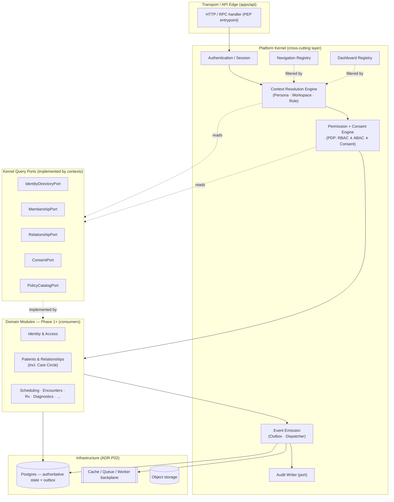
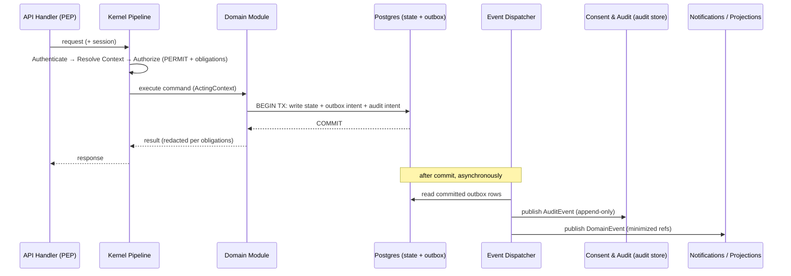
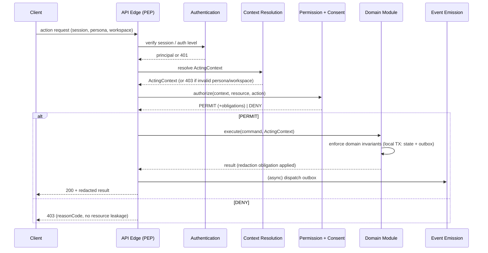
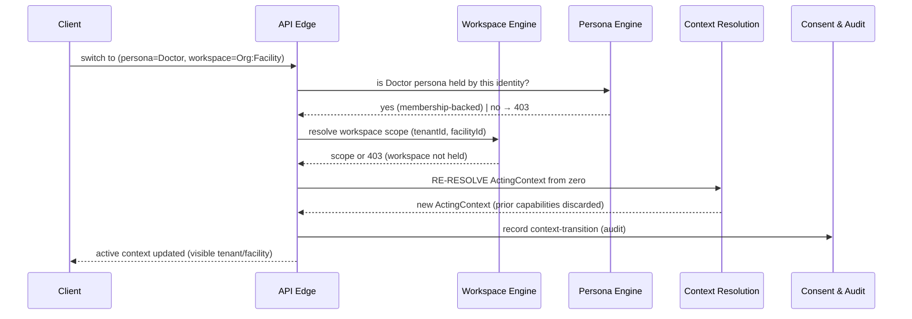
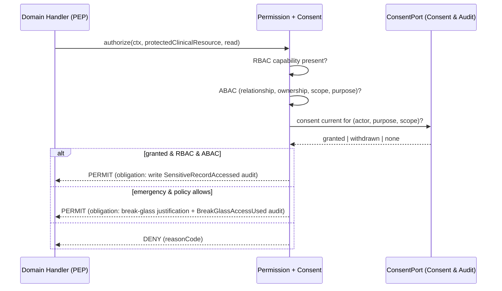
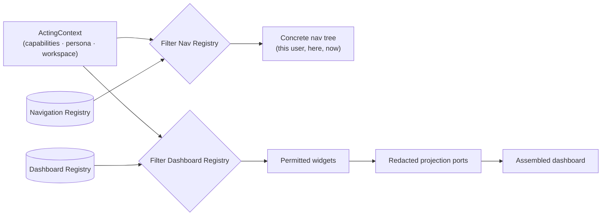

# NelyoHealth Platform Kernel — Architectural Execution Blueprint

## Document Control

| Field | Value |
|---|---|
| Document | `docs/architecture/platform-kernel-blueprint.md` |
| Kind | Architectural execution blueprint (kernel layer) |
| Governing source of truth | `docs/platform-manifest.md` (v1.0) |
| Owner role | Architecture lead + Security lead |
| Review state | PROPOSED |
| Issue ID | (to be assigned) |
| Last updated | 2026-07-17 |
| Builds on | `packages/domain/src/identity-tenancy-model.ts` (P03 identity/tenancy scaffold) |
| Related architecture | `tenancy-concept.md`, `domain-boundaries.md`, `source-of-truth-matrix.md`, `event-catalogue-draft.md`, `context-map.md` |
| Related decisions | ADR-0005 (modular monolith first), ADR-0006 (person/longitudinal identity), ADR-0007 (payer/clinical separation), ADR-0010 (no production PHI in analytics), ADR-P02-002/003 (DB, cache/queue/worker) |

---

## 1. Purpose and Scope

This document translates the **Platform Manifest** into an executable architecture for the **Platform Kernel** — the cross-cutting substrate every domain module runs on top of.

The Kernel exists so that the Manifest's non-negotiable rules are **structural guarantees**, not per-feature discipline:

- No action occurs outside a valid, resolved context (Manifest Principle 2).
- Access is never implied; it is explicitly granted, checked server-side, and gated by consent (Principles 4, and Architectural Rules 5 and 7).
- Every significant action emits an event (Principle 6).
- Dashboards and navigation assemble from context; nothing is hardcoded per role (Architectural Rules 8, 9).

### In scope

The Platform Kernel and its engines: Context Resolution, Persona, Workspace, Permission + Consent, the Navigation and Dashboard registries, the Event Emission model, the canonical request lifecycle, cross-layer dependencies, and the architectural decisions/risks that govern them.

### Out of scope — deliberately

This document does **not** design or implement any domain module. **Care Circles, Appointments, Consultations, Organizations-as-a-domain-module, Prescriptions, Diagnostics, Medical Records, Payments** and every other bounded context in `domain-boundaries.md` are **Phase 1+ domain modules**. They are *consumers* of the Kernel and are only built once the Kernel is complete (see §14, Kernel Completion Criteria). Where they appear here, they appear strictly as example consumers to illustrate a Kernel mechanism.

### What the Kernel is — and is not

The Kernel is **not a bounded context** and owns **no business or clinical data**. It owns:

- the resolution of *who is acting, for whom, where, and with what permission* (the `ActingContext`);
- the single authorization decision path (RBAC ∧ ABAC ∧ consent);
- the dispatch of derived events and audit intent;
- the assembly of navigation and dashboards from context.

Authoritative business state stays with the bounded contexts named in `source-of-truth-matrix.md`. The Kernel *orchestrates*; it never becomes a second source of truth.

---

## 2. Architectural Position

Consistent with **ADR-0005 (modular monolith first)**, the Kernel is a **layer inside one deployable backend**, not a separate service. It sits between the transport/API edge and the domain modules, and it is the only path by which a request reaches a domain module.



**Dependency direction:** domain modules depend *inward* on Kernel abstractions (`ActingContext`, `AuthorizationService`, `EventEmitter`, `AuditWriter`). The Kernel depends only on **query ports** that the relevant contexts (Identity & Access, Organizations & Facilities, Patients & Relationships, Consent & Audit) implement. This keeps the dependency graph acyclic: the Kernel never imports a domain module's internals, and a domain module never bypasses the Kernel.

---

## 3. The Canonical Request Lifecycle

Every state-changing request passes through the same five-stage pipeline. This pipeline *is* the enforcement of Manifest Principles 2 and 4 and Architectural Rules 5 and 7.

```
Authenticate → Resolve Context → Authorize → Execute → Emit Event
```

| Stage | Responsibility | Fails closed when |
|---|---|---|
| **Authenticate** | Establish the principal from the session/token; verify session validity, device, and auth level (MFA where required). | No valid session, or auth level below the resource's requirement. |
| **Resolve Context** | Build the `ActingContext`: identity → persona → workspace → active roles → capability set + scope. | No valid persona/workspace selection, expired context, or requested workspace not held. |
| **Authorize** | PDP decision: RBAC (capability present?) ∧ ABAC (attributes/relationship/ownership/time/scope) ∧ Consent (for protected resources). Deny-by-default. | Any of the three legs denies, or consent is absent/withdrawn. |
| **Execute** | Run the domain command inside one local transaction, writing authoritative state **and** the outbox/audit intent atomically. | Domain invariant violation → transaction rolls back; no event emitted. |
| **Emit Event** | The dispatcher publishes the derived domain/audit/integration events from the committed outbox to subscribers. | Never blocks the transaction; retried at-least-once with idempotent consumers. |

Read requests use the same pipeline minus Execute/Emit, and additionally pass their result through a **redaction step** that enforces the projection register in `source-of-truth-matrix.md` (e.g., pre-payment provider location must never appear).

### 3.1 The `ActingContext`

The resolved, request-scoped object threaded through the entire pipeline. It is derived once per request (or re-derived on a persona/workspace switch) and never silently mutated.

```
ActingContext {
  identity:   { userAccountId, personId }
  session:    { sessionId, deviceId, authLevel, issuedAt, expiresAt }
  persona:    { personaId, kind }                 // Self | Parent | Guardian | Caregiver
                                                  // | Practitioner | OrgAdmin | Operations …
  workspace:  { workspaceId, kind, tenantId?, facilityId? }
                                                  // Personal | Professional | Business | Organization
  roles:      RoleAssignmentRef[]                 // active roles within this workspace only
  capabilities: CapabilitySet                     // RBAC-derived, pre-ABAC/consent
  scope:      { tenantId?, facilityId? }          // hard multi-tenant boundary
  purposeOfUse?: string                           // input to consent evaluation
  onBehalfOf?: { subjectType, subjectRef }        // e.g. acting for a dependent patient
}
```

**Invariants**

- No `ActingContext` ⇒ no domain call. A domain module cannot be entered without one.
- `capabilities` reflect **only** the active `workspace` + `persona`. Switching either forces full re-resolution — **no silent privilege carryover** (`tenancy-concept.md`).
- `scope.tenantId/facilityId` is applied to *every* repository query; cross-tenant reads are impossible by default.

---

## 4. Context Resolution Engine

Turns an authenticated principal into an `ActingContext`. This is the runtime realization of the P03 identity/tenancy scaffold (`Person`, `UserAccount`, `OrganizationMembership`, `RoleAssignment`).

**Inputs:** session principal (`userAccountId` → `personId`), the client's *declared* active persona + workspace selection, and the requested action's resource hints.

**Resolution steps:**

1. **Identity** — load the principal (`UserAccount` → `Person`) via `IdentityDirectoryPort`. Identity is permanent and singular (Manifest Principle 1).
2. **Persona** — validate that the requested persona is one this identity legitimately holds (self, a relationship-derived persona such as Parent/Guardian/Caregiver, or a practitioner/admin persona backed by a membership). Delegated by the **Persona Engine** (§5).
3. **Workspace** — validate the requested workspace and resolve its tenant/facility scope. Delegated by the **Workspace Engine** (§6).
4. **Roles** — gather the `RoleAssignment`s active for this `(person, workspace)` pair via `MembershipPort`. Roles attach to persona-in-workspace, never to identity.
5. **Capabilities** — expand roles into a coarse `CapabilitySet` (the RBAC pre-computation), cached per `(person, workspace, persona)` with short TTL.

**Failure = closed.** A missing/invalid persona or a workspace the identity does not hold yields no context and a `403`, never a downgraded-but-usable context.

**Determinism.** Context transitions are deterministic and explicit (`tenancy-concept.md`): the same inputs always yield the same context, and a switch is an explicit, audited event, not an implicit side effect.

---

## 5. Persona Engine

A **persona** is the *capacity* in which one identity is acting (Manifest domain object). One identity → many personas; identity is permanent, personas are situational.

Responsibilities:

- Enumerate the personas an identity legitimately holds, derived from:
  - **Self** (always present for a verified identity),
  - **relationship personas** (Parent, Guardian, Caregiver) sourced from `RelationshipPort` — owned by Patients & Relationships / Consent & Audit, **not** invented by the Kernel,
  - **membership personas** (Practitioner, Org Admin, Operations) sourced from `MembershipPort`.
- Validate a requested persona switch and stamp it into the `ActingContext`.
- Constrain which workspaces a persona may enter (a Self persona cannot enter an Organization workspace; a Practitioner persona cannot act as a patient's Self).

The Persona Engine holds **no authority data of its own** — it composes ports. This is what prevents the Kernel from becoming a shadow relationship store.

---

## 6. Workspace Engine

A **workspace** is the *operational environment* an identity acts within: Personal, Professional, Business, or Organization. Users switch workspaces **without switching accounts** (Manifest domain object).

Responsibilities:

- Resolve a workspace to its **tenant/facility scope** (`tenantId`, optional `facilityId`), the hard authorization and data boundary defined in `tenancy-concept.md`.
- Enforce **no silent privilege carryover** across workspaces: leaving a workspace drops its capabilities; entering another re-resolves from zero.
- Provide the visible, deterministic "active context" indicator the tenancy concept requires (the UI always shows which tenant/facility the user is operating in).
- Emit a context-transition signal (for audit) on every switch.

Workspace scope is **applied at the persistence boundary**: repositories receive the scope from `ActingContext` and cannot be queried without it. Multi-organization members (a doctor across provider groups, a pharmacist across facilities) get one identity, many memberships, and strictly separated per-workspace authorization and audit streams.

---

## 7. Permission + Consent Engine

The single **Policy Decision Point (PDP)**. Every protected action is authorized here, server-side (Architectural Rule 5), and no feature may bypass consent (Rule 7). The **Policy Enforcement Point (PEP)** lives at the API edge and in domain command handlers, which *must* call the PDP before acting.

A decision is the logical **AND** of three legs; **deny-by-default** if any is missing:

1. **RBAC** — does the `ActingContext.capabilities` set include the capability the action requires?
2. **ABAC** — do the resource + context attributes satisfy policy? Attributes considered (per `tenancy-concept.md` and Manifest Authorization Model): role, organization membership, **patient relationship**, **Care Circle membership** (once that domain module exists), resource ownership, tenant/facility scope match, purpose-of-use, time restrictions, and location restrictions where applicable.
3. **Consent** — for `PROTECTED-CLINICAL-DATA` / `SENSITIVE-PERSONAL-DATA` resources, is there a current, un-withdrawn `ConsentGrant` covering this actor, purpose, and scope? Sourced from `ConsentPort` (owned by Consent & Audit). Consent is an **input to the decision**, never re-implemented in the Kernel.

**Decision object:**

```
AuthorizationDecision {
  effect: "PERMIT" | "DENY"
  reasonCode: string                 // audited, never leaks resource content
  obligations: Obligation[]          // e.g. redact-fields, require-step-up-MFA,
                                     //      break-glass-justification, write-sensitive-access-audit
}
```

**Obligations** let a PERMIT carry conditions the PEP must honour — most importantly the field-level redaction that enforces the projection register, and the **break-glass** path (explicit, time-boxed, justification-required, always audited via `BreakGlassAccessUsed`).

**Caching & revocation.** Coarse RBAC capability sets are cached with a short TTL. ABAC/consent decisions on hot paths may be cached per `(context, resource, action)` with a short TTL **plus explicit invalidation** on revocation events — `ConsentWithdrawn`, `OrganizationMembershipRevoked`, `SessionsRevoked`, `DelegationRevoked`. The residual staleness window is a named risk (§13, R3).

---

## 8. Navigation Registry

Navigation is **assembled from context**, never hardcoded per role (Architectural Rule 8). The registry is a declarative catalogue — the same pattern already proven by `@nelyohealth/content-registry` — where each entry declares the capability, persona kinds, and workspace kinds required to see it.

```
NavEntry {
  id: string
  labelContentId: string             // copy via the content registry, never inline
  route: string
  requires: {
    capability?: Capability
    personaKinds?: PersonaKind[]
    workspaceKinds?: WorkspaceKind[]
  }
  order: number
  children?: NavEntry[]
}
```

At request time the Kernel filters the full registry by the resolved `ActingContext` → the concrete navigation tree for that user, in that workspace, in that persona. A patient in a Personal workspace and a doctor in a Professional workspace are served from the *same registry* and diverge purely by resolved capability. There is no `if (role === "doctor")` anywhere.

---

## 9. Dashboard Registry

Dashboards are **composed, not coded** (Architectural Rule 9). The registry is a catalogue of **widgets/cards**, each gated by capability + persona + workspace, and each declaring the data query port it needs. The Kernel resolves a dashboard by filtering the registry against the `ActingContext` and laying out the permitted widgets.

```
DashboardWidget {
  id: string
  slot: "primary" | "secondary" | "sidebar"
  requires: { capability?, personaKinds?, workspaceKinds? }
  dataPort: string                   // named read port; returns a redacted projection
  priority: number
}
```

Consequences:

- The **same dashboard surface** serves every role; a new role or persona ships by adding registry entries + capabilities, never a new hardcoded dashboard.
- Every widget's data arrives through a **redacted projection** (`source-of-truth-matrix.md`), so a dashboard can never become a back door around the projection rules.
- An empty dashboard (no permitted widgets) is a valid, safe state.

---

## 10. Event Emission Model

**Decision (made): events are *derived from authoritative state*, not event-sourced.** Domain tables remain the system of record; events are a *published, derived fact* emitted after a committed state change. Events are the source of truth for **notifications, activity streams, analytics, audit, automation, and integrations** — *not* for reconstructing domain state. This reconciles Manifest Principle 6 with a state-authoritative model and is consistent with the "local outbox concept" and the `AuditEvent` / `DomainEvent` ownership already in `event-catalogue-draft.md` and `source-of-truth-matrix.md`.

**Mechanism — transactional outbox:**

1. A domain command mutates authoritative state **and** writes the event intent(s) + audit intent into an **outbox table in the same local transaction** (`domain-boundaries.md` transaction boundaries). This is what makes the event *provably derived from committed state* — if the state change rolls back, no event exists.
2. A **dispatcher** (on the ADR-P02-003 worker/queue backplane) reads committed outbox rows and publishes each event to subscribers.
3. Subscribers: **Consent & Audit** (append-only audit store — the audit owner), **Notifications** (minimized payloads only), **read-model/projection** builders, and **Analytics** (de-identified/aggregated only, per ADR-0010).

**Event taxonomy** (from `event-catalogue-draft.md`): Domain event, Integration event, Audit event, Operational signal. Every event carries **references, not payloads** — no clinical bodies, no auth secrets, no raw payment credentials, no pre-payment provider location.

**Delivery semantics:** at-least-once delivery; **idempotent consumers** keyed by event ID; **ordering per aggregate** (per-appointment, per-encounter, per-payment); priority lane for safety-critical events (`EmergencyEscalationTriggered`, `CriticalResultDetected`).



---

## 11. Sequence Diagrams — Common Flows

### 11.1 Canonical authenticated write



### 11.2 Persona / Workspace switch (no silent carryover)



### 11.3 Authorization with consent + break-glass obligation



### 11.4 Context-assembled navigation + dashboard



---

## 12. Cross-Layer Dependencies

| Layer | May depend on | Must never depend on |
|---|---|---|
| API edge (PEP) | Kernel pipeline | Domain module internals |
| Kernel engines | Query ports (Identity, Membership, Relationship, Consent, PolicyCatalog); infra adapters | A concrete domain module's tables or types |
| Domain modules (Phase 1+) | Kernel abstractions (`ActingContext`, `AuthorizationService`, `EventEmitter`, `AuditWriter`) | Another context's private storage; the Kernel's internals; vendor SDK types |
| Ports | Nothing (interfaces) | — |
| Port implementations | Their own context only | Other contexts' private storage |

Enforced rules (from `domain-boundaries.md`, restated as Kernel obligations):

- No context queries another context's private tables; cross-context reads use ports/read-models only.
- Domain contexts do not depend on vendor SDK types (Integrations owns adapters).
- The Kernel never carries `PROTECTED-CLINICAL-DATA` in a decision, event, or log; it carries **references and classifications**.
- Every port implementation returns the **minimum-necessary, redacted** projection for the caller's context.

---

## 13. Architectural Decisions and Risks

### 13.1 Decisions

| ID | Decision | Status | Rationale |
|---|---|---|---|
| K-D1 | Events are **derived from authoritative state via a transactional outbox**, not event-sourced. | **DECIDED** (product owner) | Reconciles Manifest Principle 6 with a state-authoritative model; matches existing outbox/audit design. Candidate ADR. |
| K-D2 | A single **`ActingContext`** is resolved once per request and threaded through; re-resolved (never patched) on persona/workspace switch. | PROPOSED | Guarantees "no action outside valid context" and "no silent carryover" structurally. |
| K-D3 | One central **PDP** (RBAC ∧ ABAC ∧ Consent), deny-by-default, with PEPs at the edge and in command handlers. | PROPOSED | Makes Architectural Rules 5 and 7 unbypassable. Candidate ADR. |
| K-D4 | Consent is a **required input** to the PDP for protected/sensitive resources, sourced from Consent & Audit via `ConsentPort`; the Kernel never stores consent. | PROPOSED | Keeps Consent & Audit the single consent authority. |
| K-D5 | Navigation and Dashboard are **declarative registries** filtered by context (content-registry pattern), in-code first, DB-backed later. | PROPOSED | Delivers dynamic, non-hardcoded assembly with a proven pattern. |
| K-D6 | Multi-tenant **scope is carried in `ActingContext` and applied at the persistence boundary** on every query. | PROPOSED | Hard tenant isolation per `tenancy-concept.md`. |
| K-D7 | Decision caching is **short-TTL + explicit invalidation** on revocation events. | PROPOSED | Balances hot-path latency against revocation freshness. |

### 13.2 Risks

| ID | Risk | Mitigation |
|---|---|---|
| K-R1 | Kernel becomes a god-object. | Strict sub-engines + ports; the Kernel composes, never owns domain data. |
| K-R2 | Registry drift (a capability without a matching role, or an orphan widget). | Registry validation test (mirror the content-registry validate/lint gate). |
| K-R3 | Consent/permission staleness within the cache TTL after revocation. | Revocation events force cache invalidation; safety-critical reads bypass cache. |
| K-R4 | Break-glass abuse. | Explicit justification, time-boxing, mandatory `BreakGlassAccessUsed` audit, and after-the-fact review. |
| K-R5 | Context confusion across a workspace switch. | Full re-resolution from zero; visible active-context indicator; audited transition. |
| K-R6 | Per-request resolution cost. | Session-scoped capability cache; precomputed RBAC sets; lazy ABAC only for the touched resource. |
| K-R7 | Outbox growth / duplicate delivery. | Dispatcher checkpointing, idempotent consumers keyed by event ID, outbox retention/compaction policy. |

---

## 14. Kernel Completion Criteria

The Platform Kernel is "complete" — and Phase 1+ domain modules may begin — when, against the P03 identity/tenancy scaffold and at least the PILOT tenant set (`tenancy-concept.md`), all of the following hold end-to-end:

1. A request can be **authenticated** (session + auth level) and rejected when invalid.
2. An **`ActingContext`** is resolved through the Persona and Workspace engines, with deterministic, audited switching and no silent carryover.
3. The **PDP** renders RBAC ∧ ABAC ∧ Consent decisions, deny-by-default, with obligations (redaction, step-up, break-glass) honoured by the PEP.
4. A domain command can **execute inside one local transaction** that writes authoritative state + outbox + audit intent atomically.
5. The **dispatcher** publishes derived domain/audit/integration events with at-least-once, idempotent, per-aggregate-ordered delivery, and the append-only audit store receives every sensitive-access and state-change event.
6. **Navigation and a dashboard assemble purely from context** via the registries, with zero role-hardcoding.
7. Every read path enforces the **redaction/projection register** (no pre-payment provider location, no clinical body in events/logs).

Until all seven are demonstrable, no Care Circle, Appointment, Consultation, Organization module, or Medical Record feature is built — those depend on every one of these guarantees.

---

## 15. Manifest Traceability

| Manifest element | Kernel realization |
|---|---|
| Principle 1 — One verified identity | Context Resolution roots every context in one `Person`/`UserAccount`; personas/roles hang off it. |
| Principle 2 — Everything context-aware | Canonical lifecycle + `ActingContext`; no domain entry without it. |
| Principle 3 — Care is collaborative | Persona/Relationship ports expose Parent/Guardian/Caregiver capacities (Care Circle module consumes them in Phase 1+). |
| Principle 4 — Permissions before access | PDP deny-by-default; explicit, revocable grants; obligations. |
| Principle 5 — AI assists humans | AI is a Kernel *consumer*: it runs inside an `ActingContext` and the same PDP, so it can never see what the user cannot (future AI layer, out of scope here). |
| Principle 6 — Everything important creates an event | Transactional outbox + dispatcher; derived events, audit store. |
| Rules 5, 7 — server-side checks, no consent bypass | Central PDP + PEPs; consent a required leg. |
| Rules 8, 9 — dynamic dashboards | Navigation + Dashboard registries filtered by context. |
| Rule 10 — API-first | Kernel is the enforced path behind the API edge; domain modules are reached only through it. |
