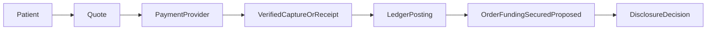
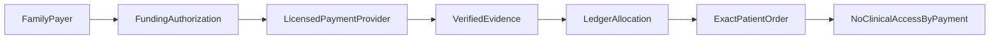
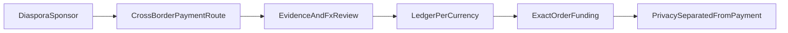
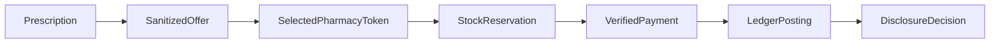
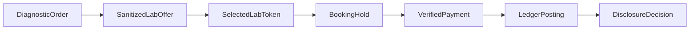
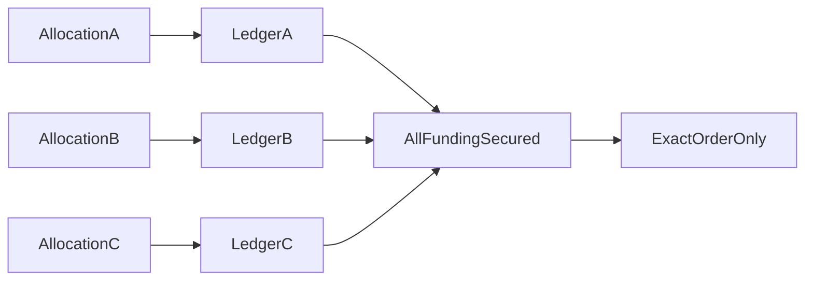
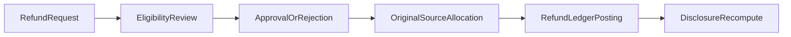
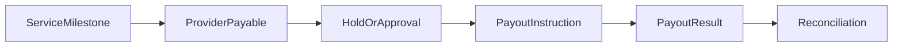
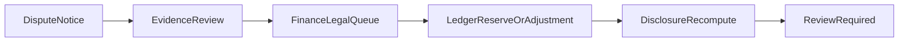
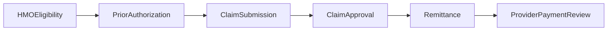

# Funds Flow

## Document Control

| Field | Value |
|---|---|
| Document title | Funds Flow |
| Codex prompt ID | P00-13 |
| Complete Breakdown work package | P00-16 |
| Issue ID | P00-FIN-001 |
| Owner role | Finance/Payments Owner + Legal Counsel + Accounting Reviewer |
| Finance status | DRAFT-PENDING-FINANCE-LEGAL-REGULATORY-ACCOUNTING-AND-TAX-APPROVAL |
| Status | DRAFT-PENDING-FINANCE-LEGAL-REGULATORY-ACCOUNTING-AND-TAX-APPROVAL |
| Review state | PROPOSED; NOT EFFECTIVE UNTIL APPROVED |
| Required reviewers | Founder/Product Owner; Finance/Payments Owner; Nigerian legal counsel; Accounting/tax reviewer; Privacy/DPO; Security Lead; Pharmacy Operations; Laboratory Operations; Engineering/Architecture |
| Last updated | 2026-06-24 |
| Effective date | NOT EFFECTIVE UNTIL APPROVED |
| Version | 0.1 |
| Related decisions | REQ-FIN-002 through REQ-FIN-046 |
| Related open questions | OQ-00-387 through OQ-00-491 |
| Related workflows | WFL-009; WFL-010; WFL-013; WFL-018; WFL-019; WFL-020; WFL-021; WFL-022 |
| Related regulatory obligations | REG-OBL-029; REG-OBL-030; REG-OBL-032; REG-OBL-039 |

This document is not legal, tax, accounting, banking, payment-service, insurance, or HMO advice. It does not authorize NelyoHealth to hold customer funds, issue stored value, operate as a payment service provider, bank, payment service bank, mobile-money operator, international money transfer operator, HMO, or insurer. Final payment-provider behavior depends on provider contracts, certification, and verified server-side evidence. Final account classification depends on accounting and legal review. Final tax treatment depends on professional review.

## Funds-Flow Principles

| Term | Phase 0 definition | Approval status |
|---|---|---|
| Source of funds | The actor, sponsor, employer, HMO, or licensed payment-provider-backed funding source from which value originates. | REQUIRES_APPROVAL by flow |
| Funding authority | The person or organization allowed to authorize a funding allocation; this is not clinical-record authority. | APPROVED as separation rule |
| Beneficiary | The patient or service order receiving care or fulfilment benefit. | APPROVED |
| Merchant or provider | The contracting party or service provider receiving payable consideration under approved contracts. | REQUIRES_APPROVAL |
| Licensed payment provider | A regulated partner or rail used to process, hold, settle, refund, or route funds where approved. | REQUIRES_APPROVAL; no provider selected |
| NelyoHealth operational ledger | A double-entry operational subledger used for order funding, balances, payables, refunds, payouts, reconciliation, and audit. | PROPOSED |
| Provider payable | A liability or operational obligation to a provider after an approved service milestone, subject to accounting review. | REQUIRES_APPROVAL |
| Platform fee | A conceptually defined commercial component, not an approved rate. | REQUIRES_APPROVAL |
| Refund source | The original funding allocation and source unless a reviewed exception is approved. | APPROVED as principle |
| Settlement | Financial movement between processor, bank, platform account, provider, or other approved financial participants. | REQUIRES_APPROVAL |
| Reconciliation | Matching provider facts, internal state, ledger entries, orders, refunds, payouts, claims, and exceptions. | PROPOSED |
| Dispute | A contested payment, order, payout, refund, or chargeback requiring evidence and owner review. | PROPOSED |
| Chargeback | Payment-rail reversal/dispute path, distinct from refund and reversal. | PROPOSED |
| Currency | The currency associated with each amount; no final currency is selected in P00-13. | REQUIRES_APPROVAL |
| Exchange rate | The rate source and timestamp used for cross-currency presentation or settlement, not approved in P00-13. | REQUIRES_APPROVAL |
| Tax or levy question | Any tax, levy, stamp, VAT, withholding, or similar classification question. | REQUIRES_APPROVAL |
| Custody boundary | The legal boundary determining who holds funds and what NelyoHealth may represent. | REQUIRES LEGAL/REGULATORY APPROVAL |

## Required Funds Flows

Every flow must record patient, beneficiary, authorized payer, funding source, payment instrument class, licensed payment provider or unresolved provider boundary, order/service, quote, invoice, authorization, capture or receipt, ledger postings, platform fee, provider payable, settlement, refund path, dispute path, data disclosed, data not disclosed, audit, reconciliation, failure path, operations owner, and approval status.

| Flow ID | Scope and trigger | Patient and beneficiary | Funding source and authorized payer | Order, quote, invoice, and evidence | Ledger, fee, payable, and settlement | Disclosure and data boundary | Refund, dispute, failure, reconciliation | Owner and approval |
|---|---|---|---|---|---|---|---|---|
| FIN-FLW-001 | Self-pay consultation triggered by patient checkout for an exact service order. | Same patient is care beneficiary; one longitudinal patient identity. | Patient-authorized payment instrument through approved licensed provider. | Exact order, current quote version, invoice, verified capture or confirmed receipt. | Balanced order-funding posting, fee and payable components conceptual, settlement separate. | No clinical access is granted by payment; no pharmacy/lab details unless a separate disclosure decision applies. | Original-source refund; chargeback/reversal to finance review; reconciliation before closure. | Finance Operations; REQUIRES_APPROVAL. |
| FIN-FLW-002 | Family-funded consultation triggered by a family payer funding an exact patient order. | Patient remains beneficiary; family payer is not clinical-record viewer by default. | Family payer with explicit funding authority only. | Exact order, quote, invoice, payer authorization, verified capture or receipt. | Funding allocation records payer source; balance and receipt are ledger-derived. | Payer sees minimum financial status only, not clinical records or hidden provider details. | Refund to original family source unless approved otherwise; disputes do not unlock care records. | Finance + Privacy; REQUIRES_APPROVAL. |
| FIN-FLW-003 | Diaspora-funded consultation triggered by remote sponsor checkout. | Patient remains beneficiary in Nigeria; sponsor is financial actor only unless separately delegated. | Diaspora sponsor via approved cross-border/licensed route. | Exact order, quote, invoice, verified capture/receipt, FX evidence if applicable. | Cross-currency entries require per-currency balancing and approved FX entries. | Cross-border payment data and clinical data remain separated; no sponsor clinical access by payment. | International refund, chargeback, KYC/AML allocation, and FX questions remain open. | Finance + Legal + Privacy; REQUIRES_APPROVAL. |
| FIN-FLW-004 | Employer-funded care future scope. | Employee or dependent patient remains beneficiary. | Employer budget or guarantee, not automatically cash. | Eligibility or guarantee evidence is not payment unless approved as evidence profile. | Employer receivable/guarantee handling is conceptual and future-scope. | Employer does not receive clinical records or hidden provider details by funding. | Recovery, refund, denial, and payroll/benefit issues remain approval-gated. | Finance + Legal + Employer Ops; FUTURE SCOPE. |
| FIN-FLW-005 | HMO-covered care future scope. | Member patient remains beneficiary. | HMO eligibility, authorization, guarantee, claim, and remittance are distinct. | HMO eligibility alone is not payment; guarantee profile is not pilot-valid. | HMO receivable/remittance allocation is conceptual and future-scope. | HMO access remains minimum necessary and not payer-clinical access by default. | Denial, shortfall, appeal, remittance, and recovery remain open. | Finance + Legal + HMO Ops; FUTURE SCOPE. |
| FIN-FLW-006 | Pharmacy order after prescription and selected sanitized offer. | Patient is beneficiary; pharmacy is selected provider. | Patient/family/sponsor/coverage source tied to exact pharmacy order. | Current prescription, selected provider token, quote, invoice, valid stock reservation, verified capture/receipt. | Balanced funding entry precedes OrderFundingSecured proposal; payable after approved pharmacy milestone. | Pre-payment client receives only providerDisplayName and approved non-identifying commercial info. | Out-of-stock, rejection, provider replacement, refund, and chargeback recompute disclosure. | Finance + Pharmacy Ops; REQUIRES_APPROVAL. |
| FIN-FLW-007 | Laboratory order after clinical order and selected sanitized lab offer. | Patient is beneficiary; laboratory is selected provider. | Patient/family/sponsor/coverage source tied to exact lab order. | Diagnostic order, selected provider token, quote, invoice, valid booking hold or operational acceptance, verified capture/receipt. | Balanced funding entry precedes OrderFundingSecured proposal; payable milestone remains contract-gated. | Pre-payment client receives only providerDisplayName and approved non-identifying commercial info. | Booking failure, specimen rejection, cancellation, refund, and chargeback recompute disclosure. | Finance + Lab Ops; REQUIRES_APPROVAL. |
| FIN-FLW-008 | Split-funded transaction where multiple funding allocations cover one exact order. | Patient remains beneficiary. | Multiple authorized sources; each source must be explicit and verified. | Quote/invoice shows allocation; every allocation must be secured before OrderFundingSecured. | Ledger posts separate source legs and one exact order funding result when balanced. | No source receives extra clinical/provider detail by funding alone. | Refund follows original allocation or approved line-specific rule. | Finance + Privacy; REQUIRES_APPROVAL. |
| FIN-FLW-009 | Partial coverage with patient shortfall. | Patient remains beneficiary. | Coverage source plus patient or sponsor source. | Coverage eligibility is not payment; patient shortfall must be captured/received or approved guarantee. | Shortfall and covered portion remain separate allocations. | Coverage actor sees only approved minimum financial data. | Denial/shortfall changes route to review and never silently charges another source. | Finance + Coverage Ops; REQUIRES_APPROVAL. |
| FIN-FLW-010 | Refund. | Original patient/order context retained. | Original funding allocation and original source unless approved exception. | Refund request, eligibility review, approved refund instruction, provider/payment evidence. | Refund liability and clearing entries are balanced and audit-linked. | Refund never creates initial provider-detail eligibility; future retrieval recomputed. | Failure routes to review, not silent credit conversion. | Finance Ops; REQUIRES_APPROVAL. |
| FIN-FLW-011 | Provider payout. | Patient context only as minimum order reference. | Provider payable balance after approved milestone. | Payable creation, payout approval, payout instruction, provider destination verification. | Payable and payout are distinct; payout completion reconciled separately. | Payout payload excludes clinical content and protected pre-payment provider location. | Failed payout, hold, reversal, negative payable, and dispute route to owner queue. | Finance Ops + Provider Ops; REQUIRES_APPROVAL. |
| FIN-FLW-012 | Chargeback or dispute. | Original order context retained. | Payment rail or payer dispute process. | Dispute notice, provider evidence, order audit, payment verification. | Chargeback reserve/receivable/loss classification requires accounting review. | No initial disclosure eligibility; future retrieval recomputed and review-gated. | Provider recovery and patient/sponsor communication need approved rules. | Finance + Legal + Support; REQUIRES_APPROVAL. |
| FIN-FLW-013 | Payment-provider reversal. | Original order context retained. | Payment provider reverses or corrects a transaction. | Provider evidence verified server-side and correlated to exact order/payment. | Reversal entries adjust ledger through approved reversal/adjustment entries. | Reversal never creates eligibility and may invalidate future retrieval pending review. | Reconciliation exception remains open until finance closure. | Finance Ops; REQUIRES_APPROVAL. |
| FIN-FLW-014 | Payment failure after authorization. | Patient remains beneficiary; order may require retry/cancel/reselect. | Authorization only; funds are not treated as secured. | Authorization evidence is insufficient for pilot OrderFundingSecured. | No order-funding secured posting; failed/expired authorization may be recorded. | No provider details unlock; client success or browser state is ignored. | Retry through same order only if valid; stale reservation blocks capture. | Finance + Ops; APPROVED as denial rule. |
| FIN-FLW-015 | Reconciliation exception. | Exact affected actor/order/payment/refund/payout/claim context. | Any source with inconsistent evidence. | Mismatch in amount, currency, order, actor, patient, tenant, ledger, provider state, or provider evidence. | Sensitive financial conclusions are blocked while exception is unresolved. | Disclosure and balance views minimize data and route to review. | Closure requires owner, evidence, ledger correction if needed, and audit. | Finance Ops; REQUIRES_APPROVAL. |

## Mermaid Diagrams

### Self-pay

Text explanation: self-pay can support the proposed financial fact only after server-side verified capture or confirmed receipt and balanced ledger posting for the exact order.

### Family-funded care

Text explanation: the family payer funds the order but does not gain clinical-record or protected provider-detail access unless a separate permission exists.

### Diaspora-funded care

Text explanation: diaspora funding requires licensed route, FX review, and privacy separation before any implementation reliance.

### Pharmacy order

Text explanation: stock reservation or approved firm confirmation precedes capture; payment still does not directly disclose pharmacy details.

### Laboratory order

Text explanation: lab booking hold or operational acceptance must be valid before the proposed financial fact can support disclosure evaluation.

### Split payment

Text explanation: every required allocation must be secured and balanced before the exact order can be considered funded.

### Refund

Text explanation: refunds follow original-source allocation and do not create initial provider-detail eligibility.

### Provider payout

Text explanation: provider payable is not provider payout; payout completion is independently verified and reconciled.

### Chargeback or dispute

Text explanation: chargeback and dispute handling routes to review and cannot unlock provider detail access.

### HMO future flow

Text explanation: HMO eligibility, prior authorization, claim approval, remittance, and provider payout are separate future-scope facts.

## Custody Boundary

| Flow ID | Who legally holds funds | Direct NelyoHealth receipt | Licensed provider boundary | Ledger classification question | Review question |
|---|---|---|---|---|---|
| FIN-FLW-001 | REQUIRES_APPROVAL | UNRESOLVED | Required for pilot payment | Clearing, reserve, fee, payable | Payment-provider contract and legal custody |
| FIN-FLW-002 | REQUIRES_APPROVAL | UNRESOLVED | Required | Source allocation and refund liability | Family refund ownership |
| FIN-FLW-003 | REQUIRES_APPROVAL | UNRESOLVED | Required | FX, clearing, refund liability | Cross-border route and KYC/AML allocation |
| FIN-FLW-004 | REQUIRES_APPROVAL | No live pilot assumption | Future contractual guarantee | Employer receivable or budget usage | Employer model approval |
| FIN-FLW-005 | REQUIRES_APPROVAL | No live pilot assumption | Future HMO contract | HMO receivable/remittance | HMO model approval |
| FIN-FLW-006 | REQUIRES_APPROVAL | UNRESOLVED | Required | Order reserve, pharmacy payable | PCN/CBN/legal and provider contract |
| FIN-FLW-007 | REQUIRES_APPROVAL | UNRESOLVED | Required | Order reserve, lab payable | MLSCN/CBN/legal and provider contract |
| FIN-FLW-008 | REQUIRES_APPROVAL by source | UNRESOLVED | Required | Per-source allocations | Split refund and custody |
| FIN-FLW-009 | REQUIRES_APPROVAL by source | UNRESOLVED | Required | Shortfall plus coverage | Coverage guarantee validity |
| FIN-FLW-010 | Original source holds/refund route by provider contract | UNRESOLVED | Required | Refund liability/clearing | Fee/tax/FX and closed instrument |
| FIN-FLW-011 | Provider payable holder classification requires review | UNRESOLVED | Required | Provider payable/payout clearing | Milestone and payout rules |
| FIN-FLW-012 | Payment rail dispute participants | UNRESOLVED | Required | Reserve/receivable/loss | Chargeback accounting |
| FIN-FLW-013 | Payment provider/rail | UNRESOLVED | Required | Reversal clearing | Correction authority |
| FIN-FLW-014 | No secured funds from authorization alone | No | Required | No secured funding | Expiry and retry rule |
| FIN-FLW-015 | Depends on exception | UNRESOLVED | Required | Suspense/reconciliation | Closure authority |

## Fees and Pricing Components

P00-13 defines components only: service price, provider base amount, platform fee, payment-provider fee, delivery fee, laboratory collection fee, discount, coverage contribution, sponsor contribution, patient payable, tax or levy, refundable amount, provider payable, and settlement adjustment. No amounts, percentages, tax rates, payout periods, refund periods, settlement periods, or chargeback periods are approved.

Every quote requires a quote version, transparent price components, currency, audit, approval status, change handling, and no hidden fee. Price changes after selection require a new reviewed quote or approved adjustment path.

## Diaspora and Currency Flow

Payer currency, display currency, transaction currency, settlement currency, provider payable currency, exchange-rate source, rate timestamp, rate expiry, markup, fee disclosure, refund exchange-rate rule, chargeback handling, failed foreign payment handling, and payment-provider country restrictions all require external finance, legal, tax, accounting, and payment-provider approval. P00-13 selects no currency, FX provider, remittance route, or foreign payment method.

## Future Financial Test Requirements

| Test ID | Requirement |
|---|---|
| FIN-TST-001 | Self-pay flow uses verified capture or confirmed receipt plus balanced ledger before proposed OrderFundingSecured. |
| FIN-TST-002 | Family-funded flow does not grant payer clinical-record access. |
| FIN-TST-003 | Diaspora flow keeps payment and clinical-data flows separated. |
| FIN-TST-004 | Pharmacy capture is blocked when stock reservation or approved firm confirmation is invalid. |
| FIN-TST-005 | Lab capture is blocked when booking hold or operational acceptance is invalid. |
| FIN-TST-006 | Split payment remains incomplete until every required allocation is secured. |
| FIN-TST-007 | Partial coverage does not silently fall back to another source. |
| FIN-TST-008 | Refund follows original-source allocation. |
| FIN-TST-009 | Chargeback routes to review and does not create eligibility. |
| FIN-TST-010 | Reconciliation exception blocks sensitive financial conclusions. |

## Finance Requirement Traceability Matrix

| Requirement ID | Requirement | Source requirement | Owning document | Financial owner | Accounting review | Legal/regulatory review | Actor/order/journey/workflow impact | Ledger transaction impact | Related OQ | Future test | Implementation phase | Approval status |
|---|---|---|---|---|---|---|---|---|---|---|---|---|
| FIN-REQ-001 | Payment does not grant clinical access. | Locked P00-13 financial rule 1; REQ-LOCK-002 | docs/finance/funds-flow.md | Finance/Payments Owner | NOT-ACCOUNTING | APPROVED as locked rule | Payers, sponsors, family, employer, HMO; all payment journeys; WFL-018 | Ledger entries must not grant clinical access | OQ-00-387 | FIN-TST-002 | P01 after P00 approval | APPROVED |
| FIN-REQ-002 | One patient identity remains longitudinal across funding sources. | Locked P00-13 financial rule 2; REQ-LOCK-001 | docs/finance/funds-flow.md | Finance/Payments Owner | NOT-ACCOUNTING | APPROVED as locked rule | Patient/order/tenant binding; WFL-018 through WFL-022 | Ledger references patient only through approved identifiers | OQ-00-390 | FIN-TST-034 | P01 after P00 approval | APPROVED |
| FIN-REQ-003 | No silent funding fallback is allowed. | Locked P00-13 financial rule 3 | docs/finance/funds-flow.md | Finance/Payments Owner | REVIEW-REQUIRED | REVIEW-REQUIRED | Split payment, partial coverage, family/diaspora/employer/HMO; WFL-018 | Funding allocations remain explicit by source | OQ-00-401 | FIN-TST-007 | P01 after approval | APPROVED |
| FIN-REQ-004 | Refunds follow original source unless approved exception exists. | Locked P00-13 financial rule 4 | docs/finance/refund-and-dispute-policy.md | Finance/Payments Owner | REVIEW-REQUIRED | REVIEW-REQUIRED | Refunds, split refunds, sponsor/family ownership; WFL-019 | Refund entries reverse or allocate by original source | OQ-00-435 through OQ-00-448 | FIN-TST-008; FIN-TST-035 | P01 after approval | APPROVED |
| FIN-REQ-005 | Every displayed balance is ledger-derived. | Locked P00-13 financial rule 5 | docs/finance/ledger-principles.md | Finance/Payments Owner | REVIEW-REQUIRED | REVIEW-REQUIRED | Balance views, family/diaspora funding, sponsor budgets | Display queries derive from posted entries and licensed-provider facts | OQ-00-404 through OQ-00-418 | FIN-TST-032 | P01 after approval | APPROVED |
| FIN-REQ-006 | Operational ledger is double-entry. | Locked P00-13 financial rule 6 | docs/finance/ledger-principles.md | Finance/Payments Owner | REVIEW-REQUIRED | REVIEW-REQUIRED | Payments, refunds, payouts, claims; WFL-018 through WFL-022 | Every posted transaction balances per currency | OQ-00-419 through OQ-00-431 | FIN-TST-025 | P01 after approval | PROPOSED architecture; accounting approval required |
| FIN-REQ-007 | Budget is not money. | Locked P00-13 financial rule 7 | docs/finance/ledger-principles.md | Finance/Payments Owner | REVIEW-REQUIRED | REVIEW-REQUIRED | Employer, HMO, sponsor benefit views | Budget/benefit limits are not cash liabilities unless separately approved | OQ-00-404; OQ-00-480 | FIN-TST-033 | P01 after approval | APPROVED |
| FIN-REQ-008 | No unlicensed custody or regulated-role representation is allowed. | Locked P00-13 financial rule 8; P00-12 REG-OBL-029/030 | docs/finance/funds-flow.md | Finance/Payments Owner | REVIEW-REQUIRED | REVIEW-REQUIRED | All payment, wallet, diaspora, employer, HMO flows | Custody and clearing classification remain review-gated | OQ-00-405 through OQ-00-418 | FIN-TST-060 | P01 only after legal approval | APPROVED boundary; model requires approval |
| FIN-REQ-009 | Stock reservation precedes payment capture where pharmacy flow requires it. | Locked P00-13 financial rule 9 | docs/finance/funds-flow.md | Finance + Pharmacy Operations | NOT-ACCOUNTING | REVIEW-REQUIRED | Pharmacy order; WFL-009; WFL-010; WFL-018 | No secured funding if reservation expired/invalid | OQ-00-394 through OQ-00-397 | FIN-TST-004 | P01 after approval | APPROVED guard |
| FIN-REQ-010 | Provider-detail disclosure is separate from finance policy. | Locked P00-13 financial rule 10; REQ-LOCK-003/004 | docs/contracts/provider-disclosure-contract.md | Finance + Security | NOT-ACCOUNTING | APPROVED as locked rule | Marketplace disclosure, pharmacy/lab matching | Finance event cannot return provider details | OQ-00-402; OQ-00-403 | FIN-TST-057 through FIN-TST-060 | P01/P00-14 tests | APPROVED |
| FIN-REQ-011 | Client-side unlock is prohibited. | Locked P00-13 financial rule 11 | docs/finance/payment-state-model.md | Finance + Security | NOT-ACCOUNTING | APPROVED as locked rule | Browser payment return, redirect, route, storage; WFL-018 | Ledger/outbox server fact only | OQ-00-399 | FIN-TST-012; FIN-TST-057 | P00-14/P01 | APPROVED |
| FIN-REQ-012 | Failed or incomplete payment never creates initial eligibility. | Locked P00-13 financial rule 12 | docs/finance/payment-state-model.md | Finance + Security | NOT-ACCOUNTING | APPROVED as locked rule | Payment failure, cancellation, expiry, pending, authorization-only; WFL-018 | No secured funding posting | OQ-00-387 through OQ-00-403 | FIN-TST-017 | P01 after approval | APPROVED |
| FIN-REQ-013 | Emergency care is not blocked by finance. | Locked P00-13 financial rule 13; REQ-LOCK-008 | docs/workflows/cross-workflow-invariants.md | Clinical + Finance | NOT-ACCOUNTING | APPROVED as locked rule | Emergency escalation and clinical workflows | No payment/ledger condition blocks emergency escalation | OQ-00-347 | Clinical/browser tests in P00-14 | P01 after approval | APPROVED |
| FIN-REQ-014 | Provider state is not canonical finance state. | Locked P00-13 financial rule 14 | docs/finance/payment-state-model.md | Finance + Engineering | REVIEW-REQUIRED | REVIEW-REQUIRED | Payment adapters and callbacks; WFL-018 | Provider state must be verified before ledger effect | OQ-00-387 through OQ-00-403 | FIN-TST-019 | P01 after approval | APPROVED boundary |
| FIN-REQ-015 | External callbacks are untrusted until verified. | Locked P00-13 financial rule 15 | docs/finance/payment-state-model.md | Security + Finance | NOT-ACCOUNTING | REVIEW-REQUIRED | Webhooks/callbacks; WFL-018 through WFL-020 | Callback cannot post ledger until verified | OQ-00-387; OQ-00-399 | FIN-TST-019 | P00-14/P01 | APPROVED boundary |
| FIN-REQ-016 | No direct database remediation is allowed. | Locked P00-13 financial rule 16 | docs/finance/ledger-principles.md | Finance + Security | REVIEW-REQUIRED | REVIEW-REQUIRED | Manual adjustments, reconciliation, refunds, payouts | Corrections use reversal/adjustment entries only | OQ-00-428 | FIN-TST-027; FIN-TST-047 | P01 after approval | APPROVED boundary |
| FIN-REQ-017 | Clinical and order state remain separate from finance state. | Locked P00-13 financial rule 17 | docs/finance/payment-state-model.md | Finance + Clinical + Architecture | REVIEW-REQUIRED | REVIEW-REQUIRED | Consultations, pharmacy/lab orders, claims, disclosure | Ledger/payment facts reference order only and do not own clinical state | OQ-00-387; OQ-00-473 | FIN-TST-049 through FIN-TST-056 | P01 after approval | APPROVED boundary |
