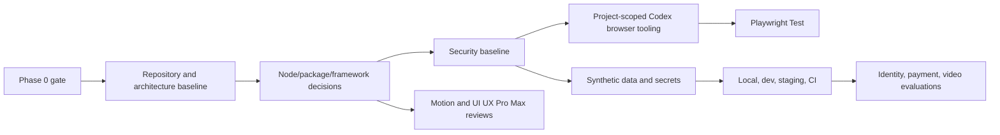
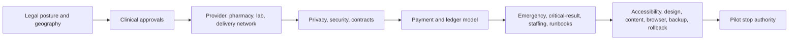

# P00-16 Dependency Register

## Document Control

| Field | Value |
|---|---|
| Status | DRAFT-PENDING-DOMAIN-OWNER-AND-FOUNDER-APPROVAL |
| Codex prompt ID | P00-16 |
| Complete Breakdown work package | P00-19 |
| Issue ID | P00-RSK-001 |
| Version | 0.1 draft |
| Owner | Governance and risk owner |
| Review state | Draft pending domain-owner and founder approval |
| Last updated | 2026-06-25 |
| Effective date | NOT EFFECTIVE AS RISK ACCEPTANCE UNTIL APPROVED |
| Required reviewers | Founder/product owner, clinical lead, Nigerian legal/regulatory counsel, privacy owner/DPO, security owner, finance/payments owner, operations lead, engineering/architecture owner, accessibility/design/content owners |
| Approval authority | External domain approvers; Codex cannot accept risk on behalf of NelyoHealth |
| Related decisions | REQ-RSK-001 through REQ-RSK-035 |
| Related open questions | OQ-00-775 through OQ-00-831 |
| Review and change-control requirements | Risk acceptance, closure, waiver, dependency satisfaction, assumption validation, ADR supersession, or blocker downgrade requires recorded human approval. |

This is a risk and decision-governance artifact. It does not itself approve legal, clinical, regulatory, financial, privacy, security, operational, design, or accessibility risk. Risk scoring is qualitative and prioritization-oriented. Risk scores are not statistical predictions. Vendor and partner dependencies remain unselected unless prior evidence proves otherwise.

## Dependency Principles

A dependency is something NelyoHealth requires but does not fully control inside the dependent work item. Dependencies may be internal or external. Each dependency has an owner, required evidence, fallback or explicit lack of fallback, required-by milestone, and potential Phase 1, capability, pilot, release, expansion, or future-scope effect. Vendor selection is not vendor approval. Partner interest is not a signed contract. Planned regulator interaction is not regulatory approval. Draft clinical content is not clinical approval.

## Dependency Categories and Status Values

Categories include INTERNAL-DECISION, INTERNAL-DOCUMENT, INTERNAL-CAPABILITY, HUMAN-APPROVAL, CLINICAL-APPROVAL, LEGAL-COUNSEL, PRIVACY-APPROVAL, SECURITY-APPROVAL, FINANCE-APPROVAL, OPERATIONS-APPROVAL, ACCESSIBILITY-DESIGN-CONTENT-APPROVAL, REGULATOR, GOVERNMENT-SYSTEM, PROVIDER-PARTNER, FACILITY-PARTNER, PAYMENT-PARTNER, LOGISTICS-PARTNER, VENDOR-TOOL, INFRASTRUCTURE, DATA-SOURCE, CONTRACT, LICENCE-OR-REGISTRATION, PILOT-GEOGRAPHY, STAFFING, TRAINING, TEST-EVIDENCE, and FUTURE-SCOPE. Status values are SATISFIED, PARTIALLY-SATISFIED, AVAILABLE-UNVERIFIED, PENDING, PENDING-SELECTION, PENDING-APPROVAL, BLOCKED, ACCESS-BLOCKED, NOT-STARTED, FUTURE-SCOPE, SUPERSEDED, and FAILED.

## Dependency Register

| Dependency ID | Name | Category | Description | Dependent capability | Dependent document or decision | Provider or source | Internal owner | External owner | Required deliverable | Required evidence | Status | Criticality | Required-by milestone | Earliest decision point | Current blocker | Related risks | Related assumptions | Related open questions | Related ADRs | Fallback | Contingency | Substitution cost | Architecture impact if delayed or unavailable | Product impact | Pilot impact | Verification method | Last checked | Next review milestone | Notes |
|---|---|---|---|---|---|---|---|---|---|---|---|---|---|---|---|---|---|---|---|---|---|---|---|---|---|---|---|---|---|
| DEP-001 | Approved pilot geography | INTERNAL-DECISION | Approved pilot geography is required but not fully controlled inside the dependent work item. | Phase 1 setup, capability launch, pilot launch, or expansion as applicable | P00-16 dependency consolidation and related Phase 0 artifact | Internal approver | Product/operations owner | Internal approver | Approved deliverable, decision, contract, evidence, or implemented capability as applicable | Signed approval, verified source, test evidence, contract, implementation evidence, or explicit waiver from authorized role | PENDING | CAPABILITY-LAUNCH-BLOCKER | P00-17 gate, Phase 1 start, pre-pilot readiness, or expansion gate as applicable | P00-17 for governance dependencies; Phase 1 for tooling; pre-pilot for launch dependencies | Approval/evidence/vendor/partner/regulatory selection remains incomplete | RSK-001 | ASSUMPT-90 through ASSUMPT-99 where applicable | OQ-00-775 | ADR-index | Fallback requires domain approval | Defer, pause capability, select substitute after due diligence, or block launch | Unknown; requires owner assessment | May alter module boundary, integration, data model, deployment, operating model, or architecture reversibility | May delay or narrow scope | May block pilot, capability, or expansion | Document review, approval evidence, contract verification, official-source evidence, synthetic test evidence, or rehearsal | 2026-06-25 | P00-17 gate or relevant Phase 1/pre-pilot milestone | Vendor selection is not vendor approval; partner interest is not a contract; regulator research is not regulator approval |
| DEP-002 | Approved pilot scope | INTERNAL-DECISION | Approved pilot scope is required but not fully controlled inside the dependent work item. | Phase 1 setup, capability launch, pilot launch, or expansion as applicable | P00-16 dependency consolidation and related Phase 0 artifact | Internal approver | Product/operations owner | Internal approver | Approved deliverable, decision, contract, evidence, or implemented capability as applicable | Signed approval, verified source, test evidence, contract, implementation evidence, or explicit waiver from authorized role | PENDING | CAPABILITY-LAUNCH-BLOCKER | P00-17 gate, Phase 1 start, pre-pilot readiness, or expansion gate as applicable | P00-17 for governance dependencies; Phase 1 for tooling; pre-pilot for launch dependencies | Approval/evidence/vendor/partner/regulatory selection remains incomplete | RSK-002 | ASSUMPT-90 through ASSUMPT-99 where applicable | OQ-00-776 | ADR-index | Fallback requires domain approval | Defer, pause capability, select substitute after due diligence, or block launch | Unknown; requires owner assessment | May alter module boundary, integration, data model, deployment, operating model, or architecture reversibility | May delay or narrow scope | May block pilot, capability, or expansion | Document review, approval evidence, contract verification, official-source evidence, synthetic test evidence, or rehearsal | 2026-06-25 | P00-17 gate or relevant Phase 1/pre-pilot milestone | Vendor selection is not vendor approval; partner interest is not a contract; regulator research is not regulator approval |
| DEP-003 | Approved clinical scope | INTERNAL-DECISION | Approved clinical scope is required but not fully controlled inside the dependent work item. | Phase 1 setup, capability launch, pilot launch, or expansion as applicable | P00-16 dependency consolidation and related Phase 0 artifact | Internal approver | Product/operations owner | Internal approver | Approved deliverable, decision, contract, evidence, or implemented capability as applicable | Signed approval, verified source, test evidence, contract, implementation evidence, or explicit waiver from authorized role | PENDING | CAPABILITY-LAUNCH-BLOCKER | P00-17 gate, Phase 1 start, pre-pilot readiness, or expansion gate as applicable | P00-17 for governance dependencies; Phase 1 for tooling; pre-pilot for launch dependencies | Approval/evidence/vendor/partner/regulatory selection remains incomplete | RSK-003 | ASSUMPT-90 through ASSUMPT-99 where applicable | OQ-00-777 | ADR-index | Fallback requires domain approval | Defer, pause capability, select substitute after due diligence, or block launch | Unknown; requires owner assessment | May alter module boundary, integration, data model, deployment, operating model, or architecture reversibility | May delay or narrow scope | May block pilot, capability, or expansion | Document review, approval evidence, contract verification, official-source evidence, synthetic test evidence, or rehearsal | 2026-06-25 | P00-17 gate or relevant Phase 1/pre-pilot milestone | Vendor selection is not vendor approval; partner interest is not a contract; regulator research is not regulator approval |
| DEP-004 | Approved emergency protocol | INTERNAL-DECISION | Approved emergency protocol is required but not fully controlled inside the dependent work item. | Phase 1 setup, capability launch, pilot launch, or expansion as applicable | P00-16 dependency consolidation and related Phase 0 artifact | Internal approver | Product/operations owner | Internal approver | Approved deliverable, decision, contract, evidence, or implemented capability as applicable | Signed approval, verified source, test evidence, contract, implementation evidence, or explicit waiver from authorized role | PENDING | CAPABILITY-LAUNCH-BLOCKER | P00-17 gate, Phase 1 start, pre-pilot readiness, or expansion gate as applicable | P00-17 for governance dependencies; Phase 1 for tooling; pre-pilot for launch dependencies | Approval/evidence/vendor/partner/regulatory selection remains incomplete | RSK-004 | ASSUMPT-90 through ASSUMPT-99 where applicable | OQ-00-778 | ADR-index | Fallback requires domain approval | Defer, pause capability, select substitute after due diligence, or block launch | Unknown; requires owner assessment | May alter module boundary, integration, data model, deployment, operating model, or architecture reversibility | May delay or narrow scope | May block pilot, capability, or expansion | Document review, approval evidence, contract verification, official-source evidence, synthetic test evidence, or rehearsal | 2026-06-25 | P00-17 gate or relevant Phase 1/pre-pilot milestone | Vendor selection is not vendor approval; partner interest is not a contract; regulator research is not regulator approval |
| DEP-005 | Approved critical-result protocol | INTERNAL-DECISION | Approved critical-result protocol is required but not fully controlled inside the dependent work item. | Phase 1 setup, capability launch, pilot launch, or expansion as applicable | P00-16 dependency consolidation and related Phase 0 artifact | Internal approver | Product/operations owner | Internal approver | Approved deliverable, decision, contract, evidence, or implemented capability as applicable | Signed approval, verified source, test evidence, contract, implementation evidence, or explicit waiver from authorized role | PENDING | CAPABILITY-LAUNCH-BLOCKER | P00-17 gate, Phase 1 start, pre-pilot readiness, or expansion gate as applicable | P00-17 for governance dependencies; Phase 1 for tooling; pre-pilot for launch dependencies | Approval/evidence/vendor/partner/regulatory selection remains incomplete | RSK-005 | ASSUMPT-90 through ASSUMPT-99 where applicable | OQ-00-779 | ADR-index | Fallback requires domain approval | Defer, pause capability, select substitute after due diligence, or block launch | Unknown; requires owner assessment | May alter module boundary, integration, data model, deployment, operating model, or architecture reversibility | May delay or narrow scope | May block pilot, capability, or expansion | Document review, approval evidence, contract verification, official-source evidence, synthetic test evidence, or rehearsal | 2026-06-25 | P00-17 gate or relevant Phase 1/pre-pilot milestone | Vendor selection is not vendor approval; partner interest is not a contract; regulator research is not regulator approval |
| DEP-006 | Approved prescription policy | INTERNAL-DECISION | Approved prescription policy is required but not fully controlled inside the dependent work item. | Phase 1 setup, capability launch, pilot launch, or expansion as applicable | P00-16 dependency consolidation and related Phase 0 artifact | Internal approver | Product/operations owner | Internal approver | Approved deliverable, decision, contract, evidence, or implemented capability as applicable | Signed approval, verified source, test evidence, contract, implementation evidence, or explicit waiver from authorized role | PENDING | CAPABILITY-LAUNCH-BLOCKER | P00-17 gate, Phase 1 start, pre-pilot readiness, or expansion gate as applicable | P00-17 for governance dependencies; Phase 1 for tooling; pre-pilot for launch dependencies | Approval/evidence/vendor/partner/regulatory selection remains incomplete | RSK-006 | ASSUMPT-90 through ASSUMPT-99 where applicable | OQ-00-780 | ADR-index | Fallback requires domain approval | Defer, pause capability, select substitute after due diligence, or block launch | Unknown; requires owner assessment | May alter module boundary, integration, data model, deployment, operating model, or architecture reversibility | May delay or narrow scope | May block pilot, capability, or expansion | Document review, approval evidence, contract verification, official-source evidence, synthetic test evidence, or rehearsal | 2026-06-25 | P00-17 gate or relevant Phase 1/pre-pilot milestone | Vendor selection is not vendor approval; partner interest is not a contract; regulator research is not regulator approval |
| DEP-007 | Approved laboratory policy | INTERNAL-DECISION | Approved laboratory policy is required but not fully controlled inside the dependent work item. | Phase 1 setup, capability launch, pilot launch, or expansion as applicable | P00-16 dependency consolidation and related Phase 0 artifact | Internal approver | Product/operations owner | Internal approver | Approved deliverable, decision, contract, evidence, or implemented capability as applicable | Signed approval, verified source, test evidence, contract, implementation evidence, or explicit waiver from authorized role | PENDING | CAPABILITY-LAUNCH-BLOCKER | P00-17 gate, Phase 1 start, pre-pilot readiness, or expansion gate as applicable | P00-17 for governance dependencies; Phase 1 for tooling; pre-pilot for launch dependencies | Approval/evidence/vendor/partner/regulatory selection remains incomplete | RSK-007 | ASSUMPT-90 through ASSUMPT-99 where applicable | OQ-00-781 | ADR-index | Fallback requires domain approval | Defer, pause capability, select substitute after due diligence, or block launch | Unknown; requires owner assessment | May alter module boundary, integration, data model, deployment, operating model, or architecture reversibility | May delay or narrow scope | May block pilot, capability, or expansion | Document review, approval evidence, contract verification, official-source evidence, synthetic test evidence, or rehearsal | 2026-06-25 | P00-17 gate or relevant Phase 1/pre-pilot milestone | Vendor selection is not vendor approval; partner interest is not a contract; regulator research is not regulator approval |
| DEP-008 | Approved pharmacy policy | INTERNAL-DECISION | Approved pharmacy policy is required but not fully controlled inside the dependent work item. | Phase 1 setup, capability launch, pilot launch, or expansion as applicable | P00-16 dependency consolidation and related Phase 0 artifact | Internal approver | Product/operations owner | Internal approver | Approved deliverable, decision, contract, evidence, or implemented capability as applicable | Signed approval, verified source, test evidence, contract, implementation evidence, or explicit waiver from authorized role | PENDING | CAPABILITY-LAUNCH-BLOCKER | P00-17 gate, Phase 1 start, pre-pilot readiness, or expansion gate as applicable | P00-17 for governance dependencies; Phase 1 for tooling; pre-pilot for launch dependencies | Approval/evidence/vendor/partner/regulatory selection remains incomplete | RSK-008 | ASSUMPT-90 through ASSUMPT-99 where applicable | OQ-00-782 | ADR-0001 | Fallback requires domain approval | Defer, pause capability, select substitute after due diligence, or block launch | Unknown; requires owner assessment | May alter module boundary, integration, data model, deployment, operating model, or architecture reversibility | May delay or narrow scope | May block pilot, capability, or expansion | Document review, approval evidence, contract verification, official-source evidence, synthetic test evidence, or rehearsal | 2026-06-25 | P00-17 gate or relevant Phase 1/pre-pilot milestone | Vendor selection is not vendor approval; partner interest is not a contract; regulator research is not regulator approval |
| DEP-009 | Approved privacy model | INTERNAL-DECISION | Approved privacy model is required but not fully controlled inside the dependent work item. | Phase 1 setup, capability launch, pilot launch, or expansion as applicable | P00-16 dependency consolidation and related Phase 0 artifact | Internal approver | Product/operations owner | Internal approver | Approved deliverable, decision, contract, evidence, or implemented capability as applicable | Signed approval, verified source, test evidence, contract, implementation evidence, or explicit waiver from authorized role | PENDING | CAPABILITY-LAUNCH-BLOCKER | P00-17 gate, Phase 1 start, pre-pilot readiness, or expansion gate as applicable | P00-17 for governance dependencies; Phase 1 for tooling; pre-pilot for launch dependencies | Approval/evidence/vendor/partner/regulatory selection remains incomplete | RSK-009 | ASSUMPT-90 through ASSUMPT-99 where applicable | OQ-00-783 | ADR-index | Fallback requires domain approval | Defer, pause capability, select substitute after due diligence, or block launch | Unknown; requires owner assessment | May alter module boundary, integration, data model, deployment, operating model, or architecture reversibility | May delay or narrow scope | May block pilot, capability, or expansion | Document review, approval evidence, contract verification, official-source evidence, synthetic test evidence, or rehearsal | 2026-06-25 | P00-17 gate or relevant Phase 1/pre-pilot milestone | Vendor selection is not vendor approval; partner interest is not a contract; regulator research is not regulator approval |
| DEP-010 | Approved access model | INTERNAL-DECISION | Approved access model is required but not fully controlled inside the dependent work item. | Phase 1 setup, capability launch, pilot launch, or expansion as applicable | P00-16 dependency consolidation and related Phase 0 artifact | Internal approver | Product/operations owner | Internal approver | Approved deliverable, decision, contract, evidence, or implemented capability as applicable | Signed approval, verified source, test evidence, contract, implementation evidence, or explicit waiver from authorized role | PENDING | CAPABILITY-LAUNCH-BLOCKER | P00-17 gate, Phase 1 start, pre-pilot readiness, or expansion gate as applicable | P00-17 for governance dependencies; Phase 1 for tooling; pre-pilot for launch dependencies | Approval/evidence/vendor/partner/regulatory selection remains incomplete | RSK-010 | ASSUMPT-90 through ASSUMPT-99 where applicable | OQ-00-784 | ADR-index | Fallback requires domain approval | Defer, pause capability, select substitute after due diligence, or block launch | Unknown; requires owner assessment | May alter module boundary, integration, data model, deployment, operating model, or architecture reversibility | May delay or narrow scope | May block pilot, capability, or expansion | Document review, approval evidence, contract verification, official-source evidence, synthetic test evidence, or rehearsal | 2026-06-25 | P00-17 gate or relevant Phase 1/pre-pilot milestone | Vendor selection is not vendor approval; partner interest is not a contract; regulator research is not regulator approval |
| DEP-011 | Approved payment and ledger model | INTERNAL-DECISION | Approved payment and ledger model is required but not fully controlled inside the dependent work item. | Phase 1 setup, capability launch, pilot launch, or expansion as applicable | P00-16 dependency consolidation and related Phase 0 artifact | Internal approver | Product/operations owner | Internal approver | Approved deliverable, decision, contract, evidence, or implemented capability as applicable | Signed approval, verified source, test evidence, contract, implementation evidence, or explicit waiver from authorized role | PENDING | CAPABILITY-LAUNCH-BLOCKER | P00-17 gate, Phase 1 start, pre-pilot readiness, or expansion gate as applicable | P00-17 for governance dependencies; Phase 1 for tooling; pre-pilot for launch dependencies | Approval/evidence/vendor/partner/regulatory selection remains incomplete | RSK-011 | ASSUMPT-90 through ASSUMPT-99 where applicable | OQ-00-785 | ADR-0011 | Fallback requires domain approval | Defer, pause capability, select substitute after due diligence, or block launch | Unknown; requires owner assessment | May alter module boundary, integration, data model, deployment, operating model, or architecture reversibility | May delay or narrow scope | May block pilot, capability, or expansion | Document review, approval evidence, contract verification, official-source evidence, synthetic test evidence, or rehearsal | 2026-06-25 | P00-17 gate or relevant Phase 1/pre-pilot milestone | Vendor selection is not vendor approval; partner interest is not a contract; regulator research is not regulator approval |
| DEP-012 | Approved provider-disclosure model | INTERNAL-DECISION | Approved provider-disclosure model is required but not fully controlled inside the dependent work item. | Phase 1 setup, capability launch, pilot launch, or expansion as applicable | P00-16 dependency consolidation and related Phase 0 artifact | Internal approver | Product/operations owner | Internal approver | Approved deliverable, decision, contract, evidence, or implemented capability as applicable | Signed approval, verified source, test evidence, contract, implementation evidence, or explicit waiver from authorized role | PENDING | CAPABILITY-LAUNCH-BLOCKER | P00-17 gate, Phase 1 start, pre-pilot readiness, or expansion gate as applicable | P00-17 for governance dependencies; Phase 1 for tooling; pre-pilot for launch dependencies | Approval/evidence/vendor/partner/regulatory selection remains incomplete | RSK-012 | ASSUMPT-90 through ASSUMPT-99 where applicable | OQ-00-786 | ADR-0001 | Fallback requires domain approval | Defer, pause capability, select substitute after due diligence, or block launch | Unknown; requires owner assessment | May alter module boundary, integration, data model, deployment, operating model, or architecture reversibility | May delay or narrow scope | May block pilot, capability, or expansion | Document review, approval evidence, contract verification, official-source evidence, synthetic test evidence, or rehearsal | 2026-06-25 | P00-17 gate or relevant Phase 1/pre-pilot milestone | Vendor selection is not vendor approval; partner interest is not a contract; regulator research is not regulator approval |
| DEP-013 | Approved design tokens | INTERNAL-DECISION | Approved design tokens is required but not fully controlled inside the dependent work item. | Phase 1 setup, capability launch, pilot launch, or expansion as applicable | P00-16 dependency consolidation and related Phase 0 artifact | Internal approver | Product/operations owner | Internal approver | Approved deliverable, decision, contract, evidence, or implemented capability as applicable | Signed approval, verified source, test evidence, contract, implementation evidence, or explicit waiver from authorized role | PENDING | CAPABILITY-LAUNCH-BLOCKER | P00-17 gate, Phase 1 start, pre-pilot readiness, or expansion gate as applicable | P00-17 for governance dependencies; Phase 1 for tooling; pre-pilot for launch dependencies | Approval/evidence/vendor/partner/regulatory selection remains incomplete | RSK-013 | ASSUMPT-90 through ASSUMPT-99 where applicable | OQ-00-787 | ADR-index | Fallback requires domain approval | Defer, pause capability, select substitute after due diligence, or block launch | Unknown; requires owner assessment | May alter module boundary, integration, data model, deployment, operating model, or architecture reversibility | May delay or narrow scope | May block pilot, capability, or expansion | Document review, approval evidence, contract verification, official-source evidence, synthetic test evidence, or rehearsal | 2026-06-25 | P00-17 gate or relevant Phase 1/pre-pilot milestone | Vendor selection is not vendor approval; partner interest is not a contract; regulator research is not regulator approval |
| DEP-014 | Approved content registry and content | INTERNAL-DECISION | Approved content registry and content is required but not fully controlled inside the dependent work item. | Phase 1 setup, capability launch, pilot launch, or expansion as applicable | P00-16 dependency consolidation and related Phase 0 artifact | Internal approver | Product/operations owner | Internal approver | Approved deliverable, decision, contract, evidence, or implemented capability as applicable | Signed approval, verified source, test evidence, contract, implementation evidence, or explicit waiver from authorized role | PENDING | CAPABILITY-LAUNCH-BLOCKER | P00-17 gate, Phase 1 start, pre-pilot readiness, or expansion gate as applicable | P00-17 for governance dependencies; Phase 1 for tooling; pre-pilot for launch dependencies | Approval/evidence/vendor/partner/regulatory selection remains incomplete | RSK-014 | ASSUMPT-90 through ASSUMPT-99 where applicable | OQ-00-788 | ADR-index | Fallback requires domain approval | Defer, pause capability, select substitute after due diligence, or block launch | Unknown; requires owner assessment | May alter module boundary, integration, data model, deployment, operating model, or architecture reversibility | May delay or narrow scope | May block pilot, capability, or expansion | Document review, approval evidence, contract verification, official-source evidence, synthetic test evidence, or rehearsal | 2026-06-25 | P00-17 gate or relevant Phase 1/pre-pilot milestone | Vendor selection is not vendor approval; partner interest is not a contract; regulator research is not regulator approval |
| DEP-015 | Approved accessibility approach | INTERNAL-DECISION | Approved accessibility approach is required but not fully controlled inside the dependent work item. | Phase 1 setup, capability launch, pilot launch, or expansion as applicable | P00-16 dependency consolidation and related Phase 0 artifact | Internal approver | Product/operations owner | Internal approver | Approved deliverable, decision, contract, evidence, or implemented capability as applicable | Signed approval, verified source, test evidence, contract, implementation evidence, or explicit waiver from authorized role | PENDING | CAPABILITY-LAUNCH-BLOCKER | P00-17 gate, Phase 1 start, pre-pilot readiness, or expansion gate as applicable | P00-17 for governance dependencies; Phase 1 for tooling; pre-pilot for launch dependencies | Approval/evidence/vendor/partner/regulatory selection remains incomplete | RSK-015 | ASSUMPT-90 through ASSUMPT-99 where applicable | OQ-00-789 | ADR-index | Fallback requires domain approval | Defer, pause capability, select substitute after due diligence, or block launch | Unknown; requires owner assessment | May alter module boundary, integration, data model, deployment, operating model, or architecture reversibility | May delay or narrow scope | May block pilot, capability, or expansion | Document review, approval evidence, contract verification, official-source evidence, synthetic test evidence, or rehearsal | 2026-06-25 | P00-17 gate or relevant Phase 1/pre-pilot milestone | Vendor selection is not vendor approval; partner interest is not a contract; regulator research is not regulator approval |
| DEP-016 | Approved security controls | INTERNAL-DECISION | Approved security controls is required but not fully controlled inside the dependent work item. | Phase 1 setup, capability launch, pilot launch, or expansion as applicable | P00-16 dependency consolidation and related Phase 0 artifact | Internal approver | Product/operations owner | Internal approver | Approved deliverable, decision, contract, evidence, or implemented capability as applicable | Signed approval, verified source, test evidence, contract, implementation evidence, or explicit waiver from authorized role | PENDING | CAPABILITY-LAUNCH-BLOCKER | P00-17 gate, Phase 1 start, pre-pilot readiness, or expansion gate as applicable | P00-17 for governance dependencies; Phase 1 for tooling; pre-pilot for launch dependencies | Approval/evidence/vendor/partner/regulatory selection remains incomplete | RSK-016 | ASSUMPT-90 through ASSUMPT-99 where applicable | OQ-00-790 | ADR-index | Fallback requires domain approval | Defer, pause capability, select substitute after due diligence, or block launch | Unknown; requires owner assessment | May alter module boundary, integration, data model, deployment, operating model, or architecture reversibility | May delay or narrow scope | May block pilot, capability, or expansion | Document review, approval evidence, contract verification, official-source evidence, synthetic test evidence, or rehearsal | 2026-06-25 | P00-17 gate or relevant Phase 1/pre-pilot milestone | Vendor selection is not vendor approval; partner interest is not a contract; regulator research is not regulator approval |
| DEP-017 | Approved operational SLOs | INTERNAL-DECISION | Approved operational SLOs is required but not fully controlled inside the dependent work item. | Phase 1 setup, capability launch, pilot launch, or expansion as applicable | P00-16 dependency consolidation and related Phase 0 artifact | Internal approver | Product/operations owner | Internal approver | Approved deliverable, decision, contract, evidence, or implemented capability as applicable | Signed approval, verified source, test evidence, contract, implementation evidence, or explicit waiver from authorized role | PENDING | CAPABILITY-LAUNCH-BLOCKER | P00-17 gate, Phase 1 start, pre-pilot readiness, or expansion gate as applicable | P00-17 for governance dependencies; Phase 1 for tooling; pre-pilot for launch dependencies | Approval/evidence/vendor/partner/regulatory selection remains incomplete | RSK-017 | ASSUMPT-90 through ASSUMPT-99 where applicable | OQ-00-791 | ADR-index | Fallback requires domain approval | Defer, pause capability, select substitute after due diligence, or block launch | Unknown; requires owner assessment | May alter module boundary, integration, data model, deployment, operating model, or architecture reversibility | May delay or narrow scope | May block pilot, capability, or expansion | Document review, approval evidence, contract verification, official-source evidence, synthetic test evidence, or rehearsal | 2026-06-25 | P00-17 gate or relevant Phase 1/pre-pilot milestone | Vendor selection is not vendor approval; partner interest is not a contract; regulator research is not regulator approval |
| DEP-018 | Assigned queue owners | INTERNAL-DECISION | Assigned queue owners is required but not fully controlled inside the dependent work item. | Phase 1 setup, capability launch, pilot launch, or expansion as applicable | P00-16 dependency consolidation and related Phase 0 artifact | Internal approver | Product/operations owner | Internal approver | Approved deliverable, decision, contract, evidence, or implemented capability as applicable | Signed approval, verified source, test evidence, contract, implementation evidence, or explicit waiver from authorized role | PENDING | CAPABILITY-LAUNCH-BLOCKER | P00-17 gate, Phase 1 start, pre-pilot readiness, or expansion gate as applicable | P00-17 for governance dependencies; Phase 1 for tooling; pre-pilot for launch dependencies | Approval/evidence/vendor/partner/regulatory selection remains incomplete | RSK-018 | ASSUMPT-90 through ASSUMPT-99 where applicable | OQ-00-792 | ADR-index | Fallback requires domain approval | Defer, pause capability, select substitute after due diligence, or block launch | Unknown; requires owner assessment | May alter module boundary, integration, data model, deployment, operating model, or architecture reversibility | May delay or narrow scope | May block pilot, capability, or expansion | Document review, approval evidence, contract verification, official-source evidence, synthetic test evidence, or rehearsal | 2026-06-25 | P00-17 gate or relevant Phase 1/pre-pilot milestone | Vendor selection is not vendor approval; partner interest is not a contract; regulator research is not regulator approval |
| DEP-019 | Approved pilot stop authorities | INTERNAL-DECISION | Approved pilot stop authorities is required but not fully controlled inside the dependent work item. | Phase 1 setup, capability launch, pilot launch, or expansion as applicable | P00-16 dependency consolidation and related Phase 0 artifact | Internal approver | Product/operations owner | Internal approver | Approved deliverable, decision, contract, evidence, or implemented capability as applicable | Signed approval, verified source, test evidence, contract, implementation evidence, or explicit waiver from authorized role | PENDING | CAPABILITY-LAUNCH-BLOCKER | P00-17 gate, Phase 1 start, pre-pilot readiness, or expansion gate as applicable | P00-17 for governance dependencies; Phase 1 for tooling; pre-pilot for launch dependencies | Approval/evidence/vendor/partner/regulatory selection remains incomplete | RSK-019 | ASSUMPT-90 through ASSUMPT-99 where applicable | OQ-00-793 | ADR-index | Fallback requires domain approval | Defer, pause capability, select substitute after due diligence, or block launch | Unknown; requires owner assessment | May alter module boundary, integration, data model, deployment, operating model, or architecture reversibility | May delay or narrow scope | May block pilot, capability, or expansion | Document review, approval evidence, contract verification, official-source evidence, synthetic test evidence, or rehearsal | 2026-06-25 | P00-17 gate or relevant Phase 1/pre-pilot milestone | Vendor selection is not vendor approval; partner interest is not a contract; regulator research is not regulator approval |
| DEP-020 | Complete Phase 0 traceability | INTERNAL-DECISION | Complete Phase 0 traceability is required but not fully controlled inside the dependent work item. | Phase 1 setup, capability launch, pilot launch, or expansion as applicable | P00-16 dependency consolidation and related Phase 0 artifact | Internal approver | Product/operations owner | Internal approver | Approved deliverable, decision, contract, evidence, or implemented capability as applicable | Signed approval, verified source, test evidence, contract, implementation evidence, or explicit waiver from authorized role | PENDING | CAPABILITY-LAUNCH-BLOCKER | P00-17 gate, Phase 1 start, pre-pilot readiness, or expansion gate as applicable | P00-17 for governance dependencies; Phase 1 for tooling; pre-pilot for launch dependencies | Approval/evidence/vendor/partner/regulatory selection remains incomplete | RSK-020 | ASSUMPT-90 through ASSUMPT-99 where applicable | OQ-00-794 | ADR-index | Fallback requires domain approval | Defer, pause capability, select substitute after due diligence, or block launch | Unknown; requires owner assessment | May alter module boundary, integration, data model, deployment, operating model, or architecture reversibility | May delay or narrow scope | May block pilot, capability, or expansion | Document review, approval evidence, contract verification, official-source evidence, synthetic test evidence, or rehearsal | 2026-06-25 | P00-17 gate or relevant Phase 1/pre-pilot milestone | Vendor selection is not vendor approval; partner interest is not a contract; regulator research is not regulator approval |
| DEP-021 | Phase 0 gate approval | INTERNAL-DECISION | Phase 0 gate approval is required but not fully controlled inside the dependent work item. | Phase 1 setup, capability launch, pilot launch, or expansion as applicable | P00-16 dependency consolidation and related Phase 0 artifact | Internal approver | Product/operations owner | Internal approver | Approved deliverable, decision, contract, evidence, or implemented capability as applicable | Signed approval, verified source, test evidence, contract, implementation evidence, or explicit waiver from authorized role | PENDING | CAPABILITY-LAUNCH-BLOCKER | P00-17 gate, Phase 1 start, pre-pilot readiness, or expansion gate as applicable | P00-17 for governance dependencies; Phase 1 for tooling; pre-pilot for launch dependencies | Approval/evidence/vendor/partner/regulatory selection remains incomplete | RSK-021 | ASSUMPT-90 through ASSUMPT-99 where applicable | OQ-00-795 | ADR-index | Fallback requires domain approval | Defer, pause capability, select substitute after due diligence, or block launch | Unknown; requires owner assessment | May alter module boundary, integration, data model, deployment, operating model, or architecture reversibility | May delay or narrow scope | May block pilot, capability, or expansion | Document review, approval evidence, contract verification, official-source evidence, synthetic test evidence, or rehearsal | 2026-06-25 | P00-17 gate or relevant Phase 1/pre-pilot milestone | Vendor selection is not vendor approval; partner interest is not a contract; regulator research is not regulator approval |
| DEP-022 | Founder or Product Owner | HUMAN-APPROVAL | Founder or Product Owner is required but not fully controlled inside the dependent work item. | Phase 1 setup, capability launch, pilot launch, or expansion as applicable | P00-16 dependency consolidation and related Phase 0 artifact | Named human approver | Founder/product owner | Named human approver | Approved deliverable, decision, contract, evidence, or implemented capability as applicable | Signed approval, verified source, test evidence, contract, implementation evidence, or explicit waiver from authorized role | PENDING-APPROVAL | PILOT-LAUNCH-BLOCKER | P00-17 gate, Phase 1 start, pre-pilot readiness, or expansion gate as applicable | P00-17 for governance dependencies; Phase 1 for tooling; pre-pilot for launch dependencies | Approval/evidence/vendor/partner/regulatory selection remains incomplete | RSK-022 | ASSUMPT-90 through ASSUMPT-99 where applicable | OQ-00-796 | ADR-index | No approved fallback yet | Defer, pause capability, select substitute after due diligence, or block launch | Unknown; requires owner assessment | May alter module boundary, integration, data model, deployment, operating model, or architecture reversibility | May delay or narrow scope | May block pilot, capability, or expansion | Document review, approval evidence, contract verification, official-source evidence, synthetic test evidence, or rehearsal | 2026-06-25 | P00-17 gate or relevant Phase 1/pre-pilot milestone | Vendor selection is not vendor approval; partner interest is not a contract; regulator research is not regulator approval |
| DEP-023 | Clinical Lead or Medical Director | HUMAN-APPROVAL | Clinical Lead or Medical Director is required but not fully controlled inside the dependent work item. | Phase 1 setup, capability launch, pilot launch, or expansion as applicable | P00-16 dependency consolidation and related Phase 0 artifact | Named human approver | Founder/product owner | Named human approver | Approved deliverable, decision, contract, evidence, or implemented capability as applicable | Signed approval, verified source, test evidence, contract, implementation evidence, or explicit waiver from authorized role | PENDING-APPROVAL | PILOT-LAUNCH-BLOCKER | P00-17 gate, Phase 1 start, pre-pilot readiness, or expansion gate as applicable | P00-17 for governance dependencies; Phase 1 for tooling; pre-pilot for launch dependencies | Approval/evidence/vendor/partner/regulatory selection remains incomplete | RSK-023 | ASSUMPT-90 through ASSUMPT-99 where applicable | OQ-00-797 | ADR-index | No approved fallback yet | Defer, pause capability, select substitute after due diligence, or block launch | Unknown; requires owner assessment | May alter module boundary, integration, data model, deployment, operating model, or architecture reversibility | May delay or narrow scope | May block pilot, capability, or expansion | Document review, approval evidence, contract verification, official-source evidence, synthetic test evidence, or rehearsal | 2026-06-25 | P00-17 gate or relevant Phase 1/pre-pilot milestone | Vendor selection is not vendor approval; partner interest is not a contract; regulator research is not regulator approval |
| DEP-024 | Nigerian Legal or Regulatory Counsel | HUMAN-APPROVAL | Nigerian Legal or Regulatory Counsel is required but not fully controlled inside the dependent work item. | Phase 1 setup, capability launch, pilot launch, or expansion as applicable | P00-16 dependency consolidation and related Phase 0 artifact | Named human approver | Founder/product owner | Named human approver | Approved deliverable, decision, contract, evidence, or implemented capability as applicable | Signed approval, verified source, test evidence, contract, implementation evidence, or explicit waiver from authorized role | PENDING-APPROVAL | PILOT-LAUNCH-BLOCKER | P00-17 gate, Phase 1 start, pre-pilot readiness, or expansion gate as applicable | P00-17 for governance dependencies; Phase 1 for tooling; pre-pilot for launch dependencies | Approval/evidence/vendor/partner/regulatory selection remains incomplete | RSK-024 | ASSUMPT-90 through ASSUMPT-99 where applicable | OQ-00-798 | ADR-index | No approved fallback yet | Defer, pause capability, select substitute after due diligence, or block launch | Unknown; requires owner assessment | May alter module boundary, integration, data model, deployment, operating model, or architecture reversibility | May delay or narrow scope | May block pilot, capability, or expansion | Document review, approval evidence, contract verification, official-source evidence, synthetic test evidence, or rehearsal | 2026-06-25 | P00-17 gate or relevant Phase 1/pre-pilot milestone | Vendor selection is not vendor approval; partner interest is not a contract; regulator research is not regulator approval |
| DEP-025 | DPO or Privacy Counsel | HUMAN-APPROVAL | DPO or Privacy Counsel is required but not fully controlled inside the dependent work item. | Phase 1 setup, capability launch, pilot launch, or expansion as applicable | P00-16 dependency consolidation and related Phase 0 artifact | Named human approver | Founder/product owner | Named human approver | Approved deliverable, decision, contract, evidence, or implemented capability as applicable | Signed approval, verified source, test evidence, contract, implementation evidence, or explicit waiver from authorized role | PENDING-APPROVAL | PILOT-LAUNCH-BLOCKER | P00-17 gate, Phase 1 start, pre-pilot readiness, or expansion gate as applicable | P00-17 for governance dependencies; Phase 1 for tooling; pre-pilot for launch dependencies | Approval/evidence/vendor/partner/regulatory selection remains incomplete | RSK-025 | ASSUMPT-90 through ASSUMPT-99 where applicable | OQ-00-799 | ADR-index | No approved fallback yet | Defer, pause capability, select substitute after due diligence, or block launch | Unknown; requires owner assessment | May alter module boundary, integration, data model, deployment, operating model, or architecture reversibility | May delay or narrow scope | May block pilot, capability, or expansion | Document review, approval evidence, contract verification, official-source evidence, synthetic test evidence, or rehearsal | 2026-06-25 | P00-17 gate or relevant Phase 1/pre-pilot milestone | Vendor selection is not vendor approval; partner interest is not a contract; regulator research is not regulator approval |
| DEP-026 | Finance or Payments Owner | HUMAN-APPROVAL | Finance or Payments Owner is required but not fully controlled inside the dependent work item. | Phase 1 setup, capability launch, pilot launch, or expansion as applicable | P00-16 dependency consolidation and related Phase 0 artifact | Named human approver | Founder/product owner | Named human approver | Approved deliverable, decision, contract, evidence, or implemented capability as applicable | Signed approval, verified source, test evidence, contract, implementation evidence, or explicit waiver from authorized role | PENDING-APPROVAL | PILOT-LAUNCH-BLOCKER | P00-17 gate, Phase 1 start, pre-pilot readiness, or expansion gate as applicable | P00-17 for governance dependencies; Phase 1 for tooling; pre-pilot for launch dependencies | Approval/evidence/vendor/partner/regulatory selection remains incomplete | RSK-026 | ASSUMPT-90 through ASSUMPT-99 where applicable | OQ-00-800 | ADR-0011 | No approved fallback yet | Defer, pause capability, select substitute after due diligence, or block launch | Unknown; requires owner assessment | May alter module boundary, integration, data model, deployment, operating model, or architecture reversibility | May delay or narrow scope | May block pilot, capability, or expansion | Document review, approval evidence, contract verification, official-source evidence, synthetic test evidence, or rehearsal | 2026-06-25 | P00-17 gate or relevant Phase 1/pre-pilot milestone | Vendor selection is not vendor approval; partner interest is not a contract; regulator research is not regulator approval |
| DEP-027 | Security Owner | HUMAN-APPROVAL | Security Owner is required but not fully controlled inside the dependent work item. | Phase 1 setup, capability launch, pilot launch, or expansion as applicable | P00-16 dependency consolidation and related Phase 0 artifact | Named human approver | Founder/product owner | Named human approver | Approved deliverable, decision, contract, evidence, or implemented capability as applicable | Signed approval, verified source, test evidence, contract, implementation evidence, or explicit waiver from authorized role | PENDING-APPROVAL | PILOT-LAUNCH-BLOCKER | P00-17 gate, Phase 1 start, pre-pilot readiness, or expansion gate as applicable | P00-17 for governance dependencies; Phase 1 for tooling; pre-pilot for launch dependencies | Approval/evidence/vendor/partner/regulatory selection remains incomplete | RSK-027 | ASSUMPT-90 through ASSUMPT-99 where applicable | OQ-00-801 | ADR-index | No approved fallback yet | Defer, pause capability, select substitute after due diligence, or block launch | Unknown; requires owner assessment | May alter module boundary, integration, data model, deployment, operating model, or architecture reversibility | May delay or narrow scope | May block pilot, capability, or expansion | Document review, approval evidence, contract verification, official-source evidence, synthetic test evidence, or rehearsal | 2026-06-25 | P00-17 gate or relevant Phase 1/pre-pilot milestone | Vendor selection is not vendor approval; partner interest is not a contract; regulator research is not regulator approval |
| DEP-028 | Engineering or Architecture Owner | HUMAN-APPROVAL | Engineering or Architecture Owner is required but not fully controlled inside the dependent work item. | Phase 1 setup, capability launch, pilot launch, or expansion as applicable | P00-16 dependency consolidation and related Phase 0 artifact | Named human approver | Founder/product owner | Named human approver | Approved deliverable, decision, contract, evidence, or implemented capability as applicable | Signed approval, verified source, test evidence, contract, implementation evidence, or explicit waiver from authorized role | PENDING-APPROVAL | PILOT-LAUNCH-BLOCKER | P00-17 gate, Phase 1 start, pre-pilot readiness, or expansion gate as applicable | P00-17 for governance dependencies; Phase 1 for tooling; pre-pilot for launch dependencies | Approval/evidence/vendor/partner/regulatory selection remains incomplete | RSK-028 | ASSUMPT-90 through ASSUMPT-99 where applicable | OQ-00-802 | ADR-index | No approved fallback yet | Defer, pause capability, select substitute after due diligence, or block launch | Unknown; requires owner assessment | May alter module boundary, integration, data model, deployment, operating model, or architecture reversibility | May delay or narrow scope | May block pilot, capability, or expansion | Document review, approval evidence, contract verification, official-source evidence, synthetic test evidence, or rehearsal | 2026-06-25 | P00-17 gate or relevant Phase 1/pre-pilot milestone | Vendor selection is not vendor approval; partner interest is not a contract; regulator research is not regulator approval |
| DEP-029 | Operations Lead | HUMAN-APPROVAL | Operations Lead is required but not fully controlled inside the dependent work item. | Phase 1 setup, capability launch, pilot launch, or expansion as applicable | P00-16 dependency consolidation and related Phase 0 artifact | Named human approver | Founder/product owner | Named human approver | Approved deliverable, decision, contract, evidence, or implemented capability as applicable | Signed approval, verified source, test evidence, contract, implementation evidence, or explicit waiver from authorized role | PENDING-APPROVAL | PILOT-LAUNCH-BLOCKER | P00-17 gate, Phase 1 start, pre-pilot readiness, or expansion gate as applicable | P00-17 for governance dependencies; Phase 1 for tooling; pre-pilot for launch dependencies | Approval/evidence/vendor/partner/regulatory selection remains incomplete | RSK-029 | ASSUMPT-90 through ASSUMPT-99 where applicable | OQ-00-803 | ADR-index | No approved fallback yet | Defer, pause capability, select substitute after due diligence, or block launch | Unknown; requires owner assessment | May alter module boundary, integration, data model, deployment, operating model, or architecture reversibility | May delay or narrow scope | May block pilot, capability, or expansion | Document review, approval evidence, contract verification, official-source evidence, synthetic test evidence, or rehearsal | 2026-06-25 | P00-17 gate or relevant Phase 1/pre-pilot milestone | Vendor selection is not vendor approval; partner interest is not a contract; regulator research is not regulator approval |
| DEP-030 | Pharmacy Operations Lead | HUMAN-APPROVAL | Pharmacy Operations Lead is required but not fully controlled inside the dependent work item. | Phase 1 setup, capability launch, pilot launch, or expansion as applicable | P00-16 dependency consolidation and related Phase 0 artifact | Named human approver | Founder/product owner | Named human approver | Approved deliverable, decision, contract, evidence, or implemented capability as applicable | Signed approval, verified source, test evidence, contract, implementation evidence, or explicit waiver from authorized role | PENDING-APPROVAL | PILOT-LAUNCH-BLOCKER | P00-17 gate, Phase 1 start, pre-pilot readiness, or expansion gate as applicable | P00-17 for governance dependencies; Phase 1 for tooling; pre-pilot for launch dependencies | Approval/evidence/vendor/partner/regulatory selection remains incomplete | RSK-030 | ASSUMPT-90 through ASSUMPT-99 where applicable | OQ-00-804 | ADR-0001 | No approved fallback yet | Defer, pause capability, select substitute after due diligence, or block launch | Unknown; requires owner assessment | May alter module boundary, integration, data model, deployment, operating model, or architecture reversibility | May delay or narrow scope | May block pilot, capability, or expansion | Document review, approval evidence, contract verification, official-source evidence, synthetic test evidence, or rehearsal | 2026-06-25 | P00-17 gate or relevant Phase 1/pre-pilot milestone | Vendor selection is not vendor approval; partner interest is not a contract; regulator research is not regulator approval |
| DEP-031 | Laboratory Operations Lead | HUMAN-APPROVAL | Laboratory Operations Lead is required but not fully controlled inside the dependent work item. | Phase 1 setup, capability launch, pilot launch, or expansion as applicable | P00-16 dependency consolidation and related Phase 0 artifact | Named human approver | Founder/product owner | Named human approver | Approved deliverable, decision, contract, evidence, or implemented capability as applicable | Signed approval, verified source, test evidence, contract, implementation evidence, or explicit waiver from authorized role | PENDING-APPROVAL | PILOT-LAUNCH-BLOCKER | P00-17 gate, Phase 1 start, pre-pilot readiness, or expansion gate as applicable | P00-17 for governance dependencies; Phase 1 for tooling; pre-pilot for launch dependencies | Approval/evidence/vendor/partner/regulatory selection remains incomplete | RSK-031 | ASSUMPT-90 through ASSUMPT-99 where applicable | OQ-00-805 | ADR-index | No approved fallback yet | Defer, pause capability, select substitute after due diligence, or block launch | Unknown; requires owner assessment | May alter module boundary, integration, data model, deployment, operating model, or architecture reversibility | May delay or narrow scope | May block pilot, capability, or expansion | Document review, approval evidence, contract verification, official-source evidence, synthetic test evidence, or rehearsal | 2026-06-25 | P00-17 gate or relevant Phase 1/pre-pilot milestone | Vendor selection is not vendor approval; partner interest is not a contract; regulator research is not regulator approval |
| DEP-032 | Accessibility Reviewer | HUMAN-APPROVAL | Accessibility Reviewer is required but not fully controlled inside the dependent work item. | Phase 1 setup, capability launch, pilot launch, or expansion as applicable | P00-16 dependency consolidation and related Phase 0 artifact | Named human approver | Founder/product owner | Named human approver | Approved deliverable, decision, contract, evidence, or implemented capability as applicable | Signed approval, verified source, test evidence, contract, implementation evidence, or explicit waiver from authorized role | PENDING-APPROVAL | PILOT-LAUNCH-BLOCKER | P00-17 gate, Phase 1 start, pre-pilot readiness, or expansion gate as applicable | P00-17 for governance dependencies; Phase 1 for tooling; pre-pilot for launch dependencies | Approval/evidence/vendor/partner/regulatory selection remains incomplete | RSK-032 | ASSUMPT-90 through ASSUMPT-99 where applicable | OQ-00-806 | ADR-index | No approved fallback yet | Defer, pause capability, select substitute after due diligence, or block launch | Unknown; requires owner assessment | May alter module boundary, integration, data model, deployment, operating model, or architecture reversibility | May delay or narrow scope | May block pilot, capability, or expansion | Document review, approval evidence, contract verification, official-source evidence, synthetic test evidence, or rehearsal | 2026-06-25 | P00-17 gate or relevant Phase 1/pre-pilot milestone | Vendor selection is not vendor approval; partner interest is not a contract; regulator research is not regulator approval |
| DEP-033 | Design Owner | HUMAN-APPROVAL | Design Owner is required but not fully controlled inside the dependent work item. | Phase 1 setup, capability launch, pilot launch, or expansion as applicable | P00-16 dependency consolidation and related Phase 0 artifact | Named human approver | Founder/product owner | Named human approver | Approved deliverable, decision, contract, evidence, or implemented capability as applicable | Signed approval, verified source, test evidence, contract, implementation evidence, or explicit waiver from authorized role | PENDING-APPROVAL | PILOT-LAUNCH-BLOCKER | P00-17 gate, Phase 1 start, pre-pilot readiness, or expansion gate as applicable | P00-17 for governance dependencies; Phase 1 for tooling; pre-pilot for launch dependencies | Approval/evidence/vendor/partner/regulatory selection remains incomplete | RSK-033 | ASSUMPT-90 through ASSUMPT-99 where applicable | OQ-00-807 | ADR-index | No approved fallback yet | Defer, pause capability, select substitute after due diligence, or block launch | Unknown; requires owner assessment | May alter module boundary, integration, data model, deployment, operating model, or architecture reversibility | May delay or narrow scope | May block pilot, capability, or expansion | Document review, approval evidence, contract verification, official-source evidence, synthetic test evidence, or rehearsal | 2026-06-25 | P00-17 gate or relevant Phase 1/pre-pilot milestone | Vendor selection is not vendor approval; partner interest is not a contract; regulator research is not regulator approval |
| DEP-034 | Content Owner | HUMAN-APPROVAL | Content Owner is required but not fully controlled inside the dependent work item. | Phase 1 setup, capability launch, pilot launch, or expansion as applicable | P00-16 dependency consolidation and related Phase 0 artifact | Named human approver | Founder/product owner | Named human approver | Approved deliverable, decision, contract, evidence, or implemented capability as applicable | Signed approval, verified source, test evidence, contract, implementation evidence, or explicit waiver from authorized role | PENDING-APPROVAL | PILOT-LAUNCH-BLOCKER | P00-17 gate, Phase 1 start, pre-pilot readiness, or expansion gate as applicable | P00-17 for governance dependencies; Phase 1 for tooling; pre-pilot for launch dependencies | Approval/evidence/vendor/partner/regulatory selection remains incomplete | RSK-034 | ASSUMPT-90 through ASSUMPT-99 where applicable | OQ-00-808 | ADR-index | No approved fallback yet | Defer, pause capability, select substitute after due diligence, or block launch | Unknown; requires owner assessment | May alter module boundary, integration, data model, deployment, operating model, or architecture reversibility | May delay or narrow scope | May block pilot, capability, or expansion | Document review, approval evidence, contract verification, official-source evidence, synthetic test evidence, or rehearsal | 2026-06-25 | P00-17 gate or relevant Phase 1/pre-pilot milestone | Vendor selection is not vendor approval; partner interest is not a contract; regulator research is not regulator approval |
| DEP-035 | Clinical Content Owner | HUMAN-APPROVAL | Clinical Content Owner is required but not fully controlled inside the dependent work item. | Phase 1 setup, capability launch, pilot launch, or expansion as applicable | P00-16 dependency consolidation and related Phase 0 artifact | Named human approver | Founder/product owner | Named human approver | Approved deliverable, decision, contract, evidence, or implemented capability as applicable | Signed approval, verified source, test evidence, contract, implementation evidence, or explicit waiver from authorized role | PENDING-APPROVAL | PILOT-LAUNCH-BLOCKER | P00-17 gate, Phase 1 start, pre-pilot readiness, or expansion gate as applicable | P00-17 for governance dependencies; Phase 1 for tooling; pre-pilot for launch dependencies | Approval/evidence/vendor/partner/regulatory selection remains incomplete | RSK-035 | ASSUMPT-90 through ASSUMPT-99 where applicable | OQ-00-809 | ADR-index | No approved fallback yet | Defer, pause capability, select substitute after due diligence, or block launch | Unknown; requires owner assessment | May alter module boundary, integration, data model, deployment, operating model, or architecture reversibility | May delay or narrow scope | May block pilot, capability, or expansion | Document review, approval evidence, contract verification, official-source evidence, synthetic test evidence, or rehearsal | 2026-06-25 | P00-17 gate or relevant Phase 1/pre-pilot milestone | Vendor selection is not vendor approval; partner interest is not a contract; regulator research is not regulator approval |
| DEP-036 | QA or Test Owner | HUMAN-APPROVAL | QA or Test Owner is required but not fully controlled inside the dependent work item. | Phase 1 setup, capability launch, pilot launch, or expansion as applicable | P00-16 dependency consolidation and related Phase 0 artifact | Named human approver | Founder/product owner | Named human approver | Approved deliverable, decision, contract, evidence, or implemented capability as applicable | Signed approval, verified source, test evidence, contract, implementation evidence, or explicit waiver from authorized role | PENDING-APPROVAL | PILOT-LAUNCH-BLOCKER | P00-17 gate, Phase 1 start, pre-pilot readiness, or expansion gate as applicable | P00-17 for governance dependencies; Phase 1 for tooling; pre-pilot for launch dependencies | Approval/evidence/vendor/partner/regulatory selection remains incomplete | RSK-036 | ASSUMPT-90 through ASSUMPT-99 where applicable | OQ-00-810 | ADR-index | No approved fallback yet | Defer, pause capability, select substitute after due diligence, or block launch | Unknown; requires owner assessment | May alter module boundary, integration, data model, deployment, operating model, or architecture reversibility | May delay or narrow scope | May block pilot, capability, or expansion | Document review, approval evidence, contract verification, official-source evidence, synthetic test evidence, or rehearsal | 2026-06-25 | P00-17 gate or relevant Phase 1/pre-pilot milestone | Vendor selection is not vendor approval; partner interest is not a contract; regulator research is not regulator approval |
| DEP-037 | NelyoHealth legal operating posture | REGULATOR | NelyoHealth legal operating posture is required but not fully controlled inside the dependent work item. | Phase 1 setup, capability launch, pilot launch, or expansion as applicable | P00-16 dependency consolidation and related Phase 0 artifact | Regulator or counsel | Legal/regulatory owner | Regulator or counsel | Approved deliverable, decision, contract, evidence, or implemented capability as applicable | Signed approval, verified source, test evidence, contract, implementation evidence, or explicit waiver from authorized role | PENDING-APPROVAL | PILOT-LAUNCH-BLOCKER | P00-17 gate, Phase 1 start, pre-pilot readiness, or expansion gate as applicable | P00-17 for governance dependencies; Phase 1 for tooling; pre-pilot for launch dependencies | Approval/evidence/vendor/partner/regulatory selection remains incomplete | RSK-037 | ASSUMPT-90 through ASSUMPT-99 where applicable | OQ-00-811 | ADR-index | No approved fallback yet | Defer, pause capability, select substitute after due diligence, or block launch | Unknown; requires owner assessment | May alter module boundary, integration, data model, deployment, operating model, or architecture reversibility | May delay or narrow scope | May block pilot, capability, or expansion | Document review, approval evidence, contract verification, official-source evidence, synthetic test evidence, or rehearsal | 2026-06-25 | P00-17 gate or relevant Phase 1/pre-pilot milestone | Vendor selection is not vendor approval; partner interest is not a contract; regulator research is not regulator approval |
| DEP-038 | Pilot-state requirements | REGULATOR | Pilot-state requirements is required but not fully controlled inside the dependent work item. | Phase 1 setup, capability launch, pilot launch, or expansion as applicable | P00-16 dependency consolidation and related Phase 0 artifact | Regulator or counsel | Legal/regulatory owner | Regulator or counsel | Approved deliverable, decision, contract, evidence, or implemented capability as applicable | Signed approval, verified source, test evidence, contract, implementation evidence, or explicit waiver from authorized role | PENDING-APPROVAL | PILOT-LAUNCH-BLOCKER | P00-17 gate, Phase 1 start, pre-pilot readiness, or expansion gate as applicable | P00-17 for governance dependencies; Phase 1 for tooling; pre-pilot for launch dependencies | Approval/evidence/vendor/partner/regulatory selection remains incomplete | RSK-038 | ASSUMPT-90 through ASSUMPT-99 where applicable | OQ-00-812 | ADR-index | No approved fallback yet | Defer, pause capability, select substitute after due diligence, or block launch | Unknown; requires owner assessment | May alter module boundary, integration, data model, deployment, operating model, or architecture reversibility | May delay or narrow scope | May block pilot, capability, or expansion | Document review, approval evidence, contract verification, official-source evidence, synthetic test evidence, or rehearsal | 2026-06-25 | P00-17 gate or relevant Phase 1/pre-pilot milestone | Vendor selection is not vendor approval; partner interest is not a contract; regulator research is not regulator approval |
| DEP-039 | PCN aggregator classification | REGULATOR | PCN aggregator classification is required but not fully controlled inside the dependent work item. | Phase 1 setup, capability launch, pilot launch, or expansion as applicable | P00-16 dependency consolidation and related Phase 0 artifact | Regulator or counsel | Legal/regulatory owner | Regulator or counsel | Approved deliverable, decision, contract, evidence, or implemented capability as applicable | Signed approval, verified source, test evidence, contract, implementation evidence, or explicit waiver from authorized role | PENDING-APPROVAL | PILOT-LAUNCH-BLOCKER | P00-17 gate, Phase 1 start, pre-pilot readiness, or expansion gate as applicable | P00-17 for governance dependencies; Phase 1 for tooling; pre-pilot for launch dependencies | Approval/evidence/vendor/partner/regulatory selection remains incomplete | RSK-039 | ASSUMPT-90 through ASSUMPT-99 where applicable | OQ-00-813 | ADR-0001 | No approved fallback yet | Defer, pause capability, select substitute after due diligence, or block launch | Unknown; requires owner assessment | May alter module boundary, integration, data model, deployment, operating model, or architecture reversibility | May delay or narrow scope | May block pilot, capability, or expansion | Document review, approval evidence, contract verification, official-source evidence, synthetic test evidence, or rehearsal | 2026-06-25 | P00-17 gate or relevant Phase 1/pre-pilot milestone | Vendor selection is not vendor approval; partner interest is not a contract; regulator research is not regulator approval |
| DEP-040 | PCN electronic-pharmacy licensing | REGULATOR | PCN electronic-pharmacy licensing is required but not fully controlled inside the dependent work item. | Phase 1 setup, capability launch, pilot launch, or expansion as applicable | P00-16 dependency consolidation and related Phase 0 artifact | Regulator or counsel | Legal/regulatory owner | Regulator or counsel | Approved deliverable, decision, contract, evidence, or implemented capability as applicable | Signed approval, verified source, test evidence, contract, implementation evidence, or explicit waiver from authorized role | PENDING-APPROVAL | PILOT-LAUNCH-BLOCKER | P00-17 gate, Phase 1 start, pre-pilot readiness, or expansion gate as applicable | P00-17 for governance dependencies; Phase 1 for tooling; pre-pilot for launch dependencies | Approval/evidence/vendor/partner/regulatory selection remains incomplete | RSK-040 | ASSUMPT-90 through ASSUMPT-99 where applicable | OQ-00-814 | ADR-0001 | No approved fallback yet | Defer, pause capability, select substitute after due diligence, or block launch | Unknown; requires owner assessment | May alter module boundary, integration, data model, deployment, operating model, or architecture reversibility | May delay or narrow scope | May block pilot, capability, or expansion | Document review, approval evidence, contract verification, official-source evidence, synthetic test evidence, or rehearsal | 2026-06-25 | P00-17 gate or relevant Phase 1/pre-pilot milestone | Vendor selection is not vendor approval; partner interest is not a contract; regulator research is not regulator approval |
| DEP-041 | Superintendent Pharmacist structure | REGULATOR | Superintendent Pharmacist structure is required but not fully controlled inside the dependent work item. | Phase 1 setup, capability launch, pilot launch, or expansion as applicable | P00-16 dependency consolidation and related Phase 0 artifact | Regulator or counsel | Legal/regulatory owner | Regulator or counsel | Approved deliverable, decision, contract, evidence, or implemented capability as applicable | Signed approval, verified source, test evidence, contract, implementation evidence, or explicit waiver from authorized role | PENDING-APPROVAL | PILOT-LAUNCH-BLOCKER | P00-17 gate, Phase 1 start, pre-pilot readiness, or expansion gate as applicable | P00-17 for governance dependencies; Phase 1 for tooling; pre-pilot for launch dependencies | Approval/evidence/vendor/partner/regulatory selection remains incomplete | RSK-041 | ASSUMPT-90 through ASSUMPT-99 where applicable | OQ-00-815 | ADR-index | No approved fallback yet | Defer, pause capability, select substitute after due diligence, or block launch | Unknown; requires owner assessment | May alter module boundary, integration, data model, deployment, operating model, or architecture reversibility | May delay or narrow scope | May block pilot, capability, or expansion | Document review, approval evidence, contract verification, official-source evidence, synthetic test evidence, or rehearsal | 2026-06-25 | P00-17 gate or relevant Phase 1/pre-pilot milestone | Vendor selection is not vendor approval; partner interest is not a contract; regulator research is not regulator approval |
| DEP-042 | PCN platform-display resolution | REGULATOR | PCN platform-display resolution is required but not fully controlled inside the dependent work item. | Phase 1 setup, capability launch, pilot launch, or expansion as applicable | P00-16 dependency consolidation and related Phase 0 artifact | Regulator or counsel | Legal/regulatory owner | Regulator or counsel | Approved deliverable, decision, contract, evidence, or implemented capability as applicable | Signed approval, verified source, test evidence, contract, implementation evidence, or explicit waiver from authorized role | PENDING-APPROVAL | PILOT-LAUNCH-BLOCKER | P00-17 gate, Phase 1 start, pre-pilot readiness, or expansion gate as applicable | P00-17 for governance dependencies; Phase 1 for tooling; pre-pilot for launch dependencies | Approval/evidence/vendor/partner/regulatory selection remains incomplete | RSK-042 | ASSUMPT-90 through ASSUMPT-99 where applicable | OQ-00-816 | ADR-0001 | No approved fallback yet | Defer, pause capability, select substitute after due diligence, or block launch | Unknown; requires owner assessment | May alter module boundary, integration, data model, deployment, operating model, or architecture reversibility | May delay or narrow scope | May block pilot, capability, or expansion | Document review, approval evidence, contract verification, official-source evidence, synthetic test evidence, or rehearsal | 2026-06-25 | P00-17 gate or relevant Phase 1/pre-pilot milestone | Vendor selection is not vendor approval; partner interest is not a contract; regulator research is not regulator approval |
| DEP-043 | NEPP obligation and integration | REGULATOR | NEPP obligation and integration is required but not fully controlled inside the dependent work item. | Phase 1 setup, capability launch, pilot launch, or expansion as applicable | P00-16 dependency consolidation and related Phase 0 artifact | Regulator or counsel | Legal/regulatory owner | Regulator or counsel | Approved deliverable, decision, contract, evidence, or implemented capability as applicable | Signed approval, verified source, test evidence, contract, implementation evidence, or explicit waiver from authorized role | PENDING-APPROVAL | PILOT-LAUNCH-BLOCKER | P00-17 gate, Phase 1 start, pre-pilot readiness, or expansion gate as applicable | P00-17 for governance dependencies; Phase 1 for tooling; pre-pilot for launch dependencies | Approval/evidence/vendor/partner/regulatory selection remains incomplete | RSK-043 | ASSUMPT-90 through ASSUMPT-99 where applicable | OQ-00-817 | ADR-index | No approved fallback yet | Defer, pause capability, select substitute after due diligence, or block launch | Unknown; requires owner assessment | May alter module boundary, integration, data model, deployment, operating model, or architecture reversibility | May delay or narrow scope | May block pilot, capability, or expansion | Document review, approval evidence, contract verification, official-source evidence, synthetic test evidence, or rehearsal | 2026-06-25 | P00-17 gate or relevant Phase 1/pre-pilot milestone | Vendor selection is not vendor approval; partner interest is not a contract; regulator research is not regulator approval |
| DEP-044 | Pharmacy and pharmacist verification | REGULATOR | Pharmacy and pharmacist verification is required but not fully controlled inside the dependent work item. | Phase 1 setup, capability launch, pilot launch, or expansion as applicable | P00-16 dependency consolidation and related Phase 0 artifact | Regulator or counsel | Legal/regulatory owner | Regulator or counsel | Approved deliverable, decision, contract, evidence, or implemented capability as applicable | Signed approval, verified source, test evidence, contract, implementation evidence, or explicit waiver from authorized role | PENDING-APPROVAL | PILOT-LAUNCH-BLOCKER | P00-17 gate, Phase 1 start, pre-pilot readiness, or expansion gate as applicable | P00-17 for governance dependencies; Phase 1 for tooling; pre-pilot for launch dependencies | Approval/evidence/vendor/partner/regulatory selection remains incomplete | RSK-044 | ASSUMPT-90 through ASSUMPT-99 where applicable | OQ-00-818 | ADR-0001 | No approved fallback yet | Defer, pause capability, select substitute after due diligence, or block launch | Unknown; requires owner assessment | May alter module boundary, integration, data model, deployment, operating model, or architecture reversibility | May delay or narrow scope | May block pilot, capability, or expansion | Document review, approval evidence, contract verification, official-source evidence, synthetic test evidence, or rehearsal | 2026-06-25 | P00-17 gate or relevant Phase 1/pre-pilot milestone | Vendor selection is not vendor approval; partner interest is not a contract; regulator research is not regulator approval |
| DEP-045 | MDCN practitioner verification | REGULATOR | MDCN practitioner verification is required but not fully controlled inside the dependent work item. | Phase 1 setup, capability launch, pilot launch, or expansion as applicable | P00-16 dependency consolidation and related Phase 0 artifact | Regulator or counsel | Legal/regulatory owner | Regulator or counsel | Approved deliverable, decision, contract, evidence, or implemented capability as applicable | Signed approval, verified source, test evidence, contract, implementation evidence, or explicit waiver from authorized role | PENDING-APPROVAL | PILOT-LAUNCH-BLOCKER | P00-17 gate, Phase 1 start, pre-pilot readiness, or expansion gate as applicable | P00-17 for governance dependencies; Phase 1 for tooling; pre-pilot for launch dependencies | Approval/evidence/vendor/partner/regulatory selection remains incomplete | RSK-045 | ASSUMPT-90 through ASSUMPT-99 where applicable | OQ-00-819 | ADR-index | No approved fallback yet | Defer, pause capability, select substitute after due diligence, or block launch | Unknown; requires owner assessment | May alter module boundary, integration, data model, deployment, operating model, or architecture reversibility | May delay or narrow scope | May block pilot, capability, or expansion | Document review, approval evidence, contract verification, official-source evidence, synthetic test evidence, or rehearsal | 2026-06-25 | P00-17 gate or relevant Phase 1/pre-pilot milestone | Vendor selection is not vendor approval; partner interest is not a contract; regulator research is not regulator approval |
| DEP-046 | Telemedicine professional standards | REGULATOR | Telemedicine professional standards is required but not fully controlled inside the dependent work item. | Phase 1 setup, capability launch, pilot launch, or expansion as applicable | P00-16 dependency consolidation and related Phase 0 artifact | Regulator or counsel | Legal/regulatory owner | Regulator or counsel | Approved deliverable, decision, contract, evidence, or implemented capability as applicable | Signed approval, verified source, test evidence, contract, implementation evidence, or explicit waiver from authorized role | PENDING-APPROVAL | PILOT-LAUNCH-BLOCKER | P00-17 gate, Phase 1 start, pre-pilot readiness, or expansion gate as applicable | P00-17 for governance dependencies; Phase 1 for tooling; pre-pilot for launch dependencies | Approval/evidence/vendor/partner/regulatory selection remains incomplete | RSK-046 | ASSUMPT-90 through ASSUMPT-99 where applicable | OQ-00-820 | ADR-index | No approved fallback yet | Defer, pause capability, select substitute after due diligence, or block launch | Unknown; requires owner assessment | May alter module boundary, integration, data model, deployment, operating model, or architecture reversibility | May delay or narrow scope | May block pilot, capability, or expansion | Document review, approval evidence, contract verification, official-source evidence, synthetic test evidence, or rehearsal | 2026-06-25 | P00-17 gate or relevant Phase 1/pre-pilot milestone | Vendor selection is not vendor approval; partner interest is not a contract; regulator research is not regulator approval |
| DEP-047 | MLSCN practitioner and facility requirements | REGULATOR | MLSCN practitioner and facility requirements is required but not fully controlled inside the dependent work item. | Phase 1 setup, capability launch, pilot launch, or expansion as applicable | P00-16 dependency consolidation and related Phase 0 artifact | Regulator or counsel | Legal/regulatory owner | Regulator or counsel | Approved deliverable, decision, contract, evidence, or implemented capability as applicable | Signed approval, verified source, test evidence, contract, implementation evidence, or explicit waiver from authorized role | PENDING-APPROVAL | PILOT-LAUNCH-BLOCKER | P00-17 gate, Phase 1 start, pre-pilot readiness, or expansion gate as applicable | P00-17 for governance dependencies; Phase 1 for tooling; pre-pilot for launch dependencies | Approval/evidence/vendor/partner/regulatory selection remains incomplete | RSK-047 | ASSUMPT-90 through ASSUMPT-99 where applicable | OQ-00-821 | ADR-index | No approved fallback yet | Defer, pause capability, select substitute after due diligence, or block launch | Unknown; requires owner assessment | May alter module boundary, integration, data model, deployment, operating model, or architecture reversibility | May delay or narrow scope | May block pilot, capability, or expansion | Document review, approval evidence, contract verification, official-source evidence, synthetic test evidence, or rehearsal | 2026-06-25 | P00-17 gate or relevant Phase 1/pre-pilot milestone | Vendor selection is not vendor approval; partner interest is not a contract; regulator research is not regulator approval |
| DEP-048 | Laboratory result-signing requirements | REGULATOR | Laboratory result-signing requirements is required but not fully controlled inside the dependent work item. | Phase 1 setup, capability launch, pilot launch, or expansion as applicable | P00-16 dependency consolidation and related Phase 0 artifact | Regulator or counsel | Legal/regulatory owner | Regulator or counsel | Approved deliverable, decision, contract, evidence, or implemented capability as applicable | Signed approval, verified source, test evidence, contract, implementation evidence, or explicit waiver from authorized role | PENDING-APPROVAL | PILOT-LAUNCH-BLOCKER | P00-17 gate, Phase 1 start, pre-pilot readiness, or expansion gate as applicable | P00-17 for governance dependencies; Phase 1 for tooling; pre-pilot for launch dependencies | Approval/evidence/vendor/partner/regulatory selection remains incomplete | RSK-048 | ASSUMPT-90 through ASSUMPT-99 where applicable | OQ-00-822 | ADR-index | No approved fallback yet | Defer, pause capability, select substitute after due diligence, or block launch | Unknown; requires owner assessment | May alter module boundary, integration, data model, deployment, operating model, or architecture reversibility | May delay or narrow scope | May block pilot, capability, or expansion | Document review, approval evidence, contract verification, official-source evidence, synthetic test evidence, or rehearsal | 2026-06-25 | P00-17 gate or relevant Phase 1/pre-pilot milestone | Vendor selection is not vendor approval; partner interest is not a contract; regulator research is not regulator approval |
| DEP-049 | NDPC registration question | REGULATOR | NDPC registration question is required but not fully controlled inside the dependent work item. | Phase 1 setup, capability launch, pilot launch, or expansion as applicable | P00-16 dependency consolidation and related Phase 0 artifact | Regulator or counsel | Legal/regulatory owner | Regulator or counsel | Approved deliverable, decision, contract, evidence, or implemented capability as applicable | Signed approval, verified source, test evidence, contract, implementation evidence, or explicit waiver from authorized role | PENDING-APPROVAL | PILOT-LAUNCH-BLOCKER | P00-17 gate, Phase 1 start, pre-pilot readiness, or expansion gate as applicable | P00-17 for governance dependencies; Phase 1 for tooling; pre-pilot for launch dependencies | Approval/evidence/vendor/partner/regulatory selection remains incomplete | RSK-049 | ASSUMPT-90 through ASSUMPT-99 where applicable | OQ-00-823 | ADR-index | No approved fallback yet | Defer, pause capability, select substitute after due diligence, or block launch | Unknown; requires owner assessment | May alter module boundary, integration, data model, deployment, operating model, or architecture reversibility | May delay or narrow scope | May block pilot, capability, or expansion | Document review, approval evidence, contract verification, official-source evidence, synthetic test evidence, or rehearsal | 2026-06-25 | P00-17 gate or relevant Phase 1/pre-pilot milestone | Vendor selection is not vendor approval; partner interest is not a contract; regulator research is not regulator approval |
| DEP-050 | DPO appointment question | REGULATOR | DPO appointment question is required but not fully controlled inside the dependent work item. | Phase 1 setup, capability launch, pilot launch, or expansion as applicable | P00-16 dependency consolidation and related Phase 0 artifact | Regulator or counsel | Legal/regulatory owner | Regulator or counsel | Approved deliverable, decision, contract, evidence, or implemented capability as applicable | Signed approval, verified source, test evidence, contract, implementation evidence, or explicit waiver from authorized role | PENDING-APPROVAL | PILOT-LAUNCH-BLOCKER | P00-17 gate, Phase 1 start, pre-pilot readiness, or expansion gate as applicable | P00-17 for governance dependencies; Phase 1 for tooling; pre-pilot for launch dependencies | Approval/evidence/vendor/partner/regulatory selection remains incomplete | RSK-050 | ASSUMPT-90 through ASSUMPT-99 where applicable | OQ-00-824 | ADR-index | No approved fallback yet | Defer, pause capability, select substitute after due diligence, or block launch | Unknown; requires owner assessment | May alter module boundary, integration, data model, deployment, operating model, or architecture reversibility | May delay or narrow scope | May block pilot, capability, or expansion | Document review, approval evidence, contract verification, official-source evidence, synthetic test evidence, or rehearsal | 2026-06-25 | P00-17 gate or relevant Phase 1/pre-pilot milestone | Vendor selection is not vendor approval; partner interest is not a contract; regulator research is not regulator approval |
| DEP-051 | DPIA | REGULATOR | DPIA is required but not fully controlled inside the dependent work item. | Phase 1 setup, capability launch, pilot launch, or expansion as applicable | P00-16 dependency consolidation and related Phase 0 artifact | Regulator or counsel | Legal/regulatory owner | Regulator or counsel | Approved deliverable, decision, contract, evidence, or implemented capability as applicable | Signed approval, verified source, test evidence, contract, implementation evidence, or explicit waiver from authorized role | PENDING-APPROVAL | PILOT-LAUNCH-BLOCKER | P00-17 gate, Phase 1 start, pre-pilot readiness, or expansion gate as applicable | P00-17 for governance dependencies; Phase 1 for tooling; pre-pilot for launch dependencies | Approval/evidence/vendor/partner/regulatory selection remains incomplete | RSK-051 | ASSUMPT-90 through ASSUMPT-99 where applicable | OQ-00-825 | ADR-index | No approved fallback yet | Defer, pause capability, select substitute after due diligence, or block launch | Unknown; requires owner assessment | May alter module boundary, integration, data model, deployment, operating model, or architecture reversibility | May delay or narrow scope | May block pilot, capability, or expansion | Document review, approval evidence, contract verification, official-source evidence, synthetic test evidence, or rehearsal | 2026-06-25 | P00-17 gate or relevant Phase 1/pre-pilot milestone | Vendor selection is not vendor approval; partner interest is not a contract; regulator research is not regulator approval |
| DEP-052 | Cross-border processing review | REGULATOR | Cross-border processing review is required but not fully controlled inside the dependent work item. | Phase 1 setup, capability launch, pilot launch, or expansion as applicable | P00-16 dependency consolidation and related Phase 0 artifact | Regulator or counsel | Legal/regulatory owner | Regulator or counsel | Approved deliverable, decision, contract, evidence, or implemented capability as applicable | Signed approval, verified source, test evidence, contract, implementation evidence, or explicit waiver from authorized role | PENDING-APPROVAL | PILOT-LAUNCH-BLOCKER | P00-17 gate, Phase 1 start, pre-pilot readiness, or expansion gate as applicable | P00-17 for governance dependencies; Phase 1 for tooling; pre-pilot for launch dependencies | Approval/evidence/vendor/partner/regulatory selection remains incomplete | RSK-052 | ASSUMPT-90 through ASSUMPT-99 where applicable | OQ-00-826 | ADR-index | No approved fallback yet | Defer, pause capability, select substitute after due diligence, or block launch | Unknown; requires owner assessment | May alter module boundary, integration, data model, deployment, operating model, or architecture reversibility | May delay or narrow scope | May block pilot, capability, or expansion | Document review, approval evidence, contract verification, official-source evidence, synthetic test evidence, or rehearsal | 2026-06-25 | P00-17 gate or relevant Phase 1/pre-pilot milestone | Vendor selection is not vendor approval; partner interest is not a contract; regulator research is not regulator approval |
| DEP-053 | Data-retention review | REGULATOR | Data-retention review is required but not fully controlled inside the dependent work item. | Phase 1 setup, capability launch, pilot launch, or expansion as applicable | P00-16 dependency consolidation and related Phase 0 artifact | Regulator or counsel | Legal/regulatory owner | Regulator or counsel | Approved deliverable, decision, contract, evidence, or implemented capability as applicable | Signed approval, verified source, test evidence, contract, implementation evidence, or explicit waiver from authorized role | PENDING-APPROVAL | PILOT-LAUNCH-BLOCKER | P00-17 gate, Phase 1 start, pre-pilot readiness, or expansion gate as applicable | P00-17 for governance dependencies; Phase 1 for tooling; pre-pilot for launch dependencies | Approval/evidence/vendor/partner/regulatory selection remains incomplete | RSK-053 | ASSUMPT-90 through ASSUMPT-99 where applicable | OQ-00-827 | ADR-index | No approved fallback yet | Defer, pause capability, select substitute after due diligence, or block launch | Unknown; requires owner assessment | May alter module boundary, integration, data model, deployment, operating model, or architecture reversibility | May delay or narrow scope | May block pilot, capability, or expansion | Document review, approval evidence, contract verification, official-source evidence, synthetic test evidence, or rehearsal | 2026-06-25 | P00-17 gate or relevant Phase 1/pre-pilot milestone | Vendor selection is not vendor approval; partner interest is not a contract; regulator research is not regulator approval |
| DEP-054 | Breach-response obligations | REGULATOR | Breach-response obligations is required but not fully controlled inside the dependent work item. | Phase 1 setup, capability launch, pilot launch, or expansion as applicable | P00-16 dependency consolidation and related Phase 0 artifact | Regulator or counsel | Legal/regulatory owner | Regulator or counsel | Approved deliverable, decision, contract, evidence, or implemented capability as applicable | Signed approval, verified source, test evidence, contract, implementation evidence, or explicit waiver from authorized role | PENDING-APPROVAL | PILOT-LAUNCH-BLOCKER | P00-17 gate, Phase 1 start, pre-pilot readiness, or expansion gate as applicable | P00-17 for governance dependencies; Phase 1 for tooling; pre-pilot for launch dependencies | Approval/evidence/vendor/partner/regulatory selection remains incomplete | RSK-054 | ASSUMPT-90 through ASSUMPT-99 where applicable | OQ-00-828 | ADR-index | No approved fallback yet | Defer, pause capability, select substitute after due diligence, or block launch | Unknown; requires owner assessment | May alter module boundary, integration, data model, deployment, operating model, or architecture reversibility | May delay or narrow scope | May block pilot, capability, or expansion | Document review, approval evidence, contract verification, official-source evidence, synthetic test evidence, or rehearsal | 2026-06-25 | P00-17 gate or relevant Phase 1/pre-pilot milestone | Vendor selection is not vendor approval; partner interest is not a contract; regulator research is not regulator approval |
| DEP-055 | CBN payment and custody boundary | REGULATOR | CBN payment and custody boundary is required but not fully controlled inside the dependent work item. | Phase 1 setup, capability launch, pilot launch, or expansion as applicable | P00-16 dependency consolidation and related Phase 0 artifact | Regulator or counsel | Legal/regulatory owner | Regulator or counsel | Approved deliverable, decision, contract, evidence, or implemented capability as applicable | Signed approval, verified source, test evidence, contract, implementation evidence, or explicit waiver from authorized role | PENDING-APPROVAL | PILOT-LAUNCH-BLOCKER | P00-17 gate, Phase 1 start, pre-pilot readiness, or expansion gate as applicable | P00-17 for governance dependencies; Phase 1 for tooling; pre-pilot for launch dependencies | Approval/evidence/vendor/partner/regulatory selection remains incomplete | RSK-055 | ASSUMPT-90 through ASSUMPT-99 where applicable | OQ-00-829 | ADR-0011 | No approved fallback yet | Defer, pause capability, select substitute after due diligence, or block launch | Unknown; requires owner assessment | May alter module boundary, integration, data model, deployment, operating model, or architecture reversibility | May delay or narrow scope | May block pilot, capability, or expansion | Document review, approval evidence, contract verification, official-source evidence, synthetic test evidence, or rehearsal | 2026-06-25 | P00-17 gate or relevant Phase 1/pre-pilot milestone | Vendor selection is not vendor approval; partner interest is not a contract; regulator research is not regulator approval |
| DEP-056 | Diaspora-payment boundary | REGULATOR | Diaspora-payment boundary is required but not fully controlled inside the dependent work item. | Phase 1 setup, capability launch, pilot launch, or expansion as applicable | P00-16 dependency consolidation and related Phase 0 artifact | Regulator or counsel | Legal/regulatory owner | Regulator or counsel | Approved deliverable, decision, contract, evidence, or implemented capability as applicable | Signed approval, verified source, test evidence, contract, implementation evidence, or explicit waiver from authorized role | PENDING-APPROVAL | PILOT-LAUNCH-BLOCKER | P00-17 gate, Phase 1 start, pre-pilot readiness, or expansion gate as applicable | P00-17 for governance dependencies; Phase 1 for tooling; pre-pilot for launch dependencies | Approval/evidence/vendor/partner/regulatory selection remains incomplete | RSK-056 | ASSUMPT-90 through ASSUMPT-99 where applicable | OQ-00-830 | ADR-0011 | No approved fallback yet | Defer, pause capability, select substitute after due diligence, or block launch | Unknown; requires owner assessment | May alter module boundary, integration, data model, deployment, operating model, or architecture reversibility | May delay or narrow scope | May block pilot, capability, or expansion | Document review, approval evidence, contract verification, official-source evidence, synthetic test evidence, or rehearsal | 2026-06-25 | P00-17 gate or relevant Phase 1/pre-pilot milestone | Vendor selection is not vendor approval; partner interest is not a contract; regulator research is not regulator approval |
| DEP-057 | NHIA and HMO boundary | REGULATOR | NHIA and HMO boundary is required but not fully controlled inside the dependent work item. | Phase 1 setup, capability launch, pilot launch, or expansion as applicable | P00-16 dependency consolidation and related Phase 0 artifact | Regulator or counsel | Legal/regulatory owner | Regulator or counsel | Approved deliverable, decision, contract, evidence, or implemented capability as applicable | Signed approval, verified source, test evidence, contract, implementation evidence, or explicit waiver from authorized role | PENDING-APPROVAL | PILOT-LAUNCH-BLOCKER | P00-17 gate, Phase 1 start, pre-pilot readiness, or expansion gate as applicable | P00-17 for governance dependencies; Phase 1 for tooling; pre-pilot for launch dependencies | Approval/evidence/vendor/partner/regulatory selection remains incomplete | RSK-057 | ASSUMPT-90 through ASSUMPT-99 where applicable | OQ-00-831 | ADR-0007 | No approved fallback yet | Defer, pause capability, select substitute after due diligence, or block launch | Unknown; requires owner assessment | May alter module boundary, integration, data model, deployment, operating model, or architecture reversibility | May delay or narrow scope | May block pilot, capability, or expansion | Document review, approval evidence, contract verification, official-source evidence, synthetic test evidence, or rehearsal | 2026-06-25 | P00-17 gate or relevant Phase 1/pre-pilot milestone | Vendor selection is not vendor approval; partner interest is not a contract; regulator research is not regulator approval |
| DEP-058 | Employer benefit and insurance boundary | REGULATOR | Employer benefit and insurance boundary is required but not fully controlled inside the dependent work item. | Phase 1 setup, capability launch, pilot launch, or expansion as applicable | P00-16 dependency consolidation and related Phase 0 artifact | Regulator or counsel | Legal/regulatory owner | Regulator or counsel | Approved deliverable, decision, contract, evidence, or implemented capability as applicable | Signed approval, verified source, test evidence, contract, implementation evidence, or explicit waiver from authorized role | PENDING-APPROVAL | PILOT-LAUNCH-BLOCKER | P00-17 gate, Phase 1 start, pre-pilot readiness, or expansion gate as applicable | P00-17 for governance dependencies; Phase 1 for tooling; pre-pilot for launch dependencies | Approval/evidence/vendor/partner/regulatory selection remains incomplete | RSK-058 | ASSUMPT-90 through ASSUMPT-99 where applicable | OQ-00-775 | ADR-0007 | No approved fallback yet | Defer, pause capability, select substitute after due diligence, or block launch | Unknown; requires owner assessment | May alter module boundary, integration, data model, deployment, operating model, or architecture reversibility | May delay or narrow scope | May block pilot, capability, or expansion | Document review, approval evidence, contract verification, official-source evidence, synthetic test evidence, or rehearsal | 2026-06-25 | P00-17 gate or relevant Phase 1/pre-pilot milestone | Vendor selection is not vendor approval; partner interest is not a contract; regulator research is not regulator approval |
| DEP-059 | Consumer-protection review | REGULATOR | Consumer-protection review is required but not fully controlled inside the dependent work item. | Phase 1 setup, capability launch, pilot launch, or expansion as applicable | P00-16 dependency consolidation and related Phase 0 artifact | Regulator or counsel | Legal/regulatory owner | Regulator or counsel | Approved deliverable, decision, contract, evidence, or implemented capability as applicable | Signed approval, verified source, test evidence, contract, implementation evidence, or explicit waiver from authorized role | PENDING-APPROVAL | PILOT-LAUNCH-BLOCKER | P00-17 gate, Phase 1 start, pre-pilot readiness, or expansion gate as applicable | P00-17 for governance dependencies; Phase 1 for tooling; pre-pilot for launch dependencies | Approval/evidence/vendor/partner/regulatory selection remains incomplete | RSK-059 | ASSUMPT-90 through ASSUMPT-99 where applicable | OQ-00-776 | ADR-index | No approved fallback yet | Defer, pause capability, select substitute after due diligence, or block launch | Unknown; requires owner assessment | May alter module boundary, integration, data model, deployment, operating model, or architecture reversibility | May delay or narrow scope | May block pilot, capability, or expansion | Document review, approval evidence, contract verification, official-source evidence, synthetic test evidence, or rehearsal | 2026-06-25 | P00-17 gate or relevant Phase 1/pre-pilot milestone | Vendor selection is not vendor approval; partner interest is not a contract; regulator research is not regulator approval |
| DEP-060 | Advertising review | REGULATOR | Advertising review is required but not fully controlled inside the dependent work item. | Phase 1 setup, capability launch, pilot launch, or expansion as applicable | P00-16 dependency consolidation and related Phase 0 artifact | Regulator or counsel | Legal/regulatory owner | Regulator or counsel | Approved deliverable, decision, contract, evidence, or implemented capability as applicable | Signed approval, verified source, test evidence, contract, implementation evidence, or explicit waiver from authorized role | PENDING-APPROVAL | PILOT-LAUNCH-BLOCKER | P00-17 gate, Phase 1 start, pre-pilot readiness, or expansion gate as applicable | P00-17 for governance dependencies; Phase 1 for tooling; pre-pilot for launch dependencies | Approval/evidence/vendor/partner/regulatory selection remains incomplete | RSK-060 | ASSUMPT-90 through ASSUMPT-99 where applicable | OQ-00-777 | ADR-index | No approved fallback yet | Defer, pause capability, select substitute after due diligence, or block launch | Unknown; requires owner assessment | May alter module boundary, integration, data model, deployment, operating model, or architecture reversibility | May delay or narrow scope | May block pilot, capability, or expansion | Document review, approval evidence, contract verification, official-source evidence, synthetic test evidence, or rehearsal | 2026-06-25 | P00-17 gate or relevant Phase 1/pre-pilot milestone | Vendor selection is not vendor approval; partner interest is not a contract; regulator research is not regulator approval |
| DEP-061 | NAFDAC medicine and advertising requirements | REGULATOR | NAFDAC medicine and advertising requirements is required but not fully controlled inside the dependent work item. | Phase 1 setup, capability launch, pilot launch, or expansion as applicable | P00-16 dependency consolidation and related Phase 0 artifact | Regulator or counsel | Legal/regulatory owner | Regulator or counsel | Approved deliverable, decision, contract, evidence, or implemented capability as applicable | Signed approval, verified source, test evidence, contract, implementation evidence, or explicit waiver from authorized role | PENDING-APPROVAL | PILOT-LAUNCH-BLOCKER | P00-17 gate, Phase 1 start, pre-pilot readiness, or expansion gate as applicable | P00-17 for governance dependencies; Phase 1 for tooling; pre-pilot for launch dependencies | Approval/evidence/vendor/partner/regulatory selection remains incomplete | RSK-061 | ASSUMPT-90 through ASSUMPT-99 where applicable | OQ-00-778 | ADR-index | No approved fallback yet | Defer, pause capability, select substitute after due diligence, or block launch | Unknown; requires owner assessment | May alter module boundary, integration, data model, deployment, operating model, or architecture reversibility | May delay or narrow scope | May block pilot, capability, or expansion | Document review, approval evidence, contract verification, official-source evidence, synthetic test evidence, or rehearsal | 2026-06-25 | P00-17 gate or relevant Phase 1/pre-pilot milestone | Vendor selection is not vendor approval; partner interest is not a contract; regulator research is not regulator approval |
| DEP-062 | Emergency-treatment responsibility | REGULATOR | Emergency-treatment responsibility is required but not fully controlled inside the dependent work item. | Phase 1 setup, capability launch, pilot launch, or expansion as applicable | P00-16 dependency consolidation and related Phase 0 artifact | Regulator or counsel | Legal/regulatory owner | Regulator or counsel | Approved deliverable, decision, contract, evidence, or implemented capability as applicable | Signed approval, verified source, test evidence, contract, implementation evidence, or explicit waiver from authorized role | PENDING-APPROVAL | PILOT-LAUNCH-BLOCKER | P00-17 gate, Phase 1 start, pre-pilot readiness, or expansion gate as applicable | P00-17 for governance dependencies; Phase 1 for tooling; pre-pilot for launch dependencies | Approval/evidence/vendor/partner/regulatory selection remains incomplete | RSK-062 | ASSUMPT-90 through ASSUMPT-99 where applicable | OQ-00-779 | ADR-index | No approved fallback yet | Defer, pause capability, select substitute after due diligence, or block launch | Unknown; requires owner assessment | May alter module boundary, integration, data model, deployment, operating model, or architecture reversibility | May delay or narrow scope | May block pilot, capability, or expansion | Document review, approval evidence, contract verification, official-source evidence, synthetic test evidence, or rehearsal | 2026-06-25 | P00-17 gate or relevant Phase 1/pre-pilot milestone | Vendor selection is not vendor approval; partner interest is not a contract; regulator research is not regulator approval |
| DEP-063 | Required contracts and indemnities | REGULATOR | Required contracts and indemnities is required but not fully controlled inside the dependent work item. | Phase 1 setup, capability launch, pilot launch, or expansion as applicable | P00-16 dependency consolidation and related Phase 0 artifact | Regulator or counsel | Legal/regulatory owner | Regulator or counsel | Approved deliverable, decision, contract, evidence, or implemented capability as applicable | Signed approval, verified source, test evidence, contract, implementation evidence, or explicit waiver from authorized role | PENDING-APPROVAL | PILOT-LAUNCH-BLOCKER | P00-17 gate, Phase 1 start, pre-pilot readiness, or expansion gate as applicable | P00-17 for governance dependencies; Phase 1 for tooling; pre-pilot for launch dependencies | Approval/evidence/vendor/partner/regulatory selection remains incomplete | RSK-063 | ASSUMPT-90 through ASSUMPT-99 where applicable | OQ-00-780 | ADR-index | No approved fallback yet | Defer, pause capability, select substitute after due diligence, or block launch | Unknown; requires owner assessment | May alter module boundary, integration, data model, deployment, operating model, or architecture reversibility | May delay or narrow scope | May block pilot, capability, or expansion | Document review, approval evidence, contract verification, official-source evidence, synthetic test evidence, or rehearsal | 2026-06-25 | P00-17 gate or relevant Phase 1/pre-pilot milestone | Vendor selection is not vendor approval; partner interest is not a contract; regulator research is not regulator approval |
| DEP-064 | Verified doctors | PROVIDER-PARTNER | Verified doctors is required but not fully controlled inside the dependent work item. | Phase 1 setup, capability launch, pilot launch, or expansion as applicable | P00-16 dependency consolidation and related Phase 0 artifact | Provider or partner | Operations owner | Provider or partner | Approved deliverable, decision, contract, evidence, or implemented capability as applicable | Signed approval, verified source, test evidence, contract, implementation evidence, or explicit waiver from authorized role | PENDING | PILOT-LAUNCH-BLOCKER | P00-17 gate, Phase 1 start, pre-pilot readiness, or expansion gate as applicable | P00-17 for governance dependencies; Phase 1 for tooling; pre-pilot for launch dependencies | Approval/evidence/vendor/partner/regulatory selection remains incomplete | RSK-064 | ASSUMPT-90 through ASSUMPT-99 where applicable | OQ-00-781 | ADR-index | No approved fallback yet | Defer, pause capability, select substitute after due diligence, or block launch | Unknown; requires owner assessment | May alter module boundary, integration, data model, deployment, operating model, or architecture reversibility | May delay or narrow scope | May block pilot, capability, or expansion | Document review, approval evidence, contract verification, official-source evidence, synthetic test evidence, or rehearsal | 2026-06-25 | P00-17 gate or relevant Phase 1/pre-pilot milestone | Vendor selection is not vendor approval; partner interest is not a contract; regulator research is not regulator approval |
| DEP-065 | Clinical supervisor or backup clinician | PROVIDER-PARTNER | Clinical supervisor or backup clinician is required but not fully controlled inside the dependent work item. | Phase 1 setup, capability launch, pilot launch, or expansion as applicable | P00-16 dependency consolidation and related Phase 0 artifact | Provider or partner | Operations owner | Provider or partner | Approved deliverable, decision, contract, evidence, or implemented capability as applicable | Signed approval, verified source, test evidence, contract, implementation evidence, or explicit waiver from authorized role | PENDING | PILOT-LAUNCH-BLOCKER | P00-17 gate, Phase 1 start, pre-pilot readiness, or expansion gate as applicable | P00-17 for governance dependencies; Phase 1 for tooling; pre-pilot for launch dependencies | Approval/evidence/vendor/partner/regulatory selection remains incomplete | RSK-065 | ASSUMPT-90 through ASSUMPT-99 where applicable | OQ-00-782 | ADR-index | No approved fallback yet | Defer, pause capability, select substitute after due diligence, or block launch | Unknown; requires owner assessment | May alter module boundary, integration, data model, deployment, operating model, or architecture reversibility | May delay or narrow scope | May block pilot, capability, or expansion | Document review, approval evidence, contract verification, official-source evidence, synthetic test evidence, or rehearsal | 2026-06-25 | P00-17 gate or relevant Phase 1/pre-pilot milestone | Vendor selection is not vendor approval; partner interest is not a contract; regulator research is not regulator approval |
| DEP-066 | Selected pharmacies | PROVIDER-PARTNER | Selected pharmacies is required but not fully controlled inside the dependent work item. | Phase 1 setup, capability launch, pilot launch, or expansion as applicable | P00-16 dependency consolidation and related Phase 0 artifact | Provider or partner | Operations owner | Provider or partner | Approved deliverable, decision, contract, evidence, or implemented capability as applicable | Signed approval, verified source, test evidence, contract, implementation evidence, or explicit waiver from authorized role | PENDING | PILOT-LAUNCH-BLOCKER | P00-17 gate, Phase 1 start, pre-pilot readiness, or expansion gate as applicable | P00-17 for governance dependencies; Phase 1 for tooling; pre-pilot for launch dependencies | Approval/evidence/vendor/partner/regulatory selection remains incomplete | RSK-066 | ASSUMPT-90 through ASSUMPT-99 where applicable | OQ-00-783 | ADR-index | No approved fallback yet | Defer, pause capability, select substitute after due diligence, or block launch | Unknown; requires owner assessment | May alter module boundary, integration, data model, deployment, operating model, or architecture reversibility | May delay or narrow scope | May block pilot, capability, or expansion | Document review, approval evidence, contract verification, official-source evidence, synthetic test evidence, or rehearsal | 2026-06-25 | P00-17 gate or relevant Phase 1/pre-pilot milestone | Vendor selection is not vendor approval; partner interest is not a contract; regulator research is not regulator approval |
| DEP-067 | Selected laboratories | PROVIDER-PARTNER | Selected laboratories is required but not fully controlled inside the dependent work item. | Phase 1 setup, capability launch, pilot launch, or expansion as applicable | P00-16 dependency consolidation and related Phase 0 artifact | Provider or partner | Operations owner | Provider or partner | Approved deliverable, decision, contract, evidence, or implemented capability as applicable | Signed approval, verified source, test evidence, contract, implementation evidence, or explicit waiver from authorized role | PENDING | PILOT-LAUNCH-BLOCKER | P00-17 gate, Phase 1 start, pre-pilot readiness, or expansion gate as applicable | P00-17 for governance dependencies; Phase 1 for tooling; pre-pilot for launch dependencies | Approval/evidence/vendor/partner/regulatory selection remains incomplete | RSK-067 | ASSUMPT-90 through ASSUMPT-99 where applicable | OQ-00-784 | ADR-index | No approved fallback yet | Defer, pause capability, select substitute after due diligence, or block launch | Unknown; requires owner assessment | May alter module boundary, integration, data model, deployment, operating model, or architecture reversibility | May delay or narrow scope | May block pilot, capability, or expansion | Document review, approval evidence, contract verification, official-source evidence, synthetic test evidence, or rehearsal | 2026-06-25 | P00-17 gate or relevant Phase 1/pre-pilot milestone | Vendor selection is not vendor approval; partner interest is not a contract; regulator research is not regulator approval |
| DEP-068 | Referral facilities | PROVIDER-PARTNER | Referral facilities is required but not fully controlled inside the dependent work item. | Phase 1 setup, capability launch, pilot launch, or expansion as applicable | P00-16 dependency consolidation and related Phase 0 artifact | Provider or partner | Operations owner | Provider or partner | Approved deliverable, decision, contract, evidence, or implemented capability as applicable | Signed approval, verified source, test evidence, contract, implementation evidence, or explicit waiver from authorized role | PENDING | PILOT-LAUNCH-BLOCKER | P00-17 gate, Phase 1 start, pre-pilot readiness, or expansion gate as applicable | P00-17 for governance dependencies; Phase 1 for tooling; pre-pilot for launch dependencies | Approval/evidence/vendor/partner/regulatory selection remains incomplete | RSK-068 | ASSUMPT-90 through ASSUMPT-99 where applicable | OQ-00-785 | ADR-index | No approved fallback yet | Defer, pause capability, select substitute after due diligence, or block launch | Unknown; requires owner assessment | May alter module boundary, integration, data model, deployment, operating model, or architecture reversibility | May delay or narrow scope | May block pilot, capability, or expansion | Document review, approval evidence, contract verification, official-source evidence, synthetic test evidence, or rehearsal | 2026-06-25 | P00-17 gate or relevant Phase 1/pre-pilot milestone | Vendor selection is not vendor approval; partner interest is not a contract; regulator research is not regulator approval |
| DEP-069 | Delivery or logistics partner | PROVIDER-PARTNER | Delivery or logistics partner is required but not fully controlled inside the dependent work item. | Phase 1 setup, capability launch, pilot launch, or expansion as applicable | P00-16 dependency consolidation and related Phase 0 artifact | Provider or partner | Operations owner | Provider or partner | Approved deliverable, decision, contract, evidence, or implemented capability as applicable | Signed approval, verified source, test evidence, contract, implementation evidence, or explicit waiver from authorized role | PENDING | PILOT-LAUNCH-BLOCKER | P00-17 gate, Phase 1 start, pre-pilot readiness, or expansion gate as applicable | P00-17 for governance dependencies; Phase 1 for tooling; pre-pilot for launch dependencies | Approval/evidence/vendor/partner/regulatory selection remains incomplete | RSK-069 | ASSUMPT-90 through ASSUMPT-99 where applicable | OQ-00-786 | ADR-index | No approved fallback yet | Defer, pause capability, select substitute after due diligence, or block launch | Unknown; requires owner assessment | May alter module boundary, integration, data model, deployment, operating model, or architecture reversibility | May delay or narrow scope | May block pilot, capability, or expansion | Document review, approval evidence, contract verification, official-source evidence, synthetic test evidence, or rehearsal | 2026-06-25 | P00-17 gate or relevant Phase 1/pre-pilot milestone | Vendor selection is not vendor approval; partner interest is not a contract; regulator research is not regulator approval |
| DEP-070 | Payment partner | PROVIDER-PARTNER | Payment partner is required but not fully controlled inside the dependent work item. | Phase 1 setup, capability launch, pilot launch, or expansion as applicable | P00-16 dependency consolidation and related Phase 0 artifact | Provider or partner | Operations owner | Provider or partner | Approved deliverable, decision, contract, evidence, or implemented capability as applicable | Signed approval, verified source, test evidence, contract, implementation evidence, or explicit waiver from authorized role | PENDING | PILOT-LAUNCH-BLOCKER | P00-17 gate, Phase 1 start, pre-pilot readiness, or expansion gate as applicable | P00-17 for governance dependencies; Phase 1 for tooling; pre-pilot for launch dependencies | Approval/evidence/vendor/partner/regulatory selection remains incomplete | RSK-070 | ASSUMPT-90 through ASSUMPT-99 where applicable | OQ-00-787 | ADR-0011 | No approved fallback yet | Defer, pause capability, select substitute after due diligence, or block launch | Unknown; requires owner assessment | May alter module boundary, integration, data model, deployment, operating model, or architecture reversibility | May delay or narrow scope | May block pilot, capability, or expansion | Document review, approval evidence, contract verification, official-source evidence, synthetic test evidence, or rehearsal | 2026-06-25 | P00-17 gate or relevant Phase 1/pre-pilot milestone | Vendor selection is not vendor approval; partner interest is not a contract; regulator research is not regulator approval |
| DEP-071 | Provider settlement partner or process | PROVIDER-PARTNER | Provider settlement partner or process is required but not fully controlled inside the dependent work item. | Phase 1 setup, capability launch, pilot launch, or expansion as applicable | P00-16 dependency consolidation and related Phase 0 artifact | Provider or partner | Operations owner | Provider or partner | Approved deliverable, decision, contract, evidence, or implemented capability as applicable | Signed approval, verified source, test evidence, contract, implementation evidence, or explicit waiver from authorized role | PENDING | PILOT-LAUNCH-BLOCKER | P00-17 gate, Phase 1 start, pre-pilot readiness, or expansion gate as applicable | P00-17 for governance dependencies; Phase 1 for tooling; pre-pilot for launch dependencies | Approval/evidence/vendor/partner/regulatory selection remains incomplete | RSK-071 | ASSUMPT-90 through ASSUMPT-99 where applicable | OQ-00-788 | ADR-0001 | No approved fallback yet | Defer, pause capability, select substitute after due diligence, or block launch | Unknown; requires owner assessment | May alter module boundary, integration, data model, deployment, operating model, or architecture reversibility | May delay or narrow scope | May block pilot, capability, or expansion | Document review, approval evidence, contract verification, official-source evidence, synthetic test evidence, or rehearsal | 2026-06-25 | P00-17 gate or relevant Phase 1/pre-pilot milestone | Vendor selection is not vendor approval; partner interest is not a contract; regulator research is not regulator approval |
| DEP-072 | Identity-verification source | PROVIDER-PARTNER | Identity-verification source is required but not fully controlled inside the dependent work item. | Phase 1 setup, capability launch, pilot launch, or expansion as applicable | P00-16 dependency consolidation and related Phase 0 artifact | Provider or partner | Operations owner | Provider or partner | Approved deliverable, decision, contract, evidence, or implemented capability as applicable | Signed approval, verified source, test evidence, contract, implementation evidence, or explicit waiver from authorized role | PENDING | PILOT-LAUNCH-BLOCKER | P00-17 gate, Phase 1 start, pre-pilot readiness, or expansion gate as applicable | P00-17 for governance dependencies; Phase 1 for tooling; pre-pilot for launch dependencies | Approval/evidence/vendor/partner/regulatory selection remains incomplete | RSK-072 | ASSUMPT-90 through ASSUMPT-99 where applicable | OQ-00-789 | ADR-0006 | No approved fallback yet | Defer, pause capability, select substitute after due diligence, or block launch | Unknown; requires owner assessment | May alter module boundary, integration, data model, deployment, operating model, or architecture reversibility | May delay or narrow scope | May block pilot, capability, or expansion | Document review, approval evidence, contract verification, official-source evidence, synthetic test evidence, or rehearsal | 2026-06-25 | P00-17 gate or relevant Phase 1/pre-pilot milestone | Vendor selection is not vendor approval; partner interest is not a contract; regulator research is not regulator approval |
| DEP-073 | Provider-credential verification sources | PROVIDER-PARTNER | Provider-credential verification sources is required but not fully controlled inside the dependent work item. | Phase 1 setup, capability launch, pilot launch, or expansion as applicable | P00-16 dependency consolidation and related Phase 0 artifact | Provider or partner | Operations owner | Provider or partner | Approved deliverable, decision, contract, evidence, or implemented capability as applicable | Signed approval, verified source, test evidence, contract, implementation evidence, or explicit waiver from authorized role | PENDING | PILOT-LAUNCH-BLOCKER | P00-17 gate, Phase 1 start, pre-pilot readiness, or expansion gate as applicable | P00-17 for governance dependencies; Phase 1 for tooling; pre-pilot for launch dependencies | Approval/evidence/vendor/partner/regulatory selection remains incomplete | RSK-073 | ASSUMPT-90 through ASSUMPT-99 where applicable | OQ-00-790 | ADR-0001 | No approved fallback yet | Defer, pause capability, select substitute after due diligence, or block launch | Unknown; requires owner assessment | May alter module boundary, integration, data model, deployment, operating model, or architecture reversibility | May delay or narrow scope | May block pilot, capability, or expansion | Document review, approval evidence, contract verification, official-source evidence, synthetic test evidence, or rehearsal | 2026-06-25 | P00-17 gate or relevant Phase 1/pre-pilot milestone | Vendor selection is not vendor approval; partner interest is not a contract; regulator research is not regulator approval |
| DEP-074 | Emergency facility directory | PROVIDER-PARTNER | Emergency facility directory is required but not fully controlled inside the dependent work item. | Phase 1 setup, capability launch, pilot launch, or expansion as applicable | P00-16 dependency consolidation and related Phase 0 artifact | Provider or partner | Operations owner | Provider or partner | Approved deliverable, decision, contract, evidence, or implemented capability as applicable | Signed approval, verified source, test evidence, contract, implementation evidence, or explicit waiver from authorized role | PENDING | PILOT-LAUNCH-BLOCKER | P00-17 gate, Phase 1 start, pre-pilot readiness, or expansion gate as applicable | P00-17 for governance dependencies; Phase 1 for tooling; pre-pilot for launch dependencies | Approval/evidence/vendor/partner/regulatory selection remains incomplete | RSK-074 | ASSUMPT-90 through ASSUMPT-99 where applicable | OQ-00-791 | ADR-index | No approved fallback yet | Defer, pause capability, select substitute after due diligence, or block launch | Unknown; requires owner assessment | May alter module boundary, integration, data model, deployment, operating model, or architecture reversibility | May delay or narrow scope | May block pilot, capability, or expansion | Document review, approval evidence, contract verification, official-source evidence, synthetic test evidence, or rehearsal | 2026-06-25 | P00-17 gate or relevant Phase 1/pre-pilot milestone | Vendor selection is not vendor approval; partner interest is not a contract; regulator research is not regulator approval |
| DEP-075 | Clinical content approval | PROVIDER-PARTNER | Clinical content approval is required but not fully controlled inside the dependent work item. | Phase 1 setup, capability launch, pilot launch, or expansion as applicable | P00-16 dependency consolidation and related Phase 0 artifact | Provider or partner | Operations owner | Provider or partner | Approved deliverable, decision, contract, evidence, or implemented capability as applicable | Signed approval, verified source, test evidence, contract, implementation evidence, or explicit waiver from authorized role | PENDING | PILOT-LAUNCH-BLOCKER | P00-17 gate, Phase 1 start, pre-pilot readiness, or expansion gate as applicable | P00-17 for governance dependencies; Phase 1 for tooling; pre-pilot for launch dependencies | Approval/evidence/vendor/partner/regulatory selection remains incomplete | RSK-075 | ASSUMPT-90 through ASSUMPT-99 where applicable | OQ-00-792 | ADR-index | No approved fallback yet | Defer, pause capability, select substitute after due diligence, or block launch | Unknown; requires owner assessment | May alter module boundary, integration, data model, deployment, operating model, or architecture reversibility | May delay or narrow scope | May block pilot, capability, or expansion | Document review, approval evidence, contract verification, official-source evidence, synthetic test evidence, or rehearsal | 2026-06-25 | P00-17 gate or relevant Phase 1/pre-pilot milestone | Vendor selection is not vendor approval; partner interest is not a contract; regulator research is not regulator approval |
| DEP-076 | Test catalogue approval | PROVIDER-PARTNER | Test catalogue approval is required but not fully controlled inside the dependent work item. | Phase 1 setup, capability launch, pilot launch, or expansion as applicable | P00-16 dependency consolidation and related Phase 0 artifact | Provider or partner | Operations owner | Provider or partner | Approved deliverable, decision, contract, evidence, or implemented capability as applicable | Signed approval, verified source, test evidence, contract, implementation evidence, or explicit waiver from authorized role | PENDING | PILOT-LAUNCH-BLOCKER | P00-17 gate, Phase 1 start, pre-pilot readiness, or expansion gate as applicable | P00-17 for governance dependencies; Phase 1 for tooling; pre-pilot for launch dependencies | Approval/evidence/vendor/partner/regulatory selection remains incomplete | RSK-076 | ASSUMPT-90 through ASSUMPT-99 where applicable | OQ-00-793 | ADR-index | No approved fallback yet | Defer, pause capability, select substitute after due diligence, or block launch | Unknown; requires owner assessment | May alter module boundary, integration, data model, deployment, operating model, or architecture reversibility | May delay or narrow scope | May block pilot, capability, or expansion | Document review, approval evidence, contract verification, official-source evidence, synthetic test evidence, or rehearsal | 2026-06-25 | P00-17 gate or relevant Phase 1/pre-pilot milestone | Vendor selection is not vendor approval; partner interest is not a contract; regulator research is not regulator approval |
| DEP-077 | Medication catalogue approval | PROVIDER-PARTNER | Medication catalogue approval is required but not fully controlled inside the dependent work item. | Phase 1 setup, capability launch, pilot launch, or expansion as applicable | P00-16 dependency consolidation and related Phase 0 artifact | Provider or partner | Operations owner | Provider or partner | Approved deliverable, decision, contract, evidence, or implemented capability as applicable | Signed approval, verified source, test evidence, contract, implementation evidence, or explicit waiver from authorized role | PENDING | PILOT-LAUNCH-BLOCKER | P00-17 gate, Phase 1 start, pre-pilot readiness, or expansion gate as applicable | P00-17 for governance dependencies; Phase 1 for tooling; pre-pilot for launch dependencies | Approval/evidence/vendor/partner/regulatory selection remains incomplete | RSK-077 | ASSUMPT-90 through ASSUMPT-99 where applicable | OQ-00-794 | ADR-index | No approved fallback yet | Defer, pause capability, select substitute after due diligence, or block launch | Unknown; requires owner assessment | May alter module boundary, integration, data model, deployment, operating model, or architecture reversibility | May delay or narrow scope | May block pilot, capability, or expansion | Document review, approval evidence, contract verification, official-source evidence, synthetic test evidence, or rehearsal | 2026-06-25 | P00-17 gate or relevant Phase 1/pre-pilot milestone | Vendor selection is not vendor approval; partner interest is not a contract; regulator research is not regulator approval |
| DEP-078 | Pharmacy inventory process | PROVIDER-PARTNER | Pharmacy inventory process is required but not fully controlled inside the dependent work item. | Phase 1 setup, capability launch, pilot launch, or expansion as applicable | P00-16 dependency consolidation and related Phase 0 artifact | Provider or partner | Operations owner | Provider or partner | Approved deliverable, decision, contract, evidence, or implemented capability as applicable | Signed approval, verified source, test evidence, contract, implementation evidence, or explicit waiver from authorized role | PENDING | PILOT-LAUNCH-BLOCKER | P00-17 gate, Phase 1 start, pre-pilot readiness, or expansion gate as applicable | P00-17 for governance dependencies; Phase 1 for tooling; pre-pilot for launch dependencies | Approval/evidence/vendor/partner/regulatory selection remains incomplete | RSK-078 | ASSUMPT-90 through ASSUMPT-99 where applicable | OQ-00-795 | ADR-0001 | No approved fallback yet | Defer, pause capability, select substitute after due diligence, or block launch | Unknown; requires owner assessment | May alter module boundary, integration, data model, deployment, operating model, or architecture reversibility | May delay or narrow scope | May block pilot, capability, or expansion | Document review, approval evidence, contract verification, official-source evidence, synthetic test evidence, or rehearsal | 2026-06-25 | P00-17 gate or relevant Phase 1/pre-pilot milestone | Vendor selection is not vendor approval; partner interest is not a contract; regulator research is not regulator approval |
| DEP-079 | Laboratory result process | PROVIDER-PARTNER | Laboratory result process is required but not fully controlled inside the dependent work item. | Phase 1 setup, capability launch, pilot launch, or expansion as applicable | P00-16 dependency consolidation and related Phase 0 artifact | Provider or partner | Operations owner | Provider or partner | Approved deliverable, decision, contract, evidence, or implemented capability as applicable | Signed approval, verified source, test evidence, contract, implementation evidence, or explicit waiver from authorized role | PENDING | PILOT-LAUNCH-BLOCKER | P00-17 gate, Phase 1 start, pre-pilot readiness, or expansion gate as applicable | P00-17 for governance dependencies; Phase 1 for tooling; pre-pilot for launch dependencies | Approval/evidence/vendor/partner/regulatory selection remains incomplete | RSK-079 | ASSUMPT-90 through ASSUMPT-99 where applicable | OQ-00-796 | ADR-index | No approved fallback yet | Defer, pause capability, select substitute after due diligence, or block launch | Unknown; requires owner assessment | May alter module boundary, integration, data model, deployment, operating model, or architecture reversibility | May delay or narrow scope | May block pilot, capability, or expansion | Document review, approval evidence, contract verification, official-source evidence, synthetic test evidence, or rehearsal | 2026-06-25 | P00-17 gate or relevant Phase 1/pre-pilot milestone | Vendor selection is not vendor approval; partner interest is not a contract; regulator research is not regulator approval |
| DEP-080 | Critical-result escalation contacts | PROVIDER-PARTNER | Critical-result escalation contacts is required but not fully controlled inside the dependent work item. | Phase 1 setup, capability launch, pilot launch, or expansion as applicable | P00-16 dependency consolidation and related Phase 0 artifact | Provider or partner | Operations owner | Provider or partner | Approved deliverable, decision, contract, evidence, or implemented capability as applicable | Signed approval, verified source, test evidence, contract, implementation evidence, or explicit waiver from authorized role | PENDING | PILOT-LAUNCH-BLOCKER | P00-17 gate, Phase 1 start, pre-pilot readiness, or expansion gate as applicable | P00-17 for governance dependencies; Phase 1 for tooling; pre-pilot for launch dependencies | Approval/evidence/vendor/partner/regulatory selection remains incomplete | RSK-080 | ASSUMPT-90 through ASSUMPT-99 where applicable | OQ-00-797 | ADR-index | No approved fallback yet | Defer, pause capability, select substitute after due diligence, or block launch | Unknown; requires owner assessment | May alter module boundary, integration, data model, deployment, operating model, or architecture reversibility | May delay or narrow scope | May block pilot, capability, or expansion | Document review, approval evidence, contract verification, official-source evidence, synthetic test evidence, or rehearsal | 2026-06-25 | P00-17 gate or relevant Phase 1/pre-pilot milestone | Vendor selection is not vendor approval; partner interest is not a contract; regulator research is not regulator approval |
| DEP-081 | Provider contracts | PROVIDER-PARTNER | Provider contracts is required but not fully controlled inside the dependent work item. | Phase 1 setup, capability launch, pilot launch, or expansion as applicable | P00-16 dependency consolidation and related Phase 0 artifact | Provider or partner | Operations owner | Provider or partner | Approved deliverable, decision, contract, evidence, or implemented capability as applicable | Signed approval, verified source, test evidence, contract, implementation evidence, or explicit waiver from authorized role | PENDING | PILOT-LAUNCH-BLOCKER | P00-17 gate, Phase 1 start, pre-pilot readiness, or expansion gate as applicable | P00-17 for governance dependencies; Phase 1 for tooling; pre-pilot for launch dependencies | Approval/evidence/vendor/partner/regulatory selection remains incomplete | RSK-081 | ASSUMPT-90 through ASSUMPT-99 where applicable | OQ-00-798 | ADR-0001 | No approved fallback yet | Defer, pause capability, select substitute after due diligence, or block launch | Unknown; requires owner assessment | May alter module boundary, integration, data model, deployment, operating model, or architecture reversibility | May delay or narrow scope | May block pilot, capability, or expansion | Document review, approval evidence, contract verification, official-source evidence, synthetic test evidence, or rehearsal | 2026-06-25 | P00-17 gate or relevant Phase 1/pre-pilot milestone | Vendor selection is not vendor approval; partner interest is not a contract; regulator research is not regulator approval |
| DEP-082 | Data-processing agreements | PROVIDER-PARTNER | Data-processing agreements is required but not fully controlled inside the dependent work item. | Phase 1 setup, capability launch, pilot launch, or expansion as applicable | P00-16 dependency consolidation and related Phase 0 artifact | Provider or partner | Operations owner | Provider or partner | Approved deliverable, decision, contract, evidence, or implemented capability as applicable | Signed approval, verified source, test evidence, contract, implementation evidence, or explicit waiver from authorized role | PENDING | PILOT-LAUNCH-BLOCKER | P00-17 gate, Phase 1 start, pre-pilot readiness, or expansion gate as applicable | P00-17 for governance dependencies; Phase 1 for tooling; pre-pilot for launch dependencies | Approval/evidence/vendor/partner/regulatory selection remains incomplete | RSK-082 | ASSUMPT-90 through ASSUMPT-99 where applicable | OQ-00-799 | ADR-index | No approved fallback yet | Defer, pause capability, select substitute after due diligence, or block launch | Unknown; requires owner assessment | May alter module boundary, integration, data model, deployment, operating model, or architecture reversibility | May delay or narrow scope | May block pilot, capability, or expansion | Document review, approval evidence, contract verification, official-source evidence, synthetic test evidence, or rehearsal | 2026-06-25 | P00-17 gate or relevant Phase 1/pre-pilot milestone | Vendor selection is not vendor approval; partner interest is not a contract; regulator research is not regulator approval |
| DEP-083 | Incident-cooperation agreements | PROVIDER-PARTNER | Incident-cooperation agreements is required but not fully controlled inside the dependent work item. | Phase 1 setup, capability launch, pilot launch, or expansion as applicable | P00-16 dependency consolidation and related Phase 0 artifact | Provider or partner | Operations owner | Provider or partner | Approved deliverable, decision, contract, evidence, or implemented capability as applicable | Signed approval, verified source, test evidence, contract, implementation evidence, or explicit waiver from authorized role | PENDING | PILOT-LAUNCH-BLOCKER | P00-17 gate, Phase 1 start, pre-pilot readiness, or expansion gate as applicable | P00-17 for governance dependencies; Phase 1 for tooling; pre-pilot for launch dependencies | Approval/evidence/vendor/partner/regulatory selection remains incomplete | RSK-083 | ASSUMPT-90 through ASSUMPT-99 where applicable | OQ-00-800 | ADR-index | No approved fallback yet | Defer, pause capability, select substitute after due diligence, or block launch | Unknown; requires owner assessment | May alter module boundary, integration, data model, deployment, operating model, or architecture reversibility | May delay or narrow scope | May block pilot, capability, or expansion | Document review, approval evidence, contract verification, official-source evidence, synthetic test evidence, or rehearsal | 2026-06-25 | P00-17 gate or relevant Phase 1/pre-pilot milestone | Vendor selection is not vendor approval; partner interest is not a contract; regulator research is not regulator approval |
| DEP-084 | Cloud hosting | VENDOR-TOOL | Cloud hosting is required but not fully controlled inside the dependent work item. | Phase 1 setup, capability launch, pilot launch, or expansion as applicable | P00-16 dependency consolidation and related Phase 0 artifact | Vendor/tool source | Engineering/architecture owner | Vendor/tool source | Approved deliverable, decision, contract, evidence, or implemented capability as applicable | Signed approval, verified source, test evidence, contract, implementation evidence, or explicit waiver from authorized role | PENDING-SELECTION | CAPABILITY-LAUNCH-BLOCKER | P00-17 gate, Phase 1 start, pre-pilot readiness, or expansion gate as applicable | P00-17 for governance dependencies; Phase 1 for tooling; pre-pilot for launch dependencies | Approval/evidence/vendor/partner/regulatory selection remains incomplete | RSK-084 | ASSUMPT-90 through ASSUMPT-99 where applicable | OQ-00-801 | ADR-index | Fallback requires domain approval | Defer, pause capability, select substitute after due diligence, or block launch | Unknown; requires owner assessment | May alter module boundary, integration, data model, deployment, operating model, or architecture reversibility | May delay or narrow scope | May block pilot, capability, or expansion | Document review, approval evidence, contract verification, official-source evidence, synthetic test evidence, or rehearsal | 2026-06-25 | P00-17 gate or relevant Phase 1/pre-pilot milestone | Vendor selection is not vendor approval; partner interest is not a contract; regulator research is not regulator approval |
| DEP-085 | Managed PostgreSQL | VENDOR-TOOL | Managed PostgreSQL is required but not fully controlled inside the dependent work item. | Phase 1 setup, capability launch, pilot launch, or expansion as applicable | P00-16 dependency consolidation and related Phase 0 artifact | Vendor/tool source | Engineering/architecture owner | Vendor/tool source | Approved deliverable, decision, contract, evidence, or implemented capability as applicable | Signed approval, verified source, test evidence, contract, implementation evidence, or explicit waiver from authorized role | PENDING-SELECTION | CAPABILITY-LAUNCH-BLOCKER | P00-17 gate, Phase 1 start, pre-pilot readiness, or expansion gate as applicable | P00-17 for governance dependencies; Phase 1 for tooling; pre-pilot for launch dependencies | Approval/evidence/vendor/partner/regulatory selection remains incomplete | RSK-085 | ASSUMPT-90 through ASSUMPT-99 where applicable | OQ-00-802 | ADR-index | Fallback requires domain approval | Defer, pause capability, select substitute after due diligence, or block launch | Unknown; requires owner assessment | May alter module boundary, integration, data model, deployment, operating model, or architecture reversibility | May delay or narrow scope | May block pilot, capability, or expansion | Document review, approval evidence, contract verification, official-source evidence, synthetic test evidence, or rehearsal | 2026-06-25 | P00-17 gate or relevant Phase 1/pre-pilot milestone | Vendor selection is not vendor approval; partner interest is not a contract; regulator research is not regulator approval |
| DEP-086 | Redis or equivalent | VENDOR-TOOL | Redis or equivalent is required but not fully controlled inside the dependent work item. | Phase 1 setup, capability launch, pilot launch, or expansion as applicable | P00-16 dependency consolidation and related Phase 0 artifact | Vendor/tool source | Engineering/architecture owner | Vendor/tool source | Approved deliverable, decision, contract, evidence, or implemented capability as applicable | Signed approval, verified source, test evidence, contract, implementation evidence, or explicit waiver from authorized role | PENDING-SELECTION | CAPABILITY-LAUNCH-BLOCKER | P00-17 gate, Phase 1 start, pre-pilot readiness, or expansion gate as applicable | P00-17 for governance dependencies; Phase 1 for tooling; pre-pilot for launch dependencies | Approval/evidence/vendor/partner/regulatory selection remains incomplete | RSK-086 | ASSUMPT-90 through ASSUMPT-99 where applicable | OQ-00-803 | ADR-index | Fallback requires domain approval | Defer, pause capability, select substitute after due diligence, or block launch | Unknown; requires owner assessment | May alter module boundary, integration, data model, deployment, operating model, or architecture reversibility | May delay or narrow scope | May block pilot, capability, or expansion | Document review, approval evidence, contract verification, official-source evidence, synthetic test evidence, or rehearsal | 2026-06-25 | P00-17 gate or relevant Phase 1/pre-pilot milestone | Vendor selection is not vendor approval; partner interest is not a contract; regulator research is not regulator approval |
| DEP-087 | Object storage | VENDOR-TOOL | Object storage is required but not fully controlled inside the dependent work item. | Phase 1 setup, capability launch, pilot launch, or expansion as applicable | P00-16 dependency consolidation and related Phase 0 artifact | Vendor/tool source | Engineering/architecture owner | Vendor/tool source | Approved deliverable, decision, contract, evidence, or implemented capability as applicable | Signed approval, verified source, test evidence, contract, implementation evidence, or explicit waiver from authorized role | PENDING-SELECTION | CAPABILITY-LAUNCH-BLOCKER | P00-17 gate, Phase 1 start, pre-pilot readiness, or expansion gate as applicable | P00-17 for governance dependencies; Phase 1 for tooling; pre-pilot for launch dependencies | Approval/evidence/vendor/partner/regulatory selection remains incomplete | RSK-087 | ASSUMPT-90 through ASSUMPT-99 where applicable | OQ-00-804 | ADR-index | Fallback requires domain approval | Defer, pause capability, select substitute after due diligence, or block launch | Unknown; requires owner assessment | May alter module boundary, integration, data model, deployment, operating model, or architecture reversibility | May delay or narrow scope | May block pilot, capability, or expansion | Document review, approval evidence, contract verification, official-source evidence, synthetic test evidence, or rehearsal | 2026-06-25 | P00-17 gate or relevant Phase 1/pre-pilot milestone | Vendor selection is not vendor approval; partner interest is not a contract; regulator research is not regulator approval |
| DEP-088 | Queue | VENDOR-TOOL | Queue is required but not fully controlled inside the dependent work item. | Phase 1 setup, capability launch, pilot launch, or expansion as applicable | P00-16 dependency consolidation and related Phase 0 artifact | Vendor/tool source | Engineering/architecture owner | Vendor/tool source | Approved deliverable, decision, contract, evidence, or implemented capability as applicable | Signed approval, verified source, test evidence, contract, implementation evidence, or explicit waiver from authorized role | PENDING-SELECTION | CAPABILITY-LAUNCH-BLOCKER | P00-17 gate, Phase 1 start, pre-pilot readiness, or expansion gate as applicable | P00-17 for governance dependencies; Phase 1 for tooling; pre-pilot for launch dependencies | Approval/evidence/vendor/partner/regulatory selection remains incomplete | RSK-088 | ASSUMPT-90 through ASSUMPT-99 where applicable | OQ-00-805 | ADR-index | Fallback requires domain approval | Defer, pause capability, select substitute after due diligence, or block launch | Unknown; requires owner assessment | May alter module boundary, integration, data model, deployment, operating model, or architecture reversibility | May delay or narrow scope | May block pilot, capability, or expansion | Document review, approval evidence, contract verification, official-source evidence, synthetic test evidence, or rehearsal | 2026-06-25 | P00-17 gate or relevant Phase 1/pre-pilot milestone | Vendor selection is not vendor approval; partner interest is not a contract; regulator research is not regulator approval |
| DEP-089 | Identity provider | VENDOR-TOOL | Identity provider is required but not fully controlled inside the dependent work item. | Phase 1 setup, capability launch, pilot launch, or expansion as applicable | P00-16 dependency consolidation and related Phase 0 artifact | Vendor/tool source | Engineering/architecture owner | Vendor/tool source | Approved deliverable, decision, contract, evidence, or implemented capability as applicable | Signed approval, verified source, test evidence, contract, implementation evidence, or explicit waiver from authorized role | PENDING-SELECTION | CAPABILITY-LAUNCH-BLOCKER | P00-17 gate, Phase 1 start, pre-pilot readiness, or expansion gate as applicable | P00-17 for governance dependencies; Phase 1 for tooling; pre-pilot for launch dependencies | Approval/evidence/vendor/partner/regulatory selection remains incomplete | RSK-089 | ASSUMPT-90 through ASSUMPT-99 where applicable | OQ-00-806 | ADR-0001 | Fallback requires domain approval | Defer, pause capability, select substitute after due diligence, or block launch | Unknown; requires owner assessment | May alter module boundary, integration, data model, deployment, operating model, or architecture reversibility | May delay or narrow scope | May block pilot, capability, or expansion | Document review, approval evidence, contract verification, official-source evidence, synthetic test evidence, or rehearsal | 2026-06-25 | P00-17 gate or relevant Phase 1/pre-pilot milestone | Vendor selection is not vendor approval; partner interest is not a contract; regulator research is not regulator approval |
| DEP-090 | Identity verification | VENDOR-TOOL | Identity verification is required but not fully controlled inside the dependent work item. | Phase 1 setup, capability launch, pilot launch, or expansion as applicable | P00-16 dependency consolidation and related Phase 0 artifact | Vendor/tool source | Engineering/architecture owner | Vendor/tool source | Approved deliverable, decision, contract, evidence, or implemented capability as applicable | Signed approval, verified source, test evidence, contract, implementation evidence, or explicit waiver from authorized role | PENDING-SELECTION | CAPABILITY-LAUNCH-BLOCKER | P00-17 gate, Phase 1 start, pre-pilot readiness, or expansion gate as applicable | P00-17 for governance dependencies; Phase 1 for tooling; pre-pilot for launch dependencies | Approval/evidence/vendor/partner/regulatory selection remains incomplete | RSK-090 | ASSUMPT-90 through ASSUMPT-99 where applicable | OQ-00-807 | ADR-0006 | Fallback requires domain approval | Defer, pause capability, select substitute after due diligence, or block launch | Unknown; requires owner assessment | May alter module boundary, integration, data model, deployment, operating model, or architecture reversibility | May delay or narrow scope | May block pilot, capability, or expansion | Document review, approval evidence, contract verification, official-source evidence, synthetic test evidence, or rehearsal | 2026-06-25 | P00-17 gate or relevant Phase 1/pre-pilot milestone | Vendor selection is not vendor approval; partner interest is not a contract; regulator research is not regulator approval |
| DEP-091 | Video provider | VENDOR-TOOL | Video provider is required but not fully controlled inside the dependent work item. | Phase 1 setup, capability launch, pilot launch, or expansion as applicable | P00-16 dependency consolidation and related Phase 0 artifact | Vendor/tool source | Engineering/architecture owner | Vendor/tool source | Approved deliverable, decision, contract, evidence, or implemented capability as applicable | Signed approval, verified source, test evidence, contract, implementation evidence, or explicit waiver from authorized role | PENDING-SELECTION | CAPABILITY-LAUNCH-BLOCKER | P00-17 gate, Phase 1 start, pre-pilot readiness, or expansion gate as applicable | P00-17 for governance dependencies; Phase 1 for tooling; pre-pilot for launch dependencies | Approval/evidence/vendor/partner/regulatory selection remains incomplete | RSK-091 | ASSUMPT-90 through ASSUMPT-99 where applicable | OQ-00-808 | ADR-0001 | Fallback requires domain approval | Defer, pause capability, select substitute after due diligence, or block launch | Unknown; requires owner assessment | May alter module boundary, integration, data model, deployment, operating model, or architecture reversibility | May delay or narrow scope | May block pilot, capability, or expansion | Document review, approval evidence, contract verification, official-source evidence, synthetic test evidence, or rehearsal | 2026-06-25 | P00-17 gate or relevant Phase 1/pre-pilot milestone | Vendor selection is not vendor approval; partner interest is not a contract; regulator research is not regulator approval |
| DEP-092 | Payment provider | VENDOR-TOOL | Payment provider is required but not fully controlled inside the dependent work item. | Phase 1 setup, capability launch, pilot launch, or expansion as applicable | P00-16 dependency consolidation and related Phase 0 artifact | Vendor/tool source | Engineering/architecture owner | Vendor/tool source | Approved deliverable, decision, contract, evidence, or implemented capability as applicable | Signed approval, verified source, test evidence, contract, implementation evidence, or explicit waiver from authorized role | PENDING-SELECTION | CAPABILITY-LAUNCH-BLOCKER | P00-17 gate, Phase 1 start, pre-pilot readiness, or expansion gate as applicable | P00-17 for governance dependencies; Phase 1 for tooling; pre-pilot for launch dependencies | Approval/evidence/vendor/partner/regulatory selection remains incomplete | RSK-092 | ASSUMPT-90 through ASSUMPT-99 where applicable | OQ-00-809 | ADR-0011 | Fallback requires domain approval | Defer, pause capability, select substitute after due diligence, or block launch | Unknown; requires owner assessment | May alter module boundary, integration, data model, deployment, operating model, or architecture reversibility | May delay or narrow scope | May block pilot, capability, or expansion | Document review, approval evidence, contract verification, official-source evidence, synthetic test evidence, or rehearsal | 2026-06-25 | P00-17 gate or relevant Phase 1/pre-pilot milestone | Vendor selection is not vendor approval; partner interest is not a contract; regulator research is not regulator approval |
| DEP-093 | International payment provider | VENDOR-TOOL | International payment provider is required but not fully controlled inside the dependent work item. | Phase 1 setup, capability launch, pilot launch, or expansion as applicable | P00-16 dependency consolidation and related Phase 0 artifact | Vendor/tool source | Engineering/architecture owner | Vendor/tool source | Approved deliverable, decision, contract, evidence, or implemented capability as applicable | Signed approval, verified source, test evidence, contract, implementation evidence, or explicit waiver from authorized role | PENDING-SELECTION | CAPABILITY-LAUNCH-BLOCKER | P00-17 gate, Phase 1 start, pre-pilot readiness, or expansion gate as applicable | P00-17 for governance dependencies; Phase 1 for tooling; pre-pilot for launch dependencies | Approval/evidence/vendor/partner/regulatory selection remains incomplete | RSK-093 | ASSUMPT-90 through ASSUMPT-99 where applicable | OQ-00-810 | ADR-0011 | Fallback requires domain approval | Defer, pause capability, select substitute after due diligence, or block launch | Unknown; requires owner assessment | May alter module boundary, integration, data model, deployment, operating model, or architecture reversibility | May delay or narrow scope | May block pilot, capability, or expansion | Document review, approval evidence, contract verification, official-source evidence, synthetic test evidence, or rehearsal | 2026-06-25 | P00-17 gate or relevant Phase 1/pre-pilot milestone | Vendor selection is not vendor approval; partner interest is not a contract; regulator research is not regulator approval |
| DEP-094 | SMS | VENDOR-TOOL | SMS is required but not fully controlled inside the dependent work item. | Phase 1 setup, capability launch, pilot launch, or expansion as applicable | P00-16 dependency consolidation and related Phase 0 artifact | Vendor/tool source | Engineering/architecture owner | Vendor/tool source | Approved deliverable, decision, contract, evidence, or implemented capability as applicable | Signed approval, verified source, test evidence, contract, implementation evidence, or explicit waiver from authorized role | PENDING-SELECTION | CAPABILITY-LAUNCH-BLOCKER | P00-17 gate, Phase 1 start, pre-pilot readiness, or expansion gate as applicable | P00-17 for governance dependencies; Phase 1 for tooling; pre-pilot for launch dependencies | Approval/evidence/vendor/partner/regulatory selection remains incomplete | RSK-094 | ASSUMPT-90 through ASSUMPT-99 where applicable | OQ-00-811 | ADR-index | Fallback requires domain approval | Defer, pause capability, select substitute after due diligence, or block launch | Unknown; requires owner assessment | May alter module boundary, integration, data model, deployment, operating model, or architecture reversibility | May delay or narrow scope | May block pilot, capability, or expansion | Document review, approval evidence, contract verification, official-source evidence, synthetic test evidence, or rehearsal | 2026-06-25 | P00-17 gate or relevant Phase 1/pre-pilot milestone | Vendor selection is not vendor approval; partner interest is not a contract; regulator research is not regulator approval |
| DEP-095 | Email | VENDOR-TOOL | Email is required but not fully controlled inside the dependent work item. | Phase 1 setup, capability launch, pilot launch, or expansion as applicable | P00-16 dependency consolidation and related Phase 0 artifact | Vendor/tool source | Engineering/architecture owner | Vendor/tool source | Approved deliverable, decision, contract, evidence, or implemented capability as applicable | Signed approval, verified source, test evidence, contract, implementation evidence, or explicit waiver from authorized role | PENDING-SELECTION | CAPABILITY-LAUNCH-BLOCKER | P00-17 gate, Phase 1 start, pre-pilot readiness, or expansion gate as applicable | P00-17 for governance dependencies; Phase 1 for tooling; pre-pilot for launch dependencies | Approval/evidence/vendor/partner/regulatory selection remains incomplete | RSK-095 | ASSUMPT-90 through ASSUMPT-99 where applicable | OQ-00-812 | ADR-index | Fallback requires domain approval | Defer, pause capability, select substitute after due diligence, or block launch | Unknown; requires owner assessment | May alter module boundary, integration, data model, deployment, operating model, or architecture reversibility | May delay or narrow scope | May block pilot, capability, or expansion | Document review, approval evidence, contract verification, official-source evidence, synthetic test evidence, or rehearsal | 2026-06-25 | P00-17 gate or relevant Phase 1/pre-pilot milestone | Vendor selection is not vendor approval; partner interest is not a contract; regulator research is not regulator approval |
| DEP-096 | Push notification | VENDOR-TOOL | Push notification is required but not fully controlled inside the dependent work item. | Phase 1 setup, capability launch, pilot launch, or expansion as applicable | P00-16 dependency consolidation and related Phase 0 artifact | Vendor/tool source | Engineering/architecture owner | Vendor/tool source | Approved deliverable, decision, contract, evidence, or implemented capability as applicable | Signed approval, verified source, test evidence, contract, implementation evidence, or explicit waiver from authorized role | PENDING-SELECTION | CAPABILITY-LAUNCH-BLOCKER | P00-17 gate, Phase 1 start, pre-pilot readiness, or expansion gate as applicable | P00-17 for governance dependencies; Phase 1 for tooling; pre-pilot for launch dependencies | Approval/evidence/vendor/partner/regulatory selection remains incomplete | RSK-096 | ASSUMPT-90 through ASSUMPT-99 where applicable | OQ-00-813 | ADR-index | Fallback requires domain approval | Defer, pause capability, select substitute after due diligence, or block launch | Unknown; requires owner assessment | May alter module boundary, integration, data model, deployment, operating model, or architecture reversibility | May delay or narrow scope | May block pilot, capability, or expansion | Document review, approval evidence, contract verification, official-source evidence, synthetic test evidence, or rehearsal | 2026-06-25 | P00-17 gate or relevant Phase 1/pre-pilot milestone | Vendor selection is not vendor approval; partner interest is not a contract; regulator research is not regulator approval |
| DEP-097 | Map and geocoding | VENDOR-TOOL | Map and geocoding is required but not fully controlled inside the dependent work item. | Phase 1 setup, capability launch, pilot launch, or expansion as applicable | P00-16 dependency consolidation and related Phase 0 artifact | Vendor/tool source | Engineering/architecture owner | Vendor/tool source | Approved deliverable, decision, contract, evidence, or implemented capability as applicable | Signed approval, verified source, test evidence, contract, implementation evidence, or explicit waiver from authorized role | PENDING-SELECTION | CAPABILITY-LAUNCH-BLOCKER | P00-17 gate, Phase 1 start, pre-pilot readiness, or expansion gate as applicable | P00-17 for governance dependencies; Phase 1 for tooling; pre-pilot for launch dependencies | Approval/evidence/vendor/partner/regulatory selection remains incomplete | RSK-097 | ASSUMPT-90 through ASSUMPT-99 where applicable | OQ-00-814 | ADR-index | Fallback requires domain approval | Defer, pause capability, select substitute after due diligence, or block launch | Unknown; requires owner assessment | May alter module boundary, integration, data model, deployment, operating model, or architecture reversibility | May delay or narrow scope | May block pilot, capability, or expansion | Document review, approval evidence, contract verification, official-source evidence, synthetic test evidence, or rehearsal | 2026-06-25 | P00-17 gate or relevant Phase 1/pre-pilot milestone | Vendor selection is not vendor approval; partner interest is not a contract; regulator research is not regulator approval |
| DEP-098 | Delivery integration | VENDOR-TOOL | Delivery integration is required but not fully controlled inside the dependent work item. | Phase 1 setup, capability launch, pilot launch, or expansion as applicable | P00-16 dependency consolidation and related Phase 0 artifact | Vendor/tool source | Engineering/architecture owner | Vendor/tool source | Approved deliverable, decision, contract, evidence, or implemented capability as applicable | Signed approval, verified source, test evidence, contract, implementation evidence, or explicit waiver from authorized role | PENDING-SELECTION | CAPABILITY-LAUNCH-BLOCKER | P00-17 gate, Phase 1 start, pre-pilot readiness, or expansion gate as applicable | P00-17 for governance dependencies; Phase 1 for tooling; pre-pilot for launch dependencies | Approval/evidence/vendor/partner/regulatory selection remains incomplete | RSK-098 | ASSUMPT-90 through ASSUMPT-99 where applicable | OQ-00-815 | ADR-index | Fallback requires domain approval | Defer, pause capability, select substitute after due diligence, or block launch | Unknown; requires owner assessment | May alter module boundary, integration, data model, deployment, operating model, or architecture reversibility | May delay or narrow scope | May block pilot, capability, or expansion | Document review, approval evidence, contract verification, official-source evidence, synthetic test evidence, or rehearsal | 2026-06-25 | P00-17 gate or relevant Phase 1/pre-pilot milestone | Vendor selection is not vendor approval; partner interest is not a contract; regulator research is not regulator approval |
| DEP-099 | Malware scanning | VENDOR-TOOL | Malware scanning is required but not fully controlled inside the dependent work item. | Phase 1 setup, capability launch, pilot launch, or expansion as applicable | P00-16 dependency consolidation and related Phase 0 artifact | Vendor/tool source | Engineering/architecture owner | Vendor/tool source | Approved deliverable, decision, contract, evidence, or implemented capability as applicable | Signed approval, verified source, test evidence, contract, implementation evidence, or explicit waiver from authorized role | PENDING-SELECTION | CAPABILITY-LAUNCH-BLOCKER | P00-17 gate, Phase 1 start, pre-pilot readiness, or expansion gate as applicable | P00-17 for governance dependencies; Phase 1 for tooling; pre-pilot for launch dependencies | Approval/evidence/vendor/partner/regulatory selection remains incomplete | RSK-099 | ASSUMPT-90 through ASSUMPT-99 where applicable | OQ-00-816 | ADR-index | Fallback requires domain approval | Defer, pause capability, select substitute after due diligence, or block launch | Unknown; requires owner assessment | May alter module boundary, integration, data model, deployment, operating model, or architecture reversibility | May delay or narrow scope | May block pilot, capability, or expansion | Document review, approval evidence, contract verification, official-source evidence, synthetic test evidence, or rehearsal | 2026-06-25 | P00-17 gate or relevant Phase 1/pre-pilot milestone | Vendor selection is not vendor approval; partner interest is not a contract; regulator research is not regulator approval |
| DEP-100 | Error monitoring | VENDOR-TOOL | Error monitoring is required but not fully controlled inside the dependent work item. | Phase 1 setup, capability launch, pilot launch, or expansion as applicable | P00-16 dependency consolidation and related Phase 0 artifact | Vendor/tool source | Engineering/architecture owner | Vendor/tool source | Approved deliverable, decision, contract, evidence, or implemented capability as applicable | Signed approval, verified source, test evidence, contract, implementation evidence, or explicit waiver from authorized role | PENDING-SELECTION | CAPABILITY-LAUNCH-BLOCKER | P00-17 gate, Phase 1 start, pre-pilot readiness, or expansion gate as applicable | P00-17 for governance dependencies; Phase 1 for tooling; pre-pilot for launch dependencies | Approval/evidence/vendor/partner/regulatory selection remains incomplete | RSK-100 | ASSUMPT-90 through ASSUMPT-99 where applicable | OQ-00-817 | ADR-index | Fallback requires domain approval | Defer, pause capability, select substitute after due diligence, or block launch | Unknown; requires owner assessment | May alter module boundary, integration, data model, deployment, operating model, or architecture reversibility | May delay or narrow scope | May block pilot, capability, or expansion | Document review, approval evidence, contract verification, official-source evidence, synthetic test evidence, or rehearsal | 2026-06-25 | P00-17 gate or relevant Phase 1/pre-pilot milestone | Vendor selection is not vendor approval; partner interest is not a contract; regulator research is not regulator approval |
| DEP-101 | Observability | VENDOR-TOOL | Observability is required but not fully controlled inside the dependent work item. | Phase 1 setup, capability launch, pilot launch, or expansion as applicable | P00-16 dependency consolidation and related Phase 0 artifact | Vendor/tool source | Engineering/architecture owner | Vendor/tool source | Approved deliverable, decision, contract, evidence, or implemented capability as applicable | Signed approval, verified source, test evidence, contract, implementation evidence, or explicit waiver from authorized role | PENDING-SELECTION | CAPABILITY-LAUNCH-BLOCKER | P00-17 gate, Phase 1 start, pre-pilot readiness, or expansion gate as applicable | P00-17 for governance dependencies; Phase 1 for tooling; pre-pilot for launch dependencies | Approval/evidence/vendor/partner/regulatory selection remains incomplete | RSK-101 | ASSUMPT-90 through ASSUMPT-99 where applicable | OQ-00-818 | ADR-index | Fallback requires domain approval | Defer, pause capability, select substitute after due diligence, or block launch | Unknown; requires owner assessment | May alter module boundary, integration, data model, deployment, operating model, or architecture reversibility | May delay or narrow scope | May block pilot, capability, or expansion | Document review, approval evidence, contract verification, official-source evidence, synthetic test evidence, or rehearsal | 2026-06-25 | P00-17 gate or relevant Phase 1/pre-pilot milestone | Vendor selection is not vendor approval; partner interest is not a contract; regulator research is not regulator approval |
| DEP-102 | Analytics | VENDOR-TOOL | Analytics is required but not fully controlled inside the dependent work item. | Phase 1 setup, capability launch, pilot launch, or expansion as applicable | P00-16 dependency consolidation and related Phase 0 artifact | Vendor/tool source | Engineering/architecture owner | Vendor/tool source | Approved deliverable, decision, contract, evidence, or implemented capability as applicable | Signed approval, verified source, test evidence, contract, implementation evidence, or explicit waiver from authorized role | PENDING-SELECTION | CAPABILITY-LAUNCH-BLOCKER | P00-17 gate, Phase 1 start, pre-pilot readiness, or expansion gate as applicable | P00-17 for governance dependencies; Phase 1 for tooling; pre-pilot for launch dependencies | Approval/evidence/vendor/partner/regulatory selection remains incomplete | RSK-102 | ASSUMPT-90 through ASSUMPT-99 where applicable | OQ-00-819 | ADR-index | Fallback requires domain approval | Defer, pause capability, select substitute after due diligence, or block launch | Unknown; requires owner assessment | May alter module boundary, integration, data model, deployment, operating model, or architecture reversibility | May delay or narrow scope | May block pilot, capability, or expansion | Document review, approval evidence, contract verification, official-source evidence, synthetic test evidence, or rehearsal | 2026-06-25 | P00-17 gate or relevant Phase 1/pre-pilot milestone | Vendor selection is not vendor approval; partner interest is not a contract; regulator research is not regulator approval |
| DEP-103 | Customer support | VENDOR-TOOL | Customer support is required but not fully controlled inside the dependent work item. | Phase 1 setup, capability launch, pilot launch, or expansion as applicable | P00-16 dependency consolidation and related Phase 0 artifact | Vendor/tool source | Engineering/architecture owner | Vendor/tool source | Approved deliverable, decision, contract, evidence, or implemented capability as applicable | Signed approval, verified source, test evidence, contract, implementation evidence, or explicit waiver from authorized role | PENDING-SELECTION | CAPABILITY-LAUNCH-BLOCKER | P00-17 gate, Phase 1 start, pre-pilot readiness, or expansion gate as applicable | P00-17 for governance dependencies; Phase 1 for tooling; pre-pilot for launch dependencies | Approval/evidence/vendor/partner/regulatory selection remains incomplete | RSK-103 | ASSUMPT-90 through ASSUMPT-99 where applicable | OQ-00-820 | ADR-index | Fallback requires domain approval | Defer, pause capability, select substitute after due diligence, or block launch | Unknown; requires owner assessment | May alter module boundary, integration, data model, deployment, operating model, or architecture reversibility | May delay or narrow scope | May block pilot, capability, or expansion | Document review, approval evidence, contract verification, official-source evidence, synthetic test evidence, or rehearsal | 2026-06-25 | P00-17 gate or relevant Phase 1/pre-pilot milestone | Vendor selection is not vendor approval; partner interest is not a contract; regulator research is not regulator approval |
| DEP-104 | Backup and disaster recovery | VENDOR-TOOL | Backup and disaster recovery is required but not fully controlled inside the dependent work item. | Phase 1 setup, capability launch, pilot launch, or expansion as applicable | P00-16 dependency consolidation and related Phase 0 artifact | Vendor/tool source | Engineering/architecture owner | Vendor/tool source | Approved deliverable, decision, contract, evidence, or implemented capability as applicable | Signed approval, verified source, test evidence, contract, implementation evidence, or explicit waiver from authorized role | PENDING-SELECTION | CAPABILITY-LAUNCH-BLOCKER | P00-17 gate, Phase 1 start, pre-pilot readiness, or expansion gate as applicable | P00-17 for governance dependencies; Phase 1 for tooling; pre-pilot for launch dependencies | Approval/evidence/vendor/partner/regulatory selection remains incomplete | RSK-104 | ASSUMPT-90 through ASSUMPT-99 where applicable | OQ-00-821 | ADR-index | Fallback requires domain approval | Defer, pause capability, select substitute after due diligence, or block launch | Unknown; requires owner assessment | May alter module boundary, integration, data model, deployment, operating model, or architecture reversibility | May delay or narrow scope | May block pilot, capability, or expansion | Document review, approval evidence, contract verification, official-source evidence, synthetic test evidence, or rehearsal | 2026-06-25 | P00-17 gate or relevant Phase 1/pre-pilot milestone | Vendor selection is not vendor approval; partner interest is not a contract; regulator research is not regulator approval |
| DEP-105 | Provider-registry integration | VENDOR-TOOL | Provider-registry integration is required but not fully controlled inside the dependent work item. | Phase 1 setup, capability launch, pilot launch, or expansion as applicable | P00-16 dependency consolidation and related Phase 0 artifact | Vendor/tool source | Engineering/architecture owner | Vendor/tool source | Approved deliverable, decision, contract, evidence, or implemented capability as applicable | Signed approval, verified source, test evidence, contract, implementation evidence, or explicit waiver from authorized role | PENDING-SELECTION | CAPABILITY-LAUNCH-BLOCKER | P00-17 gate, Phase 1 start, pre-pilot readiness, or expansion gate as applicable | P00-17 for governance dependencies; Phase 1 for tooling; pre-pilot for launch dependencies | Approval/evidence/vendor/partner/regulatory selection remains incomplete | RSK-105 | ASSUMPT-90 through ASSUMPT-99 where applicable | OQ-00-822 | ADR-0001 | Fallback requires domain approval | Defer, pause capability, select substitute after due diligence, or block launch | Unknown; requires owner assessment | May alter module boundary, integration, data model, deployment, operating model, or architecture reversibility | May delay or narrow scope | May block pilot, capability, or expansion | Document review, approval evidence, contract verification, official-source evidence, synthetic test evidence, or rehearsal | 2026-06-25 | P00-17 gate or relevant Phase 1/pre-pilot milestone | Vendor selection is not vendor approval; partner interest is not a contract; regulator research is not regulator approval |
| DEP-106 | Playwright Test | VENDOR-TOOL | Playwright Test is required but not fully controlled inside the dependent work item. | Phase 1 setup, capability launch, pilot launch, or expansion as applicable | P00-16 dependency consolidation and related Phase 0 artifact | Vendor/tool source | Engineering/architecture owner | Vendor/tool source | Approved deliverable, decision, contract, evidence, or implemented capability as applicable | Signed approval, verified source, test evidence, contract, implementation evidence, or explicit waiver from authorized role | PENDING-SELECTION | CAPABILITY-LAUNCH-BLOCKER | P00-17 gate, Phase 1 start, pre-pilot readiness, or expansion gate as applicable | P00-17 for governance dependencies; Phase 1 for tooling; pre-pilot for launch dependencies | Approval/evidence/vendor/partner/regulatory selection remains incomplete | RSK-106 | ASSUMPT-90 through ASSUMPT-99 where applicable | OQ-00-823 | ADR-index | Fallback requires domain approval | Defer, pause capability, select substitute after due diligence, or block launch | Unknown; requires owner assessment | May alter module boundary, integration, data model, deployment, operating model, or architecture reversibility | May delay or narrow scope | May block pilot, capability, or expansion | Document review, approval evidence, contract verification, official-source evidence, synthetic test evidence, or rehearsal | 2026-06-25 | P00-17 gate or relevant Phase 1/pre-pilot milestone | Vendor selection is not vendor approval; partner interest is not a contract; regulator research is not regulator approval |
| DEP-107 | Playwright MCP or supported browser integration | VENDOR-TOOL | Playwright MCP or supported browser integration is required but not fully controlled inside the dependent work item. | Phase 1 setup, capability launch, pilot launch, or expansion as applicable | P00-16 dependency consolidation and related Phase 0 artifact | Vendor/tool source | Engineering/architecture owner | Vendor/tool source | Approved deliverable, decision, contract, evidence, or implemented capability as applicable | Signed approval, verified source, test evidence, contract, implementation evidence, or explicit waiver from authorized role | PENDING-SELECTION | CAPABILITY-LAUNCH-BLOCKER | P00-17 gate, Phase 1 start, pre-pilot readiness, or expansion gate as applicable | P00-17 for governance dependencies; Phase 1 for tooling; pre-pilot for launch dependencies | Approval/evidence/vendor/partner/regulatory selection remains incomplete | RSK-107 | ASSUMPT-90 through ASSUMPT-99 where applicable | OQ-00-824 | ADR-index | Fallback requires domain approval | Defer, pause capability, select substitute after due diligence, or block launch | Unknown; requires owner assessment | May alter module boundary, integration, data model, deployment, operating model, or architecture reversibility | May delay or narrow scope | May block pilot, capability, or expansion | Document review, approval evidence, contract verification, official-source evidence, synthetic test evidence, or rehearsal | 2026-06-25 | P00-17 gate or relevant Phase 1/pre-pilot milestone | Vendor selection is not vendor approval; partner interest is not a contract; regulator research is not regulator approval |
| DEP-108 | Motion for React | VENDOR-TOOL | Motion for React is required but not fully controlled inside the dependent work item. | Phase 1 setup, capability launch, pilot launch, or expansion as applicable | P00-16 dependency consolidation and related Phase 0 artifact | Vendor/tool source | Engineering/architecture owner | Vendor/tool source | Approved deliverable, decision, contract, evidence, or implemented capability as applicable | Signed approval, verified source, test evidence, contract, implementation evidence, or explicit waiver from authorized role | PENDING-SELECTION | CAPABILITY-LAUNCH-BLOCKER | P00-17 gate, Phase 1 start, pre-pilot readiness, or expansion gate as applicable | P00-17 for governance dependencies; Phase 1 for tooling; pre-pilot for launch dependencies | Approval/evidence/vendor/partner/regulatory selection remains incomplete | RSK-108 | ASSUMPT-90 through ASSUMPT-99 where applicable | OQ-00-825 | ADR-index | Fallback requires domain approval | Defer, pause capability, select substitute after due diligence, or block launch | Unknown; requires owner assessment | May alter module boundary, integration, data model, deployment, operating model, or architecture reversibility | May delay or narrow scope | May block pilot, capability, or expansion | Document review, approval evidence, contract verification, official-source evidence, synthetic test evidence, or rehearsal | 2026-06-25 | P00-17 gate or relevant Phase 1/pre-pilot milestone | Vendor selection is not vendor approval; partner interest is not a contract; regulator research is not regulator approval |
| DEP-109 | UI UX Pro Max | VENDOR-TOOL | UI UX Pro Max is required but not fully controlled inside the dependent work item. | Phase 1 setup, capability launch, pilot launch, or expansion as applicable | P00-16 dependency consolidation and related Phase 0 artifact | Vendor/tool source | Engineering/architecture owner | Vendor/tool source | Approved deliverable, decision, contract, evidence, or implemented capability as applicable | Signed approval, verified source, test evidence, contract, implementation evidence, or explicit waiver from authorized role | PENDING-SELECTION | CAPABILITY-LAUNCH-BLOCKER | P00-17 gate, Phase 1 start, pre-pilot readiness, or expansion gate as applicable | P00-17 for governance dependencies; Phase 1 for tooling; pre-pilot for launch dependencies | Approval/evidence/vendor/partner/regulatory selection remains incomplete | RSK-109 | ASSUMPT-90 through ASSUMPT-99 where applicable | OQ-00-826 | ADR-index | Fallback requires domain approval | Defer, pause capability, select substitute after due diligence, or block launch | Unknown; requires owner assessment | May alter module boundary, integration, data model, deployment, operating model, or architecture reversibility | May delay or narrow scope | May block pilot, capability, or expansion | Document review, approval evidence, contract verification, official-source evidence, synthetic test evidence, or rehearsal | 2026-06-25 | P00-17 gate or relevant Phase 1/pre-pilot milestone | Vendor selection is not vendor approval; partner interest is not a contract; regulator research is not regulator approval |
| DEP-110 | Accessibility tooling | VENDOR-TOOL | Accessibility tooling is required but not fully controlled inside the dependent work item. | Phase 1 setup, capability launch, pilot launch, or expansion as applicable | P00-16 dependency consolidation and related Phase 0 artifact | Vendor/tool source | Engineering/architecture owner | Vendor/tool source | Approved deliverable, decision, contract, evidence, or implemented capability as applicable | Signed approval, verified source, test evidence, contract, implementation evidence, or explicit waiver from authorized role | PENDING-SELECTION | CAPABILITY-LAUNCH-BLOCKER | P00-17 gate, Phase 1 start, pre-pilot readiness, or expansion gate as applicable | P00-17 for governance dependencies; Phase 1 for tooling; pre-pilot for launch dependencies | Approval/evidence/vendor/partner/regulatory selection remains incomplete | RSK-110 | ASSUMPT-90 through ASSUMPT-99 where applicable | OQ-00-827 | ADR-index | Fallback requires domain approval | Defer, pause capability, select substitute after due diligence, or block launch | Unknown; requires owner assessment | May alter module boundary, integration, data model, deployment, operating model, or architecture reversibility | May delay or narrow scope | May block pilot, capability, or expansion | Document review, approval evidence, contract verification, official-source evidence, synthetic test evidence, or rehearsal | 2026-06-25 | P00-17 gate or relevant Phase 1/pre-pilot milestone | Vendor selection is not vendor approval; partner interest is not a contract; regulator research is not regulator approval |
| DEP-111 | Design-token implementation tooling | VENDOR-TOOL | Design-token implementation tooling is required but not fully controlled inside the dependent work item. | Phase 1 setup, capability launch, pilot launch, or expansion as applicable | P00-16 dependency consolidation and related Phase 0 artifact | Vendor/tool source | Engineering/architecture owner | Vendor/tool source | Approved deliverable, decision, contract, evidence, or implemented capability as applicable | Signed approval, verified source, test evidence, contract, implementation evidence, or explicit waiver from authorized role | PENDING-SELECTION | CAPABILITY-LAUNCH-BLOCKER | P00-17 gate, Phase 1 start, pre-pilot readiness, or expansion gate as applicable | P00-17 for governance dependencies; Phase 1 for tooling; pre-pilot for launch dependencies | Approval/evidence/vendor/partner/regulatory selection remains incomplete | RSK-111 | ASSUMPT-90 through ASSUMPT-99 where applicable | OQ-00-828 | ADR-index | Fallback requires domain approval | Defer, pause capability, select substitute after due diligence, or block launch | Unknown; requires owner assessment | May alter module boundary, integration, data model, deployment, operating model, or architecture reversibility | May delay or narrow scope | May block pilot, capability, or expansion | Document review, approval evidence, contract verification, official-source evidence, synthetic test evidence, or rehearsal | 2026-06-25 | P00-17 gate or relevant Phase 1/pre-pilot milestone | Vendor selection is not vendor approval; partner interest is not a contract; regulator research is not regulator approval |
| DEP-112 | Content-schema tooling | VENDOR-TOOL | Content-schema tooling is required but not fully controlled inside the dependent work item. | Phase 1 setup, capability launch, pilot launch, or expansion as applicable | P00-16 dependency consolidation and related Phase 0 artifact | Vendor/tool source | Engineering/architecture owner | Vendor/tool source | Approved deliverable, decision, contract, evidence, or implemented capability as applicable | Signed approval, verified source, test evidence, contract, implementation evidence, or explicit waiver from authorized role | PENDING-SELECTION | CAPABILITY-LAUNCH-BLOCKER | P00-17 gate, Phase 1 start, pre-pilot readiness, or expansion gate as applicable | P00-17 for governance dependencies; Phase 1 for tooling; pre-pilot for launch dependencies | Approval/evidence/vendor/partner/regulatory selection remains incomplete | RSK-112 | ASSUMPT-90 through ASSUMPT-99 where applicable | OQ-00-829 | ADR-index | Fallback requires domain approval | Defer, pause capability, select substitute after due diligence, or block launch | Unknown; requires owner assessment | May alter module boundary, integration, data model, deployment, operating model, or architecture reversibility | May delay or narrow scope | May block pilot, capability, or expansion | Document review, approval evidence, contract verification, official-source evidence, synthetic test evidence, or rehearsal | 2026-06-25 | P00-17 gate or relevant Phase 1/pre-pilot milestone | Vendor selection is not vendor approval; partner interest is not a contract; regulator research is not regulator approval |
| DEP-113 | Phase 0 gate | INTERNAL-CAPABILITY | Phase 0 gate is required but not fully controlled inside the dependent work item. | Phase 1 setup, capability launch, pilot launch, or expansion as applicable | P00-16 dependency consolidation and related Phase 0 artifact | Internal implementation team | Engineering/architecture owner | Internal implementation team | Approved deliverable, decision, contract, evidence, or implemented capability as applicable | Signed approval, verified source, test evidence, contract, implementation evidence, or explicit waiver from authorized role | PENDING | PHASE-1-BLOCKER | P00-17 gate, Phase 1 start, pre-pilot readiness, or expansion gate as applicable | P00-17 for governance dependencies; Phase 1 for tooling; pre-pilot for launch dependencies | Approval/evidence/vendor/partner/regulatory selection remains incomplete | RSK-113 | ASSUMPT-90 through ASSUMPT-99 where applicable | OQ-00-830 | ADR-0005 | No approved fallback yet | Defer, pause capability, select substitute after due diligence, or block launch | Unknown; requires owner assessment | May alter module boundary, integration, data model, deployment, operating model, or architecture reversibility | May delay or narrow scope | May block pilot, capability, or expansion | Document review, approval evidence, contract verification, official-source evidence, synthetic test evidence, or rehearsal | 2026-06-25 | P00-17 gate or relevant Phase 1/pre-pilot milestone | Vendor selection is not vendor approval; partner interest is not a contract; regulator research is not regulator approval |
| DEP-114 | Repository and architecture baseline approval | INTERNAL-CAPABILITY | Repository and architecture baseline approval is required but not fully controlled inside the dependent work item. | Phase 1 setup, capability launch, pilot launch, or expansion as applicable | P00-16 dependency consolidation and related Phase 0 artifact | Internal implementation team | Engineering/architecture owner | Internal implementation team | Approved deliverable, decision, contract, evidence, or implemented capability as applicable | Signed approval, verified source, test evidence, contract, implementation evidence, or explicit waiver from authorized role | PENDING | PHASE-1-BLOCKER | P00-17 gate, Phase 1 start, pre-pilot readiness, or expansion gate as applicable | P00-17 for governance dependencies; Phase 1 for tooling; pre-pilot for launch dependencies | Approval/evidence/vendor/partner/regulatory selection remains incomplete | RSK-114 | ASSUMPT-90 through ASSUMPT-99 where applicable | OQ-00-831 | ADR-0005 | No approved fallback yet | Defer, pause capability, select substitute after due diligence, or block launch | Unknown; requires owner assessment | May alter module boundary, integration, data model, deployment, operating model, or architecture reversibility | May delay or narrow scope | May block pilot, capability, or expansion | Document review, approval evidence, contract verification, official-source evidence, synthetic test evidence, or rehearsal | 2026-06-25 | P00-17 gate or relevant Phase 1/pre-pilot milestone | Vendor selection is not vendor approval; partner interest is not a contract; regulator research is not regulator approval |
| DEP-115 | Node and package-manager decision | INTERNAL-CAPABILITY | Node and package-manager decision is required but not fully controlled inside the dependent work item. | Phase 1 setup, capability launch, pilot launch, or expansion as applicable | P00-16 dependency consolidation and related Phase 0 artifact | Internal implementation team | Engineering/architecture owner | Internal implementation team | Approved deliverable, decision, contract, evidence, or implemented capability as applicable | Signed approval, verified source, test evidence, contract, implementation evidence, or explicit waiver from authorized role | PENDING | PHASE-1-BLOCKER | P00-17 gate, Phase 1 start, pre-pilot readiness, or expansion gate as applicable | P00-17 for governance dependencies; Phase 1 for tooling; pre-pilot for launch dependencies | Approval/evidence/vendor/partner/regulatory selection remains incomplete | RSK-115 | ASSUMPT-90 through ASSUMPT-99 where applicable | OQ-00-775 | ADR-0005 | No approved fallback yet | Defer, pause capability, select substitute after due diligence, or block launch | Unknown; requires owner assessment | May alter module boundary, integration, data model, deployment, operating model, or architecture reversibility | May delay or narrow scope | May block pilot, capability, or expansion | Document review, approval evidence, contract verification, official-source evidence, synthetic test evidence, or rehearsal | 2026-06-25 | P00-17 gate or relevant Phase 1/pre-pilot milestone | Vendor selection is not vendor approval; partner interest is not a contract; regulator research is not regulator approval |
| DEP-116 | Framework compatibility confirmation | INTERNAL-CAPABILITY | Framework compatibility confirmation is required but not fully controlled inside the dependent work item. | Phase 1 setup, capability launch, pilot launch, or expansion as applicable | P00-16 dependency consolidation and related Phase 0 artifact | Internal implementation team | Engineering/architecture owner | Internal implementation team | Approved deliverable, decision, contract, evidence, or implemented capability as applicable | Signed approval, verified source, test evidence, contract, implementation evidence, or explicit waiver from authorized role | PENDING | PHASE-1-BLOCKER | P00-17 gate, Phase 1 start, pre-pilot readiness, or expansion gate as applicable | P00-17 for governance dependencies; Phase 1 for tooling; pre-pilot for launch dependencies | Approval/evidence/vendor/partner/regulatory selection remains incomplete | RSK-116 | ASSUMPT-90 through ASSUMPT-99 where applicable | OQ-00-776 | ADR-0005 | No approved fallback yet | Defer, pause capability, select substitute after due diligence, or block launch | Unknown; requires owner assessment | May alter module boundary, integration, data model, deployment, operating model, or architecture reversibility | May delay or narrow scope | May block pilot, capability, or expansion | Document review, approval evidence, contract verification, official-source evidence, synthetic test evidence, or rehearsal | 2026-06-25 | P00-17 gate or relevant Phase 1/pre-pilot milestone | Vendor selection is not vendor approval; partner interest is not a contract; regulator research is not regulator approval |
| DEP-117 | Security baseline | INTERNAL-CAPABILITY | Security baseline is required but not fully controlled inside the dependent work item. | Phase 1 setup, capability launch, pilot launch, or expansion as applicable | P00-16 dependency consolidation and related Phase 0 artifact | Internal implementation team | Engineering/architecture owner | Internal implementation team | Approved deliverable, decision, contract, evidence, or implemented capability as applicable | Signed approval, verified source, test evidence, contract, implementation evidence, or explicit waiver from authorized role | PENDING | PHASE-1-BLOCKER | P00-17 gate, Phase 1 start, pre-pilot readiness, or expansion gate as applicable | P00-17 for governance dependencies; Phase 1 for tooling; pre-pilot for launch dependencies | Approval/evidence/vendor/partner/regulatory selection remains incomplete | RSK-117 | ASSUMPT-90 through ASSUMPT-99 where applicable | OQ-00-777 | ADR-0005 | No approved fallback yet | Defer, pause capability, select substitute after due diligence, or block launch | Unknown; requires owner assessment | May alter module boundary, integration, data model, deployment, operating model, or architecture reversibility | May delay or narrow scope | May block pilot, capability, or expansion | Document review, approval evidence, contract verification, official-source evidence, synthetic test evidence, or rehearsal | 2026-06-25 | P00-17 gate or relevant Phase 1/pre-pilot milestone | Vendor selection is not vendor approval; partner interest is not a contract; regulator research is not regulator approval |
| DEP-118 | Project-scoped Codex browser tooling | INTERNAL-CAPABILITY | Project-scoped Codex browser tooling is required but not fully controlled inside the dependent work item. | Phase 1 setup, capability launch, pilot launch, or expansion as applicable | P00-16 dependency consolidation and related Phase 0 artifact | Internal implementation team | Engineering/architecture owner | Internal implementation team | Approved deliverable, decision, contract, evidence, or implemented capability as applicable | Signed approval, verified source, test evidence, contract, implementation evidence, or explicit waiver from authorized role | PENDING | PHASE-1-BLOCKER | P00-17 gate, Phase 1 start, pre-pilot readiness, or expansion gate as applicable | P00-17 for governance dependencies; Phase 1 for tooling; pre-pilot for launch dependencies | Approval/evidence/vendor/partner/regulatory selection remains incomplete | RSK-118 | ASSUMPT-90 through ASSUMPT-99 where applicable | OQ-00-778 | ADR-0005 | No approved fallback yet | Defer, pause capability, select substitute after due diligence, or block launch | Unknown; requires owner assessment | May alter module boundary, integration, data model, deployment, operating model, or architecture reversibility | May delay or narrow scope | May block pilot, capability, or expansion | Document review, approval evidence, contract verification, official-source evidence, synthetic test evidence, or rehearsal | 2026-06-25 | P00-17 gate or relevant Phase 1/pre-pilot milestone | Vendor selection is not vendor approval; partner interest is not a contract; regulator research is not regulator approval |
| DEP-119 | Playwright Test | INTERNAL-CAPABILITY | Playwright Test is required but not fully controlled inside the dependent work item. | Phase 1 setup, capability launch, pilot launch, or expansion as applicable | P00-16 dependency consolidation and related Phase 0 artifact | Internal implementation team | Engineering/architecture owner | Internal implementation team | Approved deliverable, decision, contract, evidence, or implemented capability as applicable | Signed approval, verified source, test evidence, contract, implementation evidence, or explicit waiver from authorized role | PENDING | PHASE-1-BLOCKER | P00-17 gate, Phase 1 start, pre-pilot readiness, or expansion gate as applicable | P00-17 for governance dependencies; Phase 1 for tooling; pre-pilot for launch dependencies | Approval/evidence/vendor/partner/regulatory selection remains incomplete | RSK-119 | ASSUMPT-90 through ASSUMPT-99 where applicable | OQ-00-779 | ADR-0005 | No approved fallback yet | Defer, pause capability, select substitute after due diligence, or block launch | Unknown; requires owner assessment | May alter module boundary, integration, data model, deployment, operating model, or architecture reversibility | May delay or narrow scope | May block pilot, capability, or expansion | Document review, approval evidence, contract verification, official-source evidence, synthetic test evidence, or rehearsal | 2026-06-25 | P00-17 gate or relevant Phase 1/pre-pilot milestone | Vendor selection is not vendor approval; partner interest is not a contract; regulator research is not regulator approval |
| DEP-120 | Motion installation | INTERNAL-CAPABILITY | Motion installation is required but not fully controlled inside the dependent work item. | Phase 1 setup, capability launch, pilot launch, or expansion as applicable | P00-16 dependency consolidation and related Phase 0 artifact | Internal implementation team | Engineering/architecture owner | Internal implementation team | Approved deliverable, decision, contract, evidence, or implemented capability as applicable | Signed approval, verified source, test evidence, contract, implementation evidence, or explicit waiver from authorized role | PENDING | PHASE-1-BLOCKER | P00-17 gate, Phase 1 start, pre-pilot readiness, or expansion gate as applicable | P00-17 for governance dependencies; Phase 1 for tooling; pre-pilot for launch dependencies | Approval/evidence/vendor/partner/regulatory selection remains incomplete | RSK-120 | ASSUMPT-90 through ASSUMPT-99 where applicable | OQ-00-780 | ADR-0005 | No approved fallback yet | Defer, pause capability, select substitute after due diligence, or block launch | Unknown; requires owner assessment | May alter module boundary, integration, data model, deployment, operating model, or architecture reversibility | May delay or narrow scope | May block pilot, capability, or expansion | Document review, approval evidence, contract verification, official-source evidence, synthetic test evidence, or rehearsal | 2026-06-25 | P00-17 gate or relevant Phase 1/pre-pilot milestone | Vendor selection is not vendor approval; partner interest is not a contract; regulator research is not regulator approval |
| DEP-121 | UI UX Pro Max supply-chain review and installation | INTERNAL-CAPABILITY | UI UX Pro Max supply-chain review and installation is required but not fully controlled inside the dependent work item. | Phase 1 setup, capability launch, pilot launch, or expansion as applicable | P00-16 dependency consolidation and related Phase 0 artifact | Internal implementation team | Engineering/architecture owner | Internal implementation team | Approved deliverable, decision, contract, evidence, or implemented capability as applicable | Signed approval, verified source, test evidence, contract, implementation evidence, or explicit waiver from authorized role | PENDING | PHASE-1-BLOCKER | P00-17 gate, Phase 1 start, pre-pilot readiness, or expansion gate as applicable | P00-17 for governance dependencies; Phase 1 for tooling; pre-pilot for launch dependencies | Approval/evidence/vendor/partner/regulatory selection remains incomplete | RSK-121 | ASSUMPT-90 through ASSUMPT-99 where applicable | OQ-00-781 | ADR-0005 | No approved fallback yet | Defer, pause capability, select substitute after due diligence, or block launch | Unknown; requires owner assessment | May alter module boundary, integration, data model, deployment, operating model, or architecture reversibility | May delay or narrow scope | May block pilot, capability, or expansion | Document review, approval evidence, contract verification, official-source evidence, synthetic test evidence, or rehearsal | 2026-06-25 | P00-17 gate or relevant Phase 1/pre-pilot milestone | Vendor selection is not vendor approval; partner interest is not a contract; regulator research is not regulator approval |
| DEP-122 | Design-token implementation | INTERNAL-CAPABILITY | Design-token implementation is required but not fully controlled inside the dependent work item. | Phase 1 setup, capability launch, pilot launch, or expansion as applicable | P00-16 dependency consolidation and related Phase 0 artifact | Internal implementation team | Engineering/architecture owner | Internal implementation team | Approved deliverable, decision, contract, evidence, or implemented capability as applicable | Signed approval, verified source, test evidence, contract, implementation evidence, or explicit waiver from authorized role | PENDING | PHASE-1-BLOCKER | P00-17 gate, Phase 1 start, pre-pilot readiness, or expansion gate as applicable | P00-17 for governance dependencies; Phase 1 for tooling; pre-pilot for launch dependencies | Approval/evidence/vendor/partner/regulatory selection remains incomplete | RSK-122 | ASSUMPT-90 through ASSUMPT-99 where applicable | OQ-00-782 | ADR-0005 | No approved fallback yet | Defer, pause capability, select substitute after due diligence, or block launch | Unknown; requires owner assessment | May alter module boundary, integration, data model, deployment, operating model, or architecture reversibility | May delay or narrow scope | May block pilot, capability, or expansion | Document review, approval evidence, contract verification, official-source evidence, synthetic test evidence, or rehearsal | 2026-06-25 | P00-17 gate or relevant Phase 1/pre-pilot milestone | Vendor selection is not vendor approval; partner interest is not a contract; regulator research is not regulator approval |
| DEP-123 | Synthetic data architecture | INTERNAL-CAPABILITY | Synthetic data architecture is required but not fully controlled inside the dependent work item. | Phase 1 setup, capability launch, pilot launch, or expansion as applicable | P00-16 dependency consolidation and related Phase 0 artifact | Internal implementation team | Engineering/architecture owner | Internal implementation team | Approved deliverable, decision, contract, evidence, or implemented capability as applicable | Signed approval, verified source, test evidence, contract, implementation evidence, or explicit waiver from authorized role | PENDING | PHASE-1-BLOCKER | P00-17 gate, Phase 1 start, pre-pilot readiness, or expansion gate as applicable | P00-17 for governance dependencies; Phase 1 for tooling; pre-pilot for launch dependencies | Approval/evidence/vendor/partner/regulatory selection remains incomplete | RSK-123 | ASSUMPT-90 through ASSUMPT-99 where applicable | OQ-00-783 | ADR-0005 | No approved fallback yet | Defer, pause capability, select substitute after due diligence, or block launch | Unknown; requires owner assessment | May alter module boundary, integration, data model, deployment, operating model, or architecture reversibility | May delay or narrow scope | May block pilot, capability, or expansion | Document review, approval evidence, contract verification, official-source evidence, synthetic test evidence, or rehearsal | 2026-06-25 | P00-17 gate or relevant Phase 1/pre-pilot milestone | Vendor selection is not vendor approval; partner interest is not a contract; regulator research is not regulator approval |
| DEP-124 | CI | INTERNAL-CAPABILITY | CI is required but not fully controlled inside the dependent work item. | Phase 1 setup, capability launch, pilot launch, or expansion as applicable | P00-16 dependency consolidation and related Phase 0 artifact | Internal implementation team | Engineering/architecture owner | Internal implementation team | Approved deliverable, decision, contract, evidence, or implemented capability as applicable | Signed approval, verified source, test evidence, contract, implementation evidence, or explicit waiver from authorized role | PENDING | PHASE-1-BLOCKER | P00-17 gate, Phase 1 start, pre-pilot readiness, or expansion gate as applicable | P00-17 for governance dependencies; Phase 1 for tooling; pre-pilot for launch dependencies | Approval/evidence/vendor/partner/regulatory selection remains incomplete | RSK-124 | ASSUMPT-90 through ASSUMPT-99 where applicable | OQ-00-784 | ADR-0005 | No approved fallback yet | Defer, pause capability, select substitute after due diligence, or block launch | Unknown; requires owner assessment | May alter module boundary, integration, data model, deployment, operating model, or architecture reversibility | May delay or narrow scope | May block pilot, capability, or expansion | Document review, approval evidence, contract verification, official-source evidence, synthetic test evidence, or rehearsal | 2026-06-25 | P00-17 gate or relevant Phase 1/pre-pilot milestone | Vendor selection is not vendor approval; partner interest is not a contract; regulator research is not regulator approval |
| DEP-125 | Local environment | INTERNAL-CAPABILITY | Local environment is required but not fully controlled inside the dependent work item. | Phase 1 setup, capability launch, pilot launch, or expansion as applicable | P00-16 dependency consolidation and related Phase 0 artifact | Internal implementation team | Engineering/architecture owner | Internal implementation team | Approved deliverable, decision, contract, evidence, or implemented capability as applicable | Signed approval, verified source, test evidence, contract, implementation evidence, or explicit waiver from authorized role | PENDING | PHASE-1-BLOCKER | P00-17 gate, Phase 1 start, pre-pilot readiness, or expansion gate as applicable | P00-17 for governance dependencies; Phase 1 for tooling; pre-pilot for launch dependencies | Approval/evidence/vendor/partner/regulatory selection remains incomplete | RSK-125 | ASSUMPT-90 through ASSUMPT-99 where applicable | OQ-00-785 | ADR-0005 | No approved fallback yet | Defer, pause capability, select substitute after due diligence, or block launch | Unknown; requires owner assessment | May alter module boundary, integration, data model, deployment, operating model, or architecture reversibility | May delay or narrow scope | May block pilot, capability, or expansion | Document review, approval evidence, contract verification, official-source evidence, synthetic test evidence, or rehearsal | 2026-06-25 | P00-17 gate or relevant Phase 1/pre-pilot milestone | Vendor selection is not vendor approval; partner interest is not a contract; regulator research is not regulator approval |
| DEP-126 | Development environment | INTERNAL-CAPABILITY | Development environment is required but not fully controlled inside the dependent work item. | Phase 1 setup, capability launch, pilot launch, or expansion as applicable | P00-16 dependency consolidation and related Phase 0 artifact | Internal implementation team | Engineering/architecture owner | Internal implementation team | Approved deliverable, decision, contract, evidence, or implemented capability as applicable | Signed approval, verified source, test evidence, contract, implementation evidence, or explicit waiver from authorized role | PENDING | PHASE-1-BLOCKER | P00-17 gate, Phase 1 start, pre-pilot readiness, or expansion gate as applicable | P00-17 for governance dependencies; Phase 1 for tooling; pre-pilot for launch dependencies | Approval/evidence/vendor/partner/regulatory selection remains incomplete | RSK-126 | ASSUMPT-90 through ASSUMPT-99 where applicable | OQ-00-786 | ADR-0005 | No approved fallback yet | Defer, pause capability, select substitute after due diligence, or block launch | Unknown; requires owner assessment | May alter module boundary, integration, data model, deployment, operating model, or architecture reversibility | May delay or narrow scope | May block pilot, capability, or expansion | Document review, approval evidence, contract verification, official-source evidence, synthetic test evidence, or rehearsal | 2026-06-25 | P00-17 gate or relevant Phase 1/pre-pilot milestone | Vendor selection is not vendor approval; partner interest is not a contract; regulator research is not regulator approval |
| DEP-127 | Staging environment | INTERNAL-CAPABILITY | Staging environment is required but not fully controlled inside the dependent work item. | Phase 1 setup, capability launch, pilot launch, or expansion as applicable | P00-16 dependency consolidation and related Phase 0 artifact | Internal implementation team | Engineering/architecture owner | Internal implementation team | Approved deliverable, decision, contract, evidence, or implemented capability as applicable | Signed approval, verified source, test evidence, contract, implementation evidence, or explicit waiver from authorized role | PENDING | PHASE-1-BLOCKER | P00-17 gate, Phase 1 start, pre-pilot readiness, or expansion gate as applicable | P00-17 for governance dependencies; Phase 1 for tooling; pre-pilot for launch dependencies | Approval/evidence/vendor/partner/regulatory selection remains incomplete | RSK-127 | ASSUMPT-90 through ASSUMPT-99 where applicable | OQ-00-787 | ADR-0005 | No approved fallback yet | Defer, pause capability, select substitute after due diligence, or block launch | Unknown; requires owner assessment | May alter module boundary, integration, data model, deployment, operating model, or architecture reversibility | May delay or narrow scope | May block pilot, capability, or expansion | Document review, approval evidence, contract verification, official-source evidence, synthetic test evidence, or rehearsal | 2026-06-25 | P00-17 gate or relevant Phase 1/pre-pilot milestone | Vendor selection is not vendor approval; partner interest is not a contract; regulator research is not regulator approval |
| DEP-128 | Secret-management approach | INTERNAL-CAPABILITY | Secret-management approach is required but not fully controlled inside the dependent work item. | Phase 1 setup, capability launch, pilot launch, or expansion as applicable | P00-16 dependency consolidation and related Phase 0 artifact | Internal implementation team | Engineering/architecture owner | Internal implementation team | Approved deliverable, decision, contract, evidence, or implemented capability as applicable | Signed approval, verified source, test evidence, contract, implementation evidence, or explicit waiver from authorized role | PENDING | PHASE-1-BLOCKER | P00-17 gate, Phase 1 start, pre-pilot readiness, or expansion gate as applicable | P00-17 for governance dependencies; Phase 1 for tooling; pre-pilot for launch dependencies | Approval/evidence/vendor/partner/regulatory selection remains incomplete | RSK-128 | ASSUMPT-90 through ASSUMPT-99 where applicable | OQ-00-788 | ADR-0005 | No approved fallback yet | Defer, pause capability, select substitute after due diligence, or block launch | Unknown; requires owner assessment | May alter module boundary, integration, data model, deployment, operating model, or architecture reversibility | May delay or narrow scope | May block pilot, capability, or expansion | Document review, approval evidence, contract verification, official-source evidence, synthetic test evidence, or rehearsal | 2026-06-25 | P00-17 gate or relevant Phase 1/pre-pilot milestone | Vendor selection is not vendor approval; partner interest is not a contract; regulator research is not regulator approval |
| DEP-129 | Initial identity-provider approach | INTERNAL-CAPABILITY | Initial identity-provider approach is required but not fully controlled inside the dependent work item. | Phase 1 setup, capability launch, pilot launch, or expansion as applicable | P00-16 dependency consolidation and related Phase 0 artifact | Internal implementation team | Engineering/architecture owner | Internal implementation team | Approved deliverable, decision, contract, evidence, or implemented capability as applicable | Signed approval, verified source, test evidence, contract, implementation evidence, or explicit waiver from authorized role | PENDING | PHASE-1-BLOCKER | P00-17 gate, Phase 1 start, pre-pilot readiness, or expansion gate as applicable | P00-17 for governance dependencies; Phase 1 for tooling; pre-pilot for launch dependencies | Approval/evidence/vendor/partner/regulatory selection remains incomplete | RSK-129 | ASSUMPT-90 through ASSUMPT-99 where applicable | OQ-00-789 | ADR-0005 | No approved fallback yet | Defer, pause capability, select substitute after due diligence, or block launch | Unknown; requires owner assessment | May alter module boundary, integration, data model, deployment, operating model, or architecture reversibility | May delay or narrow scope | May block pilot, capability, or expansion | Document review, approval evidence, contract verification, official-source evidence, synthetic test evidence, or rehearsal | 2026-06-25 | P00-17 gate or relevant Phase 1/pre-pilot milestone | Vendor selection is not vendor approval; partner interest is not a contract; regulator research is not regulator approval |
| DEP-130 | Initial payment-provider evaluation | INTERNAL-CAPABILITY | Initial payment-provider evaluation is required but not fully controlled inside the dependent work item. | Phase 1 setup, capability launch, pilot launch, or expansion as applicable | P00-16 dependency consolidation and related Phase 0 artifact | Internal implementation team | Engineering/architecture owner | Internal implementation team | Approved deliverable, decision, contract, evidence, or implemented capability as applicable | Signed approval, verified source, test evidence, contract, implementation evidence, or explicit waiver from authorized role | PENDING | PHASE-1-BLOCKER | P00-17 gate, Phase 1 start, pre-pilot readiness, or expansion gate as applicable | P00-17 for governance dependencies; Phase 1 for tooling; pre-pilot for launch dependencies | Approval/evidence/vendor/partner/regulatory selection remains incomplete | RSK-130 | ASSUMPT-90 through ASSUMPT-99 where applicable | OQ-00-790 | ADR-0005 | No approved fallback yet | Defer, pause capability, select substitute after due diligence, or block launch | Unknown; requires owner assessment | May alter module boundary, integration, data model, deployment, operating model, or architecture reversibility | May delay or narrow scope | May block pilot, capability, or expansion | Document review, approval evidence, contract verification, official-source evidence, synthetic test evidence, or rehearsal | 2026-06-25 | P00-17 gate or relevant Phase 1/pre-pilot milestone | Vendor selection is not vendor approval; partner interest is not a contract; regulator research is not regulator approval |
| DEP-131 | Initial video-provider evaluation | INTERNAL-CAPABILITY | Initial video-provider evaluation is required but not fully controlled inside the dependent work item. | Phase 1 setup, capability launch, pilot launch, or expansion as applicable | P00-16 dependency consolidation and related Phase 0 artifact | Internal implementation team | Engineering/architecture owner | Internal implementation team | Approved deliverable, decision, contract, evidence, or implemented capability as applicable | Signed approval, verified source, test evidence, contract, implementation evidence, or explicit waiver from authorized role | PENDING | PHASE-1-BLOCKER | P00-17 gate, Phase 1 start, pre-pilot readiness, or expansion gate as applicable | P00-17 for governance dependencies; Phase 1 for tooling; pre-pilot for launch dependencies | Approval/evidence/vendor/partner/regulatory selection remains incomplete | RSK-131 | ASSUMPT-90 through ASSUMPT-99 where applicable | OQ-00-791 | ADR-0005 | No approved fallback yet | Defer, pause capability, select substitute after due diligence, or block launch | Unknown; requires owner assessment | May alter module boundary, integration, data model, deployment, operating model, or architecture reversibility | May delay or narrow scope | May block pilot, capability, or expansion | Document review, approval evidence, contract verification, official-source evidence, synthetic test evidence, or rehearsal | 2026-06-25 | P00-17 gate or relevant Phase 1/pre-pilot milestone | Vendor selection is not vendor approval; partner interest is not a contract; regulator research is not regulator approval |
| DEP-132 | Legal entity and operating posture | PILOT-GEOGRAPHY | Legal entity and operating posture is required but not fully controlled inside the dependent work item. | Phase 1 setup, capability launch, pilot launch, or expansion as applicable | P00-16 dependency consolidation and related Phase 0 artifact | Domain approver | Execution lead | Domain approver | Approved deliverable, decision, contract, evidence, or implemented capability as applicable | Signed approval, verified source, test evidence, contract, implementation evidence, or explicit waiver from authorized role | PENDING-APPROVAL | PILOT-LAUNCH-BLOCKER | P00-17 gate, Phase 1 start, pre-pilot readiness, or expansion gate as applicable | P00-17 for governance dependencies; Phase 1 for tooling; pre-pilot for launch dependencies | Approval/evidence/vendor/partner/regulatory selection remains incomplete | RSK-132 | ASSUMPT-90 through ASSUMPT-99 where applicable | OQ-00-792 | ADR-index | No approved fallback yet | Defer, pause capability, select substitute after due diligence, or block launch | Unknown; requires owner assessment | May alter module boundary, integration, data model, deployment, operating model, or architecture reversibility | May delay or narrow scope | May block pilot, capability, or expansion | Document review, approval evidence, contract verification, official-source evidence, synthetic test evidence, or rehearsal | 2026-06-25 | P00-17 gate or relevant Phase 1/pre-pilot milestone | Vendor selection is not vendor approval; partner interest is not a contract; regulator research is not regulator approval |
| DEP-133 | Pilot geography | PILOT-GEOGRAPHY | Pilot geography is required but not fully controlled inside the dependent work item. | Phase 1 setup, capability launch, pilot launch, or expansion as applicable | P00-16 dependency consolidation and related Phase 0 artifact | Domain approver | Execution lead | Domain approver | Approved deliverable, decision, contract, evidence, or implemented capability as applicable | Signed approval, verified source, test evidence, contract, implementation evidence, or explicit waiver from authorized role | PENDING-APPROVAL | PILOT-LAUNCH-BLOCKER | P00-17 gate, Phase 1 start, pre-pilot readiness, or expansion gate as applicable | P00-17 for governance dependencies; Phase 1 for tooling; pre-pilot for launch dependencies | Approval/evidence/vendor/partner/regulatory selection remains incomplete | RSK-133 | ASSUMPT-90 through ASSUMPT-99 where applicable | OQ-00-793 | ADR-index | No approved fallback yet | Defer, pause capability, select substitute after due diligence, or block launch | Unknown; requires owner assessment | May alter module boundary, integration, data model, deployment, operating model, or architecture reversibility | May delay or narrow scope | May block pilot, capability, or expansion | Document review, approval evidence, contract verification, official-source evidence, synthetic test evidence, or rehearsal | 2026-06-25 | P00-17 gate or relevant Phase 1/pre-pilot milestone | Vendor selection is not vendor approval; partner interest is not a contract; regulator research is not regulator approval |
| DEP-134 | Clinical approvals | PILOT-GEOGRAPHY | Clinical approvals is required but not fully controlled inside the dependent work item. | Phase 1 setup, capability launch, pilot launch, or expansion as applicable | P00-16 dependency consolidation and related Phase 0 artifact | Domain approver | Execution lead | Domain approver | Approved deliverable, decision, contract, evidence, or implemented capability as applicable | Signed approval, verified source, test evidence, contract, implementation evidence, or explicit waiver from authorized role | PENDING-APPROVAL | PILOT-LAUNCH-BLOCKER | P00-17 gate, Phase 1 start, pre-pilot readiness, or expansion gate as applicable | P00-17 for governance dependencies; Phase 1 for tooling; pre-pilot for launch dependencies | Approval/evidence/vendor/partner/regulatory selection remains incomplete | RSK-134 | ASSUMPT-90 through ASSUMPT-99 where applicable | OQ-00-794 | ADR-index | No approved fallback yet | Defer, pause capability, select substitute after due diligence, or block launch | Unknown; requires owner assessment | May alter module boundary, integration, data model, deployment, operating model, or architecture reversibility | May delay or narrow scope | May block pilot, capability, or expansion | Document review, approval evidence, contract verification, official-source evidence, synthetic test evidence, or rehearsal | 2026-06-25 | P00-17 gate or relevant Phase 1/pre-pilot milestone | Vendor selection is not vendor approval; partner interest is not a contract; regulator research is not regulator approval |
| DEP-135 | Provider network | PILOT-GEOGRAPHY | Provider network is required but not fully controlled inside the dependent work item. | Phase 1 setup, capability launch, pilot launch, or expansion as applicable | P00-16 dependency consolidation and related Phase 0 artifact | Domain approver | Execution lead | Domain approver | Approved deliverable, decision, contract, evidence, or implemented capability as applicable | Signed approval, verified source, test evidence, contract, implementation evidence, or explicit waiver from authorized role | PENDING-APPROVAL | PILOT-LAUNCH-BLOCKER | P00-17 gate, Phase 1 start, pre-pilot readiness, or expansion gate as applicable | P00-17 for governance dependencies; Phase 1 for tooling; pre-pilot for launch dependencies | Approval/evidence/vendor/partner/regulatory selection remains incomplete | RSK-135 | ASSUMPT-90 through ASSUMPT-99 where applicable | OQ-00-795 | ADR-0001 | No approved fallback yet | Defer, pause capability, select substitute after due diligence, or block launch | Unknown; requires owner assessment | May alter module boundary, integration, data model, deployment, operating model, or architecture reversibility | May delay or narrow scope | May block pilot, capability, or expansion | Document review, approval evidence, contract verification, official-source evidence, synthetic test evidence, or rehearsal | 2026-06-25 | P00-17 gate or relevant Phase 1/pre-pilot milestone | Vendor selection is not vendor approval; partner interest is not a contract; regulator research is not regulator approval |
| DEP-136 | PCN and pharmacy structure | PILOT-GEOGRAPHY | PCN and pharmacy structure is required but not fully controlled inside the dependent work item. | Phase 1 setup, capability launch, pilot launch, or expansion as applicable | P00-16 dependency consolidation and related Phase 0 artifact | Domain approver | Execution lead | Domain approver | Approved deliverable, decision, contract, evidence, or implemented capability as applicable | Signed approval, verified source, test evidence, contract, implementation evidence, or explicit waiver from authorized role | PENDING-APPROVAL | PILOT-LAUNCH-BLOCKER | P00-17 gate, Phase 1 start, pre-pilot readiness, or expansion gate as applicable | P00-17 for governance dependencies; Phase 1 for tooling; pre-pilot for launch dependencies | Approval/evidence/vendor/partner/regulatory selection remains incomplete | RSK-136 | ASSUMPT-90 through ASSUMPT-99 where applicable | OQ-00-796 | ADR-0001 | No approved fallback yet | Defer, pause capability, select substitute after due diligence, or block launch | Unknown; requires owner assessment | May alter module boundary, integration, data model, deployment, operating model, or architecture reversibility | May delay or narrow scope | May block pilot, capability, or expansion | Document review, approval evidence, contract verification, official-source evidence, synthetic test evidence, or rehearsal | 2026-06-25 | P00-17 gate or relevant Phase 1/pre-pilot milestone | Vendor selection is not vendor approval; partner interest is not a contract; regulator research is not regulator approval |
| DEP-137 | Laboratory structure | PILOT-GEOGRAPHY | Laboratory structure is required but not fully controlled inside the dependent work item. | Phase 1 setup, capability launch, pilot launch, or expansion as applicable | P00-16 dependency consolidation and related Phase 0 artifact | Domain approver | Execution lead | Domain approver | Approved deliverable, decision, contract, evidence, or implemented capability as applicable | Signed approval, verified source, test evidence, contract, implementation evidence, or explicit waiver from authorized role | PENDING-APPROVAL | PILOT-LAUNCH-BLOCKER | P00-17 gate, Phase 1 start, pre-pilot readiness, or expansion gate as applicable | P00-17 for governance dependencies; Phase 1 for tooling; pre-pilot for launch dependencies | Approval/evidence/vendor/partner/regulatory selection remains incomplete | RSK-137 | ASSUMPT-90 through ASSUMPT-99 where applicable | OQ-00-797 | ADR-index | No approved fallback yet | Defer, pause capability, select substitute after due diligence, or block launch | Unknown; requires owner assessment | May alter module boundary, integration, data model, deployment, operating model, or architecture reversibility | May delay or narrow scope | May block pilot, capability, or expansion | Document review, approval evidence, contract verification, official-source evidence, synthetic test evidence, or rehearsal | 2026-06-25 | P00-17 gate or relevant Phase 1/pre-pilot milestone | Vendor selection is not vendor approval; partner interest is not a contract; regulator research is not regulator approval |
| DEP-138 | Data-protection review | PILOT-GEOGRAPHY | Data-protection review is required but not fully controlled inside the dependent work item. | Phase 1 setup, capability launch, pilot launch, or expansion as applicable | P00-16 dependency consolidation and related Phase 0 artifact | Domain approver | Execution lead | Domain approver | Approved deliverable, decision, contract, evidence, or implemented capability as applicable | Signed approval, verified source, test evidence, contract, implementation evidence, or explicit waiver from authorized role | PENDING-APPROVAL | PILOT-LAUNCH-BLOCKER | P00-17 gate, Phase 1 start, pre-pilot readiness, or expansion gate as applicable | P00-17 for governance dependencies; Phase 1 for tooling; pre-pilot for launch dependencies | Approval/evidence/vendor/partner/regulatory selection remains incomplete | RSK-138 | ASSUMPT-90 through ASSUMPT-99 where applicable | OQ-00-798 | ADR-index | No approved fallback yet | Defer, pause capability, select substitute after due diligence, or block launch | Unknown; requires owner assessment | May alter module boundary, integration, data model, deployment, operating model, or architecture reversibility | May delay or narrow scope | May block pilot, capability, or expansion | Document review, approval evidence, contract verification, official-source evidence, synthetic test evidence, or rehearsal | 2026-06-25 | P00-17 gate or relevant Phase 1/pre-pilot milestone | Vendor selection is not vendor approval; partner interest is not a contract; regulator research is not regulator approval |
| DEP-139 | Payment model | PILOT-GEOGRAPHY | Payment model is required but not fully controlled inside the dependent work item. | Phase 1 setup, capability launch, pilot launch, or expansion as applicable | P00-16 dependency consolidation and related Phase 0 artifact | Domain approver | Execution lead | Domain approver | Approved deliverable, decision, contract, evidence, or implemented capability as applicable | Signed approval, verified source, test evidence, contract, implementation evidence, or explicit waiver from authorized role | PENDING-APPROVAL | PILOT-LAUNCH-BLOCKER | P00-17 gate, Phase 1 start, pre-pilot readiness, or expansion gate as applicable | P00-17 for governance dependencies; Phase 1 for tooling; pre-pilot for launch dependencies | Approval/evidence/vendor/partner/regulatory selection remains incomplete | RSK-139 | ASSUMPT-90 through ASSUMPT-99 where applicable | OQ-00-799 | ADR-0011 | No approved fallback yet | Defer, pause capability, select substitute after due diligence, or block launch | Unknown; requires owner assessment | May alter module boundary, integration, data model, deployment, operating model, or architecture reversibility | May delay or narrow scope | May block pilot, capability, or expansion | Document review, approval evidence, contract verification, official-source evidence, synthetic test evidence, or rehearsal | 2026-06-25 | P00-17 gate or relevant Phase 1/pre-pilot milestone | Vendor selection is not vendor approval; partner interest is not a contract; regulator research is not regulator approval |
| DEP-140 | Provider contracts | PILOT-GEOGRAPHY | Provider contracts is required but not fully controlled inside the dependent work item. | Phase 1 setup, capability launch, pilot launch, or expansion as applicable | P00-16 dependency consolidation and related Phase 0 artifact | Domain approver | Execution lead | Domain approver | Approved deliverable, decision, contract, evidence, or implemented capability as applicable | Signed approval, verified source, test evidence, contract, implementation evidence, or explicit waiver from authorized role | PENDING-APPROVAL | PILOT-LAUNCH-BLOCKER | P00-17 gate, Phase 1 start, pre-pilot readiness, or expansion gate as applicable | P00-17 for governance dependencies; Phase 1 for tooling; pre-pilot for launch dependencies | Approval/evidence/vendor/partner/regulatory selection remains incomplete | RSK-140 | ASSUMPT-90 through ASSUMPT-99 where applicable | OQ-00-800 | ADR-0001 | No approved fallback yet | Defer, pause capability, select substitute after due diligence, or block launch | Unknown; requires owner assessment | May alter module boundary, integration, data model, deployment, operating model, or architecture reversibility | May delay or narrow scope | May block pilot, capability, or expansion | Document review, approval evidence, contract verification, official-source evidence, synthetic test evidence, or rehearsal | 2026-06-25 | P00-17 gate or relevant Phase 1/pre-pilot milestone | Vendor selection is not vendor approval; partner interest is not a contract; regulator research is not regulator approval |
| DEP-141 | Emergency and critical-result operations | PILOT-GEOGRAPHY | Emergency and critical-result operations is required but not fully controlled inside the dependent work item. | Phase 1 setup, capability launch, pilot launch, or expansion as applicable | P00-16 dependency consolidation and related Phase 0 artifact | Domain approver | Execution lead | Domain approver | Approved deliverable, decision, contract, evidence, or implemented capability as applicable | Signed approval, verified source, test evidence, contract, implementation evidence, or explicit waiver from authorized role | PENDING-APPROVAL | PILOT-LAUNCH-BLOCKER | P00-17 gate, Phase 1 start, pre-pilot readiness, or expansion gate as applicable | P00-17 for governance dependencies; Phase 1 for tooling; pre-pilot for launch dependencies | Approval/evidence/vendor/partner/regulatory selection remains incomplete | RSK-141 | ASSUMPT-90 through ASSUMPT-99 where applicable | OQ-00-801 | ADR-index | No approved fallback yet | Defer, pause capability, select substitute after due diligence, or block launch | Unknown; requires owner assessment | May alter module boundary, integration, data model, deployment, operating model, or architecture reversibility | May delay or narrow scope | May block pilot, capability, or expansion | Document review, approval evidence, contract verification, official-source evidence, synthetic test evidence, or rehearsal | 2026-06-25 | P00-17 gate or relevant Phase 1/pre-pilot milestone | Vendor selection is not vendor approval; partner interest is not a contract; regulator research is not regulator approval |
| DEP-142 | Security testing | PILOT-GEOGRAPHY | Security testing is required but not fully controlled inside the dependent work item. | Phase 1 setup, capability launch, pilot launch, or expansion as applicable | P00-16 dependency consolidation and related Phase 0 artifact | Domain approver | Execution lead | Domain approver | Approved deliverable, decision, contract, evidence, or implemented capability as applicable | Signed approval, verified source, test evidence, contract, implementation evidence, or explicit waiver from authorized role | PENDING-APPROVAL | PILOT-LAUNCH-BLOCKER | P00-17 gate, Phase 1 start, pre-pilot readiness, or expansion gate as applicable | P00-17 for governance dependencies; Phase 1 for tooling; pre-pilot for launch dependencies | Approval/evidence/vendor/partner/regulatory selection remains incomplete | RSK-142 | ASSUMPT-90 through ASSUMPT-99 where applicable | OQ-00-802 | ADR-index | No approved fallback yet | Defer, pause capability, select substitute after due diligence, or block launch | Unknown; requires owner assessment | May alter module boundary, integration, data model, deployment, operating model, or architecture reversibility | May delay or narrow scope | May block pilot, capability, or expansion | Document review, approval evidence, contract verification, official-source evidence, synthetic test evidence, or rehearsal | 2026-06-25 | P00-17 gate or relevant Phase 1/pre-pilot milestone | Vendor selection is not vendor approval; partner interest is not a contract; regulator research is not regulator approval |
| DEP-143 | Accessibility review | PILOT-GEOGRAPHY | Accessibility review is required but not fully controlled inside the dependent work item. | Phase 1 setup, capability launch, pilot launch, or expansion as applicable | P00-16 dependency consolidation and related Phase 0 artifact | Domain approver | Execution lead | Domain approver | Approved deliverable, decision, contract, evidence, or implemented capability as applicable | Signed approval, verified source, test evidence, contract, implementation evidence, or explicit waiver from authorized role | PENDING-APPROVAL | PILOT-LAUNCH-BLOCKER | P00-17 gate, Phase 1 start, pre-pilot readiness, or expansion gate as applicable | P00-17 for governance dependencies; Phase 1 for tooling; pre-pilot for launch dependencies | Approval/evidence/vendor/partner/regulatory selection remains incomplete | RSK-143 | ASSUMPT-90 through ASSUMPT-99 where applicable | OQ-00-803 | ADR-index | No approved fallback yet | Defer, pause capability, select substitute after due diligence, or block launch | Unknown; requires owner assessment | May alter module boundary, integration, data model, deployment, operating model, or architecture reversibility | May delay or narrow scope | May block pilot, capability, or expansion | Document review, approval evidence, contract verification, official-source evidence, synthetic test evidence, or rehearsal | 2026-06-25 | P00-17 gate or relevant Phase 1/pre-pilot milestone | Vendor selection is not vendor approval; partner interest is not a contract; regulator research is not regulator approval |
| DEP-144 | Design and content approval | PILOT-GEOGRAPHY | Design and content approval is required but not fully controlled inside the dependent work item. | Phase 1 setup, capability launch, pilot launch, or expansion as applicable | P00-16 dependency consolidation and related Phase 0 artifact | Domain approver | Execution lead | Domain approver | Approved deliverable, decision, contract, evidence, or implemented capability as applicable | Signed approval, verified source, test evidence, contract, implementation evidence, or explicit waiver from authorized role | PENDING-APPROVAL | PILOT-LAUNCH-BLOCKER | P00-17 gate, Phase 1 start, pre-pilot readiness, or expansion gate as applicable | P00-17 for governance dependencies; Phase 1 for tooling; pre-pilot for launch dependencies | Approval/evidence/vendor/partner/regulatory selection remains incomplete | RSK-144 | ASSUMPT-90 through ASSUMPT-99 where applicable | OQ-00-804 | ADR-index | No approved fallback yet | Defer, pause capability, select substitute after due diligence, or block launch | Unknown; requires owner assessment | May alter module boundary, integration, data model, deployment, operating model, or architecture reversibility | May delay or narrow scope | May block pilot, capability, or expansion | Document review, approval evidence, contract verification, official-source evidence, synthetic test evidence, or rehearsal | 2026-06-25 | P00-17 gate or relevant Phase 1/pre-pilot milestone | Vendor selection is not vendor approval; partner interest is not a contract; regulator research is not regulator approval |
| DEP-145 | Browser testing | PILOT-GEOGRAPHY | Browser testing is required but not fully controlled inside the dependent work item. | Phase 1 setup, capability launch, pilot launch, or expansion as applicable | P00-16 dependency consolidation and related Phase 0 artifact | Domain approver | Execution lead | Domain approver | Approved deliverable, decision, contract, evidence, or implemented capability as applicable | Signed approval, verified source, test evidence, contract, implementation evidence, or explicit waiver from authorized role | PENDING-APPROVAL | PILOT-LAUNCH-BLOCKER | P00-17 gate, Phase 1 start, pre-pilot readiness, or expansion gate as applicable | P00-17 for governance dependencies; Phase 1 for tooling; pre-pilot for launch dependencies | Approval/evidence/vendor/partner/regulatory selection remains incomplete | RSK-145 | ASSUMPT-90 through ASSUMPT-99 where applicable | OQ-00-805 | ADR-index | No approved fallback yet | Defer, pause capability, select substitute after due diligence, or block launch | Unknown; requires owner assessment | May alter module boundary, integration, data model, deployment, operating model, or architecture reversibility | May delay or narrow scope | May block pilot, capability, or expansion | Document review, approval evidence, contract verification, official-source evidence, synthetic test evidence, or rehearsal | 2026-06-25 | P00-17 gate or relevant Phase 1/pre-pilot milestone | Vendor selection is not vendor approval; partner interest is not a contract; regulator research is not regulator approval |
| DEP-146 | Operations staffing | PILOT-GEOGRAPHY | Operations staffing is required but not fully controlled inside the dependent work item. | Phase 1 setup, capability launch, pilot launch, or expansion as applicable | P00-16 dependency consolidation and related Phase 0 artifact | Domain approver | Execution lead | Domain approver | Approved deliverable, decision, contract, evidence, or implemented capability as applicable | Signed approval, verified source, test evidence, contract, implementation evidence, or explicit waiver from authorized role | PENDING-APPROVAL | PILOT-LAUNCH-BLOCKER | P00-17 gate, Phase 1 start, pre-pilot readiness, or expansion gate as applicable | P00-17 for governance dependencies; Phase 1 for tooling; pre-pilot for launch dependencies | Approval/evidence/vendor/partner/regulatory selection remains incomplete | RSK-146 | ASSUMPT-90 through ASSUMPT-99 where applicable | OQ-00-806 | ADR-index | No approved fallback yet | Defer, pause capability, select substitute after due diligence, or block launch | Unknown; requires owner assessment | May alter module boundary, integration, data model, deployment, operating model, or architecture reversibility | May delay or narrow scope | May block pilot, capability, or expansion | Document review, approval evidence, contract verification, official-source evidence, synthetic test evidence, or rehearsal | 2026-06-25 | P00-17 gate or relevant Phase 1/pre-pilot milestone | Vendor selection is not vendor approval; partner interest is not a contract; regulator research is not regulator approval |
| DEP-147 | Runbook rehearsal | PILOT-GEOGRAPHY | Runbook rehearsal is required but not fully controlled inside the dependent work item. | Phase 1 setup, capability launch, pilot launch, or expansion as applicable | P00-16 dependency consolidation and related Phase 0 artifact | Domain approver | Execution lead | Domain approver | Approved deliverable, decision, contract, evidence, or implemented capability as applicable | Signed approval, verified source, test evidence, contract, implementation evidence, or explicit waiver from authorized role | PENDING-APPROVAL | PILOT-LAUNCH-BLOCKER | P00-17 gate, Phase 1 start, pre-pilot readiness, or expansion gate as applicable | P00-17 for governance dependencies; Phase 1 for tooling; pre-pilot for launch dependencies | Approval/evidence/vendor/partner/regulatory selection remains incomplete | RSK-147 | ASSUMPT-90 through ASSUMPT-99 where applicable | OQ-00-807 | ADR-index | No approved fallback yet | Defer, pause capability, select substitute after due diligence, or block launch | Unknown; requires owner assessment | May alter module boundary, integration, data model, deployment, operating model, or architecture reversibility | May delay or narrow scope | May block pilot, capability, or expansion | Document review, approval evidence, contract verification, official-source evidence, synthetic test evidence, or rehearsal | 2026-06-25 | P00-17 gate or relevant Phase 1/pre-pilot milestone | Vendor selection is not vendor approval; partner interest is not a contract; regulator research is not regulator approval |
| DEP-148 | Backup and rollback evidence | PILOT-GEOGRAPHY | Backup and rollback evidence is required but not fully controlled inside the dependent work item. | Phase 1 setup, capability launch, pilot launch, or expansion as applicable | P00-16 dependency consolidation and related Phase 0 artifact | Domain approver | Execution lead | Domain approver | Approved deliverable, decision, contract, evidence, or implemented capability as applicable | Signed approval, verified source, test evidence, contract, implementation evidence, or explicit waiver from authorized role | PENDING-APPROVAL | PILOT-LAUNCH-BLOCKER | P00-17 gate, Phase 1 start, pre-pilot readiness, or expansion gate as applicable | P00-17 for governance dependencies; Phase 1 for tooling; pre-pilot for launch dependencies | Approval/evidence/vendor/partner/regulatory selection remains incomplete | RSK-001 | ASSUMPT-90 through ASSUMPT-99 where applicable | OQ-00-808 | ADR-index | No approved fallback yet | Defer, pause capability, select substitute after due diligence, or block launch | Unknown; requires owner assessment | May alter module boundary, integration, data model, deployment, operating model, or architecture reversibility | May delay or narrow scope | May block pilot, capability, or expansion | Document review, approval evidence, contract verification, official-source evidence, synthetic test evidence, or rehearsal | 2026-06-25 | P00-17 gate or relevant Phase 1/pre-pilot milestone | Vendor selection is not vendor approval; partner interest is not a contract; regulator research is not regulator approval |
| DEP-149 | Pilot stop authority | PILOT-GEOGRAPHY | Pilot stop authority is required but not fully controlled inside the dependent work item. | Phase 1 setup, capability launch, pilot launch, or expansion as applicable | P00-16 dependency consolidation and related Phase 0 artifact | Domain approver | Execution lead | Domain approver | Approved deliverable, decision, contract, evidence, or implemented capability as applicable | Signed approval, verified source, test evidence, contract, implementation evidence, or explicit waiver from authorized role | PENDING-APPROVAL | PILOT-LAUNCH-BLOCKER | P00-17 gate, Phase 1 start, pre-pilot readiness, or expansion gate as applicable | P00-17 for governance dependencies; Phase 1 for tooling; pre-pilot for launch dependencies | Approval/evidence/vendor/partner/regulatory selection remains incomplete | RSK-002 | ASSUMPT-90 through ASSUMPT-99 where applicable | OQ-00-809 | ADR-index | No approved fallback yet | Defer, pause capability, select substitute after due diligence, or block launch | Unknown; requires owner assessment | May alter module boundary, integration, data model, deployment, operating model, or architecture reversibility | May delay or narrow scope | May block pilot, capability, or expansion | Document review, approval evidence, contract verification, official-source evidence, synthetic test evidence, or rehearsal | 2026-06-25 | P00-17 gate or relevant Phase 1/pre-pilot milestone | Vendor selection is not vendor approval; partner interest is not a contract; regulator research is not regulator approval |
| DEP-150 | legal counsel dependency evidence | LEGAL-COUNSEL | legal counsel dependency evidence is required but not fully controlled inside the dependent work item. | Phase 1 setup, capability launch, pilot launch, or expansion as applicable | P00-16 dependency consolidation and related Phase 0 artifact | External or internal source as applicable | Operations owner with domain owner | External or internal source as applicable | Approved deliverable, decision, contract, evidence, or implemented capability as applicable | Signed approval, verified source, test evidence, contract, implementation evidence, or explicit waiver from authorized role | PENDING-APPROVAL | PILOT-LAUNCH-BLOCKER | P00-17 gate, Phase 1 start, pre-pilot readiness, or expansion gate as applicable | P00-17 for governance dependencies; Phase 1 for tooling; pre-pilot for launch dependencies | Approval/evidence/vendor/partner/regulatory selection remains incomplete | RSK-003 | ASSUMPT-90 through ASSUMPT-99 where applicable | OQ-00-810 | ADR-index | No approved fallback yet | Defer, pause capability, select substitute after due diligence, or block launch | Unknown; requires owner assessment | May alter module boundary, integration, data model, deployment, operating model, or architecture reversibility | May delay or narrow scope | May block pilot, capability, or expansion | Document review, approval evidence, contract verification, official-source evidence, synthetic test evidence, or rehearsal | 2026-06-25 | P00-17 gate or relevant Phase 1/pre-pilot milestone | Vendor selection is not vendor approval; partner interest is not a contract; regulator research is not regulator approval |
| DEP-151 | clinical approval dependency evidence | CLINICAL-APPROVAL | clinical approval dependency evidence is required but not fully controlled inside the dependent work item. | Phase 1 setup, capability launch, pilot launch, or expansion as applicable | P00-16 dependency consolidation and related Phase 0 artifact | External or internal source as applicable | Operations owner with domain owner | External or internal source as applicable | Approved deliverable, decision, contract, evidence, or implemented capability as applicable | Signed approval, verified source, test evidence, contract, implementation evidence, or explicit waiver from authorized role | PENDING-APPROVAL | PILOT-LAUNCH-BLOCKER | P00-17 gate, Phase 1 start, pre-pilot readiness, or expansion gate as applicable | P00-17 for governance dependencies; Phase 1 for tooling; pre-pilot for launch dependencies | Approval/evidence/vendor/partner/regulatory selection remains incomplete | RSK-004 | ASSUMPT-90 through ASSUMPT-99 where applicable | OQ-00-811 | ADR-index | No approved fallback yet | Defer, pause capability, select substitute after due diligence, or block launch | Unknown; requires owner assessment | May alter module boundary, integration, data model, deployment, operating model, or architecture reversibility | May delay or narrow scope | May block pilot, capability, or expansion | Document review, approval evidence, contract verification, official-source evidence, synthetic test evidence, or rehearsal | 2026-06-25 | P00-17 gate or relevant Phase 1/pre-pilot milestone | Vendor selection is not vendor approval; partner interest is not a contract; regulator research is not regulator approval |
| DEP-152 | privacy approval dependency evidence | PRIVACY-APPROVAL | privacy approval dependency evidence is required but not fully controlled inside the dependent work item. | Phase 1 setup, capability launch, pilot launch, or expansion as applicable | P00-16 dependency consolidation and related Phase 0 artifact | External or internal source as applicable | Operations owner with domain owner | External or internal source as applicable | Approved deliverable, decision, contract, evidence, or implemented capability as applicable | Signed approval, verified source, test evidence, contract, implementation evidence, or explicit waiver from authorized role | PENDING-APPROVAL | PILOT-LAUNCH-BLOCKER | P00-17 gate, Phase 1 start, pre-pilot readiness, or expansion gate as applicable | P00-17 for governance dependencies; Phase 1 for tooling; pre-pilot for launch dependencies | Approval/evidence/vendor/partner/regulatory selection remains incomplete | RSK-005 | ASSUMPT-90 through ASSUMPT-99 where applicable | OQ-00-812 | ADR-index | No approved fallback yet | Defer, pause capability, select substitute after due diligence, or block launch | Unknown; requires owner assessment | May alter module boundary, integration, data model, deployment, operating model, or architecture reversibility | May delay or narrow scope | May block pilot, capability, or expansion | Document review, approval evidence, contract verification, official-source evidence, synthetic test evidence, or rehearsal | 2026-06-25 | P00-17 gate or relevant Phase 1/pre-pilot milestone | Vendor selection is not vendor approval; partner interest is not a contract; regulator research is not regulator approval |
| DEP-153 | security approval dependency evidence | SECURITY-APPROVAL | security approval dependency evidence is required but not fully controlled inside the dependent work item. | Phase 1 setup, capability launch, pilot launch, or expansion as applicable | P00-16 dependency consolidation and related Phase 0 artifact | External or internal source as applicable | Operations owner with domain owner | External or internal source as applicable | Approved deliverable, decision, contract, evidence, or implemented capability as applicable | Signed approval, verified source, test evidence, contract, implementation evidence, or explicit waiver from authorized role | PENDING-APPROVAL | PILOT-LAUNCH-BLOCKER | P00-17 gate, Phase 1 start, pre-pilot readiness, or expansion gate as applicable | P00-17 for governance dependencies; Phase 1 for tooling; pre-pilot for launch dependencies | Approval/evidence/vendor/partner/regulatory selection remains incomplete | RSK-006 | ASSUMPT-90 through ASSUMPT-99 where applicable | OQ-00-813 | ADR-index | No approved fallback yet | Defer, pause capability, select substitute after due diligence, or block launch | Unknown; requires owner assessment | May alter module boundary, integration, data model, deployment, operating model, or architecture reversibility | May delay or narrow scope | May block pilot, capability, or expansion | Document review, approval evidence, contract verification, official-source evidence, synthetic test evidence, or rehearsal | 2026-06-25 | P00-17 gate or relevant Phase 1/pre-pilot milestone | Vendor selection is not vendor approval; partner interest is not a contract; regulator research is not regulator approval |
| DEP-154 | finance approval dependency evidence | FINANCE-APPROVAL | finance approval dependency evidence is required but not fully controlled inside the dependent work item. | Phase 1 setup, capability launch, pilot launch, or expansion as applicable | P00-16 dependency consolidation and related Phase 0 artifact | External or internal source as applicable | Operations owner with domain owner | External or internal source as applicable | Approved deliverable, decision, contract, evidence, or implemented capability as applicable | Signed approval, verified source, test evidence, contract, implementation evidence, or explicit waiver from authorized role | PENDING-APPROVAL | PILOT-LAUNCH-BLOCKER | P00-17 gate, Phase 1 start, pre-pilot readiness, or expansion gate as applicable | P00-17 for governance dependencies; Phase 1 for tooling; pre-pilot for launch dependencies | Approval/evidence/vendor/partner/regulatory selection remains incomplete | RSK-007 | ASSUMPT-90 through ASSUMPT-99 where applicable | OQ-00-814 | ADR-index | No approved fallback yet | Defer, pause capability, select substitute after due diligence, or block launch | Unknown; requires owner assessment | May alter module boundary, integration, data model, deployment, operating model, or architecture reversibility | May delay or narrow scope | May block pilot, capability, or expansion | Document review, approval evidence, contract verification, official-source evidence, synthetic test evidence, or rehearsal | 2026-06-25 | P00-17 gate or relevant Phase 1/pre-pilot milestone | Vendor selection is not vendor approval; partner interest is not a contract; regulator research is not regulator approval |
| DEP-155 | operations approval dependency evidence | OPERATIONS-APPROVAL | operations approval dependency evidence is required but not fully controlled inside the dependent work item. | Phase 1 setup, capability launch, pilot launch, or expansion as applicable | P00-16 dependency consolidation and related Phase 0 artifact | External or internal source as applicable | Operations owner with domain owner | External or internal source as applicable | Approved deliverable, decision, contract, evidence, or implemented capability as applicable | Signed approval, verified source, test evidence, contract, implementation evidence, or explicit waiver from authorized role | PENDING-APPROVAL | PILOT-LAUNCH-BLOCKER | P00-17 gate, Phase 1 start, pre-pilot readiness, or expansion gate as applicable | P00-17 for governance dependencies; Phase 1 for tooling; pre-pilot for launch dependencies | Approval/evidence/vendor/partner/regulatory selection remains incomplete | RSK-008 | ASSUMPT-90 through ASSUMPT-99 where applicable | OQ-00-815 | ADR-index | No approved fallback yet | Defer, pause capability, select substitute after due diligence, or block launch | Unknown; requires owner assessment | May alter module boundary, integration, data model, deployment, operating model, or architecture reversibility | May delay or narrow scope | May block pilot, capability, or expansion | Document review, approval evidence, contract verification, official-source evidence, synthetic test evidence, or rehearsal | 2026-06-25 | P00-17 gate or relevant Phase 1/pre-pilot milestone | Vendor selection is not vendor approval; partner interest is not a contract; regulator research is not regulator approval |
| DEP-156 | accessibility design content approval dependency evidence | ACCESSIBILITY-DESIGN-CONTENT-APPROVAL | accessibility design content approval dependency evidence is required but not fully controlled inside the dependent work item. | Phase 1 setup, capability launch, pilot launch, or expansion as applicable | P00-16 dependency consolidation and related Phase 0 artifact | External or internal source as applicable | Operations owner with domain owner | External or internal source as applicable | Approved deliverable, decision, contract, evidence, or implemented capability as applicable | Signed approval, verified source, test evidence, contract, implementation evidence, or explicit waiver from authorized role | PENDING-APPROVAL | PILOT-LAUNCH-BLOCKER | P00-17 gate, Phase 1 start, pre-pilot readiness, or expansion gate as applicable | P00-17 for governance dependencies; Phase 1 for tooling; pre-pilot for launch dependencies | Approval/evidence/vendor/partner/regulatory selection remains incomplete | RSK-009 | ASSUMPT-90 through ASSUMPT-99 where applicable | OQ-00-816 | ADR-index | No approved fallback yet | Defer, pause capability, select substitute after due diligence, or block launch | Unknown; requires owner assessment | May alter module boundary, integration, data model, deployment, operating model, or architecture reversibility | May delay or narrow scope | May block pilot, capability, or expansion | Document review, approval evidence, contract verification, official-source evidence, synthetic test evidence, or rehearsal | 2026-06-25 | P00-17 gate or relevant Phase 1/pre-pilot milestone | Vendor selection is not vendor approval; partner interest is not a contract; regulator research is not regulator approval |
| DEP-157 | government system dependency evidence | GOVERNMENT-SYSTEM | government system dependency evidence is required but not fully controlled inside the dependent work item. | Phase 1 setup, capability launch, pilot launch, or expansion as applicable | P00-16 dependency consolidation and related Phase 0 artifact | External or internal source as applicable | Operations owner with domain owner | External or internal source as applicable | Approved deliverable, decision, contract, evidence, or implemented capability as applicable | Signed approval, verified source, test evidence, contract, implementation evidence, or explicit waiver from authorized role | PENDING | PILOT-LAUNCH-BLOCKER | P00-17 gate, Phase 1 start, pre-pilot readiness, or expansion gate as applicable | P00-17 for governance dependencies; Phase 1 for tooling; pre-pilot for launch dependencies | Approval/evidence/vendor/partner/regulatory selection remains incomplete | RSK-010 | ASSUMPT-90 through ASSUMPT-99 where applicable | OQ-00-817 | ADR-index | No approved fallback yet | Defer, pause capability, select substitute after due diligence, or block launch | Unknown; requires owner assessment | May alter module boundary, integration, data model, deployment, operating model, or architecture reversibility | May delay or narrow scope | May block pilot, capability, or expansion | Document review, approval evidence, contract verification, official-source evidence, synthetic test evidence, or rehearsal | 2026-06-25 | P00-17 gate or relevant Phase 1/pre-pilot milestone | Vendor selection is not vendor approval; partner interest is not a contract; regulator research is not regulator approval |
| DEP-158 | facility partner dependency evidence | FACILITY-PARTNER | facility partner dependency evidence is required but not fully controlled inside the dependent work item. | Phase 1 setup, capability launch, pilot launch, or expansion as applicable | P00-16 dependency consolidation and related Phase 0 artifact | External or internal source as applicable | Operations owner with domain owner | External or internal source as applicable | Approved deliverable, decision, contract, evidence, or implemented capability as applicable | Signed approval, verified source, test evidence, contract, implementation evidence, or explicit waiver from authorized role | PENDING | PILOT-LAUNCH-BLOCKER | P00-17 gate, Phase 1 start, pre-pilot readiness, or expansion gate as applicable | P00-17 for governance dependencies; Phase 1 for tooling; pre-pilot for launch dependencies | Approval/evidence/vendor/partner/regulatory selection remains incomplete | RSK-011 | ASSUMPT-90 through ASSUMPT-99 where applicable | OQ-00-818 | ADR-index | No approved fallback yet | Defer, pause capability, select substitute after due diligence, or block launch | Unknown; requires owner assessment | May alter module boundary, integration, data model, deployment, operating model, or architecture reversibility | May delay or narrow scope | May block pilot, capability, or expansion | Document review, approval evidence, contract verification, official-source evidence, synthetic test evidence, or rehearsal | 2026-06-25 | P00-17 gate or relevant Phase 1/pre-pilot milestone | Vendor selection is not vendor approval; partner interest is not a contract; regulator research is not regulator approval |
| DEP-159 | payment partner dependency evidence | PAYMENT-PARTNER | payment partner dependency evidence is required but not fully controlled inside the dependent work item. | Phase 1 setup, capability launch, pilot launch, or expansion as applicable | P00-16 dependency consolidation and related Phase 0 artifact | External or internal source as applicable | Operations owner with domain owner | External or internal source as applicable | Approved deliverable, decision, contract, evidence, or implemented capability as applicable | Signed approval, verified source, test evidence, contract, implementation evidence, or explicit waiver from authorized role | PENDING | PILOT-LAUNCH-BLOCKER | P00-17 gate, Phase 1 start, pre-pilot readiness, or expansion gate as applicable | P00-17 for governance dependencies; Phase 1 for tooling; pre-pilot for launch dependencies | Approval/evidence/vendor/partner/regulatory selection remains incomplete | RSK-012 | ASSUMPT-90 through ASSUMPT-99 where applicable | OQ-00-819 | ADR-0011 | No approved fallback yet | Defer, pause capability, select substitute after due diligence, or block launch | Unknown; requires owner assessment | May alter module boundary, integration, data model, deployment, operating model, or architecture reversibility | May delay or narrow scope | May block pilot, capability, or expansion | Document review, approval evidence, contract verification, official-source evidence, synthetic test evidence, or rehearsal | 2026-06-25 | P00-17 gate or relevant Phase 1/pre-pilot milestone | Vendor selection is not vendor approval; partner interest is not a contract; regulator research is not regulator approval |
| DEP-160 | logistics partner dependency evidence | LOGISTICS-PARTNER | logistics partner dependency evidence is required but not fully controlled inside the dependent work item. | Phase 1 setup, capability launch, pilot launch, or expansion as applicable | P00-16 dependency consolidation and related Phase 0 artifact | External or internal source as applicable | Operations owner with domain owner | External or internal source as applicable | Approved deliverable, decision, contract, evidence, or implemented capability as applicable | Signed approval, verified source, test evidence, contract, implementation evidence, or explicit waiver from authorized role | PENDING | PILOT-LAUNCH-BLOCKER | P00-17 gate, Phase 1 start, pre-pilot readiness, or expansion gate as applicable | P00-17 for governance dependencies; Phase 1 for tooling; pre-pilot for launch dependencies | Approval/evidence/vendor/partner/regulatory selection remains incomplete | RSK-013 | ASSUMPT-90 through ASSUMPT-99 where applicable | OQ-00-820 | ADR-index | No approved fallback yet | Defer, pause capability, select substitute after due diligence, or block launch | Unknown; requires owner assessment | May alter module boundary, integration, data model, deployment, operating model, or architecture reversibility | May delay or narrow scope | May block pilot, capability, or expansion | Document review, approval evidence, contract verification, official-source evidence, synthetic test evidence, or rehearsal | 2026-06-25 | P00-17 gate or relevant Phase 1/pre-pilot milestone | Vendor selection is not vendor approval; partner interest is not a contract; regulator research is not regulator approval |
| DEP-161 | infrastructure dependency evidence | INFRASTRUCTURE | infrastructure dependency evidence is required but not fully controlled inside the dependent work item. | Phase 1 setup, capability launch, pilot launch, or expansion as applicable | P00-16 dependency consolidation and related Phase 0 artifact | External or internal source as applicable | Operations owner with domain owner | External or internal source as applicable | Approved deliverable, decision, contract, evidence, or implemented capability as applicable | Signed approval, verified source, test evidence, contract, implementation evidence, or explicit waiver from authorized role | PENDING | PILOT-LAUNCH-BLOCKER | P00-17 gate, Phase 1 start, pre-pilot readiness, or expansion gate as applicable | P00-17 for governance dependencies; Phase 1 for tooling; pre-pilot for launch dependencies | Approval/evidence/vendor/partner/regulatory selection remains incomplete | RSK-014 | ASSUMPT-90 through ASSUMPT-99 where applicable | OQ-00-821 | ADR-index | No approved fallback yet | Defer, pause capability, select substitute after due diligence, or block launch | Unknown; requires owner assessment | May alter module boundary, integration, data model, deployment, operating model, or architecture reversibility | May delay or narrow scope | May block pilot, capability, or expansion | Document review, approval evidence, contract verification, official-source evidence, synthetic test evidence, or rehearsal | 2026-06-25 | P00-17 gate or relevant Phase 1/pre-pilot milestone | Vendor selection is not vendor approval; partner interest is not a contract; regulator research is not regulator approval |
| DEP-162 | data source dependency evidence | DATA-SOURCE | data source dependency evidence is required but not fully controlled inside the dependent work item. | Phase 1 setup, capability launch, pilot launch, or expansion as applicable | P00-16 dependency consolidation and related Phase 0 artifact | External or internal source as applicable | Operations owner with domain owner | External or internal source as applicable | Approved deliverable, decision, contract, evidence, or implemented capability as applicable | Signed approval, verified source, test evidence, contract, implementation evidence, or explicit waiver from authorized role | PENDING | PILOT-LAUNCH-BLOCKER | P00-17 gate, Phase 1 start, pre-pilot readiness, or expansion gate as applicable | P00-17 for governance dependencies; Phase 1 for tooling; pre-pilot for launch dependencies | Approval/evidence/vendor/partner/regulatory selection remains incomplete | RSK-015 | ASSUMPT-90 through ASSUMPT-99 where applicable | OQ-00-822 | ADR-index | No approved fallback yet | Defer, pause capability, select substitute after due diligence, or block launch | Unknown; requires owner assessment | May alter module boundary, integration, data model, deployment, operating model, or architecture reversibility | May delay or narrow scope | May block pilot, capability, or expansion | Document review, approval evidence, contract verification, official-source evidence, synthetic test evidence, or rehearsal | 2026-06-25 | P00-17 gate or relevant Phase 1/pre-pilot milestone | Vendor selection is not vendor approval; partner interest is not a contract; regulator research is not regulator approval |
| DEP-163 | contract dependency evidence | CONTRACT | contract dependency evidence is required but not fully controlled inside the dependent work item. | Phase 1 setup, capability launch, pilot launch, or expansion as applicable | P00-16 dependency consolidation and related Phase 0 artifact | External or internal source as applicable | Operations owner with domain owner | External or internal source as applicable | Approved deliverable, decision, contract, evidence, or implemented capability as applicable | Signed approval, verified source, test evidence, contract, implementation evidence, or explicit waiver from authorized role | PENDING | PILOT-LAUNCH-BLOCKER | P00-17 gate, Phase 1 start, pre-pilot readiness, or expansion gate as applicable | P00-17 for governance dependencies; Phase 1 for tooling; pre-pilot for launch dependencies | Approval/evidence/vendor/partner/regulatory selection remains incomplete | RSK-016 | ASSUMPT-90 through ASSUMPT-99 where applicable | OQ-00-823 | ADR-index | No approved fallback yet | Defer, pause capability, select substitute after due diligence, or block launch | Unknown; requires owner assessment | May alter module boundary, integration, data model, deployment, operating model, or architecture reversibility | May delay or narrow scope | May block pilot, capability, or expansion | Document review, approval evidence, contract verification, official-source evidence, synthetic test evidence, or rehearsal | 2026-06-25 | P00-17 gate or relevant Phase 1/pre-pilot milestone | Vendor selection is not vendor approval; partner interest is not a contract; regulator research is not regulator approval |
| DEP-164 | licence or registration dependency evidence | LICENCE-OR-REGISTRATION | licence or registration dependency evidence is required but not fully controlled inside the dependent work item. | Phase 1 setup, capability launch, pilot launch, or expansion as applicable | P00-16 dependency consolidation and related Phase 0 artifact | External or internal source as applicable | Operations owner with domain owner | External or internal source as applicable | Approved deliverable, decision, contract, evidence, or implemented capability as applicable | Signed approval, verified source, test evidence, contract, implementation evidence, or explicit waiver from authorized role | PENDING | PILOT-LAUNCH-BLOCKER | P00-17 gate, Phase 1 start, pre-pilot readiness, or expansion gate as applicable | P00-17 for governance dependencies; Phase 1 for tooling; pre-pilot for launch dependencies | Approval/evidence/vendor/partner/regulatory selection remains incomplete | RSK-017 | ASSUMPT-90 through ASSUMPT-99 where applicable | OQ-00-824 | ADR-index | No approved fallback yet | Defer, pause capability, select substitute after due diligence, or block launch | Unknown; requires owner assessment | May alter module boundary, integration, data model, deployment, operating model, or architecture reversibility | May delay or narrow scope | May block pilot, capability, or expansion | Document review, approval evidence, contract verification, official-source evidence, synthetic test evidence, or rehearsal | 2026-06-25 | P00-17 gate or relevant Phase 1/pre-pilot milestone | Vendor selection is not vendor approval; partner interest is not a contract; regulator research is not regulator approval |
| DEP-165 | staffing dependency evidence | STAFFING | staffing dependency evidence is required but not fully controlled inside the dependent work item. | Phase 1 setup, capability launch, pilot launch, or expansion as applicable | P00-16 dependency consolidation and related Phase 0 artifact | External or internal source as applicable | Operations owner with domain owner | External or internal source as applicable | Approved deliverable, decision, contract, evidence, or implemented capability as applicable | Signed approval, verified source, test evidence, contract, implementation evidence, or explicit waiver from authorized role | PENDING | PILOT-LAUNCH-BLOCKER | P00-17 gate, Phase 1 start, pre-pilot readiness, or expansion gate as applicable | P00-17 for governance dependencies; Phase 1 for tooling; pre-pilot for launch dependencies | Approval/evidence/vendor/partner/regulatory selection remains incomplete | RSK-018 | ASSUMPT-90 through ASSUMPT-99 where applicable | OQ-00-825 | ADR-index | No approved fallback yet | Defer, pause capability, select substitute after due diligence, or block launch | Unknown; requires owner assessment | May alter module boundary, integration, data model, deployment, operating model, or architecture reversibility | May delay or narrow scope | May block pilot, capability, or expansion | Document review, approval evidence, contract verification, official-source evidence, synthetic test evidence, or rehearsal | 2026-06-25 | P00-17 gate or relevant Phase 1/pre-pilot milestone | Vendor selection is not vendor approval; partner interest is not a contract; regulator research is not regulator approval |
| DEP-166 | training dependency evidence | TRAINING | training dependency evidence is required but not fully controlled inside the dependent work item. | Phase 1 setup, capability launch, pilot launch, or expansion as applicable | P00-16 dependency consolidation and related Phase 0 artifact | External or internal source as applicable | Operations owner with domain owner | External or internal source as applicable | Approved deliverable, decision, contract, evidence, or implemented capability as applicable | Signed approval, verified source, test evidence, contract, implementation evidence, or explicit waiver from authorized role | PENDING | PILOT-LAUNCH-BLOCKER | P00-17 gate, Phase 1 start, pre-pilot readiness, or expansion gate as applicable | P00-17 for governance dependencies; Phase 1 for tooling; pre-pilot for launch dependencies | Approval/evidence/vendor/partner/regulatory selection remains incomplete | RSK-019 | ASSUMPT-90 through ASSUMPT-99 where applicable | OQ-00-826 | ADR-index | No approved fallback yet | Defer, pause capability, select substitute after due diligence, or block launch | Unknown; requires owner assessment | May alter module boundary, integration, data model, deployment, operating model, or architecture reversibility | May delay or narrow scope | May block pilot, capability, or expansion | Document review, approval evidence, contract verification, official-source evidence, synthetic test evidence, or rehearsal | 2026-06-25 | P00-17 gate or relevant Phase 1/pre-pilot milestone | Vendor selection is not vendor approval; partner interest is not a contract; regulator research is not regulator approval |
| DEP-167 | test evidence dependency evidence | TEST-EVIDENCE | test evidence dependency evidence is required but not fully controlled inside the dependent work item. | Phase 1 setup, capability launch, pilot launch, or expansion as applicable | P00-16 dependency consolidation and related Phase 0 artifact | External or internal source as applicable | Operations owner with domain owner | External or internal source as applicable | Approved deliverable, decision, contract, evidence, or implemented capability as applicable | Signed approval, verified source, test evidence, contract, implementation evidence, or explicit waiver from authorized role | PENDING | PILOT-LAUNCH-BLOCKER | P00-17 gate, Phase 1 start, pre-pilot readiness, or expansion gate as applicable | P00-17 for governance dependencies; Phase 1 for tooling; pre-pilot for launch dependencies | Approval/evidence/vendor/partner/regulatory selection remains incomplete | RSK-020 | ASSUMPT-90 through ASSUMPT-99 where applicable | OQ-00-827 | ADR-index | No approved fallback yet | Defer, pause capability, select substitute after due diligence, or block launch | Unknown; requires owner assessment | May alter module boundary, integration, data model, deployment, operating model, or architecture reversibility | May delay or narrow scope | May block pilot, capability, or expansion | Document review, approval evidence, contract verification, official-source evidence, synthetic test evidence, or rehearsal | 2026-06-25 | P00-17 gate or relevant Phase 1/pre-pilot milestone | Vendor selection is not vendor approval; partner interest is not a contract; regulator research is not regulator approval |
| DEP-168 | future scope dependency evidence | FUTURE-SCOPE | future scope dependency evidence is required but not fully controlled inside the dependent work item. | Phase 1 setup, capability launch, pilot launch, or expansion as applicable | P00-16 dependency consolidation and related Phase 0 artifact | External or internal source as applicable | Operations owner with domain owner | External or internal source as applicable | Approved deliverable, decision, contract, evidence, or implemented capability as applicable | Signed approval, verified source, test evidence, contract, implementation evidence, or explicit waiver from authorized role | PENDING | FUTURE-SCOPE | P00-17 gate, Phase 1 start, pre-pilot readiness, or expansion gate as applicable | P00-17 for governance dependencies; Phase 1 for tooling; pre-pilot for launch dependencies | Approval/evidence/vendor/partner/regulatory selection remains incomplete | RSK-021 | ASSUMPT-90 through ASSUMPT-99 where applicable | OQ-00-828 | ADR-index | Fallback requires domain approval | Defer, pause capability, select substitute after due diligence, or block launch | Unknown; requires owner assessment | May alter module boundary, integration, data model, deployment, operating model, or architecture reversibility | May delay or narrow scope | May block pilot, capability, or expansion | Document review, approval evidence, contract verification, official-source evidence, synthetic test evidence, or rehearsal | 2026-06-25 | P00-17 gate or relevant Phase 1/pre-pilot milestone | Vendor selection is not vendor approval; partner interest is not a contract; regulator research is not regulator approval |

## Phase 1 Critical Path

Text explanation: Phase 1 cannot start safely until the Phase 0 gate, repository/architecture baseline, package/runtime choices, security baseline, project-scoped browser tooling, Playwright Test, Motion, UI UX Pro Max due diligence, design-token implementation, synthetic data, CI, local/dev/staging environments, secret management, identity, payment, and video evaluation dependencies are resolved or explicitly deferred by authorized owners. P00-16 performs none of those tasks.

## Pilot Launch Critical Path

Text explanation: Pilot launch is separate from Phase 1 setup. It depends on legal posture, geography, clinical approvals, provider network, PCN/pharmacy, laboratory, data-protection, payment model, contracts, emergency/critical-result operations, security testing, accessibility/design/content/browser evidence, operations staffing, runbook rehearsal, backup/rollback, and pilot stop authority.

## Critical Path References

| Path | Dependency references |
|---|---|
| Phase 1 critical path | DEP-001 through DEP-019 and relevant tooling dependencies |
| Pilot-launch critical path | Legal, clinical, provider, privacy, payment, operations, quality, and stop-authority dependencies in this register |

## P01-FND-001 dependency status updates

| Dependency | Prior status | P01-FND-001 evidence | Updated status | Owner | Notes |
|---|---|---|---|---|---|
| Node runtime pin | UNVALIDATED | Node 24.18.0 selected from official Node release index and pinned in .node-version/package.json/CI. | IMPLEMENTED-PENDING-CI-RUN | Architecture owner | Local host used Node v25.8.1 and emitted expected engine warning. |
| pnpm workspace install | UNVALIDATED | pnpm 11.9.0 install and frozen-lockfile install completed; lockfile committed. | IMPLEMENTED-PENDING-CI-RUN | Architecture owner | Host lacks pnpm/corepack, so local validation used npm exec with exact pnpm version. |
| Deterministic Playwright browser tests | UNVALIDATED | Chromium browser installed; desktop/tablet/mobile Playwright smoke tests passed. | IMPLEMENTED-PENDING-CI-RUN | QA owner | Firefox/WebKit deferred. |
| Accessibility smoke testing | UNVALIDATED | @axe-core/playwright accessibility smoke passed across desktop/tablet/mobile Chromium. | IMPLEMENTED-PENDING-CI-RUN | Accessibility / QA owner | Does not establish WCAG conformance. |
| Project-scoped Codex IDE browser integration | UNVALIDATED | .codex/config.toml created with @playwright/mcp@0.0.76, but current Node-backed browser-control MCP call failed before automation. | BLOCKED-PENDING-IDE-RUNTIME-CORRECTION | Architecture / Security owner | Requires Codex IDE/project reload or MCP runtime compatibility correction before acceptance. |

## P01-FND-001R dependency status updates

| Dependency | Prior status | P01-FND-001R evidence | Updated status | Owner | Notes |
|---|---|---|---|---|---|
| Official Playwright CLI package | UNVALIDATED | `npm view @playwright/cli@0.1.14` verified package metadata and `playwright-cli --version` returned `0.1.14`. | SATISFIED-FOR-P01-FND-001R | Architecture / QA owner | Exact local dev dependency only; no global install and no `@latest`. |
| Interactive Codex IDE terminal browser operation | BLOCKED-BY-MCP-RUNTIME | `@playwright/cli@0.1.14` opened the headed local smoke page through named session `nelyohealth-smoke` and completed the interaction sequence. | SATISFIED-THROUGH-PLAYWRIGHT-CLI-FALLBACK | Architecture / QA / Security owner | Satisfies P01-FND-001 closure only; not a substitute for future MCP re-verification. |
| Playwright MCP project integration | BLOCKED-PENDING-IDE-RUNTIME-CORRECTION | `.codex/config.toml` preserved; original MCP failure remains `codex/sandbox-state-meta: missing field sandboxPolicy`. | PARTIALLY-SATISFIED-UPSTREAM-BLOCKED-NONBLOCKING-TRACKED | Architecture / Security owner | Do not mark MCP operational until project-scoped MCP smoke verification succeeds after relevant Codex or Playwright MCP update. |
| Browser artifact handling | UNVALIDATED | `.playwright-cli/` and `.artifacts/playwright-cli/` are ignored; CLI screenshot and trace artifacts were produced under ignored CLI paths. | SATISFIED-FOR-P01-FND-001R | Security / Privacy / QA owner | Future sharing still requires inspection, artifact scan, and synthetic-data confirmation. |
| Deterministic Playwright browser tests | IMPLEMENTED-PENDING-CI-RUN | Existing deterministic Playwright and accessibility suites remain part of `pnpm verify`; P01-FND-001R does not replace them. | SATISFIED-FOR-LOCAL-FOUNDATION | QA owner | CI acceptance remains external to this local remediation. |

## P01-FND-002 dependencies - 2026-06-25T03:29:17.292Z
- React 19.2.7, React DOM 19.2.7, Motion 12.41.0, Vite 8.1.0, @vitejs/plugin-react 6.0.3, Zod 4.4.3, @testing-library/react 16.3.2, jsdom 29.1.1.
- UI UX Pro Max v2.6.5 vendored advisory subset with integrity lock.

## P01-FND-003 dependencies - 2026-06-25

| Dependency ID | Dependency | Owner | Status | Required before |
|---|---|---|---|---|
| DEP-P01-FND-003-001 | GitHub branch protection or rulesets configured with required checks. | Repository administrator | PENDING-ADMIN-VERIFICATION | Pilot, production release |
| DEP-P01-FND-003-002 | CODEOWNERS review enforcement enabled on protected branch. | Repository administrator | PENDING-ADMIN-VERIFICATION | Pilot, production release |
| DEP-P01-FND-003-003 | Dependency Review support verified and workflow enabled if available. | Security owner/repository administrator | PENDING-ADMIN-VERIFICATION | Pilot, production release |
| DEP-P01-FND-003-004 | Private vulnerability reporting support verified and enabled if available. | Security owner/repository administrator | PENDING-ADMIN-VERIFICATION | Pilot, production release |
| DEP-P01-FND-003-005 | UI UX Pro Max license/commercial review completed. | Legal/commercial owner | PENDING-EXTERNAL-REVIEW | Broader redistribution or commercial reliance |
| DEP-P01-FND-003-006 | `@changesets/cli` transitive `js-yaml@3.14.2` moderate advisory GHSA-h67p-54hq-rp68 reviewed against the high audit gate. | Engineering/security owner | TRACKED-NONBLOCKING-UNDER-HIGH-AUDIT-GATE | Next dependency review |

## P01-FND-004 dependencies - 2026-06-25

| Dependency ID | Dependency | Owner | Status | Required before |
|---|---|---|---|---|
| DEP-P01-FND-004-001 | Manual Git and GitHub writes performed by the human repository owner. | Repository owner | LOCKED | Every repository-changing action |
| DEP-P01-FND-004-002 | Project-local Codex manual Git rule support remains compatible with official Codex rule syntax. | Engineering owner | IMPLEMENTED-PENDING-RULE-CHECK | Treating `.codex/rules/manual-git.rules` as enforceable runtime policy |
| DEP-P01-FND-004-003 | Branch protection or GitHub ruleset configured manually with required checks and failed-check blocking. | Repository administrator | PENDING-MANUAL-EVIDENCE | Full Phase 1 pass, pilot, production release |
| DEP-P01-FND-004-004 | CODEOWNERS enforcement activated only after an independent qualified reviewer exists. | Repository administrator | DEFERRED-BY-EXPLICIT-AMENDMENT | Multi-maintainer review governance |
| DEP-P01-FND-004-005 | Project-scoped Playwright MCP local synthetic smoke compatibility. | Architecture/security owner | SATISFIED-FOR-FOUNDATION | Recheck after Codex or Playwright MCP updates |
| DEP-P01-FND-004-006 | Controlled screenshot baseline environment for cross-platform visual snapshots. | QA/design owner | DEFERRED-BY-EXPLICIT-AMENDMENT | Screenshot-baseline gate or baseline updates |
| DEP-P01-FND-004-007 | Phase 2 database package and migration ownership. | Platform/data owner | NOT-STARTED-PHASE-2 | Operational `db:migrate` or `db:seed` behavior |
| DEP-P01-FND-004-008 | GitHub organization decision trigger: team growth, ownership transfer, production-governance needs, or managed permissions. | Repository owner | DEFERRED-BY-EXPLICIT-AMENDMENT | Organization creation |

## P02-PLAN-001 dependencies - 2026-06-25

| Dependency ID | Dependency | Owner | Status | Required before |
|---|---|---|---|---|
| DEP-P02-PLAN-001 | Human-reviewed cloud provider and hosting model decision. | Platform/release owner | OPEN | P02-ISS-016, P02-ISS-017 |
| DEP-P02-PLAN-002 | Phase 2 app/framework/dependency ADR and exact pin approval. | Engineering/architecture owner | SATISFIED-FOR-P02-ISS-001; INSTALLATION-PENDING-LATER-ISSUES | P02-ISS-002 and later dependency installation |
| DEP-P02-PLAN-003 | Database access and migration tool owner/ADR. | Platform/data owner | SATISFIED-FOR-P02-ISS-004-START; IMPLEMENTATION-PENDING | P02-ISS-004 |
| DEP-P02-PLAN-004 | Redis-compatible service and queue/cache license posture. | Engineering/security owner | RESOLVED-FOR-PHASE-2-LOCAL-VALKEY-BULLMQ; PRODUCTION-REVIEW-REQUIRED | P02-ISS-003, P02-ISS-007 |
| DEP-P02-PLAN-005 | Object storage local emulator and production adapter strategy. | Platform/data owner | PARTIAL-SDK-AND-PORT-SELECTED; LOCAL-EMULATOR-REVIEW-REQUIRED | P02-ISS-003, P02-ISS-009 |
| DEP-P02-PLAN-006 | Observability backend/exporter and error-reporting boundary. | Engineering/security owner | SATISFIED-FOR-OBSERVABILITY-BOUNDARY; ERROR-VENDOR-DEFERRED | P02-ISS-011, P02-ISS-015 |
| DEP-P02-PLAN-007 | Development/staging secret provisioning performed by authorized humans or approved secret-manager IaC. | Security/platform owner | OPEN | P02-ISS-015, P02-ISS-017 |
| DEP-P02-PLAN-008 | Synthetic auth, seed/reset, and browser artifact ownership. | QA/security owner | OPEN | P02-ISS-014 |
