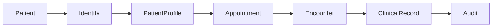
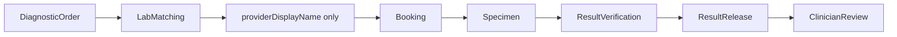
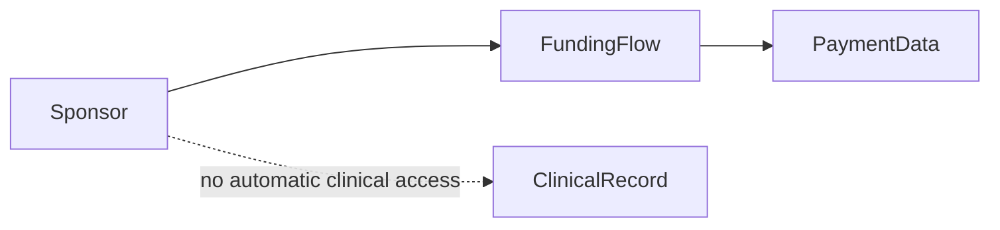
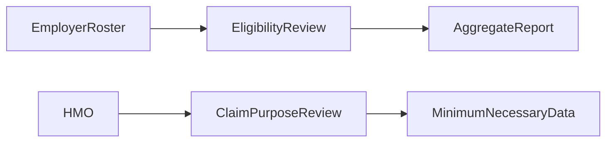
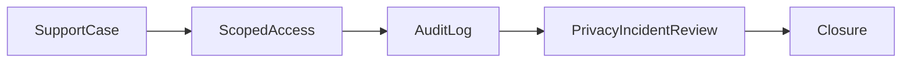
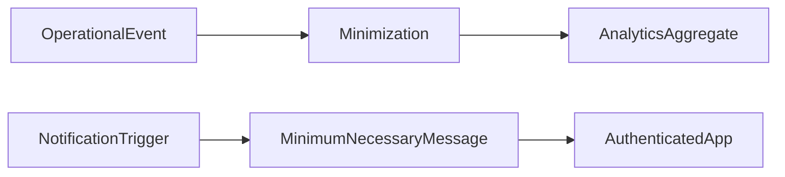

# Data-Flow Map

| Field | Value |
|---|---|
| Document title | Data-Flow Map |
| Codex prompt ID | P00-11 |
| Complete Breakdown work package | P00-14 |
| Issue ID | P00-DAT-001 |
| Owner role | Privacy Counsel + Data Protection Officer + Architecture Lead |
| Privacy status | DRAFT-PENDING-PRIVACY-AND-LEGAL-APPROVAL |
| Review state | REQUIRES_APPROVAL |
| Required reviewers | Privacy Counsel, Legal Counsel, Security Lead, Clinical Lead, Operations Lead, Architecture Lead |
| Last updated | 2026-06-24 |
| Effective date | NOT EFFECTIVE UNTIL APPROVED |
| Version | 0.1 draft |
| Related decisions | REQ-LOCK-001 through REQ-LOCK-013; REQ-DAT-001 through REQ-DAT-040 |
| Related open questions | OQ-00-265 through OQ-00-346 |
| Related data classifications | SENSITIVE-PERSONAL-DATA, PROTECTED-CLINICAL-DATA, PAYMENT-DATA, PROVIDER-IDENTITY-LOCATION-DATA, AUTHENTICATION-SECRET, SECURITY-OPERATIONAL-DATA |
| Related bounded contexts | Identity and Access, Patients and Relationships, Consent and Audit, Clinical Records, Prescriptions, Diagnostics, Pharmacy Fulfilment, Laboratory Operations, Payments and Ledger, Notifications, Analytics, Support and Operations |

## Privacy Document Status

- Status: DRAFT-PENDING-PRIVACY-AND-LEGAL-APPROVAL.
- This document is not a final legal interpretation.
- This document does not establish that NelyoHealth is compliant.
- Final lawful bases require qualified legal and privacy review.
- Final statutory periods require legal and regulatory review.
- Final cross-border transfer mechanisms require legal review.
- Final children's and guardianship rules require legal and privacy review.
- Effective date: NOT EFFECTIVE UNTIL APPROVED.
- Version and change-control: every approved change requires version increment, change reason, reviewer record, approval status, and preservation of previous versions.
## Purpose

This document records conceptual movement of data for privacy review. It is not final infrastructure topology, not a network diagram, not a database schema, and not proof of legal compliance.

## Cross-Cutting Data-Governance Requirements

| Requirement ID | Requirement | Source requirement | Owning document | Data owner | Privacy owner | Legal-review status | Data classification | Processing purpose | Related actor | Related journey | Related workflow | Related open question | Future test | Owning implementation phase |
|---|---|---|---|---|---|---|---|---|---|---|---|---|---|---|
| DAT-REQ-001 | Privacy, consent, guardian, sponsor, employer, HMO, support, or DSR processes must preserve one longitudinal Patient identity and must not create duplicate Patients. | REQ-LOCK-001 | Identity and patient continuity | Person/Patient | Privacy Counsel | APPROVED | SENSITIVE-PERSONAL-DATA; PROTECTED-CLINICAL-DATA | Identity continuity | Patient; SupportOperator | JRN-001 | WFL-001 | OQ-00-265 | TST-DAT-001 | P01 |
| DAT-REQ-002 | Person, UserAccount, Patient, Guardian, ClinicalProxy, Caregiver, Sponsor, Payer, employer, HMO, practitioner, support, and platform administrator authorities remain distinct. | P00-11 locked rule | Identity and authority boundaries | Identity and Patients | Privacy Counsel | APPROVED | SENSITIVE-PERSONAL-DATA | Authority separation | All actors | JRN-002 | WFL-001; WFL-023 | OQ-00-280 | TST-DAT-002 | P01 |
| DAT-REQ-003 | Consent is not a blanket lawful basis; every processing activity records purpose, data, actors, candidate basis, consent dependency, legal-review owner, and approval status. | P00-11 locked rule | Processing activities draft | Activity owner | Privacy Counsel | REQUIRES_APPROVAL | ALL CLASSIFICATIONS | Basis review | All actors | JRN-001 through JRN-020 | WFL-023 | OQ-00-268 | TST-CNS-001 | P00-12/P01 |
| DAT-REQ-004 | Consent grants are purpose-specific, versioned, evidenced, withdrawable where applicable, and scoped to subject, purpose, data category, recipient, version, evidence, and withdrawal method. | P00-11 locked rule | Consent matrix | Consent and Audit | Privacy Counsel | REQUIRES_APPROVAL | SENSITIVE-PERSONAL-DATA; PROTECTED-CLINICAL-DATA | Consent administration | Patient; Representative | JRN-003 | WFL-023 | OQ-00-278 | TST-CNS-002 | P01 |
| DAT-REQ-005 | Payment, sponsorship, family administration, employer administration, HMO administration, refund, claim, or benefit operation does not grant clinical access. | REQ-LOCK-002 | Payer visibility controls | Payments and Plans | Privacy Counsel | APPROVED | PAYMENT-DATA; PROTECTED-CLINICAL-DATA | Access separation | Sponsor; Payer; Employer; HMO | JRN-011 | WFL-018; WFL-019 | OQ-00-007 | TST-ACC-001 | P01 |
| DAT-REQ-006 | Family membership is not guardianship, clinical proxy authority, caregiver authority, consultation participation, or clinical-record entitlement. | P00-11 locked rule | Guardian and delegation policy | Patients and Relationships | Privacy Counsel | APPROVED | SENSITIVE-PERSONAL-DATA | Relationship governance | FamilyPlanAdministrator | JRN-011 | WFL-002 | OQ-00-281 | TST-GDN-001 | P01 |
| DAT-REQ-007 | Sponsorship is financial authority only unless separately authorized; it does not grant diagnoses, notes, prescriptions, lab results, full records, consultation participation, or unrelated provider details. | P00-11 locked rule | Funding/privacy boundary | Plans and Coverage | Privacy Counsel | APPROVED | PAYMENT-DATA; PROTECTED-CLINICAL-DATA | Sponsor funding | DiasporaSponsor | JRN-012 | WFL-018 | OQ-00-007 | TST-ACC-002 | P01 |
| DAT-REQ-008 | Employer reporting is aggregate, minimized, re-identification reviewed, and suppressed where dimensions make individual identification possible; no threshold is approved in P00-11. | P00-11 locked rule | Processing activities draft | Employer Benefits | Privacy Counsel | REQUIRES_APPROVAL | SENSITIVE-PERSONAL-DATA; AGGREGATE-DATA | Employer administration | EmployerAdministrator | JRN-015 | WFL-022 | OQ-00-273 | TST-ACC-003 | P00-12/P01 |
| DAT-REQ-009 | HMO visibility is purpose-specific, minimum necessary, authorized, audited, and separate from unrestricted longitudinal clinical-record access. | P00-11 locked rule | Processing activities draft | Claims and Coverage | Privacy Counsel | REQUIRES_APPROVAL | PAYMENT-DATA; PROTECTED-CLINICAL-DATA | Eligibility/claims | HMOAdministrator | JRN-016 | WFL-021; WFL-022 | OQ-00-274 | TST-ACC-004 | P00-12/P01 |
| DAT-REQ-010 | No platform, support, security, finance, organization, technical, or administrator role has universal clinical access. | P00-11 locked rule | Break-glass policy | Security and Support | Privacy Counsel | APPROVED | PROTECTED-CLINICAL-DATA | Administrative access control | SupportOperator; PlatformAdministrator | JRN-020 | WFL-024 | OQ-00-329 | TST-ACC-005 | P01 |
| DAT-REQ-011 | Break-glass is exceptional, reasoned, scoped, time/review bounded, audited, reviewed, revocable, and not a general bypass. | P00-11 locked rule | Break-glass policy | Clinical Records | Privacy Counsel + Security Lead | REQUIRES_APPROVAL | PROTECTED-CLINICAL-DATA | Emergency access | Clinical supervisor | JRN-009 | WFL-006; WFL-025 | OQ-00-326 | TST-BGA-001 | P01 |
| DAT-REQ-012 | Guardian authority requires approved evidence and verification and cannot arise only from payment, surname, address, emergency contact listing, family plan creation, device control, or self-claim. | P00-11 locked rule | Guardian and delegation policy | Patients and Relationships | Privacy Counsel | REQUIRES_APPROVAL | SENSITIVE-PERSONAL-DATA | Guardian verification | Guardian | JRN-013 | WFL-002 | OQ-00-280 | TST-GDN-002 | P00-12/P01 |
| DAT-REQ-013 | Multiple guardians, restrictions, suspension, dispute, temporary controls, child-safety escalation, appeal, and audit are supported conceptually. | P00-11 locked rule | Guardian and delegation policy | Patients and Relationships | Privacy Counsel | REQUIRES_APPROVAL | SENSITIVE-PERSONAL-DATA | Guardian governance | Guardian | JRN-013 | WFL-002 | OQ-00-281 | TST-GDN-003 | P01 |
| DAT-REQ-014 | Minor assent is distinct from guardian authority and remains legal and clinical approval controlled without final age thresholds. | P00-11 locked rule | Guardian and delegation policy | Patients and Relationships | Privacy Counsel | REQUIRES_APPROVAL | PROTECTED-CLINICAL-DATA | Minor assent | Minor; Guardian | JRN-013 | WFL-002 | OQ-00-284 | TST-GDN-004 | P00-12/P01 |
| DAT-REQ-015 | Age-of-majority transition preserves the same Patient and clinical record while reviewing account control, guardian access, adult consents, delegations, sponsorship, and audit. | P00-11 locked rule | Guardian and delegation policy | Patients and Relationships | Privacy Counsel | REQUIRES_APPROVAL | SENSITIVE-PERSONAL-DATA; PROTECTED-CLINICAL-DATA | Majority transition | Patient; Guardian | JRN-013 | WFL-002 | OQ-00-285 | TST-GDN-005 | P00-12/P01 |
| DAT-REQ-016 | Adult delegation is granular by capability and never a universal delegation. | P00-11 locked rule | Guardian and delegation policy | Patients and Relationships | Privacy Counsel | PROPOSED | SENSITIVE-PERSONAL-DATA; PROTECTED-CLINICAL-DATA | Delegation | Patient; Caregiver; ClinicalProxy | JRN-014 | WFL-023 | OQ-00-288 | TST-GDN-006 | P01 |
| DAT-REQ-017 | ClinicalProxy and Caregiver remain distinct, and neither automatically proves the other. | P00-11 locked rule | Guardian and delegation policy | Patients and Relationships | Privacy Counsel | APPROVED | PROTECTED-CLINICAL-DATA | Relationship authority | ClinicalProxy; Caregiver | JRN-014 | WFL-023 | OQ-00-287 | TST-GDN-007 | P01 |
| DAT-REQ-018 | Emergency safety access uses minimum necessary information, remains audited and reviewed, and is not blocked by payment, sponsor, employer, HMO, or provider-detail rules. | REQ-LOCK-010 | Emergency privacy boundary | Clinical Records | Privacy Counsel | APPROVED | PROTECTED-CLINICAL-DATA | Emergency safety | Clinician | JRN-009 | WFL-006 | OQ-00-272 | TST-BGA-002 | P01 |
| DAT-REQ-019 | Protected provider details remain absent from unauthorized analytics, session replay, logs, support tools, browser artifacts, notifications, exports, map requests, and cross-border analytics flows. | REQ-LOCK-003 through REQ-LOCK-005 | Provider disclosure privacy | Marketplace and Matching | Privacy Counsel + Security Lead | APPROVED | PROVIDER-IDENTITY-LOCATION-DATA | Provider disclosure | Patient; Support | JRN-004; JRN-005 | WFL-008; WFL-013 | OQ-00-006 | TST-PRV-001 | P01 |
| DAT-REQ-020 | Correction, deletion, restriction, or erasure requests distinguish incorrect data, historical records, amendment, supersession, legal retention, clinical safety retention, audit retention, future-use restriction, account closure, de-identification, and deletion. | REQ-LOCK-011; P00-11 locked rule | DSR workflows | Owning context | Privacy Counsel | REQUIRES_APPROVAL | ALL CLASSIFICATIONS | DSR handling | Patient; Representative | JRN-020 | WFL-024 | OQ-00-296 | TST-DSR-001 | P00-12/P01 |
| DAT-REQ-021 | Every UI, report, integration, log, event, notification, and support tool receives only data needed for its approved purpose. | P00-11 data minimization | Data handling matrix | Owning context | Privacy Counsel | PROPOSED | ALL CLASSIFICATIONS | Data minimization | All actors | All journeys | All workflows | OQ-00-300 | TST-DAT-003 | P01 |
| DAT-REQ-022 | New data reuse requires purpose, privacy, legal-basis, classification, consent, notification, retention, test, and traceability review. | P00-11 purpose limitation | Processing activities draft | Product owner | Privacy Counsel | REQUIRES_APPROVAL | ALL CLASSIFICATIONS | Purpose review | All actors | All journeys | WFL-023 | OQ-00-265 | TST-DAT-004 | P00-12/P01 |
| DAT-REQ-023 | Test, development, browser validation, screenshots, traces, videos, and training workflows use synthetic data only; production patient data is not copied to lower environments. | REQ-LOCK-012; P00-11 locked rule | Retention schedule draft | QA Lead | Privacy Counsel + Security Lead | APPROVED | ALL CLASSIFICATIONS | Testing | QA; Engineering | All journeys | All workflows | OQ-00-311 | TST-DAT-005 | P01 |
| DAT-REQ-024 | Analytics is downstream, minimized, non-authoritative, and excludes secrets, raw payment credentials, full clinical content, protected provider details, coordinates, patient-provider location pairs, and individually identifying employer reporting. | P00-11 analytics rule | Processing activities draft | Analytics owner | Privacy Counsel | REQUIRES_APPROVAL | AGGREGATE-DATA; DE-IDENTIFIED-DATA | Analytics | Product owner; Employer admin | JRN-015 | Analytics projections | OQ-00-277 | TST-ANL-001 | P00-14/P01 |
| DAT-REQ-025 | Session replay is disabled by default or separately approval-gated on sensitive surfaces and is not approved in P00-11. | P00-11 session replay rule | Subprocessor register draft | Product owner + Security Lead | Privacy Counsel | REQUIRES_APPROVAL | BROWSER-ARTIFACT-DATA | Session replay review | Patient; Support | All user journeys | Browser validation | OQ-00-323 | TST-ANL-002 | P00-14/P01 |
| DAT-REQ-026 | Logs, traces, metrics, errors, browser console output, network logs, and support diagnostics use explicit allow-lists, redaction, minimum identifiers, restricted access, and controlled retention. | P00-11 logs rule | Data handling matrix | Security Lead | Privacy Counsel | REQUIRES_APPROVAL | SECURITY-OPERATIONAL-DATA | Monitoring | Security; Support | All journeys | All workflows | OQ-00-276 | TST-LOG-001 | P00-14/P01 |
| DAT-REQ-027 | Routine notifications are minimum necessary and must not expose diagnoses, medicine names, result values, clinical notes, protected provider addresses, provider coordinates, dispute details, break-glass reasons, or secrets. | P00-11 notification rule | Notification data policy | Notifications owner | Privacy Counsel | REQUIRES_APPROVAL | SENSITIVE-PERSONAL-DATA | Notifications | All actors | All journeys | Notification workflows | OQ-00-333 | TST-NTF-001 | P00-14/P01 |
| DAT-REQ-028 | Cross-border data flows are registered with purpose, data, countries, recipient role, transfer question, retention, onward transfer, subprocessor, security, and approval status. | P00-11 cross-border rule | Cross-border data register | Privacy Counsel | Legal Counsel | REQUIRES_APPROVAL | ALL CLASSIFICATIONS | Cross-border processing | Diaspora sponsor; Processor | JRN-012 | Cross-border workflows | OQ-00-314 | TST-XBR-001 | P00-12/P01 |
| DAT-REQ-029 | Diaspora payment and diaspora clinical access are separate; funding does not create cross-border clinical disclosure. | P00-11 diaspora rule | Cross-border data register | Payments and Plans | Privacy Counsel | APPROVED | PAYMENT-DATA; PROTECTED-CLINICAL-DATA | Diaspora funding | DiasporaSponsor | JRN-012 | WFL-018 | OQ-00-317 | TST-XBR-002 | P01 |
| DAT-REQ-030 | Subprocessors require due diligence for service, data, countries, security, privacy, contract, deletion, retention, breach notice, onward subprocessors, audit rights, availability, exit, and regulatory constraints. | P00-11 subprocessor rule | Subprocessor register draft | Vendor owner | Privacy Counsel + Security Lead | REQUIRES_APPROVAL | ALL CLASSIFICATIONS | Vendor review | Processor | All journeys | Integration workflows | OQ-00-321 | TST-SUB-001 | P00-12/P01 |
| DAT-REQ-031 | Privacy incidents have defined detection, containment, evidence, privacy, security, clinical, legal, operations, notification, corrective-action, closure, and reopening ownership. | P00-11 incident rule | Processing activities draft | Support and Operations | Privacy Counsel + Security Lead | REQUIRES_APPROVAL | ALL CLASSIFICATIONS | Incident handling | Support; Security | JRN-020 | WFL-024; WFL-025 | OQ-00-339 | TST-INC-001 | P00-12/P01 |
| DAT-REQ-032 | DSR requests require requester verification, authority verification where relevant, scope confirmation, patient and tenant isolation, redaction, exception review, response evidence, audit, and appeal path. | P00-11 DSR rule | DSR workflows | Privacy operations | Privacy Counsel | REQUIRES_APPROVAL | ALL CLASSIFICATIONS | DSR handling | Patient; Representative | JRN-020 | WFL-024 | OQ-00-292 | TST-DSR-002 | P00-12/P01 |

## Data-Flow Conventions

Each row records data-flow ID, source actor, source context, destination context, destination actor, purpose, data categories, classifications, authority question, consent dependency, cross-border indicator, external processor indicator, retention category, audit requirement, risk owner, and approval status.

## Required Data Flows

| Flow ID | Flow | Source actor/context | Destination actor/context | Processing purpose | Data categories/classifications | Authority and consent question | Cross-border/processor | Retention and audit | Risk owner | Approval status |
|---|---|---|---|---|---|---|---|---|---|---|
| DFM-FLW-001 | Account registration | Requesting actor / owning context | Authorized recipient / destination context | Purpose-specific processing for Account registration | Minimum necessary data; SENSITIVE-PERSONAL-DATA | Authority check required; BASIS-REVIEW-REQUIRED; CONSENT-NOT-ASSUMED | NO or REVIEW-IF-VENDOR | RET-CAT mapping required; audit required | Privacy owner + owning context | REQUIRES_APPROVAL |
| DFM-FLW-002 | Contact verification | Requesting actor / owning context | Authorized recipient / destination context | Purpose-specific processing for Contact verification | Minimum necessary data; SENSITIVE-PERSONAL-DATA | Authority check required; BASIS-REVIEW-REQUIRED; CONSENT-NOT-ASSUMED | NO or REVIEW-IF-VENDOR | RET-CAT mapping required; audit required | Privacy owner + owning context | REQUIRES_APPROVAL |
| DFM-FLW-003 | Identity verification | Requesting actor / owning context | Authorized recipient / destination context | Purpose-specific processing for Identity verification | Minimum necessary data; SENSITIVE-PERSONAL-DATA | Authority check required; BASIS-REVIEW-REQUIRED; CONSENT-NOT-ASSUMED | NO or REVIEW-IF-VENDOR | RET-CAT mapping required; audit required | Privacy owner + owning context | REQUIRES_APPROVAL |
| DFM-FLW-004 | Account recovery | Requesting actor / owning context | Authorized recipient / destination context | Purpose-specific processing for Account recovery | Minimum necessary data; SENSITIVE-PERSONAL-DATA | Authority check required; BASIS-REVIEW-REQUIRED; CONSENT-NOT-ASSUMED | NO or REVIEW-IF-VENDOR | RET-CAT mapping required; audit required | Privacy owner + owning context | REQUIRES_APPROVAL |
| DFM-FLW-005 | Patient-profile creation | Requesting actor / owning context | Authorized recipient / destination context | Purpose-specific processing for Patient-profile creation | Minimum necessary data; SENSITIVE-PERSONAL-DATA | Authority check required; BASIS-REVIEW-REQUIRED; CONSENT-NOT-ASSUMED | NO or REVIEW-IF-VENDOR | RET-CAT mapping required; audit required | Privacy owner + owning context | REQUIRES_APPROVAL |
| DFM-FLW-006 | Medical-history collection | Requesting actor / owning context | Authorized recipient / destination context | Purpose-specific processing for Medical-history collection | Minimum necessary data; PROTECTED-CLINICAL-DATA | Authority check required; BASIS-REVIEW-REQUIRED; CONSENT-NOT-ASSUMED | NO or REVIEW-IF-VENDOR | RET-CAT mapping required; audit required | Privacy owner + owning context | REQUIRES_APPROVAL |
| DFM-FLW-007 | Appointment booking | Requesting actor / owning context | Authorized recipient / destination context | Purpose-specific processing for Appointment booking | Minimum necessary data; SENSITIVE-PERSONAL-DATA | Authority check required; BASIS-REVIEW-REQUIRED; CONSENT-NOT-ASSUMED | NO or REVIEW-IF-VENDOR | RET-CAT mapping required; audit required | Privacy owner + owning context | REQUIRES_APPROVAL |
| DFM-FLW-008 | Intake and triage | Requesting actor / owning context | Authorized recipient / destination context | Purpose-specific processing for Intake and triage | Minimum necessary data; SENSITIVE-PERSONAL-DATA | Authority check required; BASIS-REVIEW-REQUIRED; CONSENT-NOT-ASSUMED | NO or REVIEW-IF-VENDOR | RET-CAT mapping required; audit required | Privacy owner + owning context | REQUIRES_APPROVAL |
| DFM-FLW-009 | Video or audio consultation | Requesting actor / owning context | Authorized recipient / destination context | Purpose-specific processing for Video or audio consultation | Minimum necessary data; SENSITIVE-PERSONAL-DATA | Authority check required; BASIS-REVIEW-REQUIRED; CONSENT-NOT-ASSUMED | NO or REVIEW-IF-VENDOR | RET-CAT mapping required; audit required | Privacy owner + owning context | REQUIRES_APPROVAL |
| DFM-FLW-010 | Clinical-note finalization | Requesting actor / owning context | Authorized recipient / destination context | Purpose-specific processing for Clinical-note finalization | Minimum necessary data; PROTECTED-CLINICAL-DATA | Authority check required; BASIS-REVIEW-REQUIRED; CONSENT-NOT-ASSUMED | NO or REVIEW-IF-VENDOR | RET-CAT mapping required; audit required | Privacy owner + owning context | REQUIRES_APPROVAL |
| DFM-FLW-011 | Prescription issuance | Requesting actor / owning context | Authorized recipient / destination context | Purpose-specific processing for Prescription issuance | Minimum necessary data; PROTECTED-CLINICAL-DATA | Authority check required; BASIS-REVIEW-REQUIRED; CONSENT-NOT-ASSUMED | NO or REVIEW-IF-VENDOR | RET-CAT mapping required; audit required | Privacy owner + owning context | REQUIRES_APPROVAL |
| DFM-FLW-012 | Pharmacy matching | Requesting actor / owning context | Authorized recipient / destination context | Purpose-specific processing for Pharmacy matching | Minimum necessary data; SENSITIVE-PERSONAL-DATA | Authority check required; BASIS-REVIEW-REQUIRED; CONSENT-NOT-ASSUMED | NO or REVIEW-IF-VENDOR | RET-CAT mapping required; audit required | Privacy owner + owning context | REQUIRES_APPROVAL |
| DFM-FLW-013 | Pharmacy pre-payment offer | Requesting actor / owning context | Authorized recipient / destination context | Purpose-specific processing for Pharmacy pre-payment offer | Minimum necessary data; PROVIDER-IDENTITY-LOCATION-DATA | Authority check required; BASIS-REVIEW-REQUIRED; CONSENT-NOT-ASSUMED | NO or REVIEW-IF-VENDOR | RET-CAT mapping required; audit required | Privacy owner + owning context | REQUIRES_APPROVAL |
| DFM-FLW-014 | Pharmacy post-payment disclosure | Requesting actor / owning context | Authorized recipient / destination context | Purpose-specific processing for Pharmacy post-payment disclosure | Minimum necessary data; PROVIDER-IDENTITY-LOCATION-DATA | Authority check required; BASIS-REVIEW-REQUIRED; CONSENT-NOT-ASSUMED | NO or REVIEW-IF-VENDOR | RET-CAT mapping required; audit required | Privacy owner + owning context | REQUIRES_APPROVAL |
| DFM-FLW-015 | Pharmacy fulfilment | Requesting actor / owning context | Authorized recipient / destination context | Purpose-specific processing for Pharmacy fulfilment | Minimum necessary data; SENSITIVE-PERSONAL-DATA | Authority check required; BASIS-REVIEW-REQUIRED; CONSENT-NOT-ASSUMED | NO or REVIEW-IF-VENDOR | RET-CAT mapping required; audit required | Privacy owner + owning context | REQUIRES_APPROVAL |
| DFM-FLW-016 | Delivery | Requesting actor / owning context | Authorized recipient / destination context | Purpose-specific processing for Delivery | Minimum necessary data; SENSITIVE-PERSONAL-DATA | Authority check required; BASIS-REVIEW-REQUIRED; CONSENT-NOT-ASSUMED | NO or REVIEW-IF-VENDOR | RET-CAT mapping required; audit required | Privacy owner + owning context | REQUIRES_APPROVAL |
| DFM-FLW-017 | Diagnostic ordering | Requesting actor / owning context | Authorized recipient / destination context | Purpose-specific processing for Diagnostic ordering | Minimum necessary data; PROTECTED-CLINICAL-DATA | Authority check required; BASIS-REVIEW-REQUIRED; CONSENT-NOT-ASSUMED | NO or REVIEW-IF-VENDOR | RET-CAT mapping required; audit required | Privacy owner + owning context | REQUIRES_APPROVAL |
| DFM-FLW-018 | Laboratory matching | Requesting actor / owning context | Authorized recipient / destination context | Purpose-specific processing for Laboratory matching | Minimum necessary data; PROTECTED-CLINICAL-DATA | Authority check required; BASIS-REVIEW-REQUIRED; CONSENT-NOT-ASSUMED | NO or REVIEW-IF-VENDOR | RET-CAT mapping required; audit required | Privacy owner + owning context | REQUIRES_APPROVAL |
| DFM-FLW-019 | Laboratory pre-payment offer | Requesting actor / owning context | Authorized recipient / destination context | Purpose-specific processing for Laboratory pre-payment offer | Minimum necessary data; PROVIDER-IDENTITY-LOCATION-DATA | Authority check required; BASIS-REVIEW-REQUIRED; CONSENT-NOT-ASSUMED | NO or REVIEW-IF-VENDOR | RET-CAT mapping required; audit required | Privacy owner + owning context | REQUIRES_APPROVAL |
| DFM-FLW-020 | Laboratory post-payment disclosure | Requesting actor / owning context | Authorized recipient / destination context | Purpose-specific processing for Laboratory post-payment disclosure | Minimum necessary data; PROVIDER-IDENTITY-LOCATION-DATA | Authority check required; BASIS-REVIEW-REQUIRED; CONSENT-NOT-ASSUMED | NO or REVIEW-IF-VENDOR | RET-CAT mapping required; audit required | Privacy owner + owning context | REQUIRES_APPROVAL |
| DFM-FLW-021 | Specimen collection | Requesting actor / owning context | Authorized recipient / destination context | Purpose-specific processing for Specimen collection | Minimum necessary data; PROTECTED-CLINICAL-DATA | Authority check required; BASIS-REVIEW-REQUIRED; CONSENT-NOT-ASSUMED | NO or REVIEW-IF-VENDOR | RET-CAT mapping required; audit required | Privacy owner + owning context | REQUIRES_APPROVAL |
| DFM-FLW-022 | Result verification | Requesting actor / owning context | Authorized recipient / destination context | Purpose-specific processing for Result verification | Minimum necessary data; PROTECTED-CLINICAL-DATA | Authority check required; BASIS-REVIEW-REQUIRED; CONSENT-NOT-ASSUMED | NO or REVIEW-IF-VENDOR | RET-CAT mapping required; audit required | Privacy owner + owning context | REQUIRES_APPROVAL |
| DFM-FLW-023 | Result release | Requesting actor / owning context | Authorized recipient / destination context | Purpose-specific processing for Result release | Minimum necessary data; PROTECTED-CLINICAL-DATA | Authority check required; BASIS-REVIEW-REQUIRED; CONSENT-NOT-ASSUMED | NO or REVIEW-IF-VENDOR | RET-CAT mapping required; audit required | Privacy owner + owning context | REQUIRES_APPROVAL |
| DFM-FLW-024 | Critical-result escalation | Requesting actor / owning context | Authorized recipient / destination context | Purpose-specific processing for Critical-result escalation | Minimum necessary data; PROTECTED-CLINICAL-DATA | Authority check required; BASIS-REVIEW-REQUIRED; CONSENT-NOT-ASSUMED | NO or REVIEW-IF-VENDOR | RET-CAT mapping required; audit required | Privacy owner + owning context | REQUIRES_APPROVAL |
| DFM-FLW-025 | Referral | Requesting actor / owning context | Authorized recipient / destination context | Purpose-specific processing for Referral | Minimum necessary data; PROTECTED-CLINICAL-DATA | Authority check required; BASIS-REVIEW-REQUIRED; CONSENT-NOT-ASSUMED | NO or REVIEW-IF-VENDOR | RET-CAT mapping required; audit required | Privacy owner + owning context | REQUIRES_APPROVAL |
| DFM-FLW-026 | Emergency escalation | Requesting actor / owning context | Authorized recipient / destination context | Purpose-specific processing for Emergency escalation | Minimum necessary data; PROTECTED-CLINICAL-DATA | Authority check required; BASIS-REVIEW-REQUIRED; CONSENT-NOT-ASSUMED | NO or REVIEW-IF-VENDOR | RET-CAT mapping required; audit required | Privacy owner + owning context | REQUIRES_APPROVAL |
| DFM-FLW-027 | Family-plan invitation | Requesting actor / owning context | Authorized recipient / destination context | Purpose-specific processing for Family-plan invitation | Minimum necessary data; SENSITIVE-PERSONAL-DATA | Authority check required; BASIS-REVIEW-REQUIRED; CONSENT-NOT-ASSUMED | NO or REVIEW-IF-VENDOR | RET-CAT mapping required; audit required | Privacy owner + owning context | REQUIRES_APPROVAL |
| DFM-FLW-028 | Family funding | Requesting actor / owning context | Authorized recipient / destination context | Purpose-specific processing for Family funding | Minimum necessary data; PAYMENT-DATA | Authority check required; BASIS-REVIEW-REQUIRED; CONSENT-NOT-ASSUMED | NO or REVIEW-IF-VENDOR | RET-CAT mapping required; audit required | Privacy owner + owning context | REQUIRES_APPROVAL |
| DFM-FLW-029 | Diaspora beneficiary invitation | Requesting actor / owning context | Authorized recipient / destination context | Purpose-specific processing for Diaspora beneficiary invitation | Minimum necessary data; SENSITIVE-PERSONAL-DATA | Authority check required; BASIS-REVIEW-REQUIRED; CONSENT-NOT-ASSUMED | YES-REVIEW-REQUIRED | RET-CAT mapping required; audit required | Privacy owner + owning context | REQUIRES_APPROVAL |
| DFM-FLW-030 | Diaspora payment | Requesting actor / owning context | Authorized recipient / destination context | Purpose-specific processing for Diaspora payment | Minimum necessary data; PAYMENT-DATA | Authority check required; BASIS-REVIEW-REQUIRED; CONSENT-NOT-ASSUMED | YES-REVIEW-REQUIRED | RET-CAT mapping required; audit required | Privacy owner + owning context | REQUIRES_APPROVAL |
| DFM-FLW-031 | Sponsor approval | Requesting actor / owning context | Authorized recipient / destination context | Purpose-specific processing for Sponsor approval | Minimum necessary data; SENSITIVE-PERSONAL-DATA | Authority check required; BASIS-REVIEW-REQUIRED; CONSENT-NOT-ASSUMED | NO or REVIEW-IF-VENDOR | RET-CAT mapping required; audit required | Privacy owner + owning context | REQUIRES_APPROVAL |
| DFM-FLW-032 | Employer roster future scope | Requesting actor / owning context | Authorized recipient / destination context | Purpose-specific processing for Employer roster future scope | Minimum necessary data; SENSITIVE-PERSONAL-DATA | Authority check required; BASIS-REVIEW-REQUIRED; CONSENT-NOT-ASSUMED | NO or REVIEW-IF-VENDOR | RET-CAT mapping required; audit required | Privacy owner + owning context | REQUIRES_APPROVAL |
| DFM-FLW-033 | Employer eligibility future scope | Requesting actor / owning context | Authorized recipient / destination context | Purpose-specific processing for Employer eligibility future scope | Minimum necessary data; SENSITIVE-PERSONAL-DATA | Authority check required; BASIS-REVIEW-REQUIRED; CONSENT-NOT-ASSUMED | NO or REVIEW-IF-VENDOR | RET-CAT mapping required; audit required | Privacy owner + owning context | REQUIRES_APPROVAL |
| DFM-FLW-034 | HMO eligibility future scope | Requesting actor / owning context | Authorized recipient / destination context | Purpose-specific processing for HMO eligibility future scope | Minimum necessary data; SENSITIVE-PERSONAL-DATA | Authority check required; BASIS-REVIEW-REQUIRED; CONSENT-NOT-ASSUMED | NO or REVIEW-IF-VENDOR | RET-CAT mapping required; audit required | Privacy owner + owning context | REQUIRES_APPROVAL |
| DFM-FLW-035 | Prior authorization future scope | Requesting actor / owning context | Authorized recipient / destination context | Purpose-specific processing for Prior authorization future scope | Minimum necessary data; SENSITIVE-PERSONAL-DATA | Authority check required; BASIS-REVIEW-REQUIRED; CONSENT-NOT-ASSUMED | NO or REVIEW-IF-VENDOR | RET-CAT mapping required; audit required | Privacy owner + owning context | REQUIRES_APPROVAL |
| DFM-FLW-036 | Claims and remittance future scope | Requesting actor / owning context | Authorized recipient / destination context | Purpose-specific processing for Claims and remittance future scope | Minimum necessary data; PAYMENT-DATA | Authority check required; BASIS-REVIEW-REQUIRED; CONSENT-NOT-ASSUMED | NO or REVIEW-IF-VENDOR | RET-CAT mapping required; audit required | Privacy owner + owning context | REQUIRES_APPROVAL |
| DFM-FLW-037 | Provider credential verification | Requesting actor / owning context | Authorized recipient / destination context | Purpose-specific processing for Provider credential verification | Minimum necessary data; PROVIDER-IDENTITY-LOCATION-DATA | Authority check required; BASIS-REVIEW-REQUIRED; CONSENT-NOT-ASSUMED | NO or REVIEW-IF-VENDOR | RET-CAT mapping required; audit required | Privacy owner + owning context | REQUIRES_APPROVAL |
| DFM-FLW-038 | Support case | Requesting actor / owning context | Authorized recipient / destination context | Purpose-specific processing for Support case | Minimum necessary data; SENSITIVE-PERSONAL-DATA | Authority check required; BASIS-REVIEW-REQUIRED; CONSENT-NOT-ASSUMED | NO or REVIEW-IF-VENDOR | RET-CAT mapping required; audit required | Privacy owner + owning context | REQUIRES_APPROVAL |
| DFM-FLW-039 | Complaint | Requesting actor / owning context | Authorized recipient / destination context | Purpose-specific processing for Complaint | Minimum necessary data; SENSITIVE-PERSONAL-DATA | Authority check required; BASIS-REVIEW-REQUIRED; CONSENT-NOT-ASSUMED | NO or REVIEW-IF-VENDOR | RET-CAT mapping required; audit required | Privacy owner + owning context | REQUIRES_APPROVAL |
| DFM-FLW-040 | Clinical incident | Requesting actor / owning context | Authorized recipient / destination context | Purpose-specific processing for Clinical incident | Minimum necessary data; PROTECTED-CLINICAL-DATA | Authority check required; BASIS-REVIEW-REQUIRED; CONSENT-NOT-ASSUMED | NO or REVIEW-IF-VENDOR | RET-CAT mapping required; audit required | Privacy owner + owning context | REQUIRES_APPROVAL |
| DFM-FLW-041 | Privacy incident | Requesting actor / owning context | Authorized recipient / destination context | Purpose-specific processing for Privacy incident | Minimum necessary data; SENSITIVE-PERSONAL-DATA | Authority check required; BASIS-REVIEW-REQUIRED; CONSENT-NOT-ASSUMED | NO or REVIEW-IF-VENDOR | RET-CAT mapping required; audit required | Privacy owner + owning context | REQUIRES_APPROVAL |
| DFM-FLW-042 | Security incident | Requesting actor / owning context | Authorized recipient / destination context | Purpose-specific processing for Security incident | Minimum necessary data; SENSITIVE-PERSONAL-DATA | Authority check required; BASIS-REVIEW-REQUIRED; CONSENT-NOT-ASSUMED | NO or REVIEW-IF-VENDOR | RET-CAT mapping required; audit required | Privacy owner + owning context | REQUIRES_APPROVAL |
| DFM-FLW-043 | Consent grant | Requesting actor / owning context | Authorized recipient / destination context | Purpose-specific processing for Consent grant | Minimum necessary data; SENSITIVE-PERSONAL-DATA | Authority check required; CONSENT-QUESTION | NO or REVIEW-IF-VENDOR | RET-CAT mapping required; audit required | Privacy owner + owning context | REQUIRES_APPROVAL |
| DFM-FLW-044 | Consent withdrawal | Requesting actor / owning context | Authorized recipient / destination context | Purpose-specific processing for Consent withdrawal | Minimum necessary data; SENSITIVE-PERSONAL-DATA | Authority check required; CONSENT-QUESTION | NO or REVIEW-IF-VENDOR | RET-CAT mapping required; audit required | Privacy owner + owning context | REQUIRES_APPROVAL |
| DFM-FLW-045 | Guardian verification future scope | Requesting actor / owning context | Authorized recipient / destination context | Purpose-specific processing for Guardian verification future scope | Minimum necessary data; SENSITIVE-PERSONAL-DATA | Authority check required; BASIS-REVIEW-REQUIRED; CONSENT-NOT-ASSUMED | NO or REVIEW-IF-VENDOR | RET-CAT mapping required; audit required | Privacy owner + owning context | REQUIRES_APPROVAL |
| DFM-FLW-046 | Adult delegation | Requesting actor / owning context | Authorized recipient / destination context | Purpose-specific processing for Adult delegation | Minimum necessary data; SENSITIVE-PERSONAL-DATA | Authority check required; CONSENT-QUESTION | NO or REVIEW-IF-VENDOR | RET-CAT mapping required; audit required | Privacy owner + owning context | REQUIRES_APPROVAL |
| DFM-FLW-047 | Break-glass access | Requesting actor / owning context | Authorized recipient / destination context | Purpose-specific processing for Break-glass access | Minimum necessary data; SENSITIVE-PERSONAL-DATA | Authority check required; BASIS-REVIEW-REQUIRED; CONSENT-NOT-ASSUMED | NO or REVIEW-IF-VENDOR | RET-CAT mapping required; audit required | Privacy owner + owning context | REQUIRES_APPROVAL |
| DFM-FLW-048 | Data-subject request | Requesting actor / owning context | Authorized recipient / destination context | Purpose-specific processing for Data-subject request | Minimum necessary data; SENSITIVE-PERSONAL-DATA | Authority check required; BASIS-REVIEW-REQUIRED; CONSENT-NOT-ASSUMED | NO or REVIEW-IF-VENDOR | RET-CAT mapping required; audit required | Privacy owner + owning context | REQUIRES_APPROVAL |
| DFM-FLW-049 | Notifications | Requesting actor / owning context | Authorized recipient / destination context | Purpose-specific processing for Notifications | Minimum necessary data; SENSITIVE-PERSONAL-DATA | Authority check required; BASIS-REVIEW-REQUIRED; CONSENT-NOT-ASSUMED | NO or REVIEW-IF-VENDOR | RET-CAT mapping required; audit required | Privacy owner + owning context | REQUIRES_APPROVAL |
| DFM-FLW-050 | Analytics and aggregate reporting | Requesting actor / owning context | Authorized recipient / destination context | Purpose-specific processing for Analytics and aggregate reporting | Minimum necessary data; DE-IDENTIFIED-DATA; AGGREGATE-DATA | Authority check required; CONSENT-QUESTION | NO or REVIEW-IF-VENDOR | RET-CAT mapping required; audit required | Privacy owner + owning context | REQUIRES_APPROVAL |
| DFM-FLW-051 | Audit logging | Requesting actor / owning context | Authorized recipient / destination context | Purpose-specific processing for Audit logging | Minimum necessary data; SENSITIVE-PERSONAL-DATA | Authority check required; BASIS-REVIEW-REQUIRED; CONSENT-NOT-ASSUMED | NO or REVIEW-IF-VENDOR | RET-CAT mapping required; audit required | Privacy owner + owning context | REQUIRES_APPROVAL |
| DFM-FLW-052 | Backups and recovery | Requesting actor / owning context | Authorized recipient / destination context | Purpose-specific processing for Backups and recovery | Minimum necessary data; SENSITIVE-PERSONAL-DATA | Authority check required; BASIS-REVIEW-REQUIRED; CONSENT-NOT-ASSUMED | NO or REVIEW-IF-VENDOR | RET-CAT mapping required; audit required | Privacy owner + owning context | REQUIRES_APPROVAL |
| DFM-FLW-053 | Test and development data | Requesting actor / owning context | Authorized recipient / destination context | Purpose-specific processing for Test and development data | Minimum necessary data; SYNTHETIC-ONLY | Authority check required; BASIS-REVIEW-REQUIRED; CONSENT-NOT-ASSUMED | NO or REVIEW-IF-VENDOR | RET-CAT mapping required; audit required | Privacy owner + owning context | REQUIRES_APPROVAL |
| DFM-FLW-054 | Cross-border processor flow | Requesting actor / owning context | Authorized recipient / destination context | Purpose-specific processing for Cross-border processor flow | Minimum necessary data; SENSITIVE-PERSONAL-DATA | Authority check required; BASIS-REVIEW-REQUIRED; CONSENT-NOT-ASSUMED | YES-REVIEW-REQUIRED | RET-CAT mapping required; audit required | Privacy owner + owning context | REQUIRES_APPROVAL |
| DFM-FLW-055 | Subprocessor onward transfer | Requesting actor / owning context | Authorized recipient / destination context | Purpose-specific processing for Subprocessor onward transfer | Minimum necessary data; SENSITIVE-PERSONAL-DATA | Authority check required; BASIS-REVIEW-REQUIRED; CONSENT-NOT-ASSUMED | YES-REVIEW-REQUIRED | RET-CAT mapping required; audit required | Privacy owner + owning context | REQUIRES_APPROVAL |
| DFM-FLW-056 | Data deletion restriction or de-identification | Requesting actor / owning context | Authorized recipient / destination context | Purpose-specific processing for Data deletion restriction or de-identification | Minimum necessary data; SENSITIVE-PERSONAL-DATA | Authority check required; BASIS-REVIEW-REQUIRED; CONSENT-NOT-ASSUMED | NO or REVIEW-IF-VENDOR | RET-CAT mapping required; audit required | Privacy owner + owning context | REQUIRES_APPROVAL |

## Mermaid Diagrams
### Patient and consultation data flow

Explanation: Patient and consultation data flow is conceptual. Protected pre-payment pharmacy or laboratory details are not sent to unauthorized destinations, and final legal/transfer interpretation remains review-gated.
### Pharmacy pre-payment and post-payment flow

Explanation: Pharmacy pre-payment and post-payment flow is conceptual. Protected pre-payment pharmacy or laboratory details are not sent to unauthorized destinations, and final legal/transfer interpretation remains review-gated.
### Laboratory and result flow

Explanation: Laboratory and result flow is conceptual. Protected pre-payment pharmacy or laboratory details are not sent to unauthorized destinations, and final legal/transfer interpretation remains review-gated.
### Family and diaspora flow

Explanation: Family and diaspora flow is conceptual. Protected pre-payment pharmacy or laboratory details are not sent to unauthorized destinations, and final legal/transfer interpretation remains review-gated.
### Employer and HMO future flow

Explanation: Employer and HMO future flow is conceptual. Protected pre-payment pharmacy or laboratory details are not sent to unauthorized destinations, and final legal/transfer interpretation remains review-gated.
### Support, audit, and incident flow

Explanation: Support, audit, and incident flow is conceptual. Protected pre-payment pharmacy or laboratory details are not sent to unauthorized destinations, and final legal/transfer interpretation remains review-gated.
### Analytics and notification flow

Explanation: Analytics and notification flow is conceptual. Protected pre-payment pharmacy or laboratory details are not sent to unauthorized destinations, and final legal/transfer interpretation remains review-gated.
### Cross-border processor flow

Explanation: Cross-border processor flow is conceptual. Protected pre-payment pharmacy or laboratory details are not sent to unauthorized destinations, and final legal/transfer interpretation remains review-gated.

## Data-Flow Risk Review

| Risk | Control | Owner | Approval status |
|---|---|---|---|
| Excess collection | Purpose-specific minimization, authorization, redaction, audit, and owner review before implementation. | Privacy Counsel + Security Lead + owning context | REQUIRES_APPROVAL |
| Cross-tenant leakage | Purpose-specific minimization, authorization, redaction, audit, and owner review before implementation. | Privacy Counsel + Security Lead + owning context | REQUIRES_APPROVAL |
| Payer-clinical leakage | Purpose-specific minimization, authorization, redaction, audit, and owner review before implementation. | Privacy Counsel + Security Lead + owning context | REQUIRES_APPROVAL |
| Pre-payment provider-detail leakage | Purpose-specific minimization, authorization, redaction, audit, and owner review before implementation. | Privacy Counsel + Security Lead + owning context | REQUIRES_APPROVAL |
| Telemetry leakage | Purpose-specific minimization, authorization, redaction, audit, and owner review before implementation. | Privacy Counsel + Security Lead + owning context | REQUIRES_APPROVAL |
| Session-replay leakage | Purpose-specific minimization, authorization, redaction, audit, and owner review before implementation. | Privacy Counsel + Security Lead + owning context | REQUIRES_APPROVAL |
| Support-tool overexposure | Purpose-specific minimization, authorization, redaction, audit, and owner review before implementation. | Privacy Counsel + Security Lead + owning context | REQUIRES_APPROVAL |
| Cross-border transfer | Purpose-specific minimization, authorization, redaction, audit, and owner review before implementation. | Privacy Counsel + Security Lead + owning context | REQUIRES_APPROVAL |
| Duplicate identity | Purpose-specific minimization, authorization, redaction, audit, and owner review before implementation. | Privacy Counsel + Security Lead + owning context | REQUIRES_APPROVAL |
| Wrong guardian | Purpose-specific minimization, authorization, redaction, audit, and owner review before implementation. | Privacy Counsel + Security Lead + owning context | REQUIRES_APPROVAL |
| Wrong delegation | Purpose-specific minimization, authorization, redaction, audit, and owner review before implementation. | Privacy Counsel + Security Lead + owning context | REQUIRES_APPROVAL |
| DSR cross-patient disclosure | Purpose-specific minimization, authorization, redaction, audit, and owner review before implementation. | Privacy Counsel + Security Lead + owning context | REQUIRES_APPROVAL |
| Retention conflict | Purpose-specific minimization, authorization, redaction, audit, and owner review before implementation. | Privacy Counsel + Security Lead + owning context | REQUIRES_APPROVAL |
| Subprocessor onward transfer | Purpose-specific minimization, authorization, redaction, audit, and owner review before implementation. | Privacy Counsel + Security Lead + owning context | REQUIRES_APPROVAL |
| Notification leakage | Purpose-specific minimization, authorization, redaction, audit, and owner review before implementation. | Privacy Counsel + Security Lead + owning context | REQUIRES_APPROVAL |
