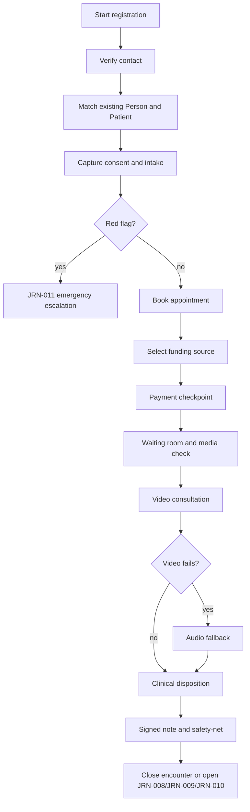
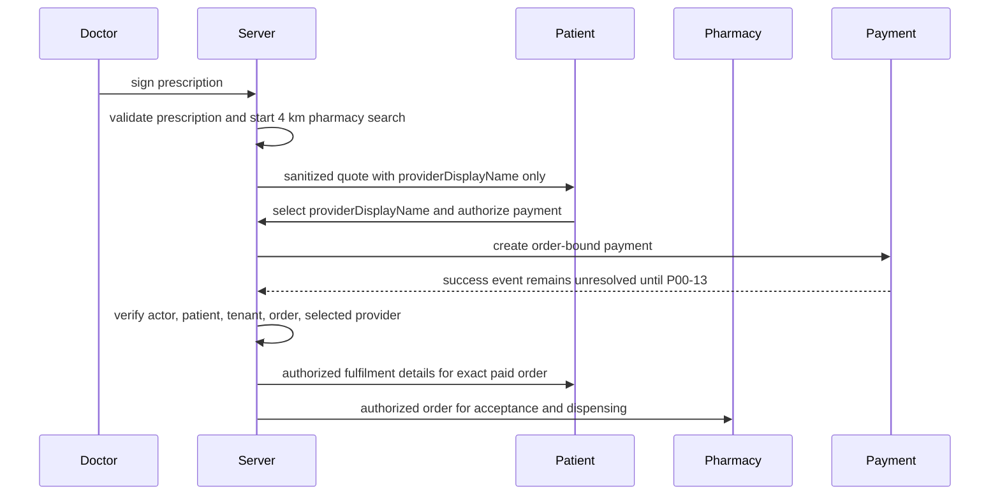
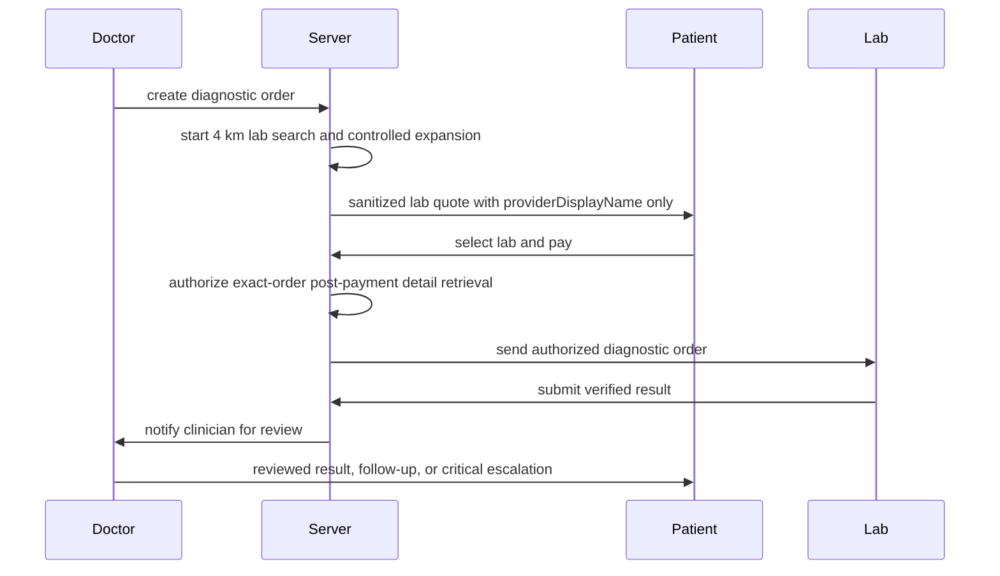
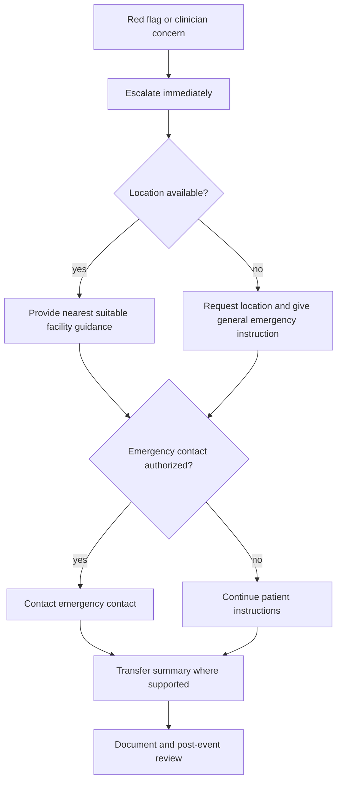
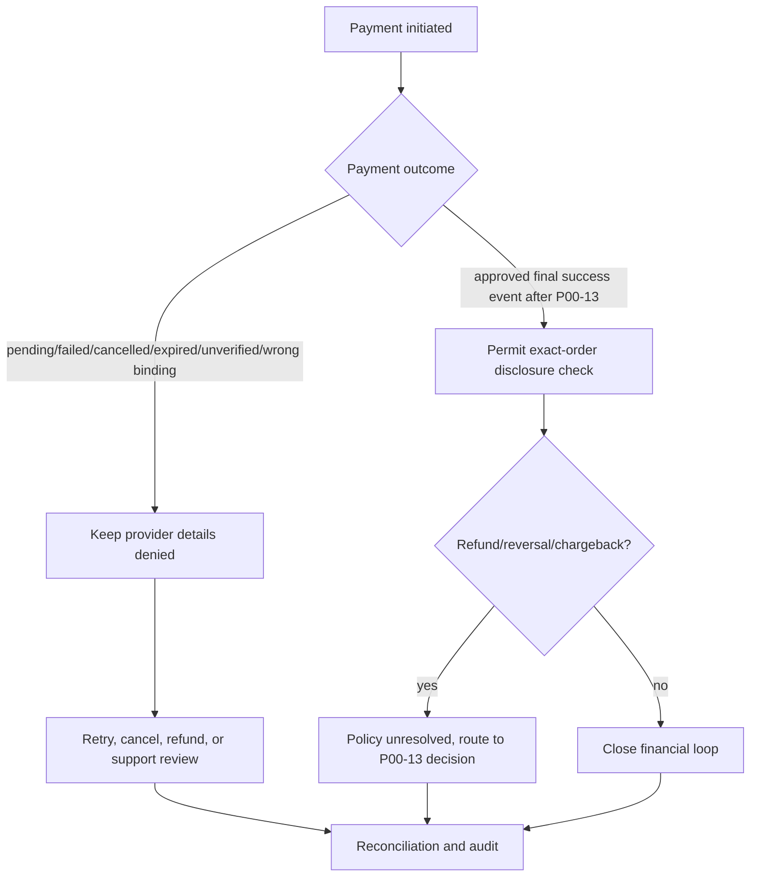

# NelyoHealth User Journeys (P00-05)

## Document Control

- Document title: End-to-end user journeys
- Codex prompt ID: P00-05
- Complete Breakdown work package: P00-06
- Issue ID: P00-JRN-001
- Owner role: Product + Clinical + Operations + Security
- Review state: PROPOSED
- Required reviewers: Product owner, Clinical lead, Operations lead, Privacy counsel, Security lead, QA lead
- Last updated: 2026-06-24
- Related decisions: REQ-LOCK-001 to REQ-LOCK-013; REQ-GOV-001 to REQ-GOV-018; REQ-COV-001 to REQ-COV-028; REQ-JRN-001 to REQ-JRN-012
- Related open questions: OQ-00-01 to OQ-00-13; OQ-00-24 to OQ-00-31; OQ-00-44 to OQ-00-89
- Related scope documents: docs/product/mvp-scope.md; docs/product/pilot-operating-boundary.md; docs/product/service-catalogue-boundary.md; docs/product/non-goals.md; docs/product/expansion-gates.md

## Purpose

This document defines end-to-end user and participant journeys. It is not an implementation state-machine specification, final UI specification, database design, vendor selection, or approval record. Final workflow state machines belong to P00-07.

## Journey Conventions

- Journey ID: canonical `JRN-###` identifier.
- Scope label: exactly one of `PILOT`, `POST-PILOT`, `DESIGN-NOW-IMPLEMENT-LATER`, `OUT-OF-SCOPE`, or `BLOCKED-PENDING-REVIEW`.
- Primary actor: actor initiating or most affected by the journey.
- Secondary actor: participant with required handoff, approval, review, or fulfilment work.
- Frontstage action: what the user or participant experiences.
- Backstage decision: platform or policy decision required before the next step.
- Human operation: staff action, review, exception handling, or escalation.
- External partner action: provider, facility, payment, logistics, employer, HMO, or sponsor action outside the primary user interface.
- Data creation: records, orders, notes, audit events, payment intents, receipts, results, or relationships produced by the journey.
- Data disclosure: information legitimately shown to an actor.
- Authorization checkpoint: actor, patient, tenant, relationship, order, consent, or clinical authority check.
- Payment checkpoint: funding, payment, refund, reversal, or denial point.
- Audit event: durable record for sensitive actions and transitions.
- Completion: condition that closes the loop.
- Reopening: condition that returns a closed loop to active review without silent overwrite.

## Locked Journey Invariants

- One person maps to one longitudinal patient identity; no journey creates a duplicate clinical identity because of family, sponsor, employer, HMO, guardian, provider, funding, account recovery, or organization changes.
- Person, UserAccount, Patient, Practitioner, Payer, Sponsor, Guardian, Caregiver, Clinical proxy, Organization member, Coverage member, and Administrator remain distinct.
- Paying for care never grants automatic access to diagnosis, notes, prescriptions, laboratory orders, laboratory results, clinical attachments, or the full clinical record.
- Before the approved successful-payment event, pharmacy and laboratory discovery may expose only `providerDisplayName` plus approved non-identifying commercial/workflow fields. It must not expose address, address components, coordinates, distance, branch identity, map pins, directions, contact details, photographs, external links, pickup/collection instructions, internal identifiers, or derivable metadata in HTML, API responses, hydration payloads, client state, browser storage/cache, hidden DOM, accessibility trees, maps, analytics, error reporting, logs, traces, screenshots, test fixtures, or source output.
- Pharmacy and laboratory matching begins server-side with a 4 km search radius and may expand in controlled stages. Pre-payment responses never include distance, coordinates, branch location, or map data.
- Post-payment provider details are retrieved through a separate authorized operation for the selected provider and exact paid order, authenticated actor, patient context, and tenant context. The final successful-payment event remains unresolved for P00-13.
- Failed, pending, abandoned, cancelled, expired, unverified, or incorrectly bound payments do not unlock provider details. Refund, reversal, and chargeback disclosure behavior remains unresolved for P00-13.
- Hospital referral and emergency guidance are not constrained by the pharmacy/laboratory pre-payment obscuration rule.
- Emergency escalation is not blocked by payment, registration, funding, plan authorization, marketplace comparison, or provider-detail obscuration.
- Signed clinical notes, prescriptions, laboratory results, referral summaries, and other finalized clinical records are corrected through amendment/versioning only.
- Every journey has a human owner, operational handoff, escalation owner, exception queue, required review, closure responsibility, recovery path, and reopening condition.
- Routine notifications use minimum necessary content and avoid diagnosis, medicine name, laboratory result, sensitive consultation detail, and protected provider location unless a later authorized notification policy permits it.
- Pilot journeys account for desktop, tablet, mobile, keyboard navigation, visible focus, screen-reader labels, accessible errors, low bandwidth, retry, draft preservation, upload recovery where applicable, and video-to-audio fallback where applicable.
- Browser validation is specified for future interactive IDE browser inspection and deterministic Playwright tests with synthetic data only.

## Journey Index

| Journey ID | Title | Scope label | Primary actor | Primary outcome | Main operational owner | Main approval dependency |
|---|---|---|---|---|---|---|
| JRN-001 | Individual patient registration to completed consultation | PILOT | Adult patient | Consultation closed with disposition and safety-netting | Care operations lead | Clinical scope and payment method approval |
| JRN-002 | Family-plan creation and adult-member invitation | PILOT | Family-plan administrator | Adult member invited/accepted without clinical access leakage | Family operations lead | Privacy/legal family authority approval |
| JRN-003 | Guardian registration of a minor | DESIGN-NOW-IMPLEMENT-LATER | Guardian | Guardian/minor model designed but not pilot-active | Privacy + clinical governance | Minor and guardian legal approval |
| JRN-004 | Diaspora sponsor inviting and funding an adult beneficiary | PILOT | Diaspora sponsor | Adult beneficiary accepts sponsorship and sponsor funds approved transaction | Sponsor operations lead | Cross-border finance/privacy approval |
| JRN-005 | Employer roster enrolment and employee activation | DESIGN-NOW-IMPLEMENT-LATER | Employer benefits administrator | Employee activation model designed without live runtime | Employer operations lead | Employer/legal/privacy approval |
| JRN-006 | HMO beneficiary eligibility and authorization | DESIGN-NOW-IMPLEMENT-LATER | HMO administrator | Eligibility and authorization model designed without live runtime | HMO operations lead | HMO/legal/clinical approval |
| JRN-007 | Doctor onboarding and credential verification | PILOT | Doctor | Verified doctor activated for bookings | Credential reviewer | Provider credential policy approval |
| JRN-008 | Consultation to prescription to pharmacy delivery or approved collection | PILOT | Adult patient | Signed prescription fulfilled or safely closed | Pharmacy operations lead | Pharmacy/payment/disclosure approval |
| JRN-009 | Consultation to laboratory test to clinician-reviewed result | PILOT | Adult patient | Ordered test returns verified clinician-reviewed result | Lab operations lead | Lab catalogue and critical-result approval |
| JRN-010 | Consultation to routine hospital or specialist referral | PILOT | Doctor | Referral sent, followed up, and closed | Referral operations lead | Referral safety protocol approval |
| JRN-011 | Urgent and emergency escalation | PILOT | Patient/doctor | Safety escalation begins without commercial friction | Clinical escalation owner | Emergency protocol approval |
| JRN-012 | Pharmacy onboarding, inventory, acceptance, dispensing, and handover | PILOT | Pharmacy organization | Verified pharmacy accepts and fulfils authorized orders | Pharmacy operations lead | Pharmacy credential and fulfilment approval |
| JRN-013 | Laboratory onboarding, booking, specimen collection, result release, and correction | PILOT | Laboratory organization | Verified lab processes authorized diagnostic orders | Laboratory operations lead | Lab quality and result policy approval |
| JRN-014 | Home-care request to completed recurring visit | DESIGN-NOW-IMPLEMENT-LATER | Patient/care coordinator | Home-care model designed but not pilot-active | Home-care operations lead | Home-care safety/legal approval |
| JRN-015 | Failed payment, cancellation, refund, reversal, and financial resolution | PILOT | Patient or payer | Financial exception reconciled without disclosure drift | Finance operations lead | P00-13 payment/refund policy approval |
| JRN-016 | Complaint, clinical incident, privacy incident, and support escalation | PILOT | Patient/provider/support | Complaint or incident classified, assigned, resolved, or escalated | Support operations lead | Incident severity and notification approval |
| JRN-017 | Account recovery and lost-phone scenario | PILOT | Account holder | Original account and patient identity recovered without duplication | Security operations lead | Identity proofing standard approval |
| JRN-018 | Guardian revocation, suspension, or dispute | DESIGN-NOW-IMPLEMENT-LATER | Guardian/patient | Guardian dispute model designed with safety restrictions | Privacy + clinical governance | Guardian revocation/dispute approval |
| JRN-019 | Employer offboarding and patient continuity | DESIGN-NOW-IMPLEMENT-LATER | Employer benefits administrator | Employer access/funding ends while patient continuity remains | Employer operations lead | Employer offboarding approval |
| JRN-020 | Provider credential expiry, suspension, or revocation | PILOT | Credential reviewer | Provider is blocked from new work while signed records and active patients are protected | Credential + clinical operations lead | Credential suspension policy approval |

## Journey Field Matrix

The matrix below is the canonical P00-05 journey definition. Each row includes trigger, preconditions, actors, initial context, main flow, alternatives, failures, recovery, human operations, external partners, data created, data disclosed, data explicitly not disclosed, authentication, authorization, consent/delegation, funding/payment, provider-detail boundary, notifications, audit, accessibility/low-bandwidth, completion, cancellation/expiry, reopening, unresolved questions, and later browser-test scenarios.

| Journey ID | Trigger and preconditions | Actors and initial context | Main flow | Alternative flows | Failure flows | Recovery flows | Operations and external partners | Data created | Data disclosed | Data explicitly not disclosed | Checks and consent | Funding and payment | Provider-detail boundary | Notifications | Audit events | Accessibility and low-bandwidth | Completion, cancellation, expiry, reopening | Unresolved questions | Later browser-test scenarios |
|---|---|---|---|---|---|---|---|---|---|---|---|---|---|---|---|---|---|---|---|
| JRN-001 | Trigger: adult starts care. Preconditions: adult pilot scope, account/contact route, consent prompt, controlled service area or emergency route. | Primary: adult patient. Secondary: doctor, support, finance, clinical supervisor. Initial context: Person/UserAccount/Patient matching starts before clinical workflow. | Registration -> contact verification -> identity matching and existing-record detection -> patient profile -> consent -> medical history/allergies/current medicines -> symptom intake -> red-flag triage -> location capture for emergency handling -> appointment/provider selection -> funding-source selection -> payment -> waiting room -> camera/microphone check -> video consult -> audio fallback if needed -> clinical note -> prescription/lab/referral/advice/follow-up disposition -> safety-net instructions -> encounter closure. Recording is off by default. | Existing Patient is linked instead of duplicated; patient resumes draft intake; doctor changes appointment; video downgrades to audio; clinician schedules follow-up. | Failed verification; duplicate match; red flag; payment failure; doctor no-show; patient no-show; device failure; connection loss; incomplete consent. | Support identity review; emergency escalation; reschedule; retry payment without duplicate order; audio fallback; reconnect and preserve clinical draft; close unresolved exceptions to owner queue. | Human owner: care operations. Handoff: identity queue, appointment queue, consultation support queue, clinical escalation. External: payment provider and video provider conceptually. | Person/UserAccount/Patient link, consent evidence, intake, appointment, payment intent, encounter, clinical note, disposition, audit. | Own profile, appointment status, payment status, waiting-room state, authorized encounter outcome, safety-net instructions. | Other patient records, payer-only data, provider protected details before payment, consultation recording by default, hidden clinical content to payers. | Authentication: account/session verified. Authorization: own patient context, tenant context, encounter context. Consent: care, privacy, teleconsultation, no recording by default. | Funding source selected explicitly; no silent fallback; failed/pending payment does not unlock provider details. | Not directly pharmacy/lab unless JRN-008/009 is created; future provider details remain locked until exact order payment event. | Privacy-safe contact, appointment, payment, waiting-room, follow-up, safety-net messages. | `patient.registered`, `identity.matched`, `consent.captured`, `appointment.booked`, `payment.started`, `encounter.started`, `encounter.closed`, `safety.net.sent`. | Mobile/tablet/desktop; keyboard registration; focus on errors; screen-reader labels; retry; draft preservation; video-to-audio fallback; low bandwidth mode. | Complete: disposition documented and patient receives safety-net/follow-up. Cancel: patient/doctor cancel before consult. Expiry: intake/payment/slot expires per later policy. Reopen: amendment, complaint, follow-up, incident, failed closure. | OQ-00-24, OQ-00-29, OQ-00-30, OQ-00-70, OQ-00-72. | Registration, existing identity detection, account activation, login, onboarding, appointment booking, payment, waiting room, video fallback, consultation completion, keyboard/focus/mobile/network tests. |
| JRN-002 | Trigger: adult creates family plan. Preconditions: verified family admin account, adult-only pilot family scope. | Primary: family-plan administrator. Secondary: adult member, family payer, support. Initial context: family plan is funding/admin umbrella only. | Plan creation -> adult invitation -> existing-person matching -> invitation acceptance or rejection -> funding rules -> spending approval rules -> payer/admin setup -> member activation -> optional member removal -> payer/admin change. | Member declines; member joins with own existing account; admin delegates payer role; member leaves after completed care. | Duplicate invitation; wrong patient match; payer removed; budget exhausted; conflicting admins; adult member revokes optional clinical sharing. | Cancel invitation; identity review; reissue invite; suspend funding; reauthorize payer/admin transfer; keep patient continuity. | Human owner: family operations. Handoff: identity queue, family membership queue, funding exception queue. External partners: none required. | Family plan, invitation, acceptance/rejection, funding rule, spending approval, membership audit. | Membership status, non-clinical funding settings, receipts where authorized. | Diagnosis, notes, prescription, lab result, full clinical record, automatic provider details, member records not authorized. | Authentication: admin/member accounts. Authorization: family role and member acceptance. Consent/delegation: adult member explicitly accepts, can reject or revoke optional sharing. | Family payer funding requires explicit authorization; no silent self-pay or payer fallback. | Family payer/admin does not bypass pharmacy/lab disclosure rules; post-payment provider details require exact-order authorization if ever allowed. | Invite, acceptance, rejection, funding approval, budget status, removal notices without clinical detail. | `family.plan.created`, `family.invite.sent`, `family.invite.accepted`, `family.member.removed`, `funding.rule.changed`. | Accessible invitation and consent text; keyboard admin controls; mobile shared-device clarity; retry invite without duplicate member. | Complete: active adult member with funding rules or rejected invite recorded. Cancel/expiry: invite expires or is withdrawn. Reopen: admin/payer transfer, member re-entry, dispute, refund. | OQ-00-47 to OQ-00-50, OQ-00-68, OQ-00-71. | Family plan creation, adult invitation, negative no-clinical-access, duplicate invite recovery. |
| JRN-003 | Trigger: guardian attempts minor registration. Preconditions: DESIGN-NOW-IMPLEMENT-LATER; no pilot activation. | Primary: guardian. Secondary: minor patient, clinical/privacy/legal reviewer, support. Initial context: accountless minor identity may be modeled only. | Guardian account -> accountless minor identity -> guardian evidence -> verification -> multiple guardian handling -> restricted guardian handling -> consent/assent questions -> age-of-majority transition design -> clinical/safety escalation design -> no pilot activation. | Evidence incomplete; multiple guardians require joint review; restricted guardian can fund but cannot view clinical data; emergency safety escalation route designed. | Rejected evidence; guardian dispute; wrong minor match; unsafe access attempt; age-transition ambiguity. | Suspend activation, route to privacy/clinical/legal review, preserve minor continuity, record dispute and appeal. | Human owner: privacy + clinical governance. Handoff: guardian verification/dispute queue. External: legal evidence source when later approved. | Guardian request, evidence record, minor continuity candidate, dispute record, verification decision. | Verification status and non-clinical decision notices. | Minor clinical record, diagnosis, results, unrestricted provider details, pilot activation capability. | Authentication: guardian account. Authorization: evidence-gated. Consent/delegation: unresolved minor consent/assent and authority rules. | Funding concepts may be modeled, but no production payment for minor care in pilot. | No pharmacy/lab disclosure bypass. | Evidence received/rejected, restriction, dispute, appeal messages with minimum necessary content. | `guardian.requested`, `minor.identity.candidate`, `guardian.evidence.reviewed`, `guardian.dispute.opened`. | Accessible evidence upload design; resumable upload later; low-bandwidth review notices. | Complete: design decision recorded, no live activation. Cancel/expiry: request withdrawn or evidence expires. Reopen: new evidence, dispute, age transition. | OQ-00-10, OQ-00-23, OQ-00-37, OQ-00-80. | Conceptual happy path and wrong-guardian/continuity negative tests. |
| JRN-004 | Trigger: diaspora sponsor invites adult beneficiary. Preconditions: sponsor account, adult beneficiary, pilot geography, beneficiary acceptance. | Primary: diaspora sponsor. Secondary: adult beneficiary, finance support. Initial context: sponsor funds Nigerian care delivery only. | Sponsor account -> beneficiary invitation -> existing-patient matching -> adult beneficiary acceptance -> sponsorship mandate -> budget/approval mode -> international payment attempt -> success/failure -> receipt -> sponsor revocation if requested. | Beneficiary declines; sponsor approval required; budget exceeded; sponsor funds consult/pharmacy/lab order; beneficiary switches to self-pay after explicit reauthorization. | Wrong beneficiary, expired invite, international payment failure, sponsor approval timeout, sponsor revocation during active order. | Cancel/reissue invite, finance review, explicit alternate funding selection, sponsor revocation closure, preserve patient identity. | Human owner: sponsor operations + finance. External: payment provider conceptually, no selected vendor. | Sponsor account, invite, acceptance, sponsorship mandate, budget/approval, payment attempt, receipt, revocation. | Sponsorship status, acceptance, budget status, payment/receipt, non-clinical fulfilment status where authorized. | Diagnosis, consultation notes, prescription details, lab results, full record, provider details unless exact-order and separately authorized. | Authentication: sponsor and beneficiary. Authorization: sponsor-beneficiary mandate. Consent: adult beneficiary acceptance and separate clinical-sharing authorization if any. | International payment attempt may succeed/fail; no silent fallback; refund/reversal unresolved. | Sponsor payment does not bypass pre-payment provider lock; sponsor post-payment provider visibility remains REQUIRES_APPROVAL and exact-order only. | Invite, acceptance, approval request, payment result, receipt, revocation notices without clinical detail. | `sponsor.invite.sent`, `sponsor.accepted`, `sponsor.approval.requested`, `payment.international.started`, `sponsor.revoked`. | Low-bandwidth sponsor approval; accessible budget controls; timezone-safe notices; retry without duplicate payment. | Complete: mandate active and transaction funded or invite closed. Cancel/expiry: invite/approval/mandate expires. Reopen: sponsor revocation, refund, beneficiary consent change. | OQ-00-51 to OQ-00-57, OQ-00-68, OQ-00-69. | Diaspora invitation/acceptance, sponsor approval, payment failure, sponsor no-clinical-access. |
| JRN-005 | Trigger: employer uploads/maintains roster. Preconditions: DESIGN-NOW-IMPLEMENT-LATER; no live employer runtime. | Primary: employer benefits administrator. Secondary: employee, employer finance, security. Initial context: employer benefit is funding relationship only. | Roster ingestion design -> identity matching -> duplicate handling -> employee activation -> eligibility period -> benefit assignment -> personal-account continuity -> employment termination -> SSO/SCIM future boundaries. | Employee declines activation; duplicate roster entry; employee has existing patient record; benefit overlaps with HMO. | Wrong employee match; employer attempts clinical access; eligibility unavailable; employee leaves mid-care. | Identity review; block live activation; maintain patient record; offboard employer access and preserve personal access. | Human owner: employer operations. External: employer roster/SSO/SCIM concept only. | Roster candidate, activation, eligibility window, benefit assignment, offboarding record. | Eligibility and benefit status, aggregate reporting where approved. | Employee diagnosis, notes, prescriptions, lab results, full clinical record. | Authentication: employer admin future account. Authorization: tenant and roster context. Consent: employee activation/notice unresolved. | Employer funding not active in pilot; no silent source switch. | Employer role never gets pre-payment provider details or unrelated post-payment details. | Roster/activation/offboarding notices without clinical detail. | `employer.roster.received`, `employee.match.reviewed`, `benefit.assigned`, `employee.offboarded`. | Accessible activation notices; low-bandwidth account recovery; future SSO fallback. | Complete: design-only employee activation model. Cancel/expiry: eligibility ends. Reopen: rehire, roster correction, claim dispute. | OQ-00-58 to OQ-00-61, OQ-00-78, OQ-00-79. | Conceptual activation and employer clinical-access negative tests. |
| JRN-006 | Trigger: HMO eligibility or authorization requested. Preconditions: DESIGN-NOW-IMPLEMENT-LATER; no live HMO runtime. | Primary: HMO administrator/claims operator. Secondary: patient, finance, clinical reviewer. Initial context: HMO is coverage/funding relationship only. | Member lookup -> identity matching -> coverage verification -> service eligibility -> copay -> network rule -> prior authorization -> unavailable service handling -> patient shortfall -> explicit self-pay alternative. | Eligibility unavailable; partial approval; denied authorization; HMO plus family/sponsor supplement. | Duplicate member number; wrong patient; HMO service unavailable; out-of-network; patient delay risk; unrestricted access attempt. | Manual review, explicit alternate funding, safe clinical escalation, preserve patient continuity and audit. | Human owner: HMO operations + finance. External: HMO integration concept only. | Eligibility check, authorization request, denial/approval, copay, shortfall, audit. | Eligibility, authorization, claim/remittance minimum necessary later. | Full clinical record, unrestricted notes/results, pre-payment provider location data. | Authentication: future HMO tenant. Authorization: coverage, patient, tenant, purpose. Consent/legal basis: minimum necessary unresolved. | Coverage/copy model conceptual; self-pay alternative requires explicit choice. | Network rule may use provider data internally, but patient pre-payment pharmacy/lab payload remains sanitized. | Eligibility and authorization notices without diagnosis unless approved. | `hmo.lookup.requested`, `hmo.eligibility.checked`, `priorauth.requested`, `priorauth.denied`. | Accessible denial/shortfall notices; low-bandwidth fallback; screen-reader eligible/ineligible messages. | Complete: design-only authorization outcome or deferral recorded. Cancel/expiry: authorization expires. Reopen: appeal, corrected eligibility, claim dispute. | OQ-00-61 to OQ-00-65, OQ-00-78. | Conceptual eligibility and HMO no-full-record negative tests. |
| JRN-007 | Trigger: doctor applies to join pilot provider network. Preconditions: selected provider pool and credential requirements. | Primary: doctor. Secondary: credential reviewer, provider org admin, clinical supervisor. Initial context: unverified doctor cannot receive bookings. | Registration -> identity verification -> professional credential submission -> facility relationship -> credential review -> approval/rejection/correction -> expiry tracking -> suspension path -> availability activation. | Missing document correction; doctor associated with multiple facilities; reviewer requests clarification; appeal after rejection. | Credential cannot be verified; expired credential; fraudulent evidence; provider org mismatch. | Credential queue review, correction request, suspension, block new bookings, preserve historical signed records. | Human owner: credential reviewer. External: professional register/source later in P00-12. | Doctor profile, credential evidence, facility link, decision, availability, audit. | Credential status to doctor/provider org and limited patient-facing active status. | Patient records before care relationship, hidden admin notes, unrestricted operational data. | Authentication: doctor account. Authorization: credential reviewer and org context. Consent/delegation: provider agreements pending. | No payment needed for onboarding in P00-05. | No pharmacy/lab provider detail rule directly; credential status can affect matching eligibility. | Approval, correction, rejection, expiry, suspension notices. | `doctor.registered`, `credential.submitted`, `credential.approved`, `doctor.activated`, `credential.suspended`. | Accessible upload/review; resumable credential upload; mobile correction notices. | Complete: verified active or rejected/closed. Cancel/expiry: application withdrawn or credential expires. Reopen: correction, appeal, reinstatement. | OQ-00-28, OQ-00-84, OQ-00-85. | Doctor onboarding, credential rejection, suspension blocks booking. |
| JRN-008 | Trigger: clinician signs prescription after consultation. Preconditions: signed prescription, allowed medication class, patient/order context. | Primary: adult patient. Secondary: doctor, pharmacist, pharmacy operations, finance, delivery participant. Initial context: prescription is signed and amend-only. | Signed prescription -> validation -> server-side 4 km pharmacy search -> controlled expansion if no match -> sanitized pre-payment matching response with `providerDisplayName` only plus approved price/availability/commercial fields -> patient selects provider -> stock confirmation/reservation -> payment authorization -> final successful-payment event unresolved for P00-13 -> pharmacist acceptance -> order-scoped release of approved provider details -> dispensing -> delivery or approved collection -> optional rideshare deep-link only after authorized disclosure -> courier/handover confirmation -> proof of delivery -> patient confirmation -> closure. | Patient chooses delivery/collection; pharmacy requests clarification; equivalent pharmacy rematch after rejection; patient cancels before fulfilment. | Out-of-stock; reservation expiry; pharmacy rejection; payment failed/pending/cancelled/expired/unverified; delivery failure; wrong recipient; refund needed. | Requote without protected leakage; controlled rematch; explicit new payment authorization; refund path; clinical review if medication availability affects care; amend prescription only by version. | Human owner: pharmacy operations. External: verified pharmacy, delivery/courier, payment provider conceptually. | Prescription order, quote, sanitized match, stock reservation, payment attempt, pharmacy acceptance, fulfilment, handover, proof, receipt/refund event. | Pre-payment: `providerDisplayName`, price/availability/turnaround/order summary only. Post-payment: approved details for exact paid order and actor if P00-13 success event allows. | Pre-payment address, coordinates, distance, branch, map pin, directions, contact, photos, links, pickup/collection instructions, internal IDs, derivable metadata, hidden DOM/cache/log copies. | Authentication: patient/session. Authorization: selected order, patient, tenant, provider context. Consent/delegation: payer and delivery consent where applicable. | Payment required before detail release; failed/pending/cancelled/expired/abandoned/unverified/incorrectly bound payments remain denied; refund/reversal/chargeback unresolved. | Matching and detail retrieval are separate operations; server filters pre-payment DTO; frontend cannot receive hidden provider object. | Payment, reservation, fulfilment, delivery, refund notices without medicine names unless later notification policy approves. | `prescription.signed`, `pharmacy.search.started`, `quote.sanitized.presented`, `stock.reserved`, `payment.started`, `provider.details.released`, `handover.confirmed`. | Mobile pharmacy selection; keyboard payment; visible focus; low-bandwidth retry; browser storage checks; no map pins pre-payment. | Complete: delivered/collected and patient confirmation or safe closure. Cancel/expiry: quote/reservation/payment/order expires. Reopen: refund, delivery issue, amendment, incident, corrected disclosure policy. | OQ-00-01 to OQ-00-04, OQ-00-12, OQ-00-13, OQ-00-26, OQ-00-72, OQ-00-74, OQ-00-75. | Pharmacy matching, selection, pre-payment negative leakage, post-payment exact-order disclosure, failed payment, delivery failure, refund status. |
| JRN-009 | Trigger: clinician orders laboratory test. Preconditions: diagnostic order, approved test/specimen requirements, patient/order context. | Primary: adult patient. Secondary: doctor, laboratory scientist, lab operations, finance, clinical supervisor. Initial context: lab order is clinician-directed. | Diagnostic order -> test/specimen requirements -> server-side 4 km lab search -> controlled expansion if no match -> sanitized pre-payment response with `providerDisplayName` only plus approved commercial/workflow fields -> patient selects lab -> payment -> exact-order disclosure of approved lab details -> appointment or approved collection -> preparation instructions after authorized disclosure where appropriate -> specimen identification -> processing -> result verification -> result release -> clinician notification -> clinician review -> patient follow-up -> closure. | Recollection; delayed result; clinician follow-up; lab rematch if capability unavailable; corrected result by amendment/version. | Invalid specimen; specimen identity mismatch; delayed result; critical result; patient unreachable; lab capability unavailable; payment failed; unauthorized result access. | Rebook/recollect; escalate critical result; clinician review before action; no automatic medication purchase without clinician authorization; corrected result version. | Human owner: lab operations + clinical review. External: verified lab, payment provider conceptually. | Diagnostic order, sanitized quote, payment attempt, appointment, specimen record, result, verification, review, amendment/correction, escalation. | Pre-payment: `providerDisplayName`, approved commercial/workflow fields. Post-payment: exact-order lab details; verified result to authorized clinician/patient per policy. | Pre-payment lab address, coordinates, distance, branch, map pin, directions, contacts, photos, links, collection instructions, internal IDs, derivable metadata. | Authentication: patient/lab/clinician. Authorization: order, patient, tenant, lab, result. Consent: diagnostic order and release policy. | Payment required before detail release; failed/pending/cancelled/expired/unverified payments remain denied. | Lab details after payment only for selected lab and exact order; no map pins pre-payment. | Appointment, specimen, result-ready, critical-result, follow-up notices with minimum necessary content. | `lab.order.created`, `lab.search.started`, `quote.sanitized.presented`, `specimen.collected`, `result.verified`, `critical.escalated`, `result.corrected`. | Accessible specimen instructions after authorization; mobile/tablet lab selection; low-bandwidth upload/retry; screen-reader result status. | Complete: clinician-reviewed result and patient follow-up/safety closure. Cancel/expiry: test order/quote/payment/booking expires. Reopen: corrected result, recollection, critical result, complaint. | OQ-00-11, OQ-00-12, OQ-00-27, OQ-00-73, OQ-00-76, OQ-00-77. | Lab matching, lab selection, pre-payment negative leakage, post-payment disclosure, result display, critical-result escalation. |
| JRN-010 | Trigger: doctor decides routine hospital/specialist referral is needed. Preconditions: encounter and patient consent. | Primary: doctor. Secondary: patient, hospital/referral coordinator, operations. Initial context: referral is not pharmacy/lab marketplace discovery. | Referral decision -> specialty/capability requirement -> facility presentation -> patient selection -> referral summary -> consent -> pre-registration -> appointment/attendance -> outcome return -> follow-up -> referral closure. | Patient chooses facility; operations assists scheduling; referral summary amended; doctor changes urgency. | Facility rejects; patient does not attend; wrong facility; missing outcome return; referral stale. | Reassign facility, contact patient, revise referral, escalate urgent cases, close no-attendance with owner. | Human owner: referral operations. External: hospital/referral facility. | Referral summary, consent, facility selection, pre-registration, attendance/outcome, follow-up. | Referral facility details and referral summary where consented and clinically needed. | Unrelated payer details, unrelated clinical record, pharmacy/lab protected discovery fields unless separate order exists. | Authentication: doctor/patient. Authorization: encounter and referral context. Consent: referral packet and pre-registration. | Payment/funding follows future referral policy; emergency referral has no payment gate. | Hospital referral details are not governed by pharmacy/lab pre-payment obscuration. | Referral, appointment, reminder, non-attendance, outcome notices. | `referral.created`, `referral.consent.captured`, `facility.presented`, `referral.sent`, `attendance.recorded`, `referral.closed`. | Mobile referral details; keyboard facility selection; low-bandwidth referral packet access; accessible failure notices. | Complete: attendance/outcome returned or referral safely closed. Cancel/expiry: patient declines or referral expires. Reopen: facility rejection, outcome missing, complaint. | OQ-00-24, OQ-00-81. | Routine referral happy path, facility rejection, patient non-attendance. |
| JRN-011 | Trigger: red flag or clinician identifies urgent/emergency concern. Preconditions: any user state; registration/payment/funding may be incomplete. | Primary: patient/doctor. Secondary: clinical supervisor, emergency contact, operations, receiving facility where supported. Initial context: safety action precedes commercial flow. | Red-flag detection -> clinician escalation or automated safety prompt -> location handling -> nearest suitable facility guidance -> emergency contact handling where authorized -> transfer summary -> patient instructions -> receiving-facility contact where supported -> documentation -> post-event review. | Patient lacks full registration; location unknown; patient disconnects; sponsor/employer/HMO funding absent; routine journey converts to emergency. | Cannot contact patient; cannot identify location; emergency contact unavailable; receiving facility unavailable; network failure. | Provide best available emergency guidance, retry contact per approved policy, route to operations/clinical supervisor, document unresolved safety risk, follow up. | Human owner: clinical escalation. External: emergency contact and receiving facility where supported. | Emergency escalation record, transfer summary, contact attempts, facility guidance, post-event review. | Emergency guidance, facility/contact information clinically needed, transfer summary to authorized receiver. | Payment demand, marketplace comparison requirement, routine provider-obscuration barrier, unrelated clinical data to payers. | Authentication: best available identity if incomplete. Authorization: emergency/break-glass policy later. Consent: emergency contact/transfer as policy permits. | No payment gate, no plan authorization, no sponsor approval requirement. | Pharmacy/lab disclosure restrictions do not block emergency facility guidance or transfer information. | Emergency instructions, failed-contact notices, operations follow-up, post-event review. | `redflag.detected`, `emergency.escalated`, `location.requested`, `facility.guidance.sent`, `transfer.summary.created`, `postevent.reviewed`. | Low-bandwidth text-first path; accessible alert; mobile-first; focus trap avoided; retries; audio fallback. | Complete: safety handoff documented and post-event review closed. Cancel/expiry: emergency false alarm documented. Reopen: patient contact regained, incident review, complaint, critical result. | OQ-00-08, OQ-00-11, OQ-00-30, OQ-00-69, OQ-00-82, OQ-00-83. | Emergency with no payment, failed payment, no coverage, no location, unavailable contact/facility, disconnect, audit. |
| JRN-012 | Trigger: pharmacy organization joins and fulfils orders. Preconditions: verified pilot pharmacy/facility/branch and staff. | Primary: pharmacy organization/pharmacist. Secondary: credential reviewer, pharmacy operations, patient, delivery. Initial context: unverified pharmacy is not matchable. | Pharmacy organization -> facility/branch -> credential verification -> staff assignment -> service area -> inventory setup/update -> quote -> reservation -> prescription review -> acceptance/rejection/clarification -> dispensing -> handover/delivery -> failed delivery handling -> settlement record -> credential expiry/suspension -> patient-order reassignment where safe. | Clarification to doctor; stock substitution only if clinically authorized; handover to delivery; branch temporarily suspended. | Credential fails/expires; false stock; stock mismatch; quote rejected; wrong order; failed handover; suspension during active order. | Suspend matching, reassign where safe, notify patient, finance/refund route, preserve signed prescription, operations review. | Human owner: pharmacy operations + credential reviewer. External: pharmacy org, delivery partner. | Pharmacy profile, credential, inventory, quote, reservation, acceptance, dispense, handover, settlement, suspension. | To pharmacy: authorized order/prescription data needed to fulfil. To patient: permitted order and post-payment details. | Unrelated patient records, pre-payment provider details to patient before payment, unrestricted payer clinical data. | Authentication: pharmacy staff. Authorization: facility/role/order. Consent: patient/order disclosure basis. | Settlement record after valid completion; refunds via P00-13. | Pharmacy can hold internal location; patient client receives no protected pre-payment details. | Credential, stock, acceptance, rejection, delivery, suspension notices. | `pharmacy.credential.verified`, `inventory.updated`, `quote.created`, `order.accepted`, `handover.completed`, `pharmacy.suspended`. | Pharmacy portal keyboard support; mobile inventory update; retry stock update; accessible rejection reasons. | Complete: order handed over/closed. Cancel/expiry: credential, reservation, or quote expires. Reopen: failed delivery, stock dispute, suspension appeal. | OQ-00-26, OQ-00-74, OQ-00-75, OQ-00-85. | Pharmacy onboarding, stock update, rejection, failed delivery, credential expiry/suspension. |
| JRN-013 | Trigger: laboratory organization joins and processes diagnostic order. Preconditions: verified pilot lab/facility/capability. | Primary: laboratory organization/lab scientist. Secondary: credential reviewer, lab operations, clinician. Initial context: unverified lab is not matchable. | Laboratory organization -> facility -> credential verification -> test capability -> availability -> booking -> specimen collection -> accession -> processing -> result verification -> result release -> corrected result if needed -> critical result -> clinician acknowledgement -> failed patient contact escalation -> credential expiry/suspension. | Recollection; capability update; corrected result version; clinician follow-up after result. | Invalid/rejected specimen; specimen identity mismatch; delayed result; incorrect result; critical result unacknowledged; lab suspension. | Recollect, escalate critical, correct by amendment/version, notify clinician, suspend lab, reassign future orders. | Human owner: lab operations + clinical supervisor. External: lab org. | Lab profile, credential, capability, booking, accession, result, verification, correction, critical alert. | To lab: authorized order/specimen data. To clinician/patient: verified result as policy permits. | Unrelated clinical records, payer clinical visibility, pre-payment lab location before payment. | Authentication: lab staff. Authorization: facility/order/result. Consent: diagnostic order and result release. | Payment/settlement per order; refund if lab cannot perform. | Patient receives no protected lab details pre-payment; post-payment details exact-order only. | Booking, specimen, result-ready, critical-alert, correction notices. | `lab.credential.verified`, `capability.updated`, `specimen.accessioned`, `result.verified`, `result.corrected`, `critical.acknowledged`. | Accessible specimen instructions; low-bandwidth result upload/retry; screen-reader result status. | Complete: verified result reviewed/closed. Cancel/expiry: booking/order expires. Reopen: corrected result, critical result, invalid specimen. | OQ-00-27, OQ-00-76, OQ-00-77, OQ-00-85. | Lab onboarding, specimen mismatch, delayed result, corrected result, critical result. |
| JRN-014 | Trigger: home-care request or referral. Preconditions: DESIGN-NOW-IMPLEMENT-LATER; no live home-care fulfilment. | Primary: patient/care coordinator. Secondary: home-care agency, worker, clinical supervisor, family actor where authorized. Initial context: home care is model-only. | Request -> suitability review -> care plan -> agency -> worker credentials -> recurring schedule -> assignment -> check-in -> visit tasks -> observations -> medication administration only where later approved -> incident -> missed visit -> replacement worker -> family update if authorized -> supervisor review -> closure/recurrence. | Recurring visit rescheduled; worker replaced; family receives non-clinical update; visit paused pending clinical review. | Missed visit; worker credential issue; unsafe task; incident; unauthorized family access. | Suspend assignment, clinical review, replacement worker, incident workflow, no pilot activation. | Human owner: home-care operations + clinical supervisor. External: home-care agency concept only. | Care request, suitability, care plan, schedule, assignment, visit record, incident, supervisor review. | Future task-specific care instructions and non-clinical updates only as authorized. | Full clinical record to worker/family, medication authority without approval, live pilot fulfilment. | Authentication: future agency/worker. Authorization: assignment/task. Consent: family updates and care plan delegation unresolved. | Funding/payment design only. | No pharmacy/lab disclosure bypass; home visit location handling deferred. | Visit, missed visit, incident, family update notices subject to authorization. | `homecare.requested`, `homecare.suitability.reviewed`, `visit.assigned`, `visit.missed`, `incident.reported`. | Mobile worker design; offline check-in fallback; accessible task list; low-bandwidth upload. | Complete: design-only recurring visit closed/renewed. Cancel/expiry: care plan expires or visit cancelled. Reopen: incident, recurrence, worker replacement. | OQ-00-86. | Conceptual happy path and unauthorized family/worker access negative tests. |
| JRN-015 | Trigger: payment is pending, failed, cancelled, refunded, reversed, or disputed. Preconditions: order/payment/funding context exists. | Primary: patient or payer. Secondary: finance operator, support, provider operations. Initial context: provider detail access is deny-by-default until approved success event. | Payment initiation -> pending -> abandoned/failed/cancelled/incorrectly bound/duplicate callback handling -> refund initiation -> refund processing -> refund failure -> original-source allocation -> split-funded refund -> reconciliation -> support escalation -> closure. | Retry same order with idempotency; explicit alternate funding; support-assisted reconciliation; split-funded refund by original source. | Pending indefinitely; failed payment; duplicate callback; wrong order/actor/patient/tenant binding; refund failure; chargeback/reversal. | Deny provider detail unlock, reverse/void where appropriate, preserve audit, escalate finance, explicit reauthorization for retry/fallback. | Human owner: finance operations. External: payment provider conceptually. | Payment intent, callback, failure/retry, refund request, allocation, reconciliation exception, receipt/status. | Payment/refund status, receipt fields per role. | Provider details before approved success, clinical records to payers, unlocked details for another order/provider/patient/tenant. | Authentication: actor/session. Authorization: order, payer, patient, tenant. Consent: payer authority/funding mandate. | Final unlock event unresolved for P00-13; refund/reversal/chargeback disclosure behavior unresolved; no silent fallback. | Failed/pending/cancelled/expired/abandoned/unverified/incorrectly bound states keep details locked. | Payment, refund, support, reconciliation notices without clinical/provider-location content. | `payment.initiated`, `payment.failed`, `payment.callback.duplicate`, `payment.wrongbinding.detected`, `refund.requested`, `refund.failed`, `reconciliation.closed`. | Keyboard payment/retry; focus after errors; mobile payment recovery; network retry without duplicate charge. | Complete: reconciled status and closure message. Cancel/expiry: payment intent expires. Reopen: dispute, chargeback, provider-detail incident, refund failure. | OQ-00-01 to OQ-00-04, OQ-00-21, OQ-00-67, OQ-00-87. | Failed payment, refund status, duplicate callback, wrong binding, provider details remain locked. |
| JRN-016 | Trigger: complaint, clinical incident, privacy incident, payment dispute, provider conduct issue, delivery issue, lab result issue, or support request. Preconditions: participant has issue context or support intake. | Primary: complainant/support. Secondary: clinical, privacy, finance, security, operations. Initial context: no silent closure. | Intake -> classification -> assignment -> containment -> investigation -> communication -> escalation -> resolution -> appeal or reopening -> audit. | Complaint redirected to privacy/clinical/finance/security/compliance; patient requests appeal; provider supplies evidence. | Misclassified incident; privacy breach; clinical harm; complaint exceeds target; notification failure; operational backlog. | Reclassify, escalate owner, containment, patient-safe fallback, corrective action, reopen if new evidence. | Human owner: support operations. External: provider or partner evidence where needed. | Case, classification, owner, evidence, communication, resolution, appeal, audit. | Case status and minimum necessary issue context. | Unrestricted clinical record to support, protected provider details unless authorized, unrelated tenant data. | Authentication: actor/support. Authorization: support case purpose and role. Consent: complaint evidence and disclosure rules. | Payment disputes routed to finance; no clinical access based on payment role. | Provider leakage incident handled under dedicated exception, not visual-only masking. | Intake, assignment, update, resolution, appeal, incident notices as policy allows. | `case.opened`, `case.classified`, `case.assigned`, `containment.started`, `resolution.sent`, `case.reopened`. | Accessible complaint forms; low-bandwidth evidence upload; focus on validation; screen-reader status updates. | Complete: resolved or escalated with owner. Cancel/expiry: requester withdraws but safety/privacy review may continue. Reopen: appeal, new evidence, recurrence. | OQ-00-88, OQ-00-89, OQ-00-79. | Complaint creation, support follow-up, privacy incident, clinical incident, backlog. |
| JRN-017 | Trigger: lost phone, compromised session, or failed account access. Preconditions: existing Person/UserAccount/Patient link. | Primary: account holder. Secondary: security admin, support, identity reviewer. Initial context: recovery must link back to original person/patient. | Lost device -> session revocation -> contact recovery -> identity verification -> MFA recovery -> existing-account linking -> fraud suspicion review -> support-assisted recovery if needed -> notification -> recovery closure. | User still has backup factor; support requires higher proof; recovery paused for fraud review. | Wrong person recovery; account linked to wrong patient; failed verification; compromised session persists; duplicate Person/Patient creation attempt. | Revoke sessions, hold recovery, identity review, restore original account safely, notify, preserve audit and patient identity. | Human owner: security operations. External: identity/communications provider conceptually. | Recovery request, session revocation, proof attempt, MFA reset, account link, fraud review, audit. | Recovery status and device/session notices. | Clinical details during identity proofing, other patient data, duplicate identity. | Authentication: step-up recovery proof. Authorization: original person/account/patient binding. Consent/delegation: support-assisted recovery explicit. | No payment action; payment data not used as clinical identity proof alone. | No provider detail retrieval through recovery; logout removes protected client state. | Session revocation, recovery, failed attempt, restored access notices. | `account.recovery.started`, `session.revoked`, `identity.proof.checked`, `mfa.reset`, `account.recovered`, `fraud.reviewed`. | Mobile recovery; keyboard-only recovery; accessible errors; low-bandwidth contact verification. | Complete: original account recovered or safely blocked. Cancel/expiry: recovery challenge expires. Reopen: fraud suspicion, wrong-link report, device found. | OQ-00-78, OQ-00-87. | Lost-phone recovery, login, account activation, wrong-person negative, logout/client state. |
| JRN-018 | Trigger: guardian revocation, suspension, or dispute. Preconditions: DESIGN-NOW-IMPLEMENT-LATER; guardian relationship exists conceptually. | Primary: guardian/patient/legal reviewer. Secondary: privacy, clinical supervisor, support. Initial context: clinical continuity remains. | Revocation request -> dispute -> evidence review -> temporary restriction -> child-safety escalation -> multiple guardian conflict -> access suspension -> clinical continuity protection -> audit -> review and appeal -> age-of-majority implications. | Patient reaches majority; court/evidence update; restricted guardian can still receive limited safety communication if approved. | Unauthorized guardian access; disputed evidence; safety risk; stale consent; multiple guardians conflict. | Suspend access, clinical safety review, privacy/legal review, appeal path, preserve records. | Human owner: privacy + clinical governance. External: legal evidence source later. | Revocation/dispute, evidence, restriction, appeal, audit. | Restriction status and minimum necessary safety communication. | Minor full clinical record unless authorized, payer-based clinical access, pilot activation. | Authentication: guardian/patient. Authorization: relationship status. Consent/delegation: unresolved guardian revocation rules. | Funding authority separated and may end without deleting record. | No provider-detail bypass. | Revocation, restriction, dispute, appeal notices. | `guardian.revocation.requested`, `guardian.restricted`, `guardian.dispute.reviewed`, `guardian.appeal.closed`. | Accessible evidence/appeal forms; low-bandwidth notices. | Complete: dispute closed or restricted state recorded. Cancel/expiry: request withdrawn or evidence expires. Reopen: new evidence, majority transition, safety event. | OQ-00-10, OQ-00-37, OQ-00-80. | Conceptual revocation and unauthorized guardian access negative tests. |
| JRN-019 | Trigger: employer offboards employee. Preconditions: DESIGN-NOW-IMPLEMENT-LATER; employer relationship exists conceptually. | Primary: employer benefits administrator. Secondary: employee, finance, support. Initial context: patient continuity remains. | Employment termination -> roster update -> eligibility end -> SSO access end -> employer funding end -> active appointment/order review -> pending refund review -> personal patient access continuity -> clinical-record continuity -> historical employer financial reporting. | Employee keeps personal account; active care continues via explicit alternate funding; employer report remains aggregate/minimum necessary. | Employer tries clinical access after offboarding; pending refund; active order loses coverage; wrong employee offboarded. | Revoke employer access, explicit funding reselection, finance review, correct roster, preserve patient identity. | Human owner: employer operations + finance. External: employer roster/SSO concept only. | Offboarding, eligibility end, access revocation, funding closure, refund case. | Employee status to employee; aggregate/historical financial reports where approved. | Clinical record, notes/results, full patient timeline, new payer automatic access. | Authentication: employer tenant future account. Authorization: roster/tenant. Consent: employee notification and data minimization unresolved. | Employer funding ends for new allocations; active/refund behavior requires P00-13/P00-15. | Employer never receives protected provider details by payer role alone. | Offboarding, eligibility, refund, continuity notices. | `employee.offboarding.received`, `eligibility.ended`, `employer.access.revoked`, `continuity.preserved`. | Accessible employee notices; low-bandwidth personal access recovery. | Complete: employer access/funding ended and patient access preserved. Cancel/expiry: offboarding corrected. Reopen: rehire, refund dispute, wrong-person offboarding. | OQ-00-58 to OQ-00-60, OQ-00-66, OQ-00-78. | Conceptual offboarding and clinical-continuity negative tests. |
| JRN-020 | Trigger: provider credential nears expiry, expires, is suspended, or revoked. Preconditions: active provider/facility may have appointments/orders. | Primary: credential reviewer. Secondary: provider, patients, operations, clinical supervisor, finance. Initial context: signed records remain attributable and immutable. | Expiry warning -> expiry -> suspension/revocation -> immediate block on new work -> active appointment handling -> active order handling -> reassignment where safe -> patient notification -> provider remediation -> appeal -> reinstatement -> attribution of existing signed records -> compliance review. | Temporary suspension; partial facility suspension; provider appeals; active order reassigned; patient reschedules. | Provider suspended during active appointment/order; no replacement; credentials cannot be verified; provider attempts new work; incorrect suspension. | Block new work, preserve signed records, reassign/reschedule/refund where safe, clinical review for active care, appeal/reinstate with audit. | Human owner: credential + clinical operations. External: credential source later. | Expiry warning, suspension, reassignment, patient notice, appeal, reinstatement, audit. | Provider status and patient-facing operational notice as needed. | Unrelated clinical records, hidden credential evidence to unauthorized actors, provider details pre-payment through matching. | Authentication: reviewer/provider. Authorization: credential/facility/context. Consent: patient communication only minimum necessary. | Refund/reassignment if active paid order affected; no provider detail unlock for unpaid orders. | Suspended pharmacy/lab removed from matching; already disclosed details handled by exact order/refund policy in P00-13. | Expiry, suspension, reassignment, refund/rebook, reinstatement notices. | `credential.expiry.warning`, `provider.suspended`, `newwork.blocked`, `order.reassigned`, `provider.reinstated`. | Accessible provider/admin notice; keyboard suspension action with confirmation; mobile patient reschedule. | Complete: provider blocked/reinstated and affected work closed. Cancel/expiry: warning clears on verification. Reopen: appeal, active order issue, incident. | OQ-00-84, OQ-00-85. | Credential suspension, new-work block, active appointment/order recovery, audit. |

## Diagrams

### JRN-001 Text Description

The patient journey first resolves identity and consent, then routes through triage, funding, consultation, disposition, and closure. Emergency flags can exit the ordinary booking/payment path at any time.

### JRN-008 Text Description

Pharmacy discovery uses server-side matching that may know precise internal data, but the pre-payment patient payload contains only `providerDisplayName` and approved non-identifying commercial fields. Post-payment detail retrieval is separate and exact-order authorized.

### JRN-009 Text Description

Laboratory discovery mirrors pharmacy disclosure controls. Verified results go to clinician review before patient follow-up, and medication purchase does not begin automatically from a result.

### JRN-011 Text Description

Emergency escalation is safety-first. It can run when registration, funding, provider matching, payment, or ordinary booking is incomplete or failing.

### JRN-015 Text Description

Financial failures never unlock provider details. Refund, reversal, and chargeback disclosure behavior remains unresolved for P00-13 and cannot be treated as approved here.

