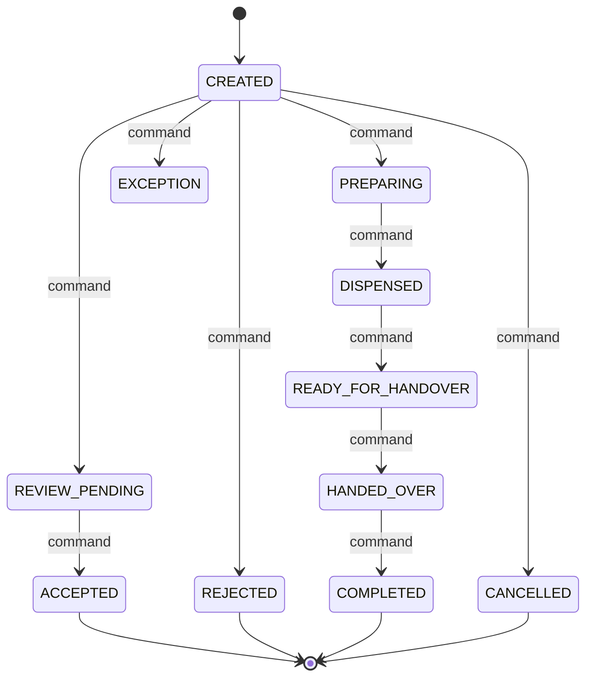

# Pharmacy order State Machine

## Document Control

| Field | Value |
|---|---|
| Document title | Pharmacy order state machine |
| Workflow ID | WFL-010 |
| Codex prompt ID | P00-07 |
| Complete Breakdown work package | P00-09 |
| Issue ID | P00-WFL-001 |
| Owning bounded context | Pharmacy Fulfilment |
| Primary owner role | Pharmacy operations |
| Escalation owner role | Pharmacy operations lead + clinical lead |
| Scope label | PILOT |
| Review state | PROPOSED |
| Required reviewers | Product, clinical, security, privacy, operations, finance where applicable, architecture |
| Last updated | 2026-06-24 |
| Related journeys | JRN-008,JRN-012,JRN-015 |
| Related exceptions | EXC-027,EXC-029,EXC-030,EXC-031 |
| Related decisions | REQ-WFL-001 through REQ-WFL-025 |
| Related open questions | OQ-00-74,OQ-00-75,OQ-00-85,OQ-00-121 |
| Related events | EVT-040,EVT-041,EVT-042,EVT-043 |

## Purpose

This workflow controls the authoritative lifecycle of PharmacyOrder in the Pharmacy Fulfilment bounded context. It does not own unrelated orthogonal facts, downstream projections, external partner state, UI-only state, payment-provider state, or browser-local state. Coverage includes: Exact prescription; selected provider; exact ServiceOrder; exact stock reservation; funding guard; pharmacist review; clarification; acceptance/rejection; preparation; dispensing; collection or delivery handoff; patient confirmation; provider replacement; prescription cancellation; refund handoff; no generic PAID state; provider details released only by separate disclosure policy.

## Aggregate or Entity Controlled

- Canonical entity: PharmacyOrder.
- Source-of-truth context: Pharmacy Fulfilment.
- One authoritative current state, state version/equivalent concurrency concept, and append-only transition history are required conceptually.

## State Dimensions

- Primary lifecycle state: one of the states in this document, initial state $initial.
- Orthogonal attributes: severity, disposition, criticality, funding source, delivery method, provider credential status, external partner status, and user-visible labels remain separate attributes unless explicitly listed as lifecycle states here.
- Derived status: dashboard/search/browser status is derived and may be stale.
- External partner status: adapter-owned and mapped into commands/callbacks; it is not the authoritative NelyoHealth lifecycle state.
- User-visible status: generated by server from authoritative state and redacted projections.
- Facts that must not be lifecycle state: payer role, clinical-access entitlement, tenant, patient, provider identity, severity, payment-provider status alone, and browser-local flags.

## State Dictionary

| State | Meaning | State category | Current owner | Escalation owner | Entry condition | Allowed maximum duration policy | Exit requirement | User-visible label | Sensitive-data considerations | Scope or approval status |
|---|---|---|---|---|---|---|---|---|---|---|
| CREATED | Conceptual lifecycle state for Pharmacy order. | NONTERMINAL | Pharmacy operations | Pharmacy operations lead + clinical lead | Explicit transition command accepted with valid version. | CONFIGURED-POLICY or NO-AUTOMATIC-TIMEOUT until approved | Authorized transition, terminal closure, or approved Reopen where allowed. | Derived safe label for the current state. | Minimum necessary data; no secrets/raw payment data; provider/location data redacted unless authorized. | PILOT; timeouts and thresholds remain approval-gated. |
| REVIEW_PENDING | Conceptual lifecycle state for Pharmacy order. | NONTERMINAL | Pharmacy operations | Pharmacy operations lead + clinical lead | Explicit transition command accepted with valid version. | CONFIGURED-POLICY or NO-AUTOMATIC-TIMEOUT until approved | Authorized transition, terminal closure, or approved Reopen where allowed. | Derived safe label for the current state. | Minimum necessary data; no secrets/raw payment data; provider/location data redacted unless authorized. | PILOT; timeouts and thresholds remain approval-gated. |
| ACCEPTED | Conceptual lifecycle state for Pharmacy order. | TERMINAL-SUCCESS | Historical owner for record retention | Pharmacy operations lead + clinical lead | Explicit transition command accepted with valid version. | Not applicable after terminal entry | Authorized transition, terminal closure, or approved Reopen where allowed. | Derived safe label for the current state. | Minimum necessary data; no secrets/raw payment data; provider/location data redacted unless authorized. | PILOT; timeouts and thresholds remain approval-gated. |
| REJECTED | Conceptual lifecycle state for Pharmacy order. | TERMINAL-FAILURE | Historical owner for record retention | Pharmacy operations lead + clinical lead | Explicit transition command accepted with valid version. | Not applicable after terminal entry | Authorized transition, terminal closure, or approved Reopen where allowed. | Derived safe label for the current state. | Minimum necessary data; no secrets/raw payment data; provider/location data redacted unless authorized. | PILOT; timeouts and thresholds remain approval-gated. |
| PREPARING | Conceptual lifecycle state for Pharmacy order. | NONTERMINAL | Pharmacy operations | Pharmacy operations lead + clinical lead | Explicit transition command accepted with valid version. | CONFIGURED-POLICY or NO-AUTOMATIC-TIMEOUT until approved | Authorized transition, terminal closure, or approved Reopen where allowed. | Derived safe label for the current state. | Minimum necessary data; no secrets/raw payment data; provider/location data redacted unless authorized. | PILOT; timeouts and thresholds remain approval-gated. |
| DISPENSED | Conceptual lifecycle state for Pharmacy order. | NONTERMINAL | Pharmacy operations | Pharmacy operations lead + clinical lead | Explicit transition command accepted with valid version. | CONFIGURED-POLICY or NO-AUTOMATIC-TIMEOUT until approved | Authorized transition, terminal closure, or approved Reopen where allowed. | Derived safe label for the current state. | Minimum necessary data; no secrets/raw payment data; provider/location data redacted unless authorized. | PILOT; timeouts and thresholds remain approval-gated. |
| READY_FOR_HANDOVER | Conceptual lifecycle state for Pharmacy order. | NONTERMINAL | Pharmacy operations | Pharmacy operations lead + clinical lead | Explicit transition command accepted with valid version. | CONFIGURED-POLICY or NO-AUTOMATIC-TIMEOUT until approved | Authorized transition, terminal closure, or approved Reopen where allowed. | Derived safe label for the current state. | Minimum necessary data; no secrets/raw payment data; provider/location data redacted unless authorized. | PILOT; timeouts and thresholds remain approval-gated. |
| HANDED_OVER | Conceptual lifecycle state for Pharmacy order. | NONTERMINAL | Pharmacy operations | Pharmacy operations lead + clinical lead | Explicit transition command accepted with valid version. | CONFIGURED-POLICY or NO-AUTOMATIC-TIMEOUT until approved | Authorized transition, terminal closure, or approved Reopen where allowed. | Derived safe label for the current state. | Minimum necessary data; no secrets/raw payment data; provider/location data redacted unless authorized. | PILOT; timeouts and thresholds remain approval-gated. |
| COMPLETED | Conceptual lifecycle state for Pharmacy order. | TERMINAL-SUCCESS | Historical owner for record retention | Pharmacy operations lead + clinical lead | Explicit transition command accepted with valid version. | Not applicable after terminal entry | Authorized transition, terminal closure, or approved Reopen where allowed. | Derived safe label for the current state. | Minimum necessary data; no secrets/raw payment data; provider/location data redacted unless authorized. | PILOT; timeouts and thresholds remain approval-gated. |
| CANCELLED | Conceptual lifecycle state for Pharmacy order. | TERMINAL-CANCELLATION | Historical owner for record retention | Pharmacy operations lead + clinical lead | Explicit transition command accepted with valid version. | Not applicable after terminal entry | Authorized transition, terminal closure, or approved Reopen where allowed. | Derived safe label for the current state. | Minimum necessary data; no secrets/raw payment data; provider/location data redacted unless authorized. | PILOT; timeouts and thresholds remain approval-gated. |
| EXCEPTION | Conceptual lifecycle state for Pharmacy order. | NONTERMINAL | Pharmacy operations | Pharmacy operations lead + clinical lead | Explicit transition command accepted with valid version. | CONFIGURED-POLICY or NO-AUTOMATIC-TIMEOUT until approved | Authorized transition, terminal closure, or approved Reopen where allowed. | Derived safe label for the current state. | Minimum necessary data; no secrets/raw payment data; provider/location data redacted unless authorized. | PILOT; timeouts and thresholds remain approval-gated. |

## Mermaid State Diagram

The diagram is conceptual and omits sensitive provider, clinical, payment, and identity details. It shows legal lifecycle movement through explicit commands; it is not an implementation enum, database enum, queue configuration, or workflow-engine design.

## Transition Table

| Transition ID | Command | From state | To state | Permitted actor or system | Required context | Guards | Atomic side effects | Events emitted | Notifications | Audit event | Timeout or expiry behavior | Retry behavior | Idempotency behavior | Compensation or reversal | Operations intervention | Failure destination | Approval status |
|---|---|---|---|---|---|---|---|---|---|---|---|---|---|---|---|---|---|
| WFL-010-T001 | AdvanceToReviewPending | CREATED | REVIEW_PENDING | Authorized actor/system for Pharmacy Fulfilment only | Matching tenant, patient/order/entity reference, assignment, purpose, consent/delegation where required, credential where required | Current state matches From state; current version; actor authorization; tenant isolation; patient/order/entity match; required evidence; no stale projection | Set current state to To state; increment version; append transition history; record audit/outbox intent atomically when sensitive | EVT-040,EVT-041,EVT-042,EVT-043 where externally meaningful; transition history otherwise | Minimum-necessary notification only; none if unsafe or not required | AuditEvent or audit intent with actor, reason, state/version | CONFIGURED-POLICY / approval-gated; no numeric timeout invented | Retry through same command only; external callbacks accepted through authenticated adapter later | Idempotency scope: workflow instance + command + actor/callback reference; duplicate returns prior result or explicit conflict | Compensate by explicit command; never delete history or finalized records | Route unresolved conflict to Pharmacy operations queue; no direct DB edit | Exception/reconciliation/manual-review state where represented, otherwise no-op denial | PROPOSED |
| WFL-010-T002 | AdvanceToAccepted | REVIEW_PENDING | ACCEPTED | Authorized actor/system for Pharmacy Fulfilment only | Matching tenant, patient/order/entity reference, assignment, purpose, consent/delegation where required, credential where required | Current state matches From state; current version; actor authorization; tenant isolation; patient/order/entity match; required evidence; no stale projection | Set current state to To state; increment version; append transition history; record audit/outbox intent atomically when sensitive | EVT-040,EVT-041,EVT-042,EVT-043 where externally meaningful; transition history otherwise | Minimum-necessary notification only; none if unsafe or not required | AuditEvent or audit intent with actor, reason, state/version | CONFIGURED-POLICY / approval-gated; no numeric timeout invented | Retry through same command only; external callbacks accepted through authenticated adapter later | Idempotency scope: workflow instance + command + actor/callback reference; duplicate returns prior result or explicit conflict | Compensate by explicit command; never delete history or finalized records | Route unresolved conflict to Pharmacy operations queue; no direct DB edit | Exception/reconciliation/manual-review state where represented, otherwise no-op denial | PROPOSED |
| WFL-010-T003 | AdvanceToRejected | CREATED | REJECTED | Authorized actor/system for Pharmacy Fulfilment only | Matching tenant, patient/order/entity reference, assignment, purpose, consent/delegation where required, credential where required | Current state matches From state; current version; actor authorization; tenant isolation; patient/order/entity match; required evidence; no stale projection | Set current state to To state; increment version; append transition history; record audit/outbox intent atomically when sensitive | EVT-040,EVT-041,EVT-042,EVT-043 where externally meaningful; transition history otherwise | Minimum-necessary notification only; none if unsafe or not required | AuditEvent or audit intent with actor, reason, state/version | CONFIGURED-POLICY / approval-gated; no numeric timeout invented | Retry through same command only; external callbacks accepted through authenticated adapter later | Idempotency scope: workflow instance + command + actor/callback reference; duplicate returns prior result or explicit conflict | Compensate by explicit command; never delete history or finalized records | Route unresolved conflict to Pharmacy operations queue; no direct DB edit | Exception/reconciliation/manual-review state where represented, otherwise no-op denial | PROPOSED |
| WFL-010-T004 | AdvanceToPreparing | CREATED | PREPARING | Authorized actor/system for Pharmacy Fulfilment only | Matching tenant, patient/order/entity reference, assignment, purpose, consent/delegation where required, credential where required | Current state matches From state; current version; actor authorization; tenant isolation; patient/order/entity match; required evidence; no stale projection | Set current state to To state; increment version; append transition history; record audit/outbox intent atomically when sensitive | EVT-040,EVT-041,EVT-042,EVT-043 where externally meaningful; transition history otherwise | Minimum-necessary notification only; none if unsafe or not required | AuditEvent or audit intent with actor, reason, state/version | CONFIGURED-POLICY / approval-gated; no numeric timeout invented | Retry through same command only; external callbacks accepted through authenticated adapter later | Idempotency scope: workflow instance + command + actor/callback reference; duplicate returns prior result or explicit conflict | Compensate by explicit command; never delete history or finalized records | Route unresolved conflict to Pharmacy operations queue; no direct DB edit | Exception/reconciliation/manual-review state where represented, otherwise no-op denial | PROPOSED |
| WFL-010-T005 | AdvanceToDispensed | PREPARING | DISPENSED | Authorized actor/system for Pharmacy Fulfilment only | Matching tenant, patient/order/entity reference, assignment, purpose, consent/delegation where required, credential where required | Current state matches From state; current version; actor authorization; tenant isolation; patient/order/entity match; required evidence; no stale projection | Set current state to To state; increment version; append transition history; record audit/outbox intent atomically when sensitive | EVT-040,EVT-041,EVT-042,EVT-043 where externally meaningful; transition history otherwise | Minimum-necessary notification only; none if unsafe or not required | AuditEvent or audit intent with actor, reason, state/version | CONFIGURED-POLICY / approval-gated; no numeric timeout invented | Retry through same command only; external callbacks accepted through authenticated adapter later | Idempotency scope: workflow instance + command + actor/callback reference; duplicate returns prior result or explicit conflict | Compensate by explicit command; never delete history or finalized records | Route unresolved conflict to Pharmacy operations queue; no direct DB edit | Exception/reconciliation/manual-review state where represented, otherwise no-op denial | PROPOSED |
| WFL-010-T006 | AdvanceToReadyForHandover | DISPENSED | READY_FOR_HANDOVER | Authorized actor/system for Pharmacy Fulfilment only | Matching tenant, patient/order/entity reference, assignment, purpose, consent/delegation where required, credential where required | Current state matches From state; current version; actor authorization; tenant isolation; patient/order/entity match; required evidence; no stale projection | Set current state to To state; increment version; append transition history; record audit/outbox intent atomically when sensitive | EVT-040,EVT-041,EVT-042,EVT-043 where externally meaningful; transition history otherwise | Minimum-necessary notification only; none if unsafe or not required | AuditEvent or audit intent with actor, reason, state/version | CONFIGURED-POLICY / approval-gated; no numeric timeout invented | Retry through same command only; external callbacks accepted through authenticated adapter later | Idempotency scope: workflow instance + command + actor/callback reference; duplicate returns prior result or explicit conflict | Compensate by explicit command; never delete history or finalized records | Route unresolved conflict to Pharmacy operations queue; no direct DB edit | Exception/reconciliation/manual-review state where represented, otherwise no-op denial | PROPOSED |
| WFL-010-T007 | AdvanceToHandedOver | READY_FOR_HANDOVER | HANDED_OVER | Authorized actor/system for Pharmacy Fulfilment only | Matching tenant, patient/order/entity reference, assignment, purpose, consent/delegation where required, credential where required | Current state matches From state; current version; actor authorization; tenant isolation; patient/order/entity match; required evidence; no stale projection | Set current state to To state; increment version; append transition history; record audit/outbox intent atomically when sensitive | EVT-040,EVT-041,EVT-042,EVT-043 where externally meaningful; transition history otherwise | Minimum-necessary notification only; none if unsafe or not required | AuditEvent or audit intent with actor, reason, state/version | CONFIGURED-POLICY / approval-gated; no numeric timeout invented | Retry through same command only; external callbacks accepted through authenticated adapter later | Idempotency scope: workflow instance + command + actor/callback reference; duplicate returns prior result or explicit conflict | Compensate by explicit command; never delete history or finalized records | Route unresolved conflict to Pharmacy operations queue; no direct DB edit | Exception/reconciliation/manual-review state where represented, otherwise no-op denial | PROPOSED |
| WFL-010-T008 | AdvanceToCompleted | HANDED_OVER | COMPLETED | Authorized actor/system for Pharmacy Fulfilment only | Matching tenant, patient/order/entity reference, assignment, purpose, consent/delegation where required, credential where required | Current state matches From state; current version; actor authorization; tenant isolation; patient/order/entity match; required evidence; no stale projection | Set current state to To state; increment version; append transition history; record audit/outbox intent atomically when sensitive | EVT-040,EVT-041,EVT-042,EVT-043 where externally meaningful; transition history otherwise | Minimum-necessary notification only; none if unsafe or not required | AuditEvent or audit intent with actor, reason, state/version | CONFIGURED-POLICY / approval-gated; no numeric timeout invented | Retry through same command only; external callbacks accepted through authenticated adapter later | Idempotency scope: workflow instance + command + actor/callback reference; duplicate returns prior result or explicit conflict | Compensate by explicit command; never delete history or finalized records | Route unresolved conflict to Pharmacy operations queue; no direct DB edit | Exception/reconciliation/manual-review state where represented, otherwise no-op denial | PROPOSED |
| WFL-010-T009 | AdvanceToCancelled | CREATED | CANCELLED | Authorized actor/system for Pharmacy Fulfilment only | Matching tenant, patient/order/entity reference, assignment, purpose, consent/delegation where required, credential where required | Current state matches From state; current version; actor authorization; tenant isolation; patient/order/entity match; required evidence; no stale projection | Set current state to To state; increment version; append transition history; record audit/outbox intent atomically when sensitive | EVT-040,EVT-041,EVT-042,EVT-043 where externally meaningful; transition history otherwise | Minimum-necessary notification only; none if unsafe or not required | AuditEvent or audit intent with actor, reason, state/version | CONFIGURED-POLICY / approval-gated; no numeric timeout invented | Retry through same command only; external callbacks accepted through authenticated adapter later | Idempotency scope: workflow instance + command + actor/callback reference; duplicate returns prior result or explicit conflict | Compensate by explicit command; never delete history or finalized records | Route unresolved conflict to Pharmacy operations queue; no direct DB edit | Exception/reconciliation/manual-review state where represented, otherwise no-op denial | PROPOSED |
| WFL-010-T010 | AdvanceToException | CREATED | EXCEPTION | Authorized actor/system for Pharmacy Fulfilment only | Matching tenant, patient/order/entity reference, assignment, purpose, consent/delegation where required, credential where required | Current state matches From state; current version; actor authorization; tenant isolation; patient/order/entity match; required evidence; no stale projection | Set current state to To state; increment version; append transition history; record audit/outbox intent atomically when sensitive | EVT-040,EVT-041,EVT-042,EVT-043 where externally meaningful; transition history otherwise | Minimum-necessary notification only; none if unsafe or not required | AuditEvent or audit intent with actor, reason, state/version | CONFIGURED-POLICY / approval-gated; no numeric timeout invented | Retry through same command only; external callbacks accepted through authenticated adapter later | Idempotency scope: workflow instance + command + actor/callback reference; duplicate returns prior result or explicit conflict | Compensate by explicit command; never delete history or finalized records | Route unresolved conflict to Pharmacy operations queue; no direct DB edit | Exception/reconciliation/manual-review state where represented, otherwise no-op denial | PROPOSED |

## Illegal Transition Table

| From state | Attempted command | Why illegal | Expected error category | Audit requirement | Security or privacy relevance | Future negative test |
|---|---|---|---|---|---|---|
| Any terminal state | AdvanceToAnyNonterminal without approved Reopen | Terminal workflows cannot silently return to nonterminal state. | STATE_CONFLICT | Audit denied attempt. | Prevents history rewriting. | Terminal-reopen-denied test. |
| Any state | DirectSetState | Direct state mutation bypasses commands, guards, audit, and versioning. | FORBIDDEN_OPERATION | Audit security event. | Prevents operations/database bypass. | Direct-state-edit denied test. |
| Any state | Command for wrong tenant/patient/order/entity | Command scope does not match authoritative instance. | AUTHORIZATION_DENIED | Audit denied access. | Tenant/patient/order isolation. | Wrong-tenant and wrong-patient tests. |
| Any state | StaleVersionCommand | Command version is stale or races with another transition. | STALE_VERSION | Audit conflict. | Prevents lost update. | Stale-version test. |
| Any state | ClientDerivedStatusTransition | Browser, URL, hidden DOM, cache, or local success screen is not authoritative. | INVALID_SOURCE | Audit suspicious attempt where applicable. | Prevents client-side state spoofing. | Browser refresh/back-navigation test. |

## Timeout and Expiry Policy

| State | Timeout-policy owner | Configuration status | Reminder behavior | Escalation behavior | Automatic transition, if any | Human-review requirement | Open-question reference |
|---|---|---|---|---|---|---|---|
| CREATED | Pharmacy operations lead + clinical lead | CONFIGURED-POLICY or NO-AUTOMATIC-TIMEOUT; no numeric value approved in P00-07 | Minimum necessary reminder only if approved | Escalate to Pharmacy operations lead + clinical lead by approved policy | None unless explicitly approved later | Owner review required; unresolved work remains queued | OQ-00-74,OQ-00-75,OQ-00-85,OQ-00-121 |
| REVIEW_PENDING | Pharmacy operations lead + clinical lead | CONFIGURED-POLICY or NO-AUTOMATIC-TIMEOUT; no numeric value approved in P00-07 | Minimum necessary reminder only if approved | Escalate to Pharmacy operations lead + clinical lead by approved policy | None unless explicitly approved later | Owner review required; unresolved work remains queued | OQ-00-74,OQ-00-75,OQ-00-85,OQ-00-121 |
| PREPARING | Pharmacy operations lead + clinical lead | CONFIGURED-POLICY or NO-AUTOMATIC-TIMEOUT; no numeric value approved in P00-07 | Minimum necessary reminder only if approved | Escalate to Pharmacy operations lead + clinical lead by approved policy | None unless explicitly approved later | Owner review required; unresolved work remains queued | OQ-00-74,OQ-00-75,OQ-00-85,OQ-00-121 |
| DISPENSED | Pharmacy operations lead + clinical lead | CONFIGURED-POLICY or NO-AUTOMATIC-TIMEOUT; no numeric value approved in P00-07 | Minimum necessary reminder only if approved | Escalate to Pharmacy operations lead + clinical lead by approved policy | None unless explicitly approved later | Owner review required; unresolved work remains queued | OQ-00-74,OQ-00-75,OQ-00-85,OQ-00-121 |
| READY_FOR_HANDOVER | Pharmacy operations lead + clinical lead | CONFIGURED-POLICY or NO-AUTOMATIC-TIMEOUT; no numeric value approved in P00-07 | Minimum necessary reminder only if approved | Escalate to Pharmacy operations lead + clinical lead by approved policy | None unless explicitly approved later | Owner review required; unresolved work remains queued | OQ-00-74,OQ-00-75,OQ-00-85,OQ-00-121 |
| HANDED_OVER | Pharmacy operations lead + clinical lead | CONFIGURED-POLICY or NO-AUTOMATIC-TIMEOUT; no numeric value approved in P00-07 | Minimum necessary reminder only if approved | Escalate to Pharmacy operations lead + clinical lead by approved policy | None unless explicitly approved later | Owner review required; unresolved work remains queued | OQ-00-74,OQ-00-75,OQ-00-85,OQ-00-121 |
| EXCEPTION | Pharmacy operations lead + clinical lead | CONFIGURED-POLICY or NO-AUTOMATIC-TIMEOUT; no numeric value approved in P00-07 | Minimum necessary reminder only if approved | Escalate to Pharmacy operations lead + clinical lead by approved policy | None unless explicitly approved later | Owner review required; unresolved work remains queued | OQ-00-74,OQ-00-75,OQ-00-85,OQ-00-121 |

## Retry and Idempotency Policy

| Command or callback | Retry source | Idempotency scope | Duplicate response | Out-of-order handling | Maximum retry policy owner | Dead-letter or operations path, conceptually |
|---|---|---|---|---|---|---|
| Transition command | User/system retry | WFL-010 instance + command + actor + version | Return prior result or explicit conflict | Reject if state cannot accept command | Pharmacy operations lead + clinical lead | Pharmacy operations review queue |
| External callback | Partner adapter | External callback reference + WFL-010 instance | Process once; subsequent duplicates acknowledged | Do not regress state; route contradiction to reconciliation | Pharmacy operations lead + clinical lead | Adapter exception queue |
| Reopen command | Authorized reviewer | Terminal instance + reason + actor | Duplicate returns reopened instance or conflict | Reject if superseded by newer instance | Pharmacy operations lead + clinical lead | Governance review |

## Compensation and Recovery

| Failure | Compensation command | Responsible actor | Resulting workflow state | Related workflow effect | Audit requirement | Patient or provider communication | Reconciliation requirement |
|---|---|---|---|---|---|---|---|
| Guard fails after dependent workflow started | RequestCompensation | Pharmacy operations | Exception/reconciliation state where available | Related workflow receives explicit cancel/release/reassign/refund command | Required | Minimum necessary | Required if financial, inventory, clinical, or disclosure contradiction exists |
| External partner callback contradicts authoritative state | OpenReconciliation | Pharmacy operations lead + clinical lead | Reconciliation or exception state | No state regression; downstream projections corrected after review | Required | As approved | Required |
| Terminal state entered incorrectly | ReopenWithReason or CreateReplacement | Authorized reviewer | Documented destination or linked replacement | History preserved; no deletion | Required | As approved | Required for affected workflows |

## Manual Operations Path

| Queue | Entry trigger | Required evidence | Permitted commands | Prohibited actions | Escalation owner | Closure condition |
|---|---|---|---|---|---|---|
| Pharmacy operations queue | Timeout, contradiction, failed guard, failed callback, user/provider support case, or safety concern | Entity reference, actor, tenant, state/version, reason, evidence, affected patient/order where applicable | Approved workflow commands only, including review, reject, approve, cancel, compensate, reopen, or escalate as applicable | Direct production database editing, silent state rewrites, deleting history, bypassing authorization/audit | Pharmacy operations lead + clinical lead | State reaches terminal or approved review/reconciliation closure with audit |

## Cross-Workflow Dependencies

- Related workflows are listed in the state-machine index and cross-workflow invariants. Pharmacy order consumes or produces states through explicit commands/events only.
- Payment status is never the owner of clinical, pharmacy, laboratory, or disclosure state.
- Consent and authorization are evaluated per transition where sensitive data or delegated action is involved.
- Provider-detail disclosure eligibility remains a separate exact-order, selected-provider, actor, patient, tenant, server-authorized decision.

## Invariants

- One authoritative current state exists for each PharmacyOrder workflow instance.
- State changes use explicit commands, version checks, guards, append-only history, and audit/outbox intent where required.
- Operations cannot edit workflow state directly.
- Terminal history remains visible and attributable; compensation never deletes history.
- Tenant, patient, actor, and order isolation are enforced in transition guards.

## Future Test Requirements

- Every legal transition.
- Every illegal transition.
- Unauthorized transition.
- Wrong-tenant transition.
- Wrong-patient transition.
- Stale-version transition.
- Duplicate command.
- Out-of-order callback.
- Timeout or NO-AUTOMATIC-TIMEOUT review.
- Retry behavior.
- Compensation.
- Operations recovery.
- Audit creation.
- Notification minimization.
- Browser refresh or back-navigation where user-facing.
- Synthetic-data-only rule.

## P00-10 Policy Alignment

- Aligns with `docs/operations/pharmacy-fulfilment-policy.md` and `docs/clinical/prescription-policy.md`.
- Guard: pharmacist acceptance precedes dispensing and may route to clarification, rejection, cancellation, refund handoff, or provider replacement.
- Guard: dispensing records exact order, exact prescription, exact quantity, substitution or partial fulfilment where approved, handover mode, timestamp, and audit.
- Guard: provider-detail disclosure remains exact-order, selected-provider, actor, patient, tenant, and server-decision bound; provider replacement requires a fresh disclosure decision.
- Guard: partial fulfilment and substitution remain approval-gated and cannot silently alter the prescription.
- Future tests: pharmacist rejection, provider suspension, provider replacement, dispensing, partial fulfilment, duplicate dispensing, payment failure, refund handoff.

## P00-13 Finance Alignment

- Aligns with `docs/finance/funds-flow.md`, `docs/finance/payment-state-model.md`, `docs/finance/ledger-principles.md`, `docs/finance/refund-and-dispute-policy.md`, `docs/finance/provider-settlement-policy.md`, and `docs/finance/claims-and-remittance-boundary.md`.
- `OrderFundingSecured` is a PROPOSED finance fact only; it requires exact order, selected provider where applicable, patient, tenant, funding allocations, verified capture or confirmed receipt or approved equivalent, balanced ledger posting, correlation, idempotency, and audit.
- Authorization-only, pending, failed, cancelled, expired, unverified, wrong-order, wrong-actor, wrong-patient, wrong-tenant, expired reservation, ledger failure, unbalanced ledger, reconciliation exception, refund, reversal, chargeback, browser success, and unverified callback states do not create initial provider-detail eligibility.
- Payment, funding, ledger, claim, remittance, provider payable, and payout facts never grant clinical-record access and never directly return protected provider details.
- Emergency escalation remains independent of payment, marketplace, provider-detail obscuration, coverage, plan authorization, and registration state.
