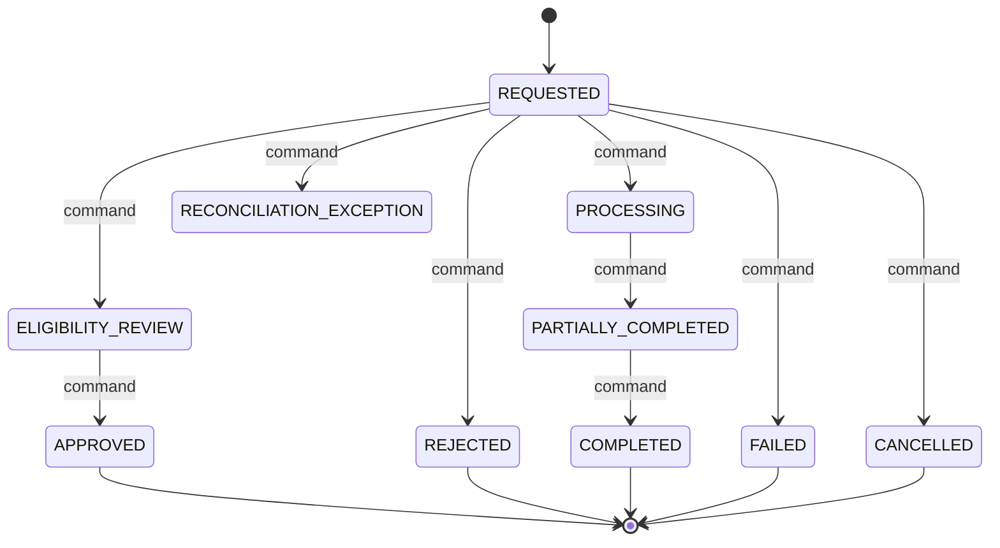

# Refund State Machine

## Document Control

| Field | Value |
|---|---|
| Document title | Refund state machine |
| Workflow ID | WFL-019 |
| Codex prompt ID | P00-07 |
| Complete Breakdown work package | P00-09 |
| Issue ID | P00-WFL-001 |
| Owning bounded context | Payments and Ledger |
| Primary owner role | Finance operations |
| Escalation owner role | Finance owner + legal counsel |
| Scope label | PILOT |
| Review state | PROPOSED |
| Required reviewers | Product, clinical, security, privacy, operations, finance where applicable, architecture |
| Last updated | 2026-06-24 |
| Related journeys | JRN-015 |
| Related exceptions | EXC-021,EXC-022 |
| Related decisions | REQ-WFL-001 through REQ-WFL-025 |
| Related open questions | OQ-00-02,OQ-00-03,OQ-00-04,OQ-00-67,OQ-00-130 |
| Related events | EVT-069,EVT-070,EVT-071 |

## Purpose

This workflow controls the authoritative lifecycle of Refund in the Payments and Ledger bounded context. It does not own unrelated orthogonal facts, downstream projections, external partner state, UI-only state, payment-provider state, or browser-local state. Coverage includes: Original-source refund; split-funded refund; patient/family/sponsor/employer/HMO source; partial refund; duplicate request; source unavailable; provider cancellation; failed fulfilment; refund failure; reconciliation; notification; provider-detail access behavior unresolved.

## Aggregate or Entity Controlled

- Canonical entity: Refund.
- Source-of-truth context: Payments and Ledger.
- One authoritative current state, state version/equivalent concurrency concept, and append-only transition history are required conceptually.

## State Dimensions

- Primary lifecycle state: one of the states in this document, initial state $initial.
- Orthogonal attributes: severity, disposition, criticality, funding source, delivery method, provider credential status, external partner status, and user-visible labels remain separate attributes unless explicitly listed as lifecycle states here.
- Derived status: dashboard/search/browser status is derived and may be stale.
- External partner status: adapter-owned and mapped into commands/callbacks; it is not the authoritative NelyoHealth lifecycle state.
- User-visible status: generated by server from authoritative state and redacted projections.
- Facts that must not be lifecycle state: payer role, clinical-access entitlement, tenant, patient, provider identity, severity, payment-provider status alone, and browser-local flags.

## State Dictionary

| State | Meaning | State category | Current owner | Escalation owner | Entry condition | Allowed maximum duration policy | Exit requirement | User-visible label | Sensitive-data considerations | Scope or approval status |
|---|---|---|---|---|---|---|---|---|---|---|
| REQUESTED | Conceptual lifecycle state for Refund. | NONTERMINAL | Finance operations | Finance owner + legal counsel | Explicit transition command accepted with valid version. | CONFIGURED-POLICY or NO-AUTOMATIC-TIMEOUT until approved | Authorized transition, terminal closure, or approved Reopen where allowed. | Derived safe label for the current state. | Minimum necessary data; no secrets/raw payment data; provider/location data redacted unless authorized. | PILOT; timeouts and thresholds remain approval-gated. |
| ELIGIBILITY_REVIEW | Conceptual lifecycle state for Refund. | NONTERMINAL | Finance operations | Finance owner + legal counsel | Explicit transition command accepted with valid version. | CONFIGURED-POLICY or NO-AUTOMATIC-TIMEOUT until approved | Authorized transition, terminal closure, or approved Reopen where allowed. | Derived safe label for the current state. | Minimum necessary data; no secrets/raw payment data; provider/location data redacted unless authorized. | PILOT; timeouts and thresholds remain approval-gated. |
| APPROVED | Conceptual lifecycle state for Refund. | TERMINAL-SUCCESS | Historical owner for record retention | Finance owner + legal counsel | Explicit transition command accepted with valid version. | Not applicable after terminal entry | Authorized transition, terminal closure, or approved Reopen where allowed. | Derived safe label for the current state. | Minimum necessary data; no secrets/raw payment data; provider/location data redacted unless authorized. | PILOT; timeouts and thresholds remain approval-gated. |
| REJECTED | Conceptual lifecycle state for Refund. | TERMINAL-FAILURE | Historical owner for record retention | Finance owner + legal counsel | Explicit transition command accepted with valid version. | Not applicable after terminal entry | Authorized transition, terminal closure, or approved Reopen where allowed. | Derived safe label for the current state. | Minimum necessary data; no secrets/raw payment data; provider/location data redacted unless authorized. | PILOT; timeouts and thresholds remain approval-gated. |
| PROCESSING | Conceptual lifecycle state for Refund. | NONTERMINAL | Finance operations | Finance owner + legal counsel | Explicit transition command accepted with valid version. | CONFIGURED-POLICY or NO-AUTOMATIC-TIMEOUT until approved | Authorized transition, terminal closure, or approved Reopen where allowed. | Derived safe label for the current state. | Minimum necessary data; no secrets/raw payment data; provider/location data redacted unless authorized. | PILOT; timeouts and thresholds remain approval-gated. |
| PARTIALLY_COMPLETED | Conceptual lifecycle state for Refund. | NONTERMINAL | Finance operations | Finance owner + legal counsel | Explicit transition command accepted with valid version. | CONFIGURED-POLICY or NO-AUTOMATIC-TIMEOUT until approved | Authorized transition, terminal closure, or approved Reopen where allowed. | Derived safe label for the current state. | Minimum necessary data; no secrets/raw payment data; provider/location data redacted unless authorized. | PILOT; timeouts and thresholds remain approval-gated. |
| COMPLETED | Conceptual lifecycle state for Refund. | TERMINAL-SUCCESS | Historical owner for record retention | Finance owner + legal counsel | Explicit transition command accepted with valid version. | Not applicable after terminal entry | Authorized transition, terminal closure, or approved Reopen where allowed. | Derived safe label for the current state. | Minimum necessary data; no secrets/raw payment data; provider/location data redacted unless authorized. | PILOT; timeouts and thresholds remain approval-gated. |
| FAILED | Conceptual lifecycle state for Refund. | TERMINAL-FAILURE | Historical owner for record retention | Finance owner + legal counsel | Explicit transition command accepted with valid version. | Not applicable after terminal entry | Authorized transition, terminal closure, or approved Reopen where allowed. | Derived safe label for the current state. | Minimum necessary data; no secrets/raw payment data; provider/location data redacted unless authorized. | PILOT; timeouts and thresholds remain approval-gated. |
| CANCELLED | Conceptual lifecycle state for Refund. | TERMINAL-CANCELLATION | Historical owner for record retention | Finance owner + legal counsel | Explicit transition command accepted with valid version. | Not applicable after terminal entry | Authorized transition, terminal closure, or approved Reopen where allowed. | Derived safe label for the current state. | Minimum necessary data; no secrets/raw payment data; provider/location data redacted unless authorized. | PILOT; timeouts and thresholds remain approval-gated. |
| RECONCILIATION_EXCEPTION | Conceptual lifecycle state for Refund. | NONTERMINAL | Finance operations | Finance owner + legal counsel | Explicit transition command accepted with valid version. | CONFIGURED-POLICY or NO-AUTOMATIC-TIMEOUT until approved | Authorized transition, terminal closure, or approved Reopen where allowed. | Derived safe label for the current state. | Minimum necessary data; no secrets/raw payment data; provider/location data redacted unless authorized. | PILOT; timeouts and thresholds remain approval-gated. |

## Mermaid State Diagram

The diagram is conceptual and omits sensitive provider, clinical, payment, and identity details. It shows legal lifecycle movement through explicit commands; it is not an implementation enum, database enum, queue configuration, or workflow-engine design.

## Transition Table

| Transition ID | Command | From state | To state | Permitted actor or system | Required context | Guards | Atomic side effects | Events emitted | Notifications | Audit event | Timeout or expiry behavior | Retry behavior | Idempotency behavior | Compensation or reversal | Operations intervention | Failure destination | Approval status |
|---|---|---|---|---|---|---|---|---|---|---|---|---|---|---|---|---|---|
| WFL-019-T001 | AdvanceToEligibilityReview | REQUESTED | ELIGIBILITY_REVIEW | Authorized actor/system for Payments and Ledger only | Matching tenant, patient/order/entity reference, assignment, purpose, consent/delegation where required, credential where required | Current state matches From state; current version; actor authorization; tenant isolation; patient/order/entity match; required evidence; no stale projection | Set current state to To state; increment version; append transition history; record audit/outbox intent atomically when sensitive | EVT-069,EVT-070,EVT-071 where externally meaningful; transition history otherwise | Minimum-necessary notification only; none if unsafe or not required | AuditEvent or audit intent with actor, reason, state/version | CONFIGURED-POLICY / approval-gated; no numeric timeout invented | Retry through same command only; external callbacks accepted through authenticated adapter later | Idempotency scope: workflow instance + command + actor/callback reference; duplicate returns prior result or explicit conflict | Compensate by explicit command; never delete history or finalized records | Route unresolved conflict to Finance operations queue; no direct DB edit | Exception/reconciliation/manual-review state where represented, otherwise no-op denial | PROPOSED; finance/legal approval still required where applicable |
| WFL-019-T002 | AdvanceToApproved | ELIGIBILITY_REVIEW | APPROVED | Authorized actor/system for Payments and Ledger only | Matching tenant, patient/order/entity reference, assignment, purpose, consent/delegation where required, credential where required | Current state matches From state; current version; actor authorization; tenant isolation; patient/order/entity match; required evidence; no stale projection | Set current state to To state; increment version; append transition history; record audit/outbox intent atomically when sensitive | EVT-069,EVT-070,EVT-071 where externally meaningful; transition history otherwise | Minimum-necessary notification only; none if unsafe or not required | AuditEvent or audit intent with actor, reason, state/version | CONFIGURED-POLICY / approval-gated; no numeric timeout invented | Retry through same command only; external callbacks accepted through authenticated adapter later | Idempotency scope: workflow instance + command + actor/callback reference; duplicate returns prior result or explicit conflict | Compensate by explicit command; never delete history or finalized records | Route unresolved conflict to Finance operations queue; no direct DB edit | Exception/reconciliation/manual-review state where represented, otherwise no-op denial | PROPOSED; finance/legal approval still required where applicable |
| WFL-019-T003 | AdvanceToRejected | REQUESTED | REJECTED | Authorized actor/system for Payments and Ledger only | Matching tenant, patient/order/entity reference, assignment, purpose, consent/delegation where required, credential where required | Current state matches From state; current version; actor authorization; tenant isolation; patient/order/entity match; required evidence; no stale projection | Set current state to To state; increment version; append transition history; record audit/outbox intent atomically when sensitive | EVT-069,EVT-070,EVT-071 where externally meaningful; transition history otherwise | Minimum-necessary notification only; none if unsafe or not required | AuditEvent or audit intent with actor, reason, state/version | CONFIGURED-POLICY / approval-gated; no numeric timeout invented | Retry through same command only; external callbacks accepted through authenticated adapter later | Idempotency scope: workflow instance + command + actor/callback reference; duplicate returns prior result or explicit conflict | Compensate by explicit command; never delete history or finalized records | Route unresolved conflict to Finance operations queue; no direct DB edit | Exception/reconciliation/manual-review state where represented, otherwise no-op denial | PROPOSED; finance/legal approval still required where applicable |
| WFL-019-T004 | AdvanceToProcessing | REQUESTED | PROCESSING | Authorized actor/system for Payments and Ledger only | Matching tenant, patient/order/entity reference, assignment, purpose, consent/delegation where required, credential where required | Current state matches From state; current version; actor authorization; tenant isolation; patient/order/entity match; required evidence; no stale projection | Set current state to To state; increment version; append transition history; record audit/outbox intent atomically when sensitive | EVT-069,EVT-070,EVT-071 where externally meaningful; transition history otherwise | Minimum-necessary notification only; none if unsafe or not required | AuditEvent or audit intent with actor, reason, state/version | CONFIGURED-POLICY / approval-gated; no numeric timeout invented | Retry through same command only; external callbacks accepted through authenticated adapter later | Idempotency scope: workflow instance + command + actor/callback reference; duplicate returns prior result or explicit conflict | Compensate by explicit command; never delete history or finalized records | Route unresolved conflict to Finance operations queue; no direct DB edit | Exception/reconciliation/manual-review state where represented, otherwise no-op denial | PROPOSED; finance/legal approval still required where applicable |
| WFL-019-T005 | AdvanceToPartiallyCompleted | PROCESSING | PARTIALLY_COMPLETED | Authorized actor/system for Payments and Ledger only | Matching tenant, patient/order/entity reference, assignment, purpose, consent/delegation where required, credential where required | Current state matches From state; current version; actor authorization; tenant isolation; patient/order/entity match; required evidence; no stale projection | Set current state to To state; increment version; append transition history; record audit/outbox intent atomically when sensitive | EVT-069,EVT-070,EVT-071 where externally meaningful; transition history otherwise | Minimum-necessary notification only; none if unsafe or not required | AuditEvent or audit intent with actor, reason, state/version | CONFIGURED-POLICY / approval-gated; no numeric timeout invented | Retry through same command only; external callbacks accepted through authenticated adapter later | Idempotency scope: workflow instance + command + actor/callback reference; duplicate returns prior result or explicit conflict | Compensate by explicit command; never delete history or finalized records | Route unresolved conflict to Finance operations queue; no direct DB edit | Exception/reconciliation/manual-review state where represented, otherwise no-op denial | PROPOSED; finance/legal approval still required where applicable |
| WFL-019-T006 | AdvanceToCompleted | PARTIALLY_COMPLETED | COMPLETED | Authorized actor/system for Payments and Ledger only | Matching tenant, patient/order/entity reference, assignment, purpose, consent/delegation where required, credential where required | Current state matches From state; current version; actor authorization; tenant isolation; patient/order/entity match; required evidence; no stale projection | Set current state to To state; increment version; append transition history; record audit/outbox intent atomically when sensitive | EVT-069,EVT-070,EVT-071 where externally meaningful; transition history otherwise | Minimum-necessary notification only; none if unsafe or not required | AuditEvent or audit intent with actor, reason, state/version | CONFIGURED-POLICY / approval-gated; no numeric timeout invented | Retry through same command only; external callbacks accepted through authenticated adapter later | Idempotency scope: workflow instance + command + actor/callback reference; duplicate returns prior result or explicit conflict | Compensate by explicit command; never delete history or finalized records | Route unresolved conflict to Finance operations queue; no direct DB edit | Exception/reconciliation/manual-review state where represented, otherwise no-op denial | PROPOSED; finance/legal approval still required where applicable |
| WFL-019-T007 | AdvanceToFailed | REQUESTED | FAILED | Authorized actor/system for Payments and Ledger only | Matching tenant, patient/order/entity reference, assignment, purpose, consent/delegation where required, credential where required | Current state matches From state; current version; actor authorization; tenant isolation; patient/order/entity match; required evidence; no stale projection | Set current state to To state; increment version; append transition history; record audit/outbox intent atomically when sensitive | EVT-069,EVT-070,EVT-071 where externally meaningful; transition history otherwise | Minimum-necessary notification only; none if unsafe or not required | AuditEvent or audit intent with actor, reason, state/version | CONFIGURED-POLICY / approval-gated; no numeric timeout invented | Retry through same command only; external callbacks accepted through authenticated adapter later | Idempotency scope: workflow instance + command + actor/callback reference; duplicate returns prior result or explicit conflict | Compensate by explicit command; never delete history or finalized records | Route unresolved conflict to Finance operations queue; no direct DB edit | Exception/reconciliation/manual-review state where represented, otherwise no-op denial | PROPOSED; finance/legal approval still required where applicable |
| WFL-019-T008 | AdvanceToCancelled | REQUESTED | CANCELLED | Authorized actor/system for Payments and Ledger only | Matching tenant, patient/order/entity reference, assignment, purpose, consent/delegation where required, credential where required | Current state matches From state; current version; actor authorization; tenant isolation; patient/order/entity match; required evidence; no stale projection | Set current state to To state; increment version; append transition history; record audit/outbox intent atomically when sensitive | EVT-069,EVT-070,EVT-071 where externally meaningful; transition history otherwise | Minimum-necessary notification only; none if unsafe or not required | AuditEvent or audit intent with actor, reason, state/version | CONFIGURED-POLICY / approval-gated; no numeric timeout invented | Retry through same command only; external callbacks accepted through authenticated adapter later | Idempotency scope: workflow instance + command + actor/callback reference; duplicate returns prior result or explicit conflict | Compensate by explicit command; never delete history or finalized records | Route unresolved conflict to Finance operations queue; no direct DB edit | Exception/reconciliation/manual-review state where represented, otherwise no-op denial | PROPOSED; finance/legal approval still required where applicable |
| WFL-019-T009 | AdvanceToReconciliationException | REQUESTED | RECONCILIATION_EXCEPTION | Authorized actor/system for Payments and Ledger only | Matching tenant, patient/order/entity reference, assignment, purpose, consent/delegation where required, credential where required | Current state matches From state; current version; actor authorization; tenant isolation; patient/order/entity match; required evidence; no stale projection | Set current state to To state; increment version; append transition history; record audit/outbox intent atomically when sensitive | EVT-069,EVT-070,EVT-071 where externally meaningful; transition history otherwise | Minimum-necessary notification only; none if unsafe or not required | AuditEvent or audit intent with actor, reason, state/version | CONFIGURED-POLICY / approval-gated; no numeric timeout invented | Retry through same command only; external callbacks accepted through authenticated adapter later | Idempotency scope: workflow instance + command + actor/callback reference; duplicate returns prior result or explicit conflict | Compensate by explicit command; never delete history or finalized records | Route unresolved conflict to Finance operations queue; no direct DB edit | Exception/reconciliation/manual-review state where represented, otherwise no-op denial | PROPOSED; finance/legal approval still required where applicable |

## Illegal Transition Table

| From state | Attempted command | Why illegal | Expected error category | Audit requirement | Security or privacy relevance | Future negative test |
|---|---|---|---|---|---|---|
| Any terminal state | AdvanceToAnyNonterminal without approved Reopen | Terminal workflows cannot silently return to nonterminal state. | STATE_CONFLICT | Audit denied attempt. | Prevents history rewriting. | Terminal-reopen-denied test. |
| Any state | DirectSetState | Direct state mutation bypasses commands, guards, audit, and versioning. | FORBIDDEN_OPERATION | Audit security event. | Prevents operations/database bypass. | Direct-state-edit denied test. |
| Any state | Command for wrong tenant/patient/order/entity | Command scope does not match authoritative instance. | AUTHORIZATION_DENIED | Audit denied access. | Tenant/patient/order isolation. | Wrong-tenant and wrong-patient tests. |
| Any state | StaleVersionCommand | Command version is stale or races with another transition. | STALE_VERSION | Audit conflict. | Prevents lost update. | Stale-version test. |
| Any state | ClientDerivedStatusTransition | Browser, URL, hidden DOM, cache, or local success screen is not authoritative. | INVALID_SOURCE | Audit suspicious attempt where applicable. | Prevents client-side state spoofing. | Browser refresh/back-navigation test. |

## Timeout and Expiry Policy

| State | Timeout-policy owner | Configuration status | Reminder behavior | Escalation behavior | Automatic transition, if any | Human-review requirement | Open-question reference |
|---|---|---|---|---|---|---|---|
| REQUESTED | Finance owner + legal counsel | CONFIGURED-POLICY or NO-AUTOMATIC-TIMEOUT; no numeric value approved in P00-07 | Minimum necessary reminder only if approved | Escalate to Finance owner + legal counsel by approved policy | None unless explicitly approved later | Owner review required; unresolved work remains queued | OQ-00-02,OQ-00-03,OQ-00-04,OQ-00-67,OQ-00-130 |
| ELIGIBILITY_REVIEW | Finance owner + legal counsel | CONFIGURED-POLICY or NO-AUTOMATIC-TIMEOUT; no numeric value approved in P00-07 | Minimum necessary reminder only if approved | Escalate to Finance owner + legal counsel by approved policy | None unless explicitly approved later | Owner review required; unresolved work remains queued | OQ-00-02,OQ-00-03,OQ-00-04,OQ-00-67,OQ-00-130 |
| PROCESSING | Finance owner + legal counsel | CONFIGURED-POLICY or NO-AUTOMATIC-TIMEOUT; no numeric value approved in P00-07 | Minimum necessary reminder only if approved | Escalate to Finance owner + legal counsel by approved policy | None unless explicitly approved later | Owner review required; unresolved work remains queued | OQ-00-02,OQ-00-03,OQ-00-04,OQ-00-67,OQ-00-130 |
| PARTIALLY_COMPLETED | Finance owner + legal counsel | CONFIGURED-POLICY or NO-AUTOMATIC-TIMEOUT; no numeric value approved in P00-07 | Minimum necessary reminder only if approved | Escalate to Finance owner + legal counsel by approved policy | None unless explicitly approved later | Owner review required; unresolved work remains queued | OQ-00-02,OQ-00-03,OQ-00-04,OQ-00-67,OQ-00-130 |
| RECONCILIATION_EXCEPTION | Finance owner + legal counsel | CONFIGURED-POLICY or NO-AUTOMATIC-TIMEOUT; no numeric value approved in P00-07 | Minimum necessary reminder only if approved | Escalate to Finance owner + legal counsel by approved policy | None unless explicitly approved later | Owner review required; unresolved work remains queued | OQ-00-02,OQ-00-03,OQ-00-04,OQ-00-67,OQ-00-130 |

## Retry and Idempotency Policy

| Command or callback | Retry source | Idempotency scope | Duplicate response | Out-of-order handling | Maximum retry policy owner | Dead-letter or operations path, conceptually |
|---|---|---|---|---|---|---|
| Transition command | User/system retry | WFL-019 instance + command + actor + version | Return prior result or explicit conflict | Reject if state cannot accept command | Finance owner + legal counsel | Finance operations review queue |
| External callback | Partner adapter | External callback reference + WFL-019 instance | Process once; subsequent duplicates acknowledged | Do not regress state; route contradiction to reconciliation | Finance owner + legal counsel | Adapter exception queue |
| Reopen command | Authorized reviewer | Terminal instance + reason + actor | Duplicate returns reopened instance or conflict | Reject if superseded by newer instance | Finance owner + legal counsel | Governance review |

## Compensation and Recovery

| Failure | Compensation command | Responsible actor | Resulting workflow state | Related workflow effect | Audit requirement | Patient or provider communication | Reconciliation requirement |
|---|---|---|---|---|---|---|---|
| Guard fails after dependent workflow started | RequestCompensation | Finance operations | Exception/reconciliation state where available | Related workflow receives explicit cancel/release/reassign/refund command | Required | Minimum necessary | Required if financial, inventory, clinical, or disclosure contradiction exists |
| External partner callback contradicts authoritative state | OpenReconciliation | Finance owner + legal counsel | Reconciliation or exception state | No state regression; downstream projections corrected after review | Required | As approved | Required |
| Terminal state entered incorrectly | ReopenWithReason or CreateReplacement | Authorized reviewer | Documented destination or linked replacement | History preserved; no deletion | Required | As approved | Required for affected workflows |

## Manual Operations Path

| Queue | Entry trigger | Required evidence | Permitted commands | Prohibited actions | Escalation owner | Closure condition |
|---|---|---|---|---|---|---|
| Finance operations queue | Timeout, contradiction, failed guard, failed callback, user/provider support case, or safety concern | Entity reference, actor, tenant, state/version, reason, evidence, affected patient/order where applicable | Approved workflow commands only, including review, reject, approve, cancel, compensate, reopen, or escalate as applicable | Direct production database editing, silent state rewrites, deleting history, bypassing authorization/audit | Finance owner + legal counsel | State reaches terminal or approved review/reconciliation closure with audit |

## Cross-Workflow Dependencies

- Related workflows are listed in the state-machine index and cross-workflow invariants. Refund consumes or produces states through explicit commands/events only.
- Payment status is never the owner of clinical, pharmacy, laboratory, or disclosure state.
- Consent and authorization are evaluated per transition where sensitive data or delegated action is involved.
- Provider-detail disclosure eligibility remains a separate exact-order, selected-provider, actor, patient, tenant, server-authorized decision.

## Invariants

- One authoritative current state exists for each Refund workflow instance.
- State changes use explicit commands, version checks, guards, append-only history, and audit/outbox intent where required.
- Operations cannot edit workflow state directly.
- Terminal history remains visible and attributable; compensation never deletes history.
- Tenant, patient, actor, and order isolation are enforced in transition guards.

## Future Test Requirements

- Every legal transition.
- Every illegal transition.
- Unauthorized transition.
- Wrong-tenant transition.
- Wrong-patient transition.
- Stale-version transition.
- Duplicate command.
- Out-of-order callback.
- Timeout or NO-AUTOMATIC-TIMEOUT review.
- Retry behavior.
- Compensation.
- Operations recovery.
- Audit creation.
- Notification minimization.
- Browser refresh or back-navigation where user-facing.
- Synthetic-data-only rule.

## P00-10 Policy Alignment

- Aligns with `docs/operations/pharmacy-fulfilment-policy.md`, `docs/clinical/laboratory-ordering-policy.md`, and future P00-13 refund policy.
- Guard: refund, reversal, or chargeback never creates initial provider-detail disclosure eligibility.
- Guard: future retrieval after a prior valid disclosure is recomputed and remains approval-gated by P00-13.
- Guard: stock failure, provider rejection, specimen rejection, recollection, delivery failure, and return can create refund handoff but do not silently alter clinical records or provider disclosure decisions.
- Future tests: refund handoff after stock failure, pharmacist rejection, delivery return, specimen rejection, no initial disclosure after refund/reversal/chargeback.

## P00-13 Finance Alignment

- Aligns with `docs/finance/funds-flow.md`, `docs/finance/payment-state-model.md`, `docs/finance/ledger-principles.md`, `docs/finance/refund-and-dispute-policy.md`, `docs/finance/provider-settlement-policy.md`, and `docs/finance/claims-and-remittance-boundary.md`.
- `OrderFundingSecured` is a PROPOSED finance fact only; it requires exact order, selected provider where applicable, patient, tenant, funding allocations, verified capture or confirmed receipt or approved equivalent, balanced ledger posting, correlation, idempotency, and audit.
- Authorization-only, pending, failed, cancelled, expired, unverified, wrong-order, wrong-actor, wrong-patient, wrong-tenant, expired reservation, ledger failure, unbalanced ledger, reconciliation exception, refund, reversal, chargeback, browser success, and unverified callback states do not create initial provider-detail eligibility.
- Payment, funding, ledger, claim, remittance, provider payable, and payout facts never grant clinical-record access and never directly return protected provider details.
- Emergency escalation remains independent of payment, marketplace, provider-detail obscuration, coverage, plan authorization, and registration state.
